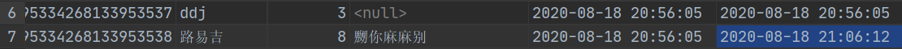
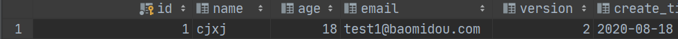
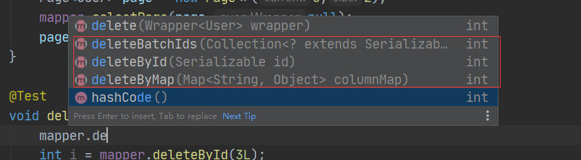

# Mybatisplus秋招学习笔记

## 一、概述

Mybatisplus是Mybatis的增强，在Mybatis的基础上只增不改，为简化开发而生，提高效率。使用了Mybatis里的插件实现

官网：https://baomidou.com/

### 1.1 特性

- **无侵入**：只做增强不做改变，引入它不会对现有工程产生影响，如丝般顺滑
- **损耗小**：启动即会自动注入基本 CURD，性能基本无损耗，直接面向对象操作
- **强大的 CRUD 操作**：内置通用 Mapper、通用 Service，仅仅通过少量配置即可实现单表大部分 CRUD 操作，更有强大的条件构造器，满足各类使用需求
- **支持 Lambda 形式调用**：通过 Lambda 表达式，方便的编写各类查询条件，无需再担心字段写错
- **支持主键自动生成**：支持多达 4 种主键策略（内含分布式唯一 ID 生成器 - Sequence），可自由配置，完美解决主键问题
- **支持 ActiveRecord 模式**：支持 ActiveRecord 形式调用，实体类只需继承 Model 类即可进行强大的 CRUD 操作
- **支持自定义全局通用操作**：支持全局通用方法注入（ Write once, use anywhere ）
- **内置代码生成器**：采用代码或者 Maven 插件可快速生成 Mapper 、 Model 、 Service 、 Controller 层代码，支持模板引擎，更有超多自定义配置等您来使用
- **内置分页插件**：基于 MyBatis 物理分页，开发者无需关心具体操作，配置好插件之后，写分页等同于普通 List 查询
- **分页插件支持多种数据库**：支持 MySQL、MariaDB、Oracle、DB2、H2、HSQL、SQLite、Postgre、SQLServer 等多种数据库
- **内置性能分析插件**：可输出 Sql 语句以及其执行时间，建议开发测试时启用该功能，能快速揪出慢查询
- **内置全局拦截插件**：提供全表 delete 、 update 操作智能分析阻断，也可自定义拦截规则，预防误操作

### 1.2 支持数据库

- mysql 、 mariadb 、 oracle 、 db2 、 h2 、 hsql 、 sqlite 、 postgresql 、 sqlserver 、 presto
- 达梦数据库 、 虚谷数据库 、 人大金仓数据库


## 二、快速入门

我们将通过一个简单的 Demo 来阐述 MyBatis-Plus 的强大功能，在此之前，我们假设您已经：

- 拥有 Java 开发环境以及相应 IDE
- 熟悉 Spring Boot
- 熟悉 Maven

### 2.1 创建数据库

这里创建了一个mybatis_plus数据库

### 2.2 创建表填充数据

现有一张 `User` 表，其表结构如下：

| id   | name   | age  | email              |
| ---- | ------ | ---- | ------------------ |
| 1    | Jone   | 18   | test1@baomidou.com |
| 2    | Jack   | 20   | test2@baomidou.com |
| 3    | Tom    | 28   | test3@baomidou.com |
| 4    | Sandy  | 21   | test4@baomidou.com |
| 5    | Billie | 24   | test5@baomidou.com |

其对应的数据库 Schema 脚本如下：

```sql
DROP TABLE IF EXISTS user;

CREATE TABLE user
(
	id BIGINT(20) NOT NULL COMMENT '主键ID',
	name VARCHAR(30) NULL DEFAULT NULL COMMENT '姓名',
	age INT(11) NULL DEFAULT NULL COMMENT '年龄',
	email VARCHAR(50) NULL DEFAULT NULL COMMENT '邮箱',
	PRIMARY KEY (id)
);
```

真实开发中，version乐观锁，deleted逻辑删除，gmt_create，gmt_modified

```sql
INSERT INTO user (id, name, age, email) VALUES
(1, 'Jone', 18, 'test1@baomidou.com'),
(2, 'Jack', 20, 'test2@baomidou.com'),
(3, 'Tom', 28, 'test3@baomidou.com'),
(4, 'Sandy', 21, 'test4@baomidou.com'),
(5, 'Billie', 24, 'test5@baomidou.com');
```

### 2.3 导入依赖

尽量不要同时导入mybatis和mybatisplus，因为可能会有jar包重复导入，甚至版本问题。

```xml
<dependency>
    <groupId>mysql</groupId>
    <artifactId>mysql-connector-java</artifactId>
</dependency>

<dependency>
    <groupId>org.projectlombok</groupId>
    <artifactId>lombok</artifactId>
</dependency>

<dependency>
    <groupId>com.baomidou</groupId>
    <artifactId>mybatis-plus-boot-starter</artifactId>
    <version>3.3.2</version>
</dependency>
```

### 2.4 配置

```yaml
spring:
  datasource:
    username: root
    password: 123456
    url: jdbc:mysql://localhost:3306/mybatis_plus?useSSL=false&useUnicode=true&characterEncoding=utf-8
    driver-class-name: com.mysql.cj.jdbc.Driver
```

### 2.5 pojo实体类

```java
@NoArgsConstructor
@AllArgsConstructor
@Data
public class User {
    private Long id;
    private String name;
    private int age;
    private String email;
}
```

### 2.6 Mapper类

```java
@Repository
public interface UserMapper extends BaseMapper<User> {

}
```

在spring boot的启动类中加入注解`@MapperScan`

```java
@MapperScan("com.hkb.mybatisplus.mapper")
@SpringBootApplication
public class MybatisplusApplication {

    public static void main(String[] args) {
        SpringApplication.run(MybatisplusApplication.class, args);
    }

}
```

### 2.7 测试

```java
@Test
void contextLoads() {
    List<User> users = mapper.selectList(null);//读取表中所有的列表
    users.forEach(System.out::println);
}
```

### 2.8 测试结果

```bash
User(id=1, name=Jone, age=18, email=test1@baomidou.com)
User(id=2, name=Jack, age=20, email=test2@baomidou.com)
User(id=3, name=Tom, age=28, email=test3@baomidou.com)
User(id=4, name=Sandy, age=21, email=test4@baomidou.com)
User(id=5, name=Billie, age=24, email=test5@baomidou.com)
```

### 2.9 问题

1. 谁帮我们写的sql？
2. 方法从哪里来的？
3. 这样子做对数据库表明，pojo类名有什么要求？


## 三、日志配置

我们的sql都是不可见的，我们希望知道他是怎么执行的，那么就需要用到日志。

### 3.1 日志开启

使用mybatis-plus进行配置，mybatisplus的配置类如下

```java
@ConfigurationProperties(prefix = "mybatis-plus")
public class MybatisPlusProperties {}
```

在之前mybatis中的一些配置例子如下，这些内容都可以在mybatis-plus中进行配置，可以理解为mybatis-plus包含了mybatis的全部功能，且做了一些加强。

```yaml
mybatis:
  type-aliases-package: com.hkb.pks.pojo
  mapper-locations: classpath:mybatis/mapper/*.xml
  configuration:
    cache-enabled: true
    log-impl: org.apache.ibatis.logging.stdout.StdOutImpl
```

这里的日志，使用的和mybatis一致，有标准输出、log4j等等，只要是mybatis支持的，他都行。

```yaml
#配置日志
mybatis-plus:
  configuration:
    log-impl: org.apache.ibatis.logging.stdout.StdOutImpl
```

### 3.2 测试结果

可以看到和mybatis的日志一样，其sql语句为`SELECT id,name,age,email FROM user` 

```bash
Creating a new SqlSession
SqlSession [org.apache.ibatis.session.defaults.DefaultSqlSession@27ab206] was not registered for synchronization because synchronization is not active
2020-08-17 18:54:43.503  INFO 17960 --- [           main] com.zaxxer.hikari.HikariDataSource       : HikariPool-1 - Starting...
2020-08-17 18:54:44.455  INFO 17960 --- [           main] com.zaxxer.hikari.HikariDataSource       : HikariPool-1 - Start completed.
JDBC Connection [HikariProxyConnection@152708419 wrapping com.mysql.cj.jdbc.ConnectionImpl@42730828] will not be managed by Spring
==>  Preparing: SELECT id,name,age,email FROM user 
==> Parameters: 
<==    Columns: id, name, age, email
<==        Row: 1, Jone, 18, test1@baomidou.com
<==        Row: 2, Jack, 20, test2@baomidou.com
<==        Row: 3, Tom, 28, test3@baomidou.com
<==        Row: 4, Sandy, 21, test4@baomidou.com
<==        Row: 5, Billie, 24, test5@baomidou.com
<==      Total: 5
Closing non transactional SqlSession [org.apache.ibatis.session.defaults.DefaultSqlSession@27ab206]
User(id=1, name=Jone, age=18, email=test1@baomidou.com)
User(id=2, name=Jack, age=20, email=test2@baomidou.com)
User(id=3, name=Tom, age=28, email=test3@baomidou.com)
User(id=4, name=Sandy, age=21, email=test4@baomidou.com)
User(id=5, name=Billie, age=24, email=test5@baomidou.com)
```


## 四、CRUD

### 4.1 插入操作

```java
@Test
void testInsert(){
    User user = new User();
    user.setAge(3);
    user.setName("ddj");
    int insert = mapper.insert(user);
    System.out.println(insert);
    System.out.println(user);
}
```

> 运行结果

可以看到作为主键的id，自动有了一个值，而不是主键也不要求不为空的email没有自动补值。

```bash
Creating a new SqlSession
SqlSession [org.apache.ibatis.session.defaults.DefaultSqlSession@7a360554] was not registered for synchronization because synchronization is not active
2020-08-17 20:18:50.334  INFO 13440 --- [           main] com.zaxxer.hikari.HikariDataSource       : HikariPool-1 - Starting...
2020-08-17 20:18:50.517  INFO 13440 --- [           main] com.zaxxer.hikari.HikariDataSource       : HikariPool-1 - Start completed.
JDBC Connection [HikariProxyConnection@1446291553 wrapping com.mysql.cj.jdbc.ConnectionImpl@2b0dc227] will not be managed by Spring
==>  Preparing: INSERT INTO user ( id, name, age ) VALUES ( ?, ?, ? ) 
==> Parameters: 1295334268133953537(Long), ddj(String), 3(Integer)
<==    Updates: 1
Closing non transactional SqlSession [org.apache.ibatis.session.defaults.DefaultSqlSession@7a360554]
1
User(id=1295334268133953537, name=ddj, age=3, email=null)
```


### 4.2 主键生成策略

数据库中的主键，如例子中的id，是全局唯一的，有多种方式生成：uuid、自增id、雪花算法、redis、zookeeper

https://www.cnblogs.com/haoxinyue/p/5208136.html 多种方式汇总看这篇博文

mybatis-plus中用的是雪花算法

> 雪花算法

snowflake是Twitter开源的分布式ID生成算法，结果是一个long型的ID。其核心思想是：使用41bit作为毫秒数，10bit作为机器的ID（5个bit是数据中心，5个bit的机器ID），12bit作为毫秒内的流水号（意味着每个节点在每毫秒可以产生 4096 个 ID），最后还有一个符号位，永远是0，共64bit、8个字节。

> @TableId注解

```java
@TableId(type = IdType.AUTO)
private Long id;
```

其参数为一个枚举类型，在mybatisplus3.3之后，废弃了几个类型。

```java
public enum IdType {
    AUTO(0),//自增
    NONE(1),//未设置主键
    INPUT(2),//手动输入
    ASSIGN_ID(3),//雪花算法
    ASSIGN_UUID(4)//UUID
}
```

在mybatis-plus3.0.5的IdType类

```java
public enum IdType {
    AUTO(0),
    NONE(1),
    INPUT(2),
    ID_WORKER(3),
    UUID(4),
    ID_WORKER_STR(5)
}
```

### 4.3 TableId之AUTO

AUTO即自增，加上注解后，数据库里必须是自增的，否则不会自动补全。

```java
@TableId(type = IdType.AUTO)
private Long id;
```

如下所示，没有设置数据库的自增，给出的错误信息

```bash
vorg.springframework.dao.DataIntegrityViolationException: 
### Error updating database.  Cause: java.sql.SQLException: Field 'id' doesn't have a default value
### The error may exist in com/hkb/mybatisplus/mapper/UserMapper.java (best guess)
### The error may involve com.hkb.mybatisplus.mapper.UserMapper.insert-Inline
### The error occurred while setting parameters
### SQL: INSERT INTO user  ( name, age )  VALUES  ( ?, ? )
### Cause: java.sql.SQLException: Field 'id' doesn't have a default value
; Field 'id' doesn't have a default value; nested exception is java.sql.SQLException: Field 'id' doesn't have a default value
```

id修改为自增后，再次执行代码

```sql
id    bigint auto_increment comment '主键ID'
    primary key,
```

执行成功，可以看到自动补全了id，其为上一个数据的id+1

```bash
JDBC Connection [HikariProxyConnection@1002762002 wrapping com.mysql.cj.jdbc.ConnectionImpl@50448409] will not be managed by Spring
==>  Preparing: INSERT INTO user ( name, age ) VALUES ( ?, ? ) 
==> Parameters: 马里奥(String), 3(Integer)
<==    Updates: 1
Closing non transactional SqlSession [org.apache.ibatis.session.defaults.DefaultSqlSession@18578491]
1
User(id=1295334268133953538, name=马里奥, age=3, email=null)
```

### 4.4 更新操作

直接传入对象，或者一个过滤器和一个对象进行修改

```java
@Test
void update(){
    User user = new User();
    user.setId(1295334268133953538L);
    user.setAge(3);
    user.setName("路易吉");
    user.setEmail("嬲你麻麻别");
    int i = mapper.updateById(user);
    System.out.println(i);
}
```

同时mybatis-plus会根据参数的不同，动态的生成sql

```bash
==>  Preparing: UPDATE user SET name=?, age=?, email=? WHERE id=? 
==> Parameters: 路易吉(String), 3(Integer), 嬲你麻麻别(String), 1295334268133953538(Long)
<==    Updates: 1
```

### 4.5 自动填充

创建时间、修改时间，这些操作都应该是自动填充的，不希望手动更新。

阿里巴巴开发手册中，所有的数据库表gmt_create、gmt_modified几乎所有表都要配置上，而且需要自动化。

> 数据库级别(不允许使用)

1. 修改数据库结构

   ```sql
   create_time datetime default CURRENT_TIMESTAMP null comment '创建时间',
   update_time datetime default CURRENT_TIMESTAMP null on update CURRENT_TIMESTAMP comment '修改时间'
   ```

2. 重新执行修改后，update_time被修改

   

> 代码级别

1. 去掉相关的默认值、自更新

   ```sql
   create_time datetime    null comment '创建时间',
   update_time datetime    null comment '修改时间'
   ```

2. 实体类的对应的字段上要增加mybatis-plus的注解

   ```java
   @TableField(fill = FieldFill.INSERT)//插入时自动生成
   private Date createTime;
   @TableField(fill = FieldFill.INSERT_UPDATE)//插入、更新时自动生成
   private Date updateTime;
   ```

3. 编写处理器来处理注解

   ```java
   @Slf4j
   @Component
   public class MyMetaObjectHandler implements MetaObjectHandler {
       @Override
       public void insertFill(MetaObject metaObject) {
           log.info("start insert fill ....");
           //这个方法是3.3.x版本推荐的方法
           this.strictInsertFill(metaObject, "createTime", Date.class, new Date());
           this.strictInsertFill(metaObject, "updateTime", Date.class, new Date());
       }
   
       @Override
       public void updateFill(MetaObject metaObject) {
           this.strictUpdateFill(metaObject, "updateTime",Date.class,new Date());
       }
   }
   ```

4. 测试结果

   测试结果显示，创建时间和修改时间正常显示！

   

### 4.6 乐观锁

- 乐观锁：无论干什么都不上锁，如果出现了问题，再次更新值测试
- 悲观锁：认为什么都会出问题，无论干什么都会上锁

乐观锁实现方式：

- 取出记录时，获取当前version
- 更新时，带上这个version
- 执行更新时， set version = newVersion where version = oldVersion
- 如果version不对，就更新失败

> 测试

1. 增加version行

   ```sql
   version     int default 1 null
   ```

2. 同步实体类，新增version字段，加上@Version注解用于乐观锁

   ```java
   @Version
   private int version;
   ```

3. 配置组件

   ```java
   @EnableTransactionManagement
   @MapperScan("com.hkb.mybatisplus.mapper")
   @Configuration
   public class MybatisPlusConfig {
       @Bean
       public OptimisticLockerInterceptor optimisticLockerInterceptor() {
           return new OptimisticLockerInterceptor();
       }
   }
   ```

4. 测试

   单线程测试，那么一定会成功

   ```java
   @Test
   void update(){
       User user = new User();
       user.setId(1295715867685961730L);
       user.setAge(8);
       user.setName("小红");
       user.setEmail("嬲你麻麻别");
       int i = mapper.updateById(user);
       System.out.println(i);
   }
   ```

   

   看到版本号为2了

   模拟测试失败情况

   ```java
   @Test
   void fail(){
       User user = mapper.selectById(1L);
       user.setName("cjxj");
   
       //模拟被其他线程插队
       User user1 = mapper.selectById(1L);
       user1.setName("nnj");
       mapper.updateById(user1);
   
       //也可以使用自旋锁尝试多次提交
       mapper.updateById(user);
   }
   ```

   如果没有乐观锁，那么插队线程的结果会被覆盖，但是这里因为乐观锁，所以没有覆盖

   

   在日志中看到，要修改id为1，且版本为2的数据，但是只有di为1，版本为3的数据，因此修改失败。

   ```bash
   ==>  Preparing: UPDATE user SET name=?, age=?, email=?, version=?, create_time=?, update_time=? WHERE id=? AND version=? 
   ==> Parameters: cjxj(String), 18(Integer), test1@baomidou.com(String), 3(Integer), 2020-08-18 20:56:05.0(Timestamp), 2020-08-18 20:56:05.0(Timestamp), 1(Long), 2(Integer)
   <==    Updates: 0
   ```

   

### 4.7 查询操作

> 可以通过id单个查询

```java
@Test
void selectUserById(){
    User user = mapper.selectById(1L);
    System.out.println(user);
}
```

> 可以通过Collection传入多个值查询

```java
@Test
void selectUserById(){
    List<User> users = mapper.selectBatchIds(Arrays.asList(1, 2, 3));
    users.forEach(System.out::println);
}
```

> 还可以通过map查询

```java
@Test
void selectUserById(){
    HashMap<String, Object> map = new HashMap<>();
    map.put("name","nnj");
    List<User> user = mapper.selectByMap(map);
    System.out.println(user);
}

//我们看到 根据map里的key，自动拼接数据库
==>  Preparing: SELECT id,name,age,email,version,create_time,update_time FROM user WHERE name = ? 
==> Parameters: nnj(String)
<==    Columns: id, name, age, email, version, create_time, update_time
<==        Row: 1, nnj, 18, test1@baomidou.com, 3, 2020-08-18 20:56:05, 2020-08-18 20:56:05
<==      Total: 1
```

都会自动的生成sql，非常爽

### 4.8 分页查询

- limit分页
- pageHelper第三方插件
- MybatisPlus提供了分页插件

> 测试

引入配置

```java
@Bean
public PaginationInterceptor paginationInterceptor() {
    PaginationInterceptor paginationInterceptor = new PaginationInterceptor();
    // 设置请求的页面大于最大页后操作， true调回到首页，false 继续请求  默认false
    // paginationInterceptor.setOverflow(false);
    // 设置最大单页限制数量，默认 500 条，-1 不受限制
    // paginationInterceptor.setLimit(500);
    // 开启 count 的 join 优化,只针对部分 left join
    paginationInterceptor.setCountSqlParser(new JsqlParserCountOptimize(true));
    return paginationInterceptor;
}
```

```java
@Test
void testPage(){
    //第一个参数为current，表示当前的页数
    //第二个参数为size，表示一页的大小，5,2就表示第五页，每页两个，即第9/10两条数据
    Page<User> page = new Page<>(5,2);
    mapper.selectPage(page,null);
    page.getRecords().forEach(System.out::println);
}

==>  Preparing: SELECT id,name,age,email,version,create_time,update_time FROM user LIMIT ?,? 
==> Parameters: 8(Long), 2(Long)
<==    Columns: id, name, age, email, version, create_time, update_time
<==        Row: 1295715867685961730, 小红, 8, 嬲你麻麻别, 1, 2020-08-18 21:35:11, 2020-08-18 22:06:30
<==        Row: 1295724622385426433, 马里奥, 5, null, 1, 2020-08-18 22:09:58, 2020-08-18 22:09:58
<==      Total: 2
```

### 4.9 删除记录

删除操作的方法和之前的一致，通过id、批量、map删除



```java
@Test
void delete(){
    int i = mapper.deleteById(3L);
}

==>  Preparing: DELETE FROM user WHERE id=? 
==> Parameters: 3(Long)
<==    Updates: 1
```

### 4.10 逻辑删除

- 物理删除：真正的从数据库删除
- 逻辑删除：没有在数据库中删除，而是通过一个变量来让他失效

管理员可以查看已删除的记录，类似回收站

1. 增加字段

   ```sql
   deleted     int default 0 null comment '逻辑删除'
   ```

2. 增加字段

   ```java
   @TableLogic
   private int deleted;
   ```

3. 配置

   在mybatis-plus3.3之后，无需配置

   ```java
   @Bean
   public ISqlInjector sqlInjector(){
       return new LogicSqlInjector();
   }
   ```

   只需要在yaml中加上配置即可

   ```yaml
   mybatis-plus:
     global-config:
       db-config:
         logic-delete-field: deleted  # 全局逻辑删除的实体字段名(since 3.3.0,配置后可以忽略不配置步骤2)
         logic-delete-value: 1 # 逻辑已删除值(默认为 1)
         logic-not-delete-value: 0 # 逻辑未删除值(默认为 0)
   ```

4. 尝试删除

   虽然执行的是删除操作，但是本质上是update，把deleted置为1，数据库中并没有删除

   ```bash
   ==>  Preparing: UPDATE user SET deleted=1 WHERE id=? AND deleted=0 
   ==> Parameters: 1(Long)
   <==    Updates: 1
   ```

   

   再次尝试查询，会自动的拼接上deleted字段！

   ```bash
   ==>  Preparing: SELECT id,name,age,email,version,create_time,update_time,deleted FROM user WHERE name = ? AND deleted=0 
   ==> Parameters: nnj(String)
   <==      Total: 0
   ```


## 五、性能分析插件

在平时开发中会遇到一些慢sql，常用方法有测试、driud等，mybatis-plus中会提供了相关的插件，超过这个时间就停止运行

在mybatis-plus的3.2.x版本后已经被移除了，既然已经被淘汰了，那么也没必要去学这个了，还是使用其他的方法来检测慢sql


## 六、条件查询器Wrapper

我们写一些复杂的sql就可以用Wrapper来代替

具体的API见官方文档

https://baomidou.com/guide/wrapper.html#abstractwrapper

这里给出一些简单的测试

```java
@Test
void select() {
    QueryWrapper<User> wrapper = new QueryWrapper<>();
    wrapper.isNotNull("name").isNotNull("email").ge("age",12);
    List<User> users = mapper.selectList(wrapper);
    users.forEach(System.out::println);
}
```

其实就是调用wrapper的api，而不是写sql，比如isNotNull("name")，对应了sql的name is not null，说白了就是原本的sql语句，现在可以使用java的方法来完成，mybatis-plus会帮助我们动态的自动的生成sql语句。

**另外值得注意的是，当涉及到多表查询时，还是推荐使用mybatis的方式来完成！**


## 七、代码生成器

官方文档如下：

https://baomidou.com/guide/generator.html

```java
public class CodeGenerator {
    public static void main(String[] args) {

        // 1、创建代码生成器
        AutoGenerator mpg = new AutoGenerator();

        // 2、全局配置
        GlobalConfig gc = new GlobalConfig();
        String projectPath = System.getProperty("user.dir");
        gc.setOutputDir(projectPath + "/src/main/java");
        gc.setAuthor("遇见狂神说");
        gc.setOpen(false); //生成后是否打开资源管理器
        gc.setFileOverride(false); //重新生成时文件是否覆盖
        gc.setServiceName("%sService");    //去掉Service接口的首字母I
        gc.setIdType(IdType.ID_WORKER_STR); //主键策略
        gc.setDateType(DateType.ONLY_DATE);//定义生成的实体类中日期类型
        gc.setSwagger2(true);//开启Swagger2模式

        mpg.setGlobalConfig(gc);

        // 3、数据源配置
        DataSourceConfig dsc = new DataSourceConfig();
        dsc.setUrl("jdbc:mysql://localhost:3306/kuangstudy?useUnicode=true&characterEncoding=utf-8&useSSL=false");
        dsc.setDriverName("com.mysql.jdbc.Driver");
        dsc.setUsername("root");
        dsc.setPassword("123456");
        dsc.setDbType(DbType.MYSQL);
        mpg.setDataSource(dsc);

        // 4、包配置
        PackageConfig pc = new PackageConfig();
        pc.setModuleName("kuang");
        pc.setParent("com");
        pc.setController("controller");
        pc.setEntity("pojo");
        pc.setService("service");
        pc.setMapper("mapper");
        mpg.setPackageInfo(pc);

        // 5、策略配置
        StrategyConfig strategy = new StrategyConfig();
        //strategy.setInclude("ks_\\w*");//设置要映射的表名
        strategy.setInclude("ks_download");//设置要映射的表名
        strategy.setNaming(NamingStrategy.underline_to_camel);//数据库表映射到实体的命名策略
        strategy.setTablePrefix("ks_");//设置表前缀不生成

        strategy.setColumnNaming(NamingStrategy.underline_to_camel);//数据库表字段映射到实体的命名策略
        strategy.setEntityLombokModel(true); // lombok 模型 @Accessors(chain = true) setter链式操作

        strategy.setRestControllerStyle(true); //restful api风格控制器
        strategy.setControllerMappingHyphenStyle(true); //url中驼峰转连字符

        mpg.setStrategy(strategy);

        // 6、执行
        mpg.execute();
    }
}
```

用于创建一些controller，mapper等等内容，让我们可以更加的关注到业务逻辑上。


## 八、Service层

Service层也可以使用mybatis-plus来完成，看IService的实现类ServiceImpl，其中都是基于dao层的mapper进行了一个简单的封装，也就是说，如果业务中只涉及到简单的比如说传入一个id，获得相关的信息，就可以使用mybatis-plus中已封装的方法。这样简单的业务代码也可以省略了。

当然如果遇到数据处理等，那就需要自己额外的代码。

```java
package com.baomidou.mybatisplus.extension.service;
public interface IService<T> {
    //...
}
```


## 九、总结

mybatias-plus本身极大的简化了简单且繁琐的步骤，帮助我们省略了大量的sql语句，甚至说是service层代码。

在学生时代是个利器，但是真正的就业后，看领导脸色把！