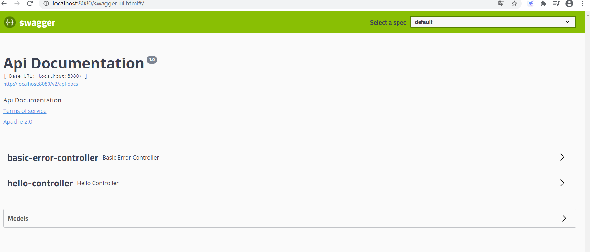
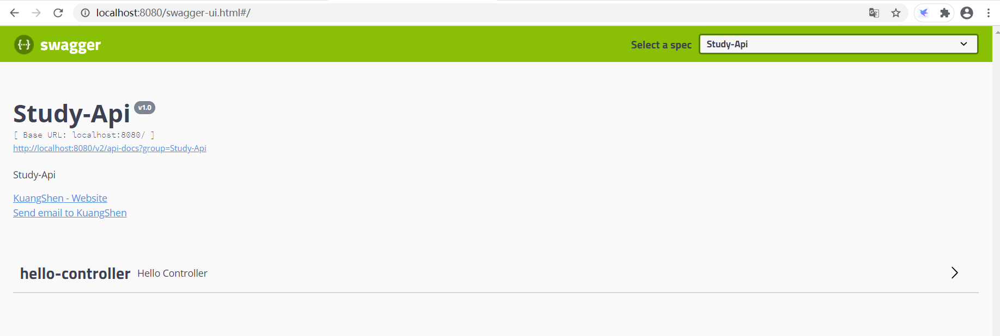
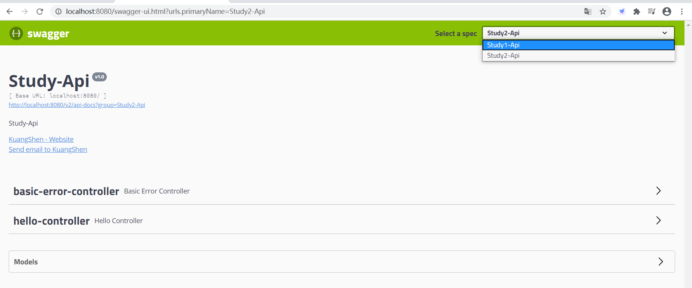

# RESTful风格秋招复习笔记

## 一、概述

在没有前后端分离概念之前，一个网站的完成总是“all in one”，在这个阶段，页面、数据、渲染全部在服务端完成，这样做的最大的弊端是后期维护，扩展极其痛苦，开发人员必须==同时具备前后端知识==。 于是后来慢慢的兴起了前后端分离的思想：即后端负责数据编造，而前端则负责数据渲染，前端静态页面调用指定api获取到有固定格式的数据，再将数据展示出来，这样呈现给用户的就是一个”动态“的过程。

### 1.1 调用api的规范

就拿javaweb中的api来说，比如某一个查询的接口，需要使用`？、&`这些符号来分割URL，这样看上去很不舒服

```
http://localhost:8080/search?key=12ke&limit=5
```

因此如何设计出一个便于理解，容易使用的api则成了一个问题，而所谓的RESTful就是用来规范我们的API的一种约束。

```
http://localhost:8080/search/12ke/5
```

如上所示的URL，看上去很清晰，是RESTful风格的体现，很多公司现在都应用了这一风格，百度百科、知乎等等。


## 二、什么是RESTful

RESTful是一种网络应用程序的**设计风格**和**开发方式**，基于HTTP。RESTFUL适用于移动互联网厂商作为业务使能**接口**的场景，实现第三方OTT调用移动网络资源的功能，动作类型为新增、变更、删除所调用资源。

### 2.1 什么是REST

REST：即 Representational State Transfer。==（资源）表现层状态转化==。是目前最流行的一种互联网软件架构。它结构清晰、符合标准、易于理解、扩展方便，所以正得到越来越多网站的采用

- 资源（Resources）：网络上的一个实体，或者说是网络上的一个具体信息。它可以是一段文本、一张图片、一首歌曲、一种服务，总之就是一个具体的存在。可以用一个URI（统一资源定位符）指向它，每种资源对应一个特定的 URI 。要获取这个资源，访问它的URI就可以，因此 URI 即为每一个资源的独一无二的识别符。
- 表现层（Representation）：把资源具体呈现出来的形式，叫做它的表现层。比如，文本可以用 txt 格式表现，也可以用 HTML 格式、XML 格式、JSON 格式表现，甚至可以采用二进制格式。
- 状态转化（State Transfer）：每发出一个请求，就代表了客户端和服务器的一次交互过程。HTTP协议，是一个无状态协议，即所有的状态都保存在服务器端。因此，如果客户端想要操作服务器，必须通过某种手段，让服务器端发生“状态转化”（State Transfer）。而这种转化是建立在表现层之上的，所以就是 “表现层状态转化”。具体说，就是 **HTTP** 协议里面，四个表示操作方式的动词：**GET**、**POST**、**PUT**、**DELETE**。它们分别对应四种基本操作：**GET** 用来获取资源，**POST** 用来新建资源，**PUT** 用来更新资源，**DELETE** 用来删除资源。

示例： 

```bash
- /order/1 HTTP   GET ：得到 id = 1 的 order 
- /order/1 HTTP DELETE：删除 id = 1的 order 
- /order/1 HTTP    PUT：更新id = 1的 order 
- /order HTTP     POST：新增 order
```

符合REST原则的架构方式即可称为RESTful

### 2.2 RESTful 6个原则

1. 在接口命名时应该用名词，不应该用动词，因为通过接口操作到是资源。

2. 在url中加入版本号，利于版本迭代管理更加直观(不是必须)

   ```
   https://www.rgc.com/v1/
   ```

3. 对于资源的操作类型应该是通过http动词表示。

   > - GET /zoos：列出所有动物园
   > - POST /zoos：新建一个动物园
   > - GET /zoos/ID：获取某个指定动物园的信息
   > - PUT /zoos/ID：更新某个指定动物园的信息（提供该动物园的全部信息）
   > - DELETE /zoos/ID：删除某个动物园
   > - GET /zoos/ID/animals：列出某个指定动物园的所有动物
   > - DELETE /zoos/ID/animals/ID：删除某个指定动物园的指定动物

4. 排序规则：默认时升序，‘-’为降序;多个排序规则时以逗号间隔组合。使用sort查询参数限制

   ```
   GET /tickets?sort=-time,created_at 
   优先以time倒序显示，其次以created_at正序显示
   ```

5. 限制返回值的字段域：明确指定输出字段列表，用于控制网络带宽和速度。使用fields查询参数来限制。

   ```
   GET /tickets?fileds=id,subject,customer_name,time&sort=-time
   返回参数列表为id,subject,customer_name,time，并且以time字段倒序显
   ```

6. HTTP Method分别对于资源的CURD操作

   ```
   GET（SELECT）：从服务器取出资源（一项或多项）。
   POST（CREATE）：在服务器新建一个资源。
   PUT（UPDATE）：在服务器更新资源（客户端提供改变后的完整资源）。
   PATCH（UPDATE）：在服务器更新资源（客户端提供改变的属性）。
   DELETE（DELETE）：从服务器删除资源。
   ```

   保证 POST，PUT，DELETE,PATCH，GET 操作幂等性。

7. 使用SSL(Secure Sockets Layer 安全套接层)

8. 参数和url采用蛇行命名方式。如：updated_time

9. 服务器请求和返回的数据格式，应该尽量使用JSON，避免使用XML。在 request中的Accept和Response中的Content-Type:application/json

### 3.2 RESTful的好处

1. 前后端分离，减少流量
2. 安全问题集中在接口上，由于接受json格式，防止了注入型等安全问题
3. 前端无关化，后端只负责数据处理，前端表现方式可以是任何前端语言（android，ios,html5）
4. 前端和后端人员更加专注于各自开发，只需接口文档便可完成前后端交互，无需过多相互了解
5. 服务器性能优化：由于前端是静态页面，通过nginx便可获取，服务器主要压力放在了接口上


## 三、后端实现RESTful风格

当今最流行的后端框架当属Spring Boot，那么这里就以Spring Boot为例实现RESTful风格。

```java
@GetMapping("/blog/category/{bid}/{page}/{limit}")
public String blogPage(@PathVariable int bid,@PathVariable int page,@PathVariable int limit,Model model){
    //方法体，略过
}
```

### 3.1 @GetMapping

这个注解是表示，`blogPage`方法只能通过Get方法访问，且url为参数

`/blog/category/{bid}/{page}/{limit}`

这个URL地址，我们看到其中的`{bid}`以及`{page}`等，都是一个空缺的参数，只需要把参数写入URL中即可

如`/blog/category/5/2/3`

### 3.2 @PathVariable

那么怎么从URL中读取出数据呢？

通过 **@PathVariable** 可以将 **URL** 中占位符参数绑定到控制器处理方法的入参中：URL 中的 {xxx} 占位符可以通过@PathVariable(“xxx“) 绑定到操作方法的入参中。


## 四、swagger

- swagger号称全世界最流行的API框架
- 在线自动生成工具->API与API定义同步更新
- 测试API接口
- 支持多种语言

### 4.1 在项目中使用swagger

使用spring boot继承swagger

1. 新建一个spring boot项目，添加web启动器

2. 导入依赖

   ```xml
   <!--swagger2-->
   <dependency>
       <groupId>io.springfox</groupId>
       <artifactId>springfox-swagger2</artifactId>
       <version>2.9.2</version>
   </dependency>
   <!--swagger-ui-->
   <dependency>
       <groupId>io.springfox</groupId>
       <artifactId>springfox-swagger-ui</artifactId>
       <version>2.9.2</version>
   </dependency>
   ```

3. 编写一个hello工程

   ```java
   @RestController
   public class HelloController {
   
       @RequestMapping("/hello")
       public String hello(){
           return "hello";
       }
   }
   ```

4. 配置swagger

   ```java
   @Configuration
   @EnableSwagger2
   public class SwaggerConfig {
   }
   ```

5. 测试运行

   http://localhost:8080/swagger-ui.html



可以看到spring boot项目除了hello-controller之外，还存在一个basic-error-controller，是用于错误的请求。

**本来头铁，用的swagger3.0.0版本，结果swagger-ui愣是打不开，然后降到2.9.2之后就可以了。。估计是版本冲突了？**

### 4.2 swagger配置

通常swagger配置就是修改一下swagger-ui中的显示。

```java
package swagger.study.config;

import com.google.common.base.Predicates;
import org.springframework.context.annotation.Bean;
import org.springframework.context.annotation.Configuration;
import springfox.documentation.builders.ApiInfoBuilder;
import springfox.documentation.builders.PathSelectors;
import springfox.documentation.service.ApiInfo;
import springfox.documentation.service.Contact;
import springfox.documentation.spi.DocumentationType;
import springfox.documentation.spring.web.plugins.Docket;
import springfox.documentation.swagger2.annotations.EnableSwagger2;

@Configuration
@EnableSwagger2
public class SwaggerConfig {
    @Bean
    public Docket webApiConfig(){
        return new Docket(DocumentationType.SWAGGER_2)
                .groupName("Study-Api")
                .apiInfo(webApiInfo())
                .enable(true)  // 是否启动swagger
                .select()
                .paths(Predicates.not(PathSelectors.regex("/error.*")))//屏蔽了error的controller
                .build();
    }

    //显示信息
    private ApiInfo webApiInfo(){
        return new ApiInfoBuilder()
                .title("Study-Api")
                .description("Study-Api")
                .version("v1.0")
                .contact(new Contact("KuangShen", "http://kuangstudy.com", "24736743@qq.com"))
                .build();
    }
}
```

运行结果如下



### 4.3 swaager配置扫描接口

使用select方法，配合build方法进行swagger的一个筛选。去掉一些没有必要的内容。

```java
@Bean
public Docket webApiConfig(){
    return new Docket(DocumentationType.SWAGGER_2)
            .groupName("Study-Api")
            .apiInfo(webApiInfo())
            .select()
            //RequestHandlerSelectors扫描的方式
            //basePackage 指定扫描的包
            //any 扫描全部
            //none 都不扫描
            //withClassAnnotation 扫描类上的注解
            //withMethodAnnotation 扫描方法上的注解
            .apis(RequestHandlerSelectors.basePackage("swagger.study.controller"))
            .build();
}
```

```java
@Bean
public Docket webApiConfig(){
    return new Docket(DocumentationType.SWAGGER_2)
            .groupName("Study-Api")
            .apiInfo(webApiInfo())
            .enable(true) // 是否启动swagger
            .select()
        	//paths 过滤路径
        	//PathSelectors 过滤路径的选择方式
            .paths(Predicates.not(PathSelectors.regex("/error.*")))
            .build();
}
```

### 4.4 配置是否启动swagger

```java
@Bean
public Docket webApiConfig(){
    return new Docket(DocumentationType.SWAGGER_2)
            .groupName("Study-Api")
            .apiInfo(webApiInfo())
            .enable(true) // 是否启动swagger
            .select()
            .paths(Predicates.not(PathSelectors.regex("/error.*")))
            .build();
}
```

### 4.5 配置API的分组

一个docket对应了一个分组，可以使用多个docket配置不同的内容，对应每个开发者的内容范围，协作开发

```java
@Bean
public Docket webApiConfig(){
    return new Docket(DocumentationType.SWAGGER_2)
            .groupName("Study-Api")//配置分组
            .apiInfo(webApiInfo())
            .enable(true) // 是否启动swagger
            .select()
            .paths(Predicates.not(PathSelectors.regex("/error.*")))
            .build();
}
```

```java
@Bean
public Docket webApiConfig1(){
    return new Docket(DocumentationType.SWAGGER_2)
            .groupName("Study2-Api")
            .apiInfo(webApiInfo())
            .enable(true);// 是否显示
}
```



### 4.6 配置注解

```java
@ApiModel("用户实体类")//配置实体类名
public class User {
    @ApiModelProperty("用户名")//字段
    public String username;

    @ApiModelProperty("密码")
    public String password;
}
```

```java
@GetMapping("/hello")
public String hello(){
    return "hello456";
}

@ApiOperation("获得用户")//方法
@PostMapping("/user")
public User user(@ApiParam("用户名") String username//参数){
    return new User();
}
```

### 4.7 优点

1. 可以使用注解把信息展示在页面上
2. 接口文档实时更新
3. 可以在线测试
4. 可以多人协作
5. 出于安全考虑，上线后必须关闭swagger