# Java JVM秋招复习笔记

## 一、概述

### 1.1 什么是JVM

- 是JRE的一部分
- 是于操作系统之上的一个java的运行虚拟机，他是针对于已经编译完成的class文件的**运行**

### 1.2 JVM结构图


## 二、类加载机制

类是在运行期间第一次使用时动态加载的（当使用到时才会加载），而不是一次性加载所有类。因为如果一次性加载，那么会占用很多的内存。

### 2.1 类的生命周期

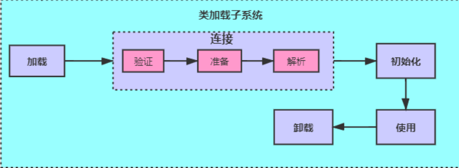

包括以下 7 个阶段：

-   **加载（Loading）**  
-   **验证（Verification）**  
-   **准备（Preparation）**  
-   **解析（Resolution）**  
-   **初始化（Initialization）**  
-   使用（Using）
-   卸载（Unloading）

### 2.2 类加载过程

类加载过程包含了加载、验证、准备、解析、初始化5个阶段。

#### 2.2.1 加载

加载过程完成以下三件事：

- 通过类的完全限定名称获取定义该类的二进制字节流。
- 将该字节流表示的**静态存储结构**转换为方法区的运行时存储结构（还没有分配内存空间）。
- 在内存中生成一个代表该类的 **Class 对象**，作为方法区中该类各种数据的访问入口。

其中二进制字节流可以从以下方式中获取(了解即可)：

- 从 ZIP 包读取，成为 JAR、EAR、WAR 格式的基础。
- 从网络中获取，最典型的应用是 Applet。
- 运行时计算生成，例如动态代理技术，在 java.lang.reflect.Proxy 使用 ProxyGenerator.generateProxyClass 的代理类的二进制字节流。
- 由其他文件生成，例如由 JSP 文件生成对应的 Class 类。

#### 2.2.2 验证

确保 Class 文件的字节流中包含的信息符合当前虚拟机的要求，并且不会危害虚拟机自身的安全。

#### 2.2.3 准备

类变量是被 **static 修饰的变量**，准备阶段为类变量分配内存并设置初始值，使用的是**方法区**的内存。

实例变量不会在这阶段分配内存，它会在对象实例化时随着对象一起被分配在堆中。应该注意到，实例化不是类加载的一个过程，类加载发生在所有实例化操作之前，并且**类加载只进行一次**，实例化可以进行多次。

初始值一般为 0 值，例如下面的类变量 value 被初始化为 0 而不是 123。

```java
public static int value = 123;
```

如果类变量是常量，那么它将初始化为表达式所定义的值而不是 0。例如下面的常量 value 被初始化为 123 而不是 0。

```java
public static final int value = 123;
```

#### 2.2.4 解析

将常量池的符号引用替换为直接引用的过程。

其中解析过程在某些情况下可以在初始化阶段之后再开始，这是为了支持 Java 的动态绑定。

> 符号引用

符号引用以一组符号来描述所引用的目标，符号可以是任何形式的字面量，只要使用时能够无歧义的定位到目标即可。

例如，在Class文件中它以CONSTANT_Class_info、等类型的常量出现。符号引用与虚拟机的内存布局无关，引用的目标并不一定加载到内存中。

在Java中，一个java类将会编译成一个class文件。在编译时，java类并不知道所引用的类的实际地址，因此只能使用**符号引用来代替**。

比如org.simple.People类引用了org.simple.Language类，在编译时People类并不知道Language类的实际内存地址，因此只能使用符号org.simple.Language（假设是这个，当然实际中是由类似于CONSTANT_Class_info的常量来表示的）来表示Language类的地址。各种虚拟机实现的内存布局可能有所不同，但是它们能接受的符号引用都是一致的，因为符号引用的字面量形式明确定义在Java虚拟机规范的Class文件格式中。

> 直接引用

- 直接指向目标的指针（比如，指向“类型”【Class对象】、类变量、类方法的直接引用可能是指向方法区的指针）
- 相对偏移量（比如，指向实例变量、实例方法的直接引用都是偏移量）
- 一个能间接定位到目标的句柄

直接引用是和虚拟机的布局**相关**的，同一个符号引用在不同的虚拟机实例上翻译出来的直接引用一般不会相同。如果有了直接引用，那引用的目标**必定已经被加载入内存中**了。

#### 2.2.5 初始化

初始化阶段才真正开始执行类中定义的 Java 程序代码。初始化阶段是虚拟机执行类构造器 &lt;clinit>() 方法的过程。

在准备阶段，类变量已经赋过一次系统要求的初始值，而在初始化阶段，根据程序员通过程序制定的主观计划去初**始化类变量和其它资源**。

&lt;clinit>() 是由编译器自动收集类中所有类变量的赋值动作和静态语句块中的语句合并产生的，编译器收集的顺序由语句在源文件中出现的顺序决定。特别注意的是，静态语句块只能访问到定义在它之前的类变量，定义在它之后的类变量只能赋值，不能访问。例如以下代码：

```java
public class Test {
    static {
        i = 0;                // 给变量赋值可以正常编译通过
        System.out.print(i);  // 这句编译器会提示“非法向前引用”
    }
    static int i = 1;
}
```

由于父类的 &lt;clinit>() 方法先执行，也就意味着**父类中定义的静态语句块的执行要优先于子类**。

接口中不可以使用静态语句块，但仍然有类变量初始化的赋值操作，因此接口与类一样都会生成 &lt;clinit>() 方法。但接口与类不同的是，执行接口的 &lt;clinit>() 方法不需要先执行父接口的 &lt;clinit>() 方法。只有当父接口中定义的变量使用时，父接口才会初始化。另外，接口的实现类在初始化时也一样不会执行接口的 &lt;clinit>() 方法。

虚拟机会保证一个类的 &lt;clinit>() 方法在多线程环境下被正确的加锁和同步，如果多个线程同时初始化一个类，只会有一个线程执行这个类的 &lt;clinit>() 方法，其它线程都会阻塞等待，直到活动线程执行 &lt;clinit>() 方法完毕。如果在一个类的 &lt;clinit>() 方法中有耗时的操作，就可能造成多个线程阻塞，在实际过程中此种阻塞很隐蔽。

### 2.3 类初始化时机

#### 2.3.1 主动引用

虚拟机规范中并没有强制约束何时进行加载，但是规范严格规定了有且只有下列五种情况必须对类进行初始化（加载、验证、准备都会随之发生）：

- 遇到 `new`、`getstatic`、`putstatic`、`invokestatic` 这四条字节码指令时，如果类没有进行过初始化，则必须**先触发其初始化**。最常见的生成这 4 条指令的场景是：
  1. 使用 new 关键字实例化对象的时候；
  2. 读取或设置一个类的静态字段（被 final 修饰、已在编译期把结果放入常量池的静态字段除外）的时候；
  3. 以及调用一个类的静态方法的时候。
- 使用 java.lang.reflect 包的方法对类进行反射调用的时候，如果类没有进行初始化，则需要先触发其初始化。
- 当初始化一个类的时候，如果发现其父类还没有进行过初始化，则需要先触发其父类的初始化。
- 当虚拟机启动时，用户需要指定一个要执行的主类（包含 main() 方法的那个类），虚拟机会先初始化这个主类；
- 当使用 JDK 1.7 的动态语言支持时，如果一个 java.lang.invoke.MethodHandle 实例最后的解析结果为 REF_getStatic, REF_putStatic, REF_invokeStatic 的方法句柄，并且这个方法句柄所对应的类没有进行过初始化，则需要先触发其初始化；

#### 2.3.2 被动引用

所有**引用**类的方式都不会触发初始化，称为被动引用。被动引用的常见例子包括：

- 通过子类引用父类的静态字段，不会导致父类初始化。

```java
System.out.println(SubClass.value);  // value 字段在 SuperClass 中定义
```

- 通过数组定义来引用类，不会触发此类的初始化。该过程会对数组类进行初始化，数组类是一个由虚拟机自动生成的、直接继承自 Object 的子类，其中包含了数组的属性和方法。

```java
SuperClass[] sca = new SuperClass[10];
```

- 常量在编译阶段会存入调用类的常量池中，本质上并没有直接引用到定义常量的类，因此不会触发定义常量的类的初始化。

```java
System.out.println(ConstClass.HELLOWORLD);
```

### 2.4 类加载器

> 类与类加载器

两个类相等，需要类本身相等，并且使用同一个类加载器进行加载。这是因为每一个类加载器都拥有一个独立的类名称空间。

> 类加载器分类

- 启动类加载器（Bootstrap ClassLoader）此类加载器负责将存放在 &lt;JRE_HOME>\lib 目录中的，或者被 -Xbootclasspath 参数所指定的路径中的，并且是虚拟机识别的（仅按照文件名识别，如 rt.jar，名字不符合的类库即使放在 lib 目录中也不会被加载）类库加载到虚拟机内存中。启动类加载器无法被 Java 程序直接引用，用户在编写自定义类加载器时，如果需要把加载请求委派给启动类加载器，直接使用 null 代替即可。

- 扩展类加载器（Extension ClassLoader）这个类加载器是由 ExtClassLoader（sun.misc.Launcher$ExtClassLoader）实现的。它负责将 &lt;JAVA_HOME>/lib/ext 或者被 java.ext.dir 系统变量所指定路径中的所有类库加载到内存中，开发者可以直接使用扩展类加载器。

- 应用程序类加载器（Application ClassLoader）这个类加载器是由 AppClassLoader（sun.misc.Launcher$AppClassLoader）实现的。由于这个类加载器是 ClassLoader 中的 getSystemClassLoader() 方法的返回值，因此一般称为系统类加载器。它负责加载用户类路径（ClassPath）上所指定的类库，开发者可以直接使用这个类加载器，如果应用程序中没有自定义过自己的类加载器，一般情况下这个就是程序中默认的类加载器。

```java
public class Car {
    public static void main(String[] args) {
        Car car1 = new Car();
        Car car2 = new Car();
        System.out.println(car1.hashCode());
        System.out.println(car2.hashCode());

        Class<? extends Car> aClass1 = car1.getClass();
        Class<? extends Car> aClass2 = car2.getClass();
        System.out.println(aClass1.hashCode());
        System.out.println(aClass2.hashCode());

        ClassLoader classLoader = aClass1.getClassLoader();//AppClassLoader 应用加载器
        System.out.println(classLoader);
        ClassLoader parent = classLoader.getParent();//ExtClassLoader 扩展类加载器 \jre\lib\ext
        System.out.println(parent);
        ClassLoader loader = parent.getParent();
        System.out.println(loader);
    }
}

//运行结果
1956725890
356573597
1163157884
1163157884
sun.misc.Launcher$AppClassLoader@18b4aac2
sun.misc.Launcher$ExtClassLoader@677327b6
null //java无法获取到ROOT启动类加载器，是用C来实现的
```

### 2.5 双亲委派机制

双亲委派机制，其目的是为了保证安全。

```java
package java.lang;

public class String {
    public String toString(){
        return "hello";
    }

    public static void main(String[] args) {
        String s = new String();
        s.toString();
    }
}
```

- 定义了一个和java中的String同名同包的类，运行结果如下

  **错误: 在类 java.lang.String 中找不到 main 方法, 请将 main 方法定义为:**
     **public static void main(String[] args)**
  **否则 JavaFX 应用程序类必须扩展javafx.application.Application**

- 小结

  - JVM会在执行一个class时有如下的步骤
    - 类加载器收到类加载的请求
    - 类加载器会将请求向上委托给父加载器，直到启动类（根）加载器
    - 启动类加载器检查该类是否能执行，可以则使用当前的加载器，否则抛出异常，委派给子加载器加载
    - 子加载器重复步骤3
    - tips: java无法获取到ROOT启动类加载器，其是用C来实现的
  - 所以上面的例子中说没有找到main方法，是因为执行了rt.jar包中的java.lang.String，即由根加载器加载了String

### 2.6 沙箱安全机制

本节了解即可

[沙箱安全机制详解](https://blog.csdn.net/qq_30336433/article/details/83268945)


## 三、运行时数据区域

### 3.1 程序计数器

也叫PC寄存器，**线程私有**，记录当前线程执行到的方法区中的字节码行号（如果正在执行的是本地方法则为空）。

### 3.2 栈

**线程私有**，每个 Java 方法在执行的同时会创建一个栈帧用于存储局部变量表、操作数栈、常量池引用等信息。从方法调用直至执行完成的过程，对应着一个栈帧在 Java 虚拟机栈中入栈和出栈的过程。

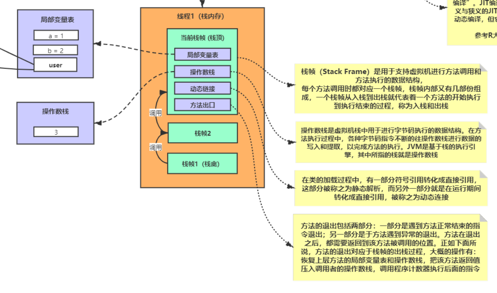

可以通过 -Xss 这个虚拟机参数来指定每个线程的 Java 虚拟机栈内存大小，在 JDK 1.4 中默认为 256K，而在 JDK 1.5+ 默认为 1M：

```java
java -Xss2M HackTheJava
```

该区域可能抛出以下异常：

- 当线程请求的栈深度超过最大值，会抛出 StackOverflowError 异常；
- 栈进行动态扩展时如果无法申请到足够内存，会抛出 OutOfMemoryError 异常。

> 总结

- 每当启动一个新线程时，Java虚拟机都会为它分配一个Java栈。
- 栈主管程序的运行，生命周期和栈同步，线程结束对应栈的内存即释放。
- 栈中不存在垃圾问题。
- Java中，线程每运行一个方法都会产生一个栈帧，当前执行的方法一定在栈的顶部。

### 3.3 本地方法栈

**线程私有**，本地方法栈与 Java 虚拟机栈类似，它们之间的区别只不过是本地方法栈为本地方法服务。

* 带有native关键词的方法，代表java的范围无法做到，需要调用底层C语言的库
* 该方法会进入本地方法栈，登记native，在执行时通过本地方法接口JNI(Java Native Interface)调用本地方法库
* JNI的作用，扩展Java的使用，融合不同的编程语言为Java所用，最初是为了调用C/C++
* native关键字一般用于使用Java来操纵硬件

### 3.4 堆

**线程共享**，所有对象都在这里分配内存，是垃圾收集的主要区域（"GC 堆"）。

- 堆不需要连续内存，并且可以动态增加其内存，增加失败会抛出 OutOfMemoryError(OOM) 异常。
- 一个JVM只有一个堆
- 堆中分为新生区、老年区
- 堆的最大值为内存的1/4（默认），初始化的堆内存大小为1/64（默认）
- 可以通过参数来调整，即JVM调优就是针对堆来调优(提高必备) [提高篇-JVM调优](https://www.cnblogs.com/ws0722/p/11542136.html)

可以通过 -Xms 和 -Xmx 这两个虚拟机参数来指定一个程序的堆内存大小，第一个参数设置初始值，第二个参数设置最大值。

```java
java -Xms1M -Xmx2M HackTheJava
```

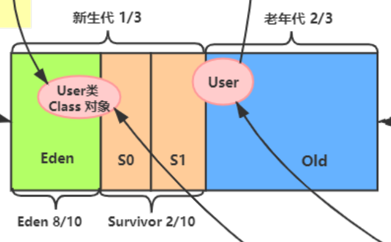

> 新生区

- Eden区，新创建的对象在这里
- Survivor区

> 老年区

- 当一个对象经历了15次（默认值）GC后，进入老年区

### 3.5 方法区

又名：永久区、元空间

**线程共享**，这个区是**常驻内存**的

> 存放数据

用来存放：

- JDK自带的Class对象、interface元数据
- 已被加载的类信息、常量、静态变量、即时编译器编译后的代码等数据

> 存放位置

- JDK1.6之前 ：永久代，常量池在方法区中
- JDK1.7 ：永久代，常量池在堆中
- JDK1.8之后：元空间，常量池在元空间中
- 永久代逻辑上存在，物理上不存在。**元空间并不占堆的内存，而是直接使用本地内存。**

### 3.6 运行时常量池

运行时常量池是方法区的一部分。

Class 文件中的常量池（编译器生成的字面量和符号引用）会在类加载后被放入这个区域。

除了在编译期生成的常量，还允许动态生成，例如 String 类的 intern()。

### 3.7 直接内存

在 JDK 1.4 中新引入了 NIO 类，它可以使用 Native 函数库直接分配堆外内存，然后通过 Java 堆里的 DirectByteBuffer 对象作为这块内存的引用进行操作。这样能在一些场景中显著提高性能，因为避免了在堆内存和堆外内存来回拷贝数据。

### 3.8 总结反思

- Class对象是存放在堆区的，不是方法区
- 的元数据（元数据并不是类的Class对象！Class对象是加载的最终产品，类的方法代码，变量名，方法名，访问权限，返回值等等都是在方法区的）才是存在方法区
- 静态变量static、常量final、类信息（构造方法、接口定义）运行时的常量池存在于方法区中，但是实例变量存在于堆内存中，和方法区无关


## 四、垃圾收集

垃圾收集主要是针对**堆**和**方法区**进行

### 4.1 判断一个对象是否可被回收

#### 4.1.1 引用计数算法

为对象添加一个引用计数器，当对象增加一个引用时计数器加 1，引用失效时计数器减 1。引用计数为 0 的对象可被回收。

在两个对象出现循环引用的情况下，此时引用计数器永远不为 0，导致无法对它们进行回收。正是因为循环引用的存在，因此 Java 虚拟机**不使用**引用计数算法。

```java
public class Test {

    public Object instance = null;

    public static void main(String[] args) {
        Test a = new Test();
        Test b = new Test();
        a.instance = b;
        b.instance = a;
        a = null;
        b = null;
        doSomething();
    }
}
```

在上述代码中，a 与 b 引用的对象实例互相持有了对象的引用，因此当我们把对 a 对象与 b 对象的引用去除之后，由于两个对象还存在互相之间的引用，导致两个 Test 对象无法被回收。

#### 4.1.2 可达性分析算法

以 GC Roots 为起始点进行搜索，可达的对象都是存活的，不可达的对象可被回收。

Java 虚拟机使用该算法来判断对象是否可被回收，GC Roots 一般包含以下内容：

- 虚拟机栈中局部变量表中引用的对象
- 本地方法栈中 JNI 中引用的对象
- 方法区中类静态属性引用的对象
- 方法区中的常量引用的对象

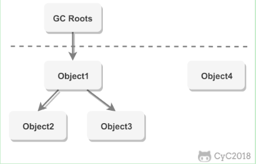


#### 4.1.3  方法区的回收

因为方法区主要存放永久代对象，而永久代对象的回收率比新生代低很多，所以在方法区上进行回收性价比不高。

主要是对**常量池**的回收和对类的卸载。

为了避免内存溢出，在大量使用反射和动态代理的场景都需要虚拟机具备类卸载功能。

类的卸载条件很多，需要满足以下三个条件，并且满足了条件也**不一定**会被卸载：

- 该类所有的实例都已经被回收，此时堆中不存在该类的任何实例。
- 加载该类的 ClassLoader 已经被回收。
- 该类对应的 Class 对象没有在任何地方被引用，也就无法在任何地方通过反射访问该类方法。

#### 4.1.4 finalize()

类似 C++ 的析构函数，用于关闭外部资源。但是 try-finally 等方式可以做得更好，并且该方法运行**代价很高**，不确定性大，无法保证各个对象的调用顺序，因此**最好不要使用**。

当一个对象可被回收时，如果需要执行该对象的 finalize() 方法，那么就有可能在该方法中让对象重新被引用，从而实现自救。自救只能进行一次，如果回收的对象之前调用了 finalize() 方法自救，后面回收时不会再调用该方法。

### 4.2 引用类型

无论是通过引用计数算法判断对象的引用数量，还是通过可达性分析算法判断对象是否可达，判定对象是否可被回收都与**引用**有关。

Java 提供了四种强度不同的引用类型。

#### 4.2.1 强引用

被强引用关联的对象不会被回收。

使用 new 一个新对象的方式来创建强引用。

```java
Object obj = new Object();
```

#### 4.2.2 软引用

被软引用关联的对象只有在**内存不够的情况**下才会被回收。

使用 **SoftReference 类来创建软引用**。

```java
Object obj = new Object();
SoftReference<Object> sf = new SoftReference<Object>(obj);
obj = null;  // 使对象只被软引用关联
```

#### 4.2.3 弱引用

被弱引用关联的对象一定会被回收，也就是说它只能存活到下一次垃圾回收发生之前。

使用 **WeakReference 类来创建弱引用**。

```java
Object obj = new Object();
WeakReference<Object> wf = new WeakReference<Object>(obj);
obj = null;
```

#### 4.2.4 虚引用

又称为幽灵引用或者幻影引用，一个对象是否有虚引用的存在，不会对其生存时间造成影响，也无法通过虚引用得到一个对象。

为一个对象设置虚引用的唯一目的是能在**这个对象被回收时收到一个系统通知**。

使用 **PhantomReference 来创建虚引用**。

```java
Object obj = new Object();
PhantomReference<Object> pf = new PhantomReference<Object>(obj, null);
obj = null;
```

### 4.3 垃圾收集算法

#### 4.3.1 标记 - 清除

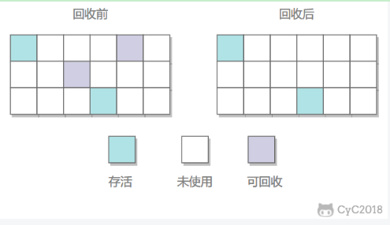

在标记阶段，程序会检查每个对象是否为活动对象，如果是活动对象，则程序会在对象头部打上**标记**。

在清除阶段，会进行对象回收并取消标志位，另外，还会判断回收后的分块与前一个空闲分块是否连续，若连续，会合并这两个分块。回收对象就是把对象作为分块，连接到被称为 “空闲链表” 的单向链表，之后进行分配时只需要遍历这个空闲链表，就可以找到分块。

在分配时，程序会搜索空闲链表寻找空间大于等于新对象大小 size 的块 block。如果它找到的块等于 size，会直接返回这个分块；如果找到的块大于 size，会将块分割成大小为 size 与 (block - size) 的两部分，返回大小为 size 的分块，并把大小为 (block - size) 的块返回给空闲链表。

不足：

- 标记和清除过程效率都不高；
- 会产生**大量不连续的内存碎片**，导致无法给大对象分配内存。

#### 4.3.2 标记 - 整理

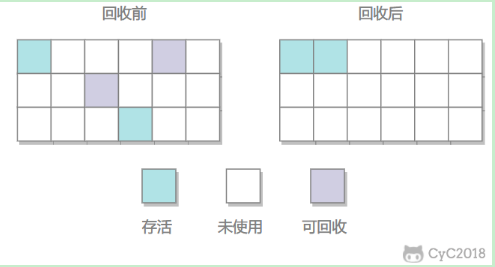

让所有存活的对象都向一端移动，然后直接清理掉端边界以外的内存。

优点:

- 不会产生内存碎片

不足:

- 需要**移动大量对象**，处理效率比较低。

#### 4.3.3 复制

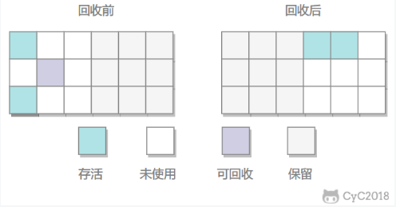

将内存划分为大小相等的两块，每次只使用其中一块，当这一块内存用完了就将还存活的对象复制到另一块上面，然后再把使用过的内存空间进行一次清理。分为from区和to区，from-to两个都不为空，复制其中的一个到另外一个，空的为to区。

主要不足是只使用了**内存的一半**。

现在的商业虚拟机都采用这种收集算法回收新生代，但是并不是划分为大小相等的两块，而是一块较大的 Eden 空间和两块较小的 Survivor 空间，每次使用 Eden 和其中一块 Survivor。在回收时，将 Eden 和 Survivor 中还存活着的对象全部复制到另一块 Survivor 上，最后清理 Eden 和使用过的那一块 Survivor。

HotSpot 虚拟机的 Eden 和 Survivor 大小比例默认为**8:1** ，保证了内存的利用率达到 90%。如果每次回收有多于 10% 的对象存活，那么一块 Survivor 就不够用了，此时需要依赖于老年代进行空间分配担保，也就是借用老年代的空间存储放不下的对象。

#### 4.3.4 分代收集

现在的商业虚拟机采用分代收集算法，它根据对象存活周期将内存划分为几块，不同块采用适当的收集算法。

一般将堆分为新生代和老年代。

- 新生代使用：复制算法
- 老年代使用：标记 - 清除 或者 标记 - 整理 算法

#### 4.3.5 GC算法总结

- 时间复杂度：复制算法>标记清除法>标记整理法
- 内存整齐度：复制算法=标记整理法>标记清除法
- 内存利用率：标记整理法=标记清除法>复制算法
- 使用场合
  - 新生代（存活率很低）使用复制算法
  - 老年代（存活率很高）使用标记清除压缩算法
  - tips：JVM调优主要就是针对这方面调整，多少次进入老年代、多少次清除后压缩等等，这些算法在不同场合应用，成为**分代收集算法**

### 4.4 垃圾收集器(了解)

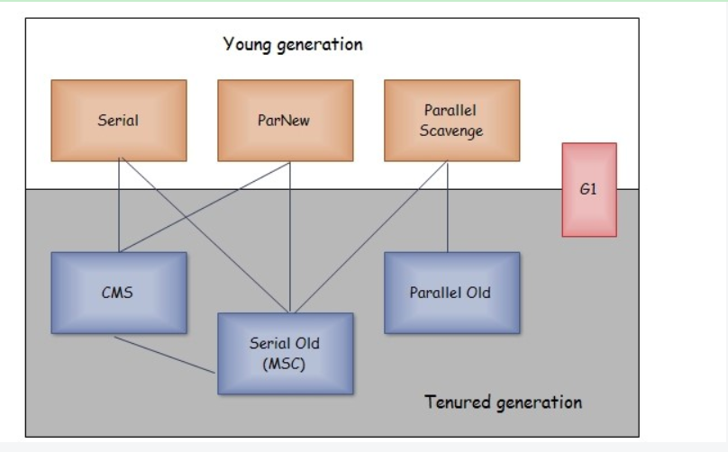

以上是 HotSpot 虚拟机中的 7 个垃圾收集器，连线表示垃圾收集器可以配合使用。

- 单线程与多线程：单线程指的是垃圾收集器只使用一个线程，而多线程使用多个线程；
- 串行与并行：串行指的是垃圾收集器与用户程序交替执行，这意味着在执行垃圾收集的时候需要停顿用户程序；并行指的是垃圾收集器和用户程序同时执行。除了 CMS 和 G1 之外，其它垃圾收集器都是以串行的方式执行。

#### 4.4.1 Serial 收集器

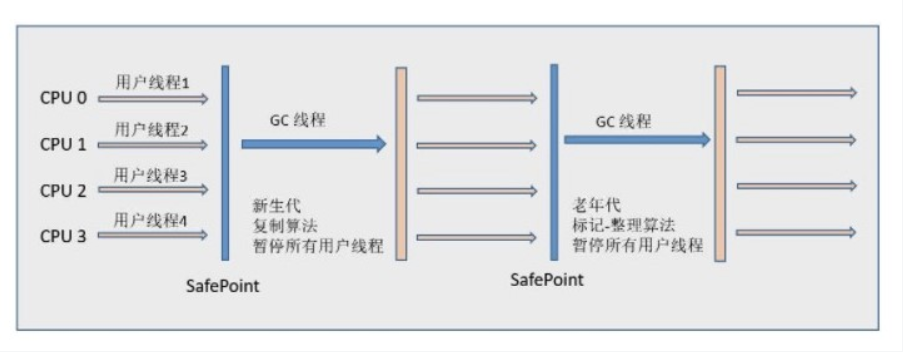

Serial 翻译为串行，也就是说它以串行的方式执行。

它是单线程的收集器，只会使用一个线程进行垃圾收集工作。

它的优点是简单高效，在单个 CPU 环境下，由于没有线程交互的开销，因此拥有最高的单线程收集效率。

它是 Client 场景下的默认新生代收集器，因为在该场景下内存一般来说不会很大。它收集一两百兆垃圾的停顿时间可以控制在一百多毫秒以内，只要不是太频繁，这点停顿时间是可以接受的。

#### 4.4.2 ParNew 收集器

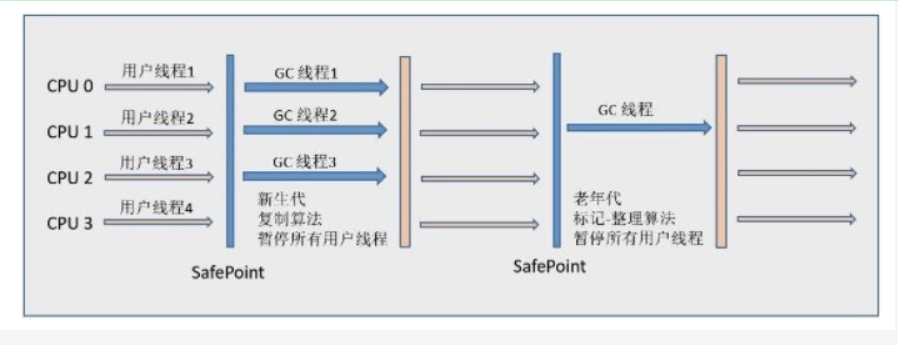

它是 Serial 收集器的多线程版本。

它是 Server 场景下默认的新生代收集器，除了性能原因外，主要是因为除了 Serial 收集器，只有它能与 CMS 收集器配合使用。

#### 4.4.3 Parallel Scavenge 收集器

与 ParNew 一样是多线程收集器。

其它收集器目标是尽可能缩短垃圾收集时用户线程的停顿时间，而它的目标是达到一个可控制的吞吐量，因此它被称为“吞吐量优先”收集器。这里的吞吐量指 CPU 用于运行用户程序的时间占总时间的比值。

停顿时间越短就越适合需要与用户交互的程序，良好的响应速度能提升用户体验。而高吞吐量则可以高效率地利用 CPU 时间，尽快完成程序的运算任务，适合在后台运算而不需要太多交互的任务。

缩短停顿时间是以牺牲吞吐量和新生代空间来换取的：新生代空间变小，垃圾回收变得频繁，导致吞吐量下降。

可以通过一个开关参数打开 GC 自适应的调节策略（GC Ergonomics），就不需要手工指定新生代的大小（-Xmn）、Eden 和 Survivor 区的比例、晋升老年代对象年龄等细节参数了。虚拟机会根据当前系统的运行情况收集性能监控信息，动态调整这些参数以提供最合适的停顿时间或者最大的吞吐量。

#### 4.4.4 Serial Old 收集器

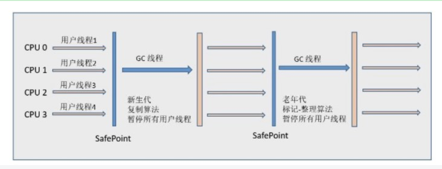

是 Serial 收集器的老年代版本，也是给 Client 场景下的虚拟机使用。如果用在 Server 场景下，它有两大用途：

- 在 JDK 1.5 以及之前版本（Parallel Old 诞生以前）中与 Parallel Scavenge 收集器搭配使用。
- 作为 CMS 收集器的后备预案，在并发收集发生 Concurrent Mode Failure 时使用。

#### 4.4.5 Parallel Old 收集器

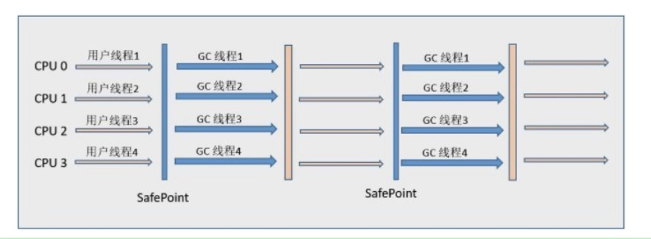

是 Parallel Scavenge 收集器的老年代版本。

在注重吞吐量以及 CPU 资源敏感的场合，都可以优先考虑 Parallel Scavenge 加 Parallel Old 收集器。

#### 4.4.6 CMS 收集器

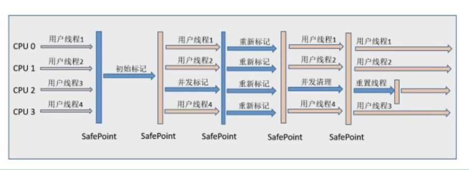

CMS（Concurrent Mark Sweep），Mark Sweep 指的是标记 - 清除算法。

分为以下四个流程：

- 初始标记：仅仅只是标记一下 GC Roots 能直接关联到的对象，速度很快，需要停顿。
- 并发标记：进行 GC Roots Tracing 的过程，它在整个回收过程中耗时最长，不需要停顿。
- 重新标记：为了修正并发标记期间因用户程序继续运作而导致标记产生变动的那一部分对象的标记记录，需要停顿。
- 并发清除：不需要停顿。

在整个过程中耗时最长的并发标记和并发清除过程中，收集器线程都可以与用户线程一起工作，不需要进行停顿。

具有以下缺点：

- 吞吐量低：低停顿时间是以牺牲吞吐量为代价的，导致 CPU 利用率不够高。
- 无法处理浮动垃圾，可能出现 Concurrent Mode Failure。浮动垃圾是指并发清除阶段由于用户线程继续运行而产生的垃圾，这部分垃圾只能到下一次 GC 时才能进行回收。由于浮动垃圾的存在，因此需要预留出一部分内存，意味着 CMS 收集不能像其它收集器那样等待老年代快满的时候再回收。如果预留的内存不够存放浮动垃圾，就会出现 Concurrent Mode Failure，这时虚拟机将临时启用 Serial Old 来替代 CMS。
- 标记 - 清除算法导致的空间碎片，往往出现老年代空间剩余，但无法找到足够大连续空间来分配当前对象，不得不提前触发一次 Full GC。

#### 4.4.7 G1 收集器

G1（Garbage-First），它是一款面向服务端应用的垃圾收集器，在多 CPU 和大内存的场景下有很好的性能。HotSpot 开发团队赋予它的使命是未来可以替换掉 CMS 收集器。

堆被分为新生代和老年代，其它收集器进行收集的范围都是整个新生代或者老年代，而 G1 可以直接对新生代和老年代一起回收。

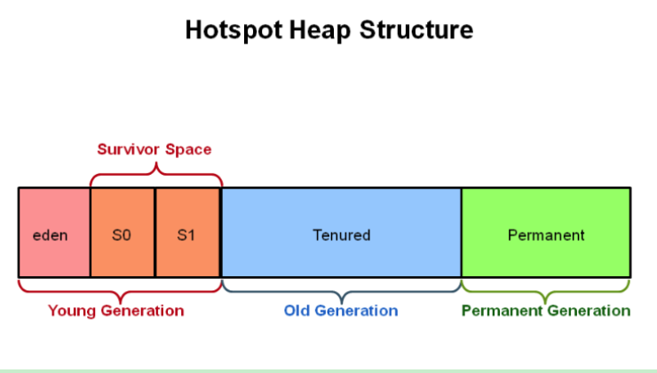

G1 把堆划分成多个大小相等的独立区域（Region），新生代和老年代不再物理隔离。

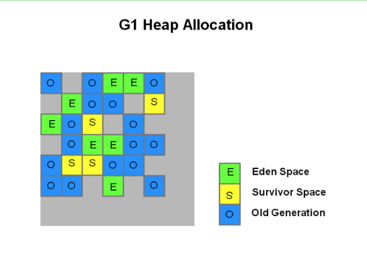

通过引入 Region 的概念，从而将原来的一整块内存空间划分成多个的小空间，使得每个小空间可以单独进行垃圾回收。这种划分方法带来了很大的灵活性，使得可预测的停顿时间模型成为可能。通过记录每个 Region 垃圾回收时间以及回收所获得的空间（这两个值是通过过去回收的经验获得），并维护一个优先列表，每次根据允许的收集时间，优先回收价值最大的 Region。

每个 Region 都有一个 Remembered Set，用来记录该 Region 对象的引用对象所在的 Region。通过使用 Remembered Set，在做可达性分析的时候就可以避免全堆扫描。

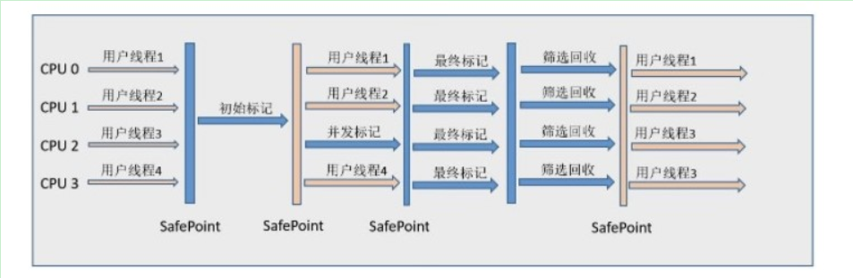

如果不计算维护 Remembered Set 的操作，G1 收集器的运作大致可划分为以下几个步骤：

- 初始标记
- 并发标记
- 最终标记：为了修正在并发标记期间因用户程序继续运作而导致标记产生变动的那一部分标记记录，虚拟机将这段时间对象变化记录在线程的 Remembered Set Logs 里面，最终标记阶段需要把 Remembered Set Logs 的数据合并到 Remembered Set 中。这阶段需要停顿线程，但是可并行执行。
- 筛选回收：首先对各个 Region 中的回收价值和成本进行排序，根据用户所期望的 GC 停顿时间来制定回收计划。此阶段其实也可以做到与用户程序一起并发执行，但是因为只回收一部分 Region，时间是用户可控制的，而且停顿用户线程将大幅度提高收集效率。

具备如下特点：

- 空间整合：整体来看是基于“标记 - 整理”算法实现的收集器，从局部（两个 Region 之间）上来看是基于“复制”算法实现的，这意味着运行期间不会产生内存空间碎片。
- 可预测的停顿：能让使用者明确指定在一个长度为 M 毫秒的时间片段内，消耗在 GC 上的时间不得超过 N 毫秒。


## 五、内存分配与回收策略

### 5.1 Minor GC 和 Full GC

- Minor GC：轻GC，回收新生代，因为新生代对象存活时间很短，因此 Minor GC 会频繁执行，执行的速度一般也会比较快。

- Full GC：重GC，回收老年代和新生代，老年代对象其存活时间长，因此 Full GC 很少执行，执行速度会比 Minor GC 慢很多。

### 5.2 内存分配策略

#### 5.2.1 对象优先在 Eden 分配

大多数情况下，对象在新生代 Eden 上分配，当 Eden 空间不够时，发起 Minor GC。

#### 5.2.2 大对象直接进入老年代

大对象是指需要连续内存空间的对象，最典型的大对象是那种很长的字符串以及数组。

经常出现大对象会提前触发垃圾收集以获取足够的连续空间分配给大对象。

`-XX:PretenureSizeThreshold`，大于此值的对象直接在老年代分配，避免在 Eden 和 Survivor 之间的大量内存复制。

#### 5.2.3 长期存活的对象进入老年代

为对象定义年龄计数器，对象在 Eden 出生并经过 Minor GC 依然存活，将移动到 Survivor 中，年龄就增加 1 岁，增加到一定年龄则移动到老年代（默认15次）中。

`-XX:MaxTenuringThreshold` 用来定义年龄的阈值。

#### 5.2.4 动态对象年龄判定

虚拟机并不是永远要求对象的年龄必须达到 MaxTenuringThreshold 才能晋升老年代，如果在 Survivor 中相同年龄所有对象大小的总和大于 Survivor 空间的一半，则年龄大于或等于该年龄的对象可以直接进入老年代，无需等到 MaxTenuringThreshold 中要求的年龄。

#### 5.2.5 空间分配担保

在发生 Minor GC 之前，虚拟机先检查老年代最大可用的连续空间是否大于新生代所有对象总空间，如果条件成立的话，那么 Minor GC 可以确认是安全的。

如果不成立的话虚拟机会查看 HandlePromotionFailure 的值是否允许担保失败，如果允许那么就会继续检查老年代最大可用的连续空间是否大于历次晋升到老年代对象的平均大小，如果大于，将尝试着进行一次 Minor GC；如果**小于，或者 HandlePromotionFailure 的值不允许冒险**，那么就要进行一次 Full GC。

### 5.3 Full GC 的触发条件

对于 Minor GC，其触发条件非常简单，当 Eden 空间满时，就将**触发一次** Minor GC，GC后Eden必定为空。而 Full GC 则相对复杂，有以下条件：

#### 5.3.1 调用 System.gc()

只是建议虚拟机执行 Full GC，但是虚拟机不一定真正去执行。**不建议**使用这种方式，而是让虚拟机管理内存。

#### 5.3.2 老年代空间不足

老年代空间不足的常见场景为前文所讲的大对象直接进入老年代、长期存活的对象进入老年代等。

为了避免以上原因引起的 Full GC，**应当尽量不要创建过大的对象以及数组**。除此之外，可以通过 -Xmn 虚拟机参数调大新生代的大小，让对象尽量在新生代被回收掉，不进入老年代。还可以通过 -XX:MaxTenuringThreshold 调大对象进入老年代的年龄，让对象在新生代多存活一段时间。

#### 5.3.3 空间分配担保失败

使用复制算法的 Minor GC 需要老年代的内存空间作担保，如果担保失败会执行一次 Full GC。具体内容请参考上面的第 5 小节。

#### 5.3.4 JDK 1.7 及以前的永久代空间不足

在 JDK 1.7 及以前，HotSpot 虚拟机中的方法区是用永久代实现的，永久代中存放的为一些 Class 的信息、常量、静态变量等数据。

当系统中要加载的类、反射的类和调用的方法较多时，永久代可能会被占满，在未配置为采用 CMS GC 的情况下也会执行 Full GC。如果经过 Full GC 仍然回收不了，那么虚拟机会抛出 java.lang.OutOfMemoryError。

为避免以上原因引起的 Full GC，可采用的方法为增大永久代空间或转为使用 CMS GC。

#### 5.3.5 Concurrent Mode Failure

执行 CMS GC 的过程中同时有对象要放入老年代，而此时老年代空间不足（可能是 GC 过程中浮动垃圾过多导致暂时性的空间不足），便会报 Concurrent Mode Failure 错误，并触发 Full GC。
