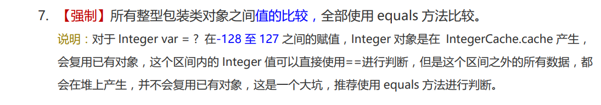

# Java基础秋招复习笔记

## 一、数据类型

### 1.1 八大基本数据类型

> 八大数据类型概览

| 数据类型 |    位数     |            范围             |  包装类   |  默认值  |
| :------: | :---------: | :-------------------------: | :-------: | :------: |
|   byte   | 1字节(8位)  |   -2^7 ~2^7 -1(-128~127)    |   Byte    |    0     |
|  short   | 2字节(16位) | -2^15~2^15 -1(-32768,32767) |   Short   |    0     |
|   int    | 4字节(32位) |        -2^31~2^31 -1        |  Integer  |    0     |
|   long   | 8字节(64位) |        -2^63~2^63 -1        |   Long    |    0L    |
|  float   | 4字节(32位) |              /              |   Float   |   0.0F   |
|  double  | 8字节(64位) |              /              |  Double   |   0.0D   |
|   char   | 2字节(16位) |           0~65536           | Character | '\u0000' |
| boolean  |      /      |         true、false         |  Boolean  |  false   |

> boolean值在JVM中的实现

boolean 只有两个值：true、false，可以使用 1 bit 来存储，但是具体大小没有明确规定。JVM 会在编译时期将 boolean 类型的数据转换为 int，使用 1 来表示 true，0 表示 false。JVM 支持 boolean 数组，但是是通过读写 byte 数组来实现的。

> 浮点数的精度问题

Java中浮点型数据无法由二进制直接表示，而是一种对于实数的**近似**数据表示法，因此会有精度丢失的风险。因此如果需要表示金额，会使用`BigDecimal`类。

```java
public static void main(String[] args) {
    System.out.println(1.2 - 1);//1.2 - 1，明显是1但是运行结果却不是！
}
//0.19999999999999996
```

这种精度丢失的问题牵扯到计算机中二进制的小数近似表示，不仅仅是java有进度丢失的问题，所以在float、double中是无法避免的，如果对此有需求可以使用`BigDecimal`类。

### 1.2 包装类型

基本类型都有对应的包装类型。

> 包装类源码分析

以Integer包装类为例分析

```java
//Integer类实现了Comparable接口、继承了Number类
//并且被写为final，因此不能被继承
public final class Integer extends Number implements Comparable<Integer> {}

//Comparable接口是一个函数式接口、其子类需要重写compareTo方法
public interface Comparable<T> {
    public int compareTo(T o);
}

//Number类是一个抽象类，包含了一些方法
public abstract class Number implements java.io.Serializable {
    public abstract int intValue();

    public abstract long longValue();

    public abstract float floatValue();

    public abstract double doubleValue();

    public byte byteValue() {
        return (byte)intValue();
    }

    public short shortValue() {
        return (short)intValue();
    }
}
```

```java
//Integer中的字段
@Native public static final int   MIN_VALUE = 0x80000000;//最小值
@Native public static final int   MAX_VALUE = 0x7fffffff;//最大值
@Native public static final int SIZE = 32;//位
private final int value;//存放的值，注意到是final，即不能改变（编译层面）
```

除此之外，还有很多Integer的实现方法。

> 装箱和拆箱

所谓装箱就是把基本数据类型，转化为包装类的过程。而拆箱则是把包装类转化为基本数据类型的过程。

```java
public class Demo {
    public static void main(String[] args) {
    int m = 500;
    Integer obj = new Integer(m); // 手动装箱
    int n = obj.intValue(); // 手动拆箱
    System.out.println("n = " + n);
    Integer obj1 = new Integer(500);
    System.out.println("obj 等价于 obj1？" + obj.equals(obj1));
　　}
}
//n = 500
//obj 等价于 obj1？true
```

基本类型与其对应的包装类型之间的赋值使用自动装箱与拆箱完成。

```java
public class Demo {
    public static void main www.120xh.cn (String[] args) {
        int m = 500;
        Integer obj = m; // 自动装箱
        int n = obj; // 自动拆箱
        System.out.println("n = " + n);
        Integer obj1 = 500;
        System.out.println("obj 等价于 obj1？" + obj.equals(obj1));
    }
}
//n = 500 obj
//等价于 obj1？true
```

> 为什么需要包装类

Java 是号称面向对象的语言，所有的类型都是引用类型。 Object 类是所有类的父类，而且是唯一不用指定明确继承的类。但是**基本类型如 int 不是引用类型，也不是继承自 Object，所以 Java 需要一个这样的包装类来使其面向对象的完整性**。 包装类同时也可以实现可空类型，即一个数值是空的。Java 集合中也只能放入包装类型，而不支持基本类型。

### 1.3 缓存池

> 缓存池底层源码

在 jdk 1.8 所有的数值类缓冲池中，Integer 的缓冲池 IntegerCache 很特殊，这个缓冲池的下界是 - 128，上界默认是 127，但是这个上界是可调的，在启动 jvm 的时候，通过 `-XX:AutoBoxCacheMax=<size>` 来指定这个缓冲池的大小，该选项在 JVM 初始化的时候会设定一个名为 java.lang.IntegerCache.high 系统属性，然后 IntegerCache 初始化的时候就会读取该系统属性来决定上界。

```java
private static class IntegerCache {
    static final int low = -128;//其下限是固定的为-128
    static final int high;
    static final Integer cache[];

    static {
        // high value may be configured by property
        int h = 127;
        String integerCacheHighPropValue =
            sun.misc.VM.getSavedProperty("java.lang.Integer.IntegerCache.high");//读取参数
        if (integerCacheHighPropValue != null) {
            try {
                int i = parseInt(integerCacheHighPropValue);
                i = Math.max(i, 127);//这两句是为了保证程序能正常运行
                // Maximum array size is Integer.MAX_VALUE
                h = Math.min(i, Integer.MAX_VALUE - (-low) -1);
            } catch( NumberFormatException nfe) {
                // If the property cannot be parsed into an int, ignore it.
            }
        }
        high = h;//其上限是可以通过JVM的参数来调整的

        cache = new Integer[(high - low) + 1];
        int j = low;
        for(int k = 0; k < cache.length; k++)
            cache[k] = new Integer(j++);

        // range [-128, 127] must be interned (JLS7 5.1.7)
        assert IntegerCache.high >= 127;
    }

    private IntegerCache() {}
}
```

> 创建包装类的方式

new Integer(123) 与 Integer.valueOf(123) 均可以创建包装类，区别在于：

- new Integer(123) 每次都会新建一个对象；
- Integer.valueOf(123) 当数值在缓存范围内，会返回缓存。

```java
public static Integer valueOf(int i) {
    if (i >= IntegerCache.low && i <= IntegerCache.high)//如果在缓存范围内，就返回缓存
        return IntegerCache.cache[i + (-IntegerCache.low)];
    return new Integer(i);
}
```

```java
public Integer(int value) {
    this.value = value;
}
```

```java
public static void main(String[] args) {
    Integer i1 = new Integer(123);
    Integer i2 = new Integer(123);
    System.out.println(i1 == i2);//false
    System.out.println(i1.equals(i2));//true
    Integer i3 = Integer.valueOf(123);
    Integer i4 = Integer.valueOf(123);
    System.out.println(i3 == i4);//true
    Integer i5 = 123;
    Integer i6 = 123;
    System.out.println(i5 == i6);//true
}
```

从测试结果可以看到，i3和i4确实是同一个对象。同时java的自动装箱操作也会调用valueOf方法。

> 缓存池的默认范围

基本类型对应的缓冲池如下：

- boolean values true and false
- all byte values
- short values between -128 and 127
- int values between -128 and 127
- char in the range \u0000 to \u007F

> 注意事项

对于Integer类的比较，要使用equals方法，因为==比较的是对象是否为同一个！在缓存池的范围内确实可以使用==，但是一旦超出范围就会出现问题，两个值一样的对象，==的结果是false。而equals方法，比较的是对象内的值（阿里开发手册）。



## 二、String

### 2.1 String分析

> String底层分析

String 被声明为 final，因此它不可被继承。(Integer 等包装类也不能被继承）

在 Java 8 中，String 内部使用 char 数组存储数据。

```java
public final class String
    implements java.io.Serializable, Comparable<String>, CharSequence {
    /** The value is used for character storage. */
    private final char value[];
}
```

在 Java 9 之后，String 类的实现改用 byte 数组存储字符串，同时使用 `coder` 来标识使用了哪种编码。

```java
public final class String
    implements java.io.Serializable, Comparable<String>, CharSequence {
    /** The value is used for character storage. */
    private final byte[] value;

    /** The identifier of the encoding used to encode the bytes in {@code value}. */
    private final byte coder;
}
```

value 数组被声明为 final，这意味着 value 数组初始化之后就不能再引用其它数组。并且 String 内部没有改变 value 数组的方法，因此可以保证 String 不可变。

> 不可变的好处

1. 可以缓存 hash 值

因为 String 的 hash 值经常被使用，例如 String 用做 HashMap 的 key。不可变的特性可以使得 hash 值也不可变，因此只需要进行一次计算。

2. String Pool 的需要

如果一个 String 对象已经被创建过了，那么就会从 String Pool 中取得引用。只有 String 是不可变的，才可能使用 String Pool。

3. 安全性

String 经常作为参数，String 不可变性可以保证参数不可变。例如在作为网络连接参数的情况下如果 String 是可变的，那么在网络连接过程中，String 被改变，改变 String 的那一方以为现在连接的是其它主机，而实际情况却不一定是。

4. 线程安全

String 不可变性天生具备线程安全，可以在多个线程中安全地使用。

### 2.2 String、StringBuffer、StringBuilder

1. 可变性

- String 不可变
- StringBuffer 可变
- StringBuilder 可变

2. 线程安全

- String 不可变，因此是线程安全的
- StringBuilder 不是线程安全的
- StringBuffer 是线程安全的，内部使用 synchronized 进行同步

### 2.3 String Pool

> 什么是String Pool

- 在工作中，String类是我们使用频率非常高的一种对象类型。JVM为了提升性能和减少内存开销，避免字符串的重复创建，其维护了一块特殊的内存空间，这就是我们今天要讨论的核心，即字符串池（String Pool）。字符串池由String类私有的维护。
- 在 Java 7 之前，String Pool 被放在运行时常量池中，它属于永久代。而在 Java 7，String Pool 被移到堆中。这是因为永久代的空间有限，在大量使用字符串的场景下会导致 OutOfMemoryError 错误。
- 字符串池中维护了共享的字符串对象，这些字符串不会被垃圾收集器回收。

> String创建方式

- 采用字面值直接赋值

```java
public static void main(String[] args) {
    String s1 = "aaa";
    String s2 = "aaa";
    System.out.println(s1 == s2);
}
//true
```

采用字面值的方式创建一个字符串时，JVM首先会去字符串池中查找是否存在"aaa"这个对象，如果不存在，则在字符串池中**创建**"aaa"这个对象，然后将池中"aaa"这个对象的引用地址返回给字符串常量str，这样str会指向池中"aaa"这个字符串对象；如果存在，则**不创建**任何对象，直接将池中"aaa"这个对象的地址返回，赋给字符串常量。即最多只会在池中创建一个对象！

- 采用new关键字新建一个字符串对象

```java
public static void main(String[] args) {
    String s1 = new String("aaa");
    String s2 = new String("aaa");
    System.out.println(s1 == s2);
}
//false
```

采用new关键字新建一个字符串对象时，JVM首先在字符串池中查找有没有"aaa"这个字符串对象，如果有，则不在池中再去创建"aaa"这个对象了，**直接在堆中创建**一个"aaa"字符串对象，然后将堆中的这个"aaa"对象的地址返回赋给引用str3，这样，str3就指向了堆中创建的这个"aaa"字符串对象；如果没有，则首先**在字符串池中创建**一个"aaa"字符串对象，然后**再在堆中创建**一个"aaa"字符串对象，然后将堆中这个"aaa"字符串对象的地址返回赋给str3引用，这样，str3指向了堆中创建的这个"aaa"字符串对象。不管存不存在都是会指向堆中的str！

> 字符串池的优缺点

- 字符串池的优点就是避免了相同内容的字符串的创建，节省了内存，省去了创建相同字符串的时间，同时提升了性能；
- 字符串池的缺点就是牺牲了JVM在常量池中遍历对象所需要的时间，不过其时间成本相比而言比较低。

> intern方法使用

字符串常量池（String Pool）保存着所有字符串字面量（literal strings），这些字面量在编译时期就确定。不仅如此，还可以使用 String 的 intern() 方法在运行过程将字符串添加到 String Pool 中。

当一个字符串调用 intern() 方法时，如果 String Pool 中已经存在一个字符串和该字符串值相等（使用 equals() 方法进行确定），那么就会返回 String Pool 中字符串的引用；否则，就会在 String Pool 中添加一个新的字符串，并返回这个新字符串的引用。

下面示例中，s1 和 s2 采用 new String() 的方式新建了两个不同字符串，而 s3 和 s4 是通过 s1.intern() 方法取得同一个字符串引用。intern() 首先把 s1 引用的字符串放到 String Pool 中，然后返回这个字符串引用。因此 s3 和 s4 引用的是同一个字符串。

对于任意两个字符串s和t，当且仅当s.equals(t)为true时，s.instan() == t.instan才为true。所有字面值字符串和字符串赋值常量表达式都使用 intern方法进行操作。因为值对应在常量池中只有一份！

```java
String s1 = new String("aaa");
String s2 = new String("aaa");
System.out.println(s1 == s2);           // false
String s3 = s1.intern();
String s4 = s1.intern();
System.out.println(s3 == s4);           // true
```

> 总结

字符串是常量，字符串池中的每个字符串对象只有唯一的一份，可以被多个引用所指向，避免了重复创建内容相同的字符串；通过字面值赋值创建的字符串对象存放在字符串池中，通过关键字new出来的字符串对象存放在堆中。


## 三、