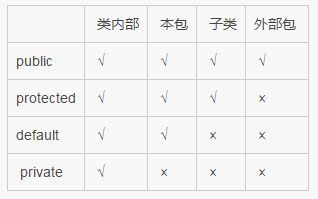
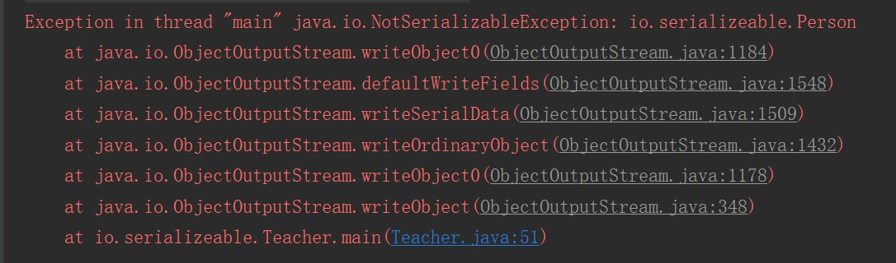
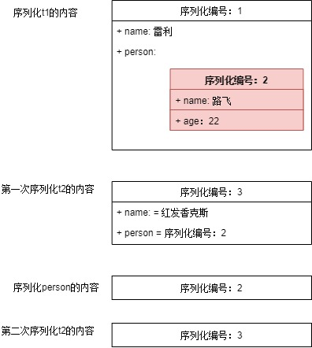
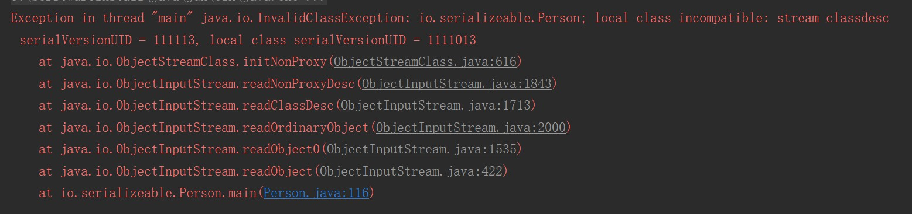

# Java基础秋招复习笔记

## 一、数据类型

### 1.1 八大基本数据类型

> 八大数据类型概览

| 数据类型 |    位数     |            范围             |  包装类   |  默认值  |
| :------: | :---------: | :-------------------------: | :-------: | :------: |
|   byte   | 1字节(8位)  |   -2^7 ~2^7 -1(-128~127)    |   Byte    |    0     |
|  short   | 2字节(16位) | -2^15~2^15 -1(-32768,32767) |   Short   |    0     |
|   int    | 4字节(32位) |        -2^31~2^31 -1        |  Integer  |    0     |
|   long   | 8字节(64位) |        -2^63~2^63 -1        |   Long    |    0L    |
|  float   | 4字节(32位) |              /              |   Float   |   0.0F   |
|  double  | 8字节(64位) |              /              |  Double   |   0.0D   |
|   char   | 2字节(16位) |           0~65536           | Character | '\u0000' |
| boolean  |      /      |         true、false         |  Boolean  |  false   |

> boolean值在JVM中的实现

boolean 只有两个值：true、false，可以使用 1 bit 来存储，但是具体大小没有明确规定。JVM 会在编译时期将 boolean 类型的数据转换为 int，使用 1 来表示 true，0 表示 false。JVM 支持 boolean 数组，但是是通过读写 byte 数组来实现的。

> 浮点数的精度问题

Java中浮点型数据无法由二进制直接表示，而是一种对于实数的**近似**数据表示法，因此会有精度丢失的风险。因此如果需要表示金额，会使用`BigDecimal`类。

```java
public static void main(String[] args) {
    System.out.println(1.2 - 1);//1.2 - 1，明显是1但是运行结果却不是！
}
//0.19999999999999996
```

这种精度丢失的问题牵扯到计算机中二进制的小数近似表示，不仅仅是java有进度丢失的问题，所以在float、double中是无法避免的，如果对此有需求可以使用`BigDecimal`类。

### 1.2 包装类型

基本类型都有对应的包装类型。

> 包装类源码分析

以Integer包装类为例分析

```java
//Integer类实现了Comparable接口、继承了Number类
//并且被写为final，因此不能被继承
public final class Integer extends Number implements Comparable<Integer> {}

//Comparable接口是一个函数式接口、其子类需要重写compareTo方法
public interface Comparable<T> {
    public int compareTo(T o);
}

//Number类是一个抽象类，包含了一些方法
public abstract class Number implements java.io.Serializable {
    public abstract int intValue();

    public abstract long longValue();

    public abstract float floatValue();

    public abstract double doubleValue();

    public byte byteValue() {
        return (byte)intValue();
    }

    public short shortValue() {
        return (short)intValue();
    }
}
```

```java
//Integer中的字段
@Native public static final int   MIN_VALUE = 0x80000000;//最小值
@Native public static final int   MAX_VALUE = 0x7fffffff;//最大值
@Native public static final int SIZE = 32;//位
private final int value;//存放的值，注意到是final，即不能改变（编译层面）
```

除此之外，还有很多Integer的实现方法。

1. valueOf，该方法可以输入不同的进制，如果radix = 16，那么s是一个十六进制的数，得到一个10进制的数

   ```java
   public static Integer valueOf(String s, int radix) throws NumberFormatException {
       return Integer.valueOf(parseInt(s,radix));
   }
   ```

2. toOctalString方法,十进制转为8进制

   ```java
   public static String toOctalString(int i) {
       return toUnsignedString0(i, 3);
   }
   ```

3. toHexString方法，十进制转化为16进制

   ```java
   public static String toHexString(int i) {
       return toUnsignedString0(i, 4);
   }
   ```

4. toBinaryString方法，十进制转化为2进制

   ```java
   public static String toBinaryString(int i) {
       return toUnsignedString0(i, 1);
   }
   ```

5. toUnsignedString0方法，上面3个方法都基于此方法，就不深入研究了。

   ```java
   private static String toUnsignedString0(int val, int shift) {
       // assert shift > 0 && shift <=5 : "Illegal shift value";
       int mag = Integer.SIZE - Integer.numberOfLeadingZeros(val);
       int chars = Math.max(((mag + (shift - 1)) / shift), 1);
       char[] buf = new char[chars];
   
       formatUnsignedInt(val, shift, buf, 0, chars);
   
       // Use special constructor which takes over "buf".
       return new String(buf, true);
   }
   ```

> 装箱和拆箱

所谓装箱就是把基本数据类型，转化为包装类的过程。而拆箱则是把包装类转化为基本数据类型的过程。

```java
public class Demo {
    public static void main(String[] args) {
    int m = 500;
    Integer obj = new Integer(m); // 手动装箱
    int n = obj.intValue(); // 手动拆箱
    System.out.println("n = " + n);
    Integer obj1 = new Integer(500);
    System.out.println("obj 等价于 obj1？" + obj.equals(obj1));
　　}
}
//n = 500
//obj 等价于 obj1？true
```

基本类型与其对应的包装类型之间的赋值使用自动装箱与拆箱完成。

```java
public class Demo {
    public static void main www.120xh.cn (String[] args) {
        int m = 500;
        Integer obj = m; // 自动装箱
        int n = obj; // 自动拆箱
        System.out.println("n = " + n);
        Integer obj1 = 500;
        System.out.println("obj 等价于 obj1？" + obj.equals(obj1));
    }
}
//n = 500 obj
//等价于 obj1？true
```

> 为什么需要包装类

Java 是号称面向对象的语言，所有的类型都是引用类型。 Object 类是所有类的父类，而且是唯一不用指定明确继承的类。但是**基本类型如 int 不是引用类型，也不是继承自 Object，所以 Java 需要一个这样的包装类来使其面向对象的完整性**。 包装类同时也可以实现可空类型，即一个数值是空的。Java 集合中也只能放入包装类型，而不支持基本类型。

### 1.3 缓存池

> 缓存池底层源码

在 jdk 1.8 所有的数值类缓冲池中，Integer 的缓冲池 IntegerCache 很特殊，这个缓冲池的下界是 - 128，上界默认是 127，但是这个上界是可调的，在启动 jvm 的时候，通过 `-XX:AutoBoxCacheMax=<size>` 来指定这个缓冲池的大小，该选项在 JVM 初始化的时候会设定一个名为 java.lang.IntegerCache.high 系统属性，然后 IntegerCache 初始化的时候就会读取该系统属性来决定上界。

```java
private static class IntegerCache {
    static final int low = -128;//其下限是固定的为-128
    static final int high;
    static final Integer cache[];

    static {
        // high value may be configured by property
        int h = 127;
        String integerCacheHighPropValue =
            sun.misc.VM.getSavedProperty("java.lang.Integer.IntegerCache.high");//读取参数
        if (integerCacheHighPropValue != null) {
            try {
                int i = parseInt(integerCacheHighPropValue);
                i = Math.max(i, 127);//这两句是为了保证程序能正常运行
                // Maximum array size is Integer.MAX_VALUE
                h = Math.min(i, Integer.MAX_VALUE - (-low) -1);
            } catch( NumberFormatException nfe) {
                // If the property cannot be parsed into an int, ignore it.
            }
        }
        high = h;//其上限是可以通过JVM的参数来调整的

        cache = new Integer[(high - low) + 1];
        int j = low;
        for(int k = 0; k < cache.length; k++)
            cache[k] = new Integer(j++);

        // range [-128, 127] must be interned (JLS7 5.1.7)
        assert IntegerCache.high >= 127;
    }

    private IntegerCache() {}
}
```

> 创建包装类的方式

new Integer(123) 与 Integer.valueOf(123) 均可以创建包装类，区别在于：

- new Integer(123) 每次都会新建一个对象；
- Integer.valueOf(123) 当数值在缓存范围内，会返回缓存。

```java
public static Integer valueOf(int i) {
    if (i >= IntegerCache.low && i <= IntegerCache.high)//如果在缓存范围内，就返回缓存
        return IntegerCache.cache[i + (-IntegerCache.low)];
    return new Integer(i);
}
```

```java
public Integer(int value) {
    this.value = value;
}
```

```java
public static void main(String[] args) {
    Integer i1 = new Integer(123);
    Integer i2 = new Integer(123);
    System.out.println(i1 == i2);//false
    System.out.println(i1.equals(i2));//true
    Integer i3 = Integer.valueOf(123);
    Integer i4 = Integer.valueOf(123);
    System.out.println(i3 == i4);//true
    Integer i5 = 123;
    Integer i6 = 123;
    System.out.println(i5 == i6);//true
}
```

从测试结果可以看到，i3和i4确实是同一个对象。同时java的自动装箱操作也会调用valueOf方法。

> 缓存池的默认范围

基本类型对应的缓冲池如下：

- boolean values true and false
- all byte values
- short values between -128 and 127
- int values between -128 and 127
- char in the range \u0000 to \u007F

> 注意事项

对于Integer类的比较，要使用equals方法，因为==比较的是对象是否为同一个！在缓存池的范围内确实可以使用==，但是一旦超出范围就会出现问题，两个值一样的对象，==的结果是false。而equals方法，比较的是对象内的值（阿里开发手册）。


## 二、String

### 2.1 String分析

> String底层分析

String 被声明为 final，因此它不可被继承。(Integer 等包装类也不能被继承）

在 Java 8 中，String 内部使用 char 数组存储数据。

```java
public final class String
    implements java.io.Serializable, Comparable<String>, CharSequence {
    /** The value is used for character storage. */
    private final char value[];
}
```

在 Java 9 之后，String 类的实现改用 byte 数组存储字符串，同时使用 `coder` 来标识使用了哪种编码。

```java
public final class String
    implements java.io.Serializable, Comparable<String>, CharSequence {
    /** The value is used for character storage. */
    private final byte[] value;

    /** The identifier of the encoding used to encode the bytes in {@code value}. */
    private final byte coder;
}
```

value 数组被声明为 final，这意味着 value 数组初始化之后就不能再引用其它数组。并且 String 内部没有改变 value 数组的方法，因此可以保证 String 不可变。

> 不可变的好处

1. 可以缓存 hash 值

因为 String 的 hash 值经常被使用，例如 String 用做 HashMap 的 key。不可变的特性可以使得 hash 值也不可变，因此只需要进行一次计算。

2. String Pool 的需要

如果一个 String 对象已经被创建过了，那么就会从 String Pool 中取得引用。只有 String 是不可变的，才可能使用 String Pool。

3. 安全性

String 经常作为参数，String 不可变性可以保证参数不可变。例如在作为网络连接参数的情况下如果 String 是可变的，那么在网络连接过程中，String 被改变，改变 String 的那一方以为现在连接的是其它主机，而实际情况却不一定是。

4. 线程安全

String 不可变性天生具备线程安全，可以在多个线程中安全地使用。

### 2.2 String、StringBuffer、StringBuilder

1. 可变性

- String 不可变
- StringBuffer 可变
- StringBuilder 可变

2. 线程安全

- String 不可变，因此是线程安全的
- StringBuilder 不是线程安全的
- StringBuffer 是线程安全的，内部使用 synchronized 进行同步

### 2.3 String Pool

> 什么是String Pool

- 在工作中，String类是我们使用频率非常高的一种对象类型。JVM为了提升性能和减少内存开销，避免字符串的重复创建，其维护了一块特殊的内存空间，这就是我们今天要讨论的核心，即字符串池（String Pool）。字符串池由String类私有的维护。
- 在 Java 7 之前，String Pool 被放在运行时常量池中，它属于永久代。而在 Java 7，String Pool 被移到堆中。这是因为永久代的空间有限，在大量使用字符串的场景下会导致 OutOfMemoryError 错误。
- 字符串池中维护了共享的字符串对象，这些字符串不会被垃圾收集器回收。

> String创建方式

- 采用字面值直接赋值

```java
public static void main(String[] args) {
    String s1 = "aaa";
    String s2 = "aaa";
    System.out.println(s1 == s2);
}
//true
```

采用字面值的方式创建一个字符串时，JVM首先会去字符串池中查找是否存在"aaa"这个对象，如果不存在，则在字符串池中**创建**"aaa"这个对象，然后将池中"aaa"这个对象的引用地址返回给字符串常量str，这样str会指向池中"aaa"这个字符串对象；如果存在，则**不创建**任何对象，直接将池中"aaa"这个对象的地址返回，赋给字符串常量。即最多只会在池中创建一个对象！

- 采用new关键字新建一个字符串对象

```java
public static void main(String[] args) {
    String s1 = new String("aaa");
    String s2 = new String("aaa");
    System.out.println(s1 == s2);
}
//false
```

采用new关键字新建一个字符串对象时，JVM首先在字符串池中查找有没有"aaa"这个字符串对象，如果有，则不在池中再去创建"aaa"这个对象了，**直接在堆中创建**一个"aaa"字符串对象，然后将堆中的这个"aaa"对象的地址返回赋给引用str3，这样，str3就指向了堆中创建的这个"aaa"字符串对象；如果没有，则首先**在字符串池中创建**一个"aaa"字符串对象，然后**再在堆中创建**一个"aaa"字符串对象，然后将堆中这个"aaa"字符串对象的地址返回赋给str3引用，这样，str3指向了堆中创建的这个"aaa"字符串对象。不管存不存在都是会指向堆中的str！

> 字符串池的优缺点

- 字符串池的优点就是避免了相同内容的字符串的创建，节省了内存，省去了创建相同字符串的时间，同时提升了性能；
- 字符串池的缺点就是牺牲了JVM在常量池中遍历对象所需要的时间，不过其时间成本相比而言比较低。

> intern方法使用

字符串常量池（String Pool）保存着所有字符串字面量（literal strings），这些字面量在编译时期就确定。不仅如此，还可以使用 String 的 intern() 方法在运行过程将字符串添加到 String Pool 中。

当一个字符串调用 intern() 方法时，如果 String Pool 中已经存在一个字符串和该字符串值相等（使用 equals() 方法进行确定），那么就会返回 String Pool 中字符串的引用；否则，就会在 String Pool 中添加一个新的字符串，并返回这个新字符串的引用。

下面示例中，s1 和 s2 采用 new String() 的方式新建了两个不同字符串，而 s3 和 s4 是通过 s1.intern() 方法取得同一个字符串引用。intern() 首先把 s1 引用的字符串放到 String Pool 中，然后返回这个字符串引用。因此 s3 和 s4 引用的是同一个字符串。

对于任意两个字符串s和t，当且仅当s.equals(t)为true时，s.instan() == t.instan才为true。所有字面值字符串和字符串赋值常量表达式都使用 intern方法进行操作。因为值对应在常量池中只有一份！

```java
String s1 = new String("aaa");
String s2 = new String("aaa");
System.out.println(s1 == s2);           // false
String s3 = s1.intern();
String s4 = s1.intern();
System.out.println(s3 == s4);           // true
```

> 总结

字符串是常量，字符串池中的每个字符串对象只有唯一的一份，可以被多个引用所指向，避免了重复创建内容相同的字符串；通过字面值赋值创建的字符串对象存放在字符串池中，通过关键字new出来的字符串对象存放在堆中。


## 三、运算

### 3.1 参数传递

Java中基本数据类型传递是值，而引用数据类型如对象、数组等则是传递的引用地址。

> 基本数据类型

对于基本数据类型而言，修改形参而不会影响实参

```java
public static void main(String[] args) {
    int i = 6;
    System.out.println(i);//6
    test(i);
    System.out.println(i);//6
}

public static void test(int a){
    a = 7;
}
```

> 引用数据类型

而当参数为对象、数组等引用数据类型时，修改形参则会影响到实参。因为传递的是实参的引用，实参和形参是同一个参数。

```java
public class DataType {
    public static void main(String[] args) {
        Dog i = new Dog();
        i.name = "66";
        System.out.println(i);//66
        test(i);
        System.out.println(i);//77
    }

    public static void test(Dog a){
        a.name = "77";
    }
}

class Dog{
    public String name;

    @Override
    public String toString() {
        return "Dog{" +
                "name='" + name + '\'' +
                '}';
    }
}
```

> 为什么会有这样的区别？

其本质原因需要探究JVM的堆栈。Java程序的运行主要是通过栈来实现的，而JVM中的堆负责的是存放对象。

- 基本数据类型是直接存储在栈中，在运行时，发生方法调用，就会直接传值开辟临时空间。所以形参和实参对应的是**不同**的内存！
- 引用数据类型则是存储在堆中，栈中存放的是其引用，发生方法调用，传递的还是引用，形参和实参对应的是**同一个**内存。

### 3.2 类型转换

> 显示类型转换

即强制类型转换，Java中对大类型转化为小类型是默认不允许的，因此只能使用强转。如Long转int。

```java
public static void main(String[] args) {
    long l = 1L;
    int a = (int) l;
}
```

特别注意的是，对于+=、-=、*=、/=、++这类运算符时，就不需要手动的类型转换！

```java
i += j;//对于+=操作，会自动进行类型转换
i = i + j;//错误
i = (type of i) (i + j)//正确
```

> 隐式类型转换

对于小类型转变为大类型，Java支持自动转化。

```java
public static void main(String[] args) {
    float f = 1.1F;
    double d = f;
}
```

当然类型转换不仅仅局限于基本数据类型，对于引用数据类型也适用。

> 错误的类型转换

当尝试把Object转化为Float时，会抛出异常。这种错误通常会发生在引用数据类型的小转大时发生。

```java
public static void main(String[] args) {
    float f = 1.1F;
    double d = f;
    //Exception in thread "main" java.lang.ClassCastException: java.lang.Object cannot be cast to java.lang.Float
    float f2 = (float)new Object();
}
```

### 3.3 switch-case

switch语句在Java7之后开始支持String类型。在IDEA中使用long去测试switch，给出如下提示！

Incompatible types. Found: 'java.lang.Long', required: 'char, byte, short, int, Character, Byte, Short, Integer, String, or an enum'

上一句话中写明，switch中只支持char、byte、short、int和他们的包装类，以及String和枚举。

**注意**：switch 不支持 long，是因为 switch 的设计初衷是对那些只有少数几个值的类型进行等值判断，如果值过于复杂，那么还是用 if 比较合适。

### 3.4 instanceof

该运算符是双目运算符，左面的操作元是一个**对象**，右面是一个**类或接口**。当左面的对象是右面的类(或右边类的子孙类)创建的对象、或者是右边接口的实现类(或实现类的子孙类)的对象时，该运算符运算结果是true，否则是false。

```java
public static void main(String[] args) {
    String s = "aaa";
    System.out.println(s instanceof Object);
}
```

### 3.5 位运算

```java
public class DataType {
    public static void main(String[] args) {
        byte a = 12;
        byte b = -20;
        //如果同位上都为1，则为1，否则为0，与
        System.out.println(a & b);
        //如果同位上有一个为1，则为1，否则为0，或
        System.out.println(a | b);
        //如果同位相等为0，否则为1，异或
        System.out.println(a ^ b);
        //取反
        System.out.println(~a);
        //如果同位相等为0，否则为1，异或
        System.out.println(a ^ b);
        //左移,把数值二进制向左移动x位，低位补0
        System.out.println(a << 1);
        //右移，把数值二进制向右移动x位，正数高位补0，负数补1
        System.out.println(b >> 1);
        //无符号右移，把数值二进制向右移动x位，高位补0
        System.out.println(b >>> 5);
        System.out.println(~60);//00111100 1100 0011 原码1011 1101 反码1100 0010 补码 1100 0011
    }
}
```


## 四、关键字

在java中共有53个关键字，包括两个保留字，`const` `goto`。另外还有三个保留字，`false` `true` `null`。

### 4.1 基本数据类型

基本数据类型，共有8个关键字，已在第一章中讨论过了。

### 4.2 逻辑控制

> 条件判断

- if，条件语句的引导词
- else，用在条件语句中，表明当条件不成立时的分支

> switch

- switch，分支语句结构的引导词
- case，用在switch语句之中，表示其中的一个分支
- default，默认，例如，用在switch语句中，表明一个默认的分支

> 循环

- while，用在循环结构中
- break，提前跳出一个块
- continue，回到一个块的开始处
- do，do-while结构
- for，一种循环结构的引导词

### 4.3 类与接口

- abstract，表明类或者成员方法具有抽象属性
  - abstract类不能实例化。
  - 仅当abstract类的子类实现其超类的所有abstract方法时，才能实例化abstract类的子类。这种类称为具体类。
  - 如果abstract类的子类没有实现其超类的所有abstract方法，该子类也是abstract类。
  - abstract关键字不能应用于static、private或final方法，因为这些方法不能被重写，因此，不能在子类中实现。
  - final类的方法都不能是abstract，因为final类不能有子类。
- class，声明一个类
- enum，枚举类型
- extends，继承类
- implements，实现接口
- interface，接口
- super，表明当前对象的父类型的引用或者父类型的**构造方法**
- this，指向当前实例对象的引用

### 4.4 方法

- return，从成员方法中返回数据
- void，用于函数中**声明当前成员方法没有返回值**

### 4.5 权限

- private，私有
- protected，保护
- public，公有

### 4.6 异常

- catch，用在异常处理中，用来捕捉异常
- finally，用于处理异常情况，用来声明一个基本肯定会被执行到的语句块
- throw，抛出一个异常
- throws，声明在当前定义的成员方法中所有需要抛出的异常
- try，尝试一个可能抛出异常的程序块

### 4.7 其他

- assert，断言，用来进行程序调试（测试中用的多）

- **final**，用来说明最终属性，表明一个类不能派生出子类，或者成员方法不能被覆盖，或者成员域的值不能被改变，用来定义常量

  1. 数据

  声明数据为常量，可以是编译时常量，也可以是在运行时被初始化后不能被改变的常量。

  - 对于基本类型，final 使数值不变；
  - 对于引用类型，final 使引用不变，也就不能引用其它对象，但是被引用的对象本身是可以修改的。

  ```java
  final int x = 1;
  // x = 2;  // cannot assign value to final variable 'x'
  final A y = new A();
  y.a = 1;
  ```

  2. 方法

  声明方法不能被子类重写。

  private 方法隐式地被指定为 final，如果在子类中定义的方法和基类中的一个 private 方法签名相同，此时子类的方法不是重写基类方法，而是在子类中定义了一个新的方法。

  3. 类

  声明类不允许被继承。

- import，表明要访问指定的类或包

- instanceof，用来测试一个对象是否是指定类型的实例对象

- **native**，用来声明一个方法是由与计算机相关的语言（如C/C++/FORTRAN语言）实现的（在JVM中会涉及）

- new，用来创建新实例对象

- package，包

- **static**，表明具有静态属性

  1. 静态变量

  - 静态变量：又称为类变量，也就是说这个变量属于类的，类所有的实例都共享静态变量，可以直接通过类名来访问它。静态变量在内存中只存在一份。
  - 实例变量：每创建一个实例就会产生一个实例变量，它与该实例同生共死。

  ```java
  public class A {
  
      private int x;         // 实例变量
      private static int y;  // 静态变量
  
      public static void main(String[] args) {
          // int x = A.x;  // Non-static field 'x' cannot be referenced from a static context
          A a = new A();
          int x = a.x;
          int y = A.y;
      }
  }
  ```

  2. 静态方法

  静态方法在类加载的时候就存在了，它不依赖于任何实例。所以静态方法必须有实现，也就是说它不能是抽象方法。

  ```java
  public abstract class A {
      public static void func1(){
      }
      // public abstract static void func2();  // Illegal combination of modifiers: 'abstract' and 'static'
  }
  ```

  只能访问所属类的静态字段和静态方法，方法中不能有 `this` 和 `super` 关键字，因此这两个关键字与具体对象关联。

  ```java
  public class A {
  
      private static int x;
      private int y;
  
      public static void func1(){
          int a = x;
          // int b = y;  // Non-static field 'y' cannot be referenced from a static context
          // int b = this.y;     // 'A.this' cannot be referenced from a static context
      }
  }
  ```

  3. 静态语句块

  静态语句块在类初始化时运行一次。

  ```java
  public class A {
      static {
          System.out.println("123");
      }
  
      public static void main(String[] args) {
          A a1 = new A();
          A a2 = new A();
      }
  }
  ```

  ```html
  123
  ```

  4. 静态内部类

  非静态内部类依赖于外部类的实例，也就是说需要先创建外部类实例，才能用这个实例去创建非静态内部类。而静态内部类不需要。

  ```java
  public class OuterClass {
  
      class InnerClass {
      }
  
      static class StaticInnerClass {
      }
  
      public static void main(String[] args) {
          // InnerClass innerClass = new InnerClass(); // 'OuterClass.this' cannot be referenced from a static context
          OuterClass outerClass = new OuterClass();
          InnerClass innerClass = outerClass.new InnerClass();
          StaticInnerClass staticInnerClass = new StaticInnerClass();
      }
  }
  ```

  静态内部类不能访问外部类的非静态的变量和方法。

  5. 静态导包

  在使用静态变量和方法时不用再指明 ClassName，从而简化代码，但可读性大大降低。

  ```java
  import static com.xxx.ClassName.*
  ```

  6. 初始化顺序

  静态变量和静态语句块优先于实例变量和普通语句块，静态变量和静态语句块的初始化顺序取决于它们在代码中的顺序。

  ```java
  public static String staticField = "静态变量";
  ```

  ```java
  static {
      System.out.println("静态语句块");
  }
  ```

  ```java
  public String field = "实例变量";
  ```

  ```java
  {
      System.out.println("普通语句块");
  }
  ```

  最后才是构造函数的初始化。

  ```java
  public InitialOrderTest() {
      System.out.println("构造函数");
  }
  ```

  存在继承的情况下，初始化顺序为：

  - 父类（静态变量、静态语句块）
  - 子类（静态变量、静态语句块）
  - 父类（实例变量、普通语句块）
  - 父类（构造函数）
  - 子类（实例变量、普通语句块）
  - 子类（构造函数）

  ```java
  public class DataType {
      public DataType(){System.out.println("a"); }//4
      static {System.out.println("b"); }//1
      {System.out.println("c");}//3
  }
  class A extends DataType{
      public A(){System.out.println("d"); }//6
      static {System.out.println("e"); }//2
      {System.out.println("f");}//5
      public static void main(String[] args) {new A();}
  }
  ```

- strictfp，用来声明FP_strict（单精度或双精度浮点数）表达式遵循IEEE 754算术规范

- **synchronized**，同步锁（并发）

- **transient**，声明不用序列化的成员域（序列化）

- **volatile**，表明两个或者多个变量必须同步地发生变化（并发）


## 五、继承与实现

### 5.1 访问权限



如果子类的方法重写了父类的方法，那么子类中该方法的访问级别不允许低于父类的访问级别。这是为了确保可以使用父类实例的地方都可以使用子类实例去代替，也就是确保满足里氏替换原则。

字段决不能是公有的，因为这么做的话就失去了对这个字段修改行为的控制，客户端可以对其随意修改。例如下面的例子中，AccessExample 拥有 id 公有字段，如果在某个时刻，我们想要使用 int 存储 id 字段，那么就需要修改所有的客户端代码。

### 5.2 抽象类与接口

> 抽象类

抽象类和抽象方法都使用 abstract 关键字进行声明。如果一个类中包含抽象方法，那么这个类必须声明为抽象类。

抽象类和普通类最大的区别是，抽象类不能被实例化，只能被继承。abstract不能和static、final一起出现。

> 接口

接口是抽象类的延伸，在 Java 8 之前，它可以看成是一个完全抽象的类，也就是说它不能有任何的方法实现。

从 Java 8 开始，接口也可以使用`default`来拥有默认的方法实现，这是因为不支持默认方法的接口的维护成本太高了。在 Java 8 之前，如果一个接口想要添加新的方法，那么要修改所有实现了该接口的类，让它们都实现新增的方法。

接口的成员（字段 + 方法）默认都是 **public** 的，并且**不允许**定义为 private 或者 protected。

接口的字段默认都是 **static 和 final** 的。

> 两者的区别

- 从设计层面上看，抽象类提供了一种 IS-A 关系，需要满足里式替换原则，即子类对象必须能够替换掉所有父类对象。而接口更像是一种 LIKE-A 关系，它只是提供一种方法实现契约，并不要求接口和实现接口的类具有 IS-A 关系。
- 从使用上来看，一个类可以实现多个接口，但是不能继承多个抽象类。
- 接口的字段只能是 static 和 final 类型的，而抽象类的字段没有这种限制。
- 接口的成员只能是 public 的，而抽象类的成员可以有多种访问权限。

> 使用选择

使用接口：

- 需要让不相关的类都实现一个方法，例如不相关的类都可以实现 Comparable 接口中的 compareTo() 方法；
- 需要使用多重继承。

使用抽象类：

- 需要在几个相关的类中共享代码。
- 需要能控制继承来的成员的访问权限，而不是都为 public。
- 需要继承非静态和非常量字段。

在很多情况下，接口优先于抽象类。因为接口没有抽象类严格的类层次结构要求，可以灵活地为一个类添加行为。并且从 Java 8 开始，接口也可以有默认的方法实现，使得修改接口的成本也变的很低。

### 5.3 super与this

> super

- 访问父类的构造函数：可以使用 super() 函数访问父类的构造函数，从而委托父类完成一些初始化的工作。应该注意到，子类一定会调用父类的构造函数来完成初始化工作，一般是调用父类的默认构造函数，如果子类需要调用父类其它构造函数，那么就可以使用 super() 函数。
- 访问父类的成员：如果子类重写了父类的某个方法，可以通过使用 super 关键字来引用父类的方法实现。

```java
public class SuperExample {

    protected int x;
    protected int y;

    public SuperExample(int x, int y) {
        this.x = x;
        this.y = y;
    }

    public void func() {
        System.out.println("SuperExample.func()");
    }
}
```

```java
public class SuperExtendExample extends SuperExample {
    private int z;

    public SuperExtendExample(int x, int y, int z) {
        super(x, y);
        this.z = z;
    }

    @Override
    public void func() {
        super.func();
        System.out.println("SuperExtendExample.func()");
    }
}
```
> this

- 可以通过this来访问本类的构造器，但是访问构造器的语句必须为构造函数的第一行。
- 可以通过this访问本类的字段与方法

```java
public class ThisTest implements A{
    public DataType(){}

    public DataType(int a){
        this();
        this.setNumber(a);
    }
    
    public static void main(String[] args) {
        new DataType(4);
    }
}
interface A{
    int number = 0;
    default void setNumber(int a){
        System.out.println(number);
    };
}
```

### 5.4 重写与重载

> 重写

存在于继承体系中，指子类实现了一个与父类在方法声明上完全相同的一个方法。

为了满足里式替换原则，重写有以下三个限制：

- 子类方法的访问权限必须大于等于父类方法；
- 子类方法的返回类型必须是父类方法返回类型或为其子类型。
- 子类方法抛出的异常类型必须是父类抛出异常类型或为其子类型。

使用 @Override 注解，可以让编译器帮忙检查是否满足上面的三个限制条件。

下面的示例中，SubClass 为 SuperClass 的子类，SubClass 重写了 SuperClass 的 func() 方法。其中：

- 子类方法访问权限为 public，大于父类的 protected。
- 子类的返回类型为 ArrayList<Integer>，是父类返回类型 List<Integer> 的子类。
- 子类抛出的异常类型为 Exception，是父类抛出异常 Throwable 的子类。
- 子类重写方法使用 @Override 注解，从而让编译器自动检查是否满足限制条件。

```java
class SuperClass {
    protected List<Integer> func() throws Throwable {
        return new ArrayList<>();
    }
}

class SubClass extends SuperClass {
    @Override
    public ArrayList<Integer> func() throws Exception {
        return new ArrayList<>();
    }
}
```

在调用一个方法时，先从本类中查找看是否有对应的方法，如果没有再到父类中查看，看是否从父类继承来。否则就要对参数进行转型，转成父类之后看是否有对应的方法。总的来说，方法调用的优先级为：

- this.func(this)
- super.func(this)
- this.func(super)
- super.func(super)


```java
/*
    A
    |
    B
    |
    C
    |
    D
 */


class A {

    public void show(A obj) {
        System.out.println("A.show(A)");
    }

    public void show(C obj) {
        System.out.println("A.show(C)");
    }
}

class B extends A {

    @Override
    public void show(A obj) {
        System.out.println("B.show(A)");
    }
}

class C extends B {
}

class D extends C {
}
```

```java
public static void main(String[] args) {

    A a = new A();
    B b = new B();
    C c = new C();
    D d = new D();

    // 在 A 中存在 show(A obj)，直接调用
    a.show(a); // A.show(A)
    // 在 A 中不存在 show(B obj)，将 B 转型成其父类 A
    a.show(b); // A.show(A)
    // 在 B 中存在从 A 继承来的 show(C obj)，直接调用
    b.show(c); // A.show(C)
    // 在 B 中不存在 show(D obj)，但是存在从 A 继承来的 show(C obj)，将 D 转型成其父类 C
    b.show(d); // A.show(C)

    // 引用的还是 B 对象，所以 ba 和 b 的调用结果一样
    A ba = new B();
    ba.show(c); // A.show(C)
    ba.show(d); // A.show(C)
    ba.show(a);//B.show(A),使用父类来接受子类对象的话，会把子类中的父类没有的方法去掉，但会保留子类中的父类
}
```

> 重载

存在于同一个类中，指一个方法与已经存在的方法名称上相同，但是参数类型、个数、顺序至少有一个不同。

应该注意的是，返回值、权限、抛出的异常不同，其它都相同不算是重载。

### 5.5 Object对象

> Object中所有的方法

```java
package java.lang;

public class Object {

    //注册的方法就是该类所包含的除了registerNatives()方法以外的所有本地方法
    private static native void registerNatives();
    static {
        registerNatives();
    }

    public final native Class<?> getClass();

    public native int hashCode();

    //指示一些其他对象是否等于此。 
    public boolean equals(Object obj) {
        return (this == obj);
    }

    //创建并返回此对象的副本。 
    protected native Object clone() throws CloneNotSupportedException;

    public String toString() {
        return getClass().getName() + "@" + Integer.toHexString(hashCode());
    }

    public final native void notify();

    public final native void notifyAll();

    public final native void wait(long timeout) throws InterruptedException;

    public final void wait(long timeout, int nanos) throws InterruptedException {
        if (timeout < 0) {
            throw new IllegalArgumentException("timeout value is negative");
        }

        if (nanos < 0 || nanos > 999999) {
            throw new IllegalArgumentException(
                                "nanosecond timeout value out of range");
        }

        if (nanos > 0) {
            timeout++;
        }

        wait(timeout);
    }
    public final void wait() throws InterruptedException {
        wait(0);
    }
    
    //当垃圾收集确定不再有对该对象的引用时，垃圾收集器在对象上调用该对象。 
    protected void finalize() throws Throwable { }
}

```

> registerNatives

一个Java程序要想调用一个本地方法，需要执行两个步骤

- 第一，通过System.loadLibrary()将包含本地方法实现的动态文件加载进内存；
- 第二，当Java程序需要调用本地方法时，虚拟机在加载的动态文件中定位并链接该本地方法，从而得以执行本地方法。
- registerNatives()方法的作用就是取代第二步，让程序主动将本地方法链接到调用方，当Java程序需要调用本地方法时就可以直接调用，而不需要虚拟机再去定位并链接。

> registerNatives()方法的三点好处：

- 通过registerNatives方法在类被加载的时候就主动将本地方法链接到调用方，比当方法被使用时再由虚拟机来定位和链接更方便有效
- 如果本地方法在程序运行中更新了，可以通过调用registerNative方法进行更新
- Java程序需要调用一个本地应用提供的方法时，因为虚拟机只会检索本地动态库，因而虚拟机是无法定位到本地方法实现的，这个时候就只能使用registerNatives()方法进行主动链接。
- 通过registerNatives()方法，在定义本地方法实现的时候，可以不遵守JNI命名规范。

> JNI命名规范

举个例子，我们在Object中定义的本地方法registerNatives，那这个方法对应的本地方法名就叫Java_java_lang_Object_registerNatives，而在System类中定义的registerNatives方法对应的本地方法名叫Java_java_lang_System_registerNatives等等。也就是说，JNI命名规范要求本地方法名由“包名”+“方法名”构成。

## 

```java
public native int hashCode()

public boolean equals(Object obj)

protected native Object clone() throws CloneNotSupportedException

public String toString()

public final native Class<?> getClass()

protected void finalize() throws Throwable {}

public final native void notify()

public final native void notifyAll()

public final native void wait(long timeout) throws InterruptedException

public final void wait(long timeout, int nanos) throws InterruptedException

public final void wait() throws InterruptedException
```

> equals()

1. 等价关系

两个对象具有等价关系，需要满足以下五个条件：

Ⅰ 自反性

```java
x.equals(x); // true
```

Ⅱ 对称性

```java
x.equals(y) == y.equals(x); // true
```

Ⅲ 传递性

```java
if (x.equals(y) && y.equals(z))
    x.equals(z); // true;
```

Ⅳ 一致性

多次调用 equals() 方法结果不变

```java
x.equals(y) == x.equals(y); // true
```

Ⅴ 与 null 的比较

对任何不是 null 的对象 x 调用 x.equals(null) 结果都为 false

```java
x.equals(null); // false;
```

2. 等价与相等

- 对于基本类型，== 判断两个值是否相等，基本类型没有 equals() 方法。
- 对于引用类型，== 判断两个变量是否引用同一个对象，而 equals() 判断引用的对象是否等价。

```java
Integer x = new Integer(1);
Integer y = new Integer(1);
System.out.println(x.equals(y)); // true
System.out.println(x == y);      // false
```

3. 实现

- 检查是否为同一个对象的引用，如果是直接返回 true；
- 检查是否是同一个类型，如果不是，直接返回 false；
- 将 Object 对象进行转型；
- 判断每个关键域是否相等。

```java
public class EqualExample {

    private int x;
    private int y;
    private int z;

    public EqualExample(int x, int y, int z) {
        this.x = x;
        this.y = y;
        this.z = z;
    }

    @Override
    public boolean equals(Object o) {
        if (this == o) return true;
        if (o == null || getClass() != o.getClass()) return false;

        EqualExample that = (EqualExample) o;

        if (x != that.x) return false;
        if (y != that.y) return false;
        return z == that.z;
    }
}
```

> hashCode()

hashCode() 返回哈希值，而 equals() 是用来判断两个对象是否等价。等价的两个对象散列值一定相同，但是散列值相同的两个对象不一定等价，这是因为计算哈希值具有随机性，两个值不同的对象可能计算出相同的哈希值。

在覆盖 equals() 方法时应当总是覆盖 hashCode() 方法，保证等价的两个对象哈希值也相等。

HashSet  和 HashMap 等集合类使用了 hashCode()  方法来计算对象应该存储的位置，因此要将对象添加到这些集合类中，需要让对应的类实现 hashCode()  方法。

下面的代码中，新建了两个等价的对象，并将它们添加到 HashSet 中。我们希望将这两个对象当成一样的，只在集合中添加一个对象。但是 EqualExample 没有实现 hashCode() 方法，因此这两个对象的哈希值是不同的，最终导致集合添加了两个等价的对象。

```java
EqualExample e1 = new EqualExample(1, 1, 1);
EqualExample e2 = new EqualExample(1, 1, 1);
System.out.println(e1.equals(e2)); // true
HashSet<EqualExample> set = new HashSet<>();
set.add(e1);
set.add(e2);
System.out.println(set.size());   // 2
```

理想的哈希函数应当具有均匀性，即不相等的对象应当均匀分布到所有可能的哈希值上。这就要求了哈希函数要把所有域的值都考虑进来。可以将每个域都当成 R 进制的某一位，然后组成一个 R 进制的整数。

R 一般取 31，因为它是一个奇素数，如果是偶数的话，当出现乘法溢出，信息就会丢失，因为与 2 相乘相当于向左移一位，最左边的位丢失。并且一个数与 31 相乘可以转换成移位和减法：`31*x == (x<<5)-x`，编译器会自动进行这个优化。

```java
@Override
public int hashCode() {
    int result = 17;
    result = 31 * result + x;
    result = 31 * result + y;
    result = 31 * result + z;
    return result;
}
```

> toString()

默认返回 ToStringExample@4554617c 这种形式，其中 @ 后面的数值为散列码的无符号十六进制表示。

```java
public class ToStringExample {

    private int number;

    public ToStringExample(int number) {
        this.number = number;
    }
}
```

```java
ToStringExample example = new ToStringExample(123);
System.out.println(example.toString());
```

```html
ToStringExample@4554617c
```

> clone()

1. cloneable

clone() 是 Object 的 protected 方法，它不是 public，一个类不显式去重写 clone()，其它类就不能直接去调用该类实例的 clone() 方法。

```java
public class CloneExample {
    private int a;
    private int b;
}
```

```java
CloneExample e1 = new CloneExample();
// CloneExample e2 = e1.clone(); // 'clone()' has protected access in 'java.lang.Object'
```

重写 clone() 得到以下实现：

```java
public class CloneExample {
    private int a;
    private int b;

    @Override
    public CloneExample clone() throws CloneNotSupportedException {
        return (CloneExample)super.clone();
    }
}
```

```java
CloneExample e1 = new CloneExample();
try {
    CloneExample e2 = e1.clone();
} catch (CloneNotSupportedException e) {
    e.printStackTrace();
}
```

```html
java.lang.CloneNotSupportedException: CloneExample
```

以上抛出了 CloneNotSupportedException，这是因为 CloneExample 没有实现 Cloneable 接口。

应该注意的是，clone() 方法并不是 Cloneable 接口的方法，而是 Object 的一个 protected 方法。**Cloneable 接口只是规定，如果一个类没有实现 Cloneable 接口又调用了 clone() 方法，就会抛出 CloneNotSupportedException。**

```java
public class CloneExample implements Cloneable {
    private int a;
    private int b;

    @Override
    public Object clone() throws CloneNotSupportedException {
        return super.clone();
    }
}
```

2. 浅拷贝

拷贝对象和原始对象的引用类型引用同一个对象。

```java
public class ShallowCloneExample implements Cloneable {

    private int[] arr;

    public ShallowCloneExample() {
        arr = new int[10];
        for (int i = 0; i < arr.length; i++) {
            arr[i] = i;
        }
    }

    public void set(int index, int value) {
        arr[index] = value;
    }

    public int get(int index) {
        return arr[index];
    }

    @Override
    protected ShallowCloneExample clone() throws CloneNotSupportedException {
        return (ShallowCloneExample) super.clone();
    }
}
```

```java
ShallowCloneExample e1 = new ShallowCloneExample();
ShallowCloneExample e2 = null;
try {
    e2 = e1.clone();
} catch (CloneNotSupportedException e) {
    e.printStackTrace();
}
e1.set(2, 222);
System.out.println(e2.get(2)); // 222
```

3. 深拷贝

拷贝对象和原始对象的引用类型引用不同对象。

```java
public class DeepCloneExample implements Cloneable {

    private int[] arr;

    public DeepCloneExample() {
        arr = new int[10];
        for (int i = 0; i < arr.length; i++) {
            arr[i] = i;
        }
    }

    public void set(int index, int value) {
        arr[index] = value;
    }

    public int get(int index) {
        return arr[index];
    }

    @Override
    protected DeepCloneExample clone() throws CloneNotSupportedException {
        DeepCloneExample result = (DeepCloneExample) super.clone();
        result.arr = new int[arr.length];
        for (int i = 0; i < arr.length; i++) {
            result.arr[i] = arr[i];
        }
        return result;
    }
}
```

```java
DeepCloneExample e1 = new DeepCloneExample();
DeepCloneExample e2 = null;
try {
    e2 = e1.clone();
} catch (CloneNotSupportedException e) {
    e.printStackTrace();
}
e1.set(2, 222);
System.out.println(e2.get(2)); // 2
```

4. clone() 的替代方案

使用 clone() 方法来拷贝一个对象即复杂又有风险，它会抛出异常，并且还需要类型转换。Effective Java 书上讲到，最好不要去使用 clone()，可以使用**拷贝构造函数**或者**拷贝工厂**来拷贝一个对象。

```java
public class CloneConstructorExample {

    private int[] arr;

    public CloneConstructorExample() {
        arr = new int[10];
        for (int i = 0; i < arr.length; i++) {
            arr[i] = i;
        }
    }

    public CloneConstructorExample(CloneConstructorExample original) {
        arr = new int[original.arr.length];
        for (int i = 0; i < original.arr.length; i++) {
            arr[i] = original.arr[i];
        }
    }

    public void set(int index, int value) {
        arr[index] = value;
    }

    public int get(int index) {
        return arr[index];
    }
}
```

```java
CloneConstructorExample e1 = new CloneConstructorExample();
CloneConstructorExample e2 = new CloneConstructorExample(e1);
e1.set(2, 222);
System.out.println(e2.get(2)); // 2
```


## 六、异常

### 6.1 异常概述

Throwable 可以用来表示任何可以作为异常抛出的类，分为两种：  **Error**   和 **Exception**。其中 Error 用来表示 JVM 无法处理的错误，Exception 分为两种：

-   **受检异常**  ：需要用 try...catch... 语句捕获并进行处理，并且可以从异常中恢复；
-   **非受检异常**  ：是程序运行时错误（即RuntimeException以及其子类）例如除 0 会引发 Arithmetic Exception，此时程序崩溃并且无法恢复。

### 6.2 为什么运行时错误不用捕获

当你把一个异常定义在方法的throws定义中，你就可以不处理这个异常，系统会自动把该异常抛出。 而RuntimeException则是java设计中所有方法都默认定义在throws中了，所以只要你不捕获，就会一层一层的往上抛出。 除非你显示的标准要捕获它。否则不会被捕获。也不会造成编译异常。

## 七、反射

### 7.1 什么是反射

每个类都有一个   **Class**   对象，包含了与类有关的信息。当编译一个新类时，会产生一个同名的 .class 文件，该文件内容保存着 Class 对象。

### 7.2 如何使用反射

类加载相当于 Class 对象的加载，类在第一次使用时才动态加载到 JVM 中。也可以使用 `Class.forName("com.mysql.jdbc.Driver")` 这种方式来控制类的加载，该方法会返回一个 Class 对象。

反射可以提供运行时的类信息，并且这个类可以在运行时才加载进来，甚至在编译时期该类的 .class 不存在也可以加载进来。

Class 和 java.lang.reflect 一起对反射提供了支持，java.lang.reflect 类库主要包含了以下三个类：

-   **Field**  ：可以使用 get() 和 set() 方法读取和修改 Field 对象关联的字段；
-   **Method**  ：可以使用 invoke() 方法调用与 Method 对象关联的方法；
-   **Constructor**  ：可以用 Constructor 的 newInstance() 创建新的对象。

```java
public class LazyMan {
    private static LazyMan single;
    private static boolean my = false;
    private LazyMan(){
        if(!my){
            my = true;
        }
        else{
            throw new RuntimeException("反射");
        }
        System.out.println(Thread.currentThread().getName());
    }
    public static LazyMan getInstance(){
        if(single == null){
            synchronized (LazyMan.class){
                if(single == null){
                    single = new LazyMan();
                }
            }
        }
        return single;
    }

    public static void main(String[] args) throws NoSuchMethodException, IllegalAccessException, InvocationTargetException, InstantiationException, NoSuchFieldException {
        //LazyMan obj1 = LazyMan.getInstance();
        Field my = LazyMan.class.getDeclaredField("my");
        Constructor<LazyMan> constructor = LazyMan.class.getDeclaredConstructor(null);//获得空参构造
        constructor.setAccessible(true);
        LazyMan lazyMan = constructor.newInstance();//执行构造
        my.setAccessible(true);
        my.set(lazyMan,false);
        LazyMan obj1 = constructor.newInstance();
        System.out.println(lazyMan.hashCode());
        System.out.println(obj1.hashCode());
    }
}
//356573597
//1735600054
```

### 7.3 反射的优缺点

> 优点

*     **可扩展性**   ：应用程序可以利用全限定名创建可扩展对象的实例，来使用来自外部的用户自定义类。
*     **类浏览器和可视化开发环境**   ：一个类浏览器需要可以枚举类的成员。可视化开发环境（如 IDE）可以从利用反射中可用的类型信息中受益，以帮助程序员编写正确的代码。
*     **调试器和测试工具**   ： 调试器需要能够检查一个类里的私有成员。测试工具可以利用反射来自动地调用类里定义的可被发现的 API 定义，以确保一组测试中有较高的代码覆盖率。

> 缺点

尽管反射非常强大，但也不能滥用。如果一个功能可以不用反射完成，那么最好就不用。在我们使用反射技术时，下面几条内容应该牢记于心。

*     **性能开销**   ：反射涉及了动态类型的解析，所以 JVM 无法对这些代码进行优化。因此，反射操作的效率要比那些非反射操作低得多。我们应该避免在经常被执行的代码或对性能要求很高的程序中使用反射。

*     **安全限制**   ：使用反射技术要求程序必须在一个没有安全限制的环境中运行。如果一个程序必须在有安全限制的环境中运行，如 Applet，那么这就是个问题了。

*     **内部暴露**   ：由于反射允许代码执行一些在正常情况下不被允许的操作（比如访问私有的属性和方法），所以使用反射可能会导致意料之外的副作用，这可能导致代码功能失调并破坏可移植性。反射代码破坏了抽象性，因此当平台发生改变的时候，代码的行为就有可能也随着变化。


## 八、注解

### 8.1 如何自定义注解

使用@interface就可以定义注解了，使用String xxx()，可以定义字段。如果有default表示有默认值，在使用时就可以不指定。

```java
public @interface Annotation {
    String myFiled() default "default";//注解里可以定义字段
}
```

### 8.2 4个元注解

元注解是每个注解都应当有的。

> @Target

该注解使用说明注解的使用范围的，可以写多个。有以下选择，这些内容保存在ElementType枚举类中。

- ElementType.TYPE：类、接口、注解、枚举
- ElementType.FIELD：字段、枚举常量
- ElementType.METHOD：方法
- ElementType.PARAMETER：形式参数
- ElementType.CONSTRUCTOR：构造方法
- ElementType.LOCAL_VARIABLE：局部变量
- ElementType.ANNOTATION_TYPE：注解
- ElementType.PACKAGE：包
- ElementType.TYPE_PARAMETER：类型参数
- ElementType.TYPE_USE：类型使用

```java
@Target({ElementType.METHOD,ElementType.FIELD})//注解作用于方法、字段上
```

```java
public class AnTest{
    @Annotation(myFiled = "test")//只有当注解的字段为value，且只有一个字段时，可以省略=号之前的内容
    public void test(){}

    @Annotation//因为指定了默认值，所以可以不填写字段
    private String a = "test";
}
```

> @Retention

可选范围定义在RetentionPolicy枚举类中

- RetentionPolicy.SOURCE：注解将被编译器丢弃 
- RetentionPolicy.CLASS：注解在class文件中可用，但会被JVM丢弃 
- RetentionPolicy.RUNTIME：将在运行期也保留注释，因此可以通过反射机制读取注解的信息。

通常自定义注解的Retention会写成RUNTIME，因为这样可以通过反射来操作注解的信息来做一些操作。

```java
@Retention(RetentionPolicy.RUNTIME)
```

一般以上两个元注解在每个自定义注解中都会使用到。

> @Documented

将此注解包含在 javadoc 中 。它代表着此注解会被javadoc工具提取成文档。在doc文档中的内容会因为此注解的信息内容不同而不同。

> @Inherited

是否允许允许子类继承父类中的注解。如果没有此注解，那么子类就不会继承父类上的注解。

### 8.3 结合反射使用注解

这种操作在spring等java企业级框架的底层有非常广泛的运用！

简单需求，通过注解来对字段进行赋值

> 使用set方法

```java
public class DataType {
    public DataType(String filed) {
        this.filed = filed;
    }

    @Annotation(myFiled = "注解的参数")
    private String filed;

    public String getA() {
        return filed;
    }

    @Annotation(myFiled = "注解的参数")
    public void setFiled(String filed) {
        this.filed = filed;
    }

    public static void main(String[] args) throws IllegalAccessException, NoSuchMethodException, InvocationTargetException {
        DataType dataType = new DataType("第一次参数");
        System.out.println(dataType.getA());//第一次参数
        
        Class<DataType> myClass = DataType.class;//获得class对象模板
        Method method = myClass.getDeclaredMethod("setFiled", String.class);//获得set方法
        Annotation annotation = method.getAnnotation(Annotation.class);//获得注解
        method.invoke(dataType,annotation.myFiled());//调用函数，把注解的myFiled字段的值传入
        System.out.println(dataType.getA());//注解的参数
    }
}
```

> 直接修改字段

条件允许的话，不建议使用这种方式，因为java类中的字段大多为private，使用反射直接修改字段的话，会破坏java的封装性。

```java
public class DataType {
    public DataType(String filed) {
        this.filed = filed;
    }

    @Annotation(myFiled = "注解的参数")
    private String filed;

    public String getA() {
        return filed;
    }

    @Annotation(myFiled = "注解的参数")
    public void setFiled(String filed) {
        this.filed = filed;
    }

    public static void main(String[] args) throws NoSuchFieldException, IllegalAccessException,  InvocationTargetException {
        DataType dataType = new DataType("第一次参数");
        System.out.println(dataType.getA());//第一次参数

        Class<DataType> myClass = DataType.class;//获得class类
        Field a = myClass.getDeclaredField("a");//通过该方法获得private属性的字段
        Annotation annotation = a.getAnnotation(Annotation.class);//获得注解
        a.setAccessible(true);//取消权限验证
        a.set(dataType,annotation.myFiled());//设置字段值
        System.out.println(dataType.getA());//注解的参数
    }
}
```


## 九、泛型

### 9.1 泛型的基本使用

```java
public class Box<T> {
    // T stands for "Type"
    private T t;
    public void set(T t) { this.t = t; }
    public T get() { return t; }
}
```

### 9.2 通配符

- <?> 无限定的通配符
- <? extends T> 有上限的通配符，所接受的参数必须是T，或者T的子类
- <? super T> 有下限的通配符，所接受的参数必须是T，或者T的父类直至Object
- <T extends B1 & B2 & B3>多重界限


## 十、枚举

### 10.1 枚举的简单使用

```java
public enum Day {
    MONDAY,TUESDAY,WEDNESDAY,THURSDAY,FRIDAY,SATURDAY,SUNDAY;
}
```

```java
public class TestEnum {
    public static void main(String[] args) {
        Day today=Day.FRIDAY;
        switch(today)
        {
            case MONDAY:
                System.out.println("today is monday");
                break;
            case TUESDAY:
                System.out.println("today is tuesday");
                break;
            case WEDNESDAY:
                System.out.println("today is webnesday");
                break;
            case THURSDAY:
                System.out.println("today is thursday");
                break;
            case FRIDAY:
                System.out.println("today is firday");
                break;
            case SATURDAY:
                System.out.println("today is saturday");
                break;
            case SUNDAY:
                System.out.println("today is sunday");
                break;
        }
    }
}
```

### 10.2 枚举底层研究

使用`jad -sjava Day.class`命令，把字节码文件反编译为java文件后可以看到枚举他本身也是一个类，且为final属性。

```java
public final class Day extends Enum
{

    //编译器为我们添加的静态的values()方法，获得全部元素
    public static Day[] values()
    {
        return (Day[])$VALUES.clone();
    }

    //编译器为我们添加的静态的valueOf()方法，注意间接调用了Enum也类的valueOf方法，获得指定元素
    public static Day valueOf(String name)
    {
        return (Day)Enum.valueOf(base/Day, name);
    }

    //私有构造函数
    private Day(String s, int i)
    {
        super(s, i);
    }

    //前面定义的7种枚举实例
    public static final Day MONDAY;//7个实例对象
    public static final Day TUESDAY;
    public static final Day WEDNESDAY;
    public static final Day THURSDAY;
    public static final Day FRIDAY;
    public static final Day SATURDAY;
    public static final Day SUNDAY;
    private static final Day $VALUES[];//实例对象数组

    //实例化枚举实例
    static 
    {
        MONDAY = new Day("MONDAY", 0);
        TUESDAY = new Day("TUESDAY", 1);
        WEDNESDAY = new Day("WEDNESDAY", 2);
        THURSDAY = new Day("THURSDAY", 3);
        FRIDAY = new Day("FRIDAY", 4);
        SATURDAY = new Day("SATURDAY", 5);
        SUNDAY = new Day("SUNDAY", 6);
        $VALUES = (new Day[] {
            MONDAY, TUESDAY, WEDNESDAY, THURSDAY, FRIDAY, SATURDAY, SUNDAY
        });
    }
}
```

可以清楚地看出每个枚举类型即星期数就是该Day类的一个**实例对象**，该构成方式和单例模式有些类似，故可以用只有一个枚举类型的枚举作为单例模式，而且枚举的构造器由编译器管理安全性十分高，既可以防止反射破解也可以防止反序列破解。

### 10.3 枚举的基本用法

> 常量

在JDK1.5 之前，我们定义常量都是： public static fianl.... 。现在好了，有了枚举，可以把相关的常量分组到一个枚举类型里，而且枚举提供了比常量更多的方法。

> switch

枚举可在switch语句中使用

> 在枚举中增加方法

和普通类一样，static方法呢可以直接用类名调用，而普通方法则需要实例对象来调用。

```java
public enum Color {
    RED("红色", 1), GREEN("绿色", 2), BLANK("白色", 3), YELLO("黄色", 4);
    // 成员变量
    private String name;
    private int index;
    // 构造方法
    private Color(String name, int index) {
        this.name = name;
        this.index = index;
    }
    // 普通方法
    public static String getName(int index) {
        for (Color c : Color.values()) {
            if (c.getIndex() == index) {
                return c.name;
            }
        }
        return null;
    }
    // get set 方法
    public String getName() {
        return name;
    }
    public void setName(String name) {
        this.name = name;
    }
    public int getIndex() {
        return index;
    }
    public void setIndex(int index) {
        this.index = index;
    }
}
```

> 方法覆盖

和普通java类一样，可以重写toString方法

```java
@Override
public String toString() {
    return "Color{" +
            "name='" + name + '\'' +
            ", index=" + index +
            '}';
}
```

> 实现接口

因为枚举默认继承了Enum类，所以无法继承其他的类，但可以实现接口

```java
public interface Behaviour {
    void print();
    String getInfo();
}
public enum Color implements Behaviour{
    RED("红色", 1), GREEN("绿色", 2), BLANK("白色", 3), YELLO("黄色", 4);
    // 成员变量
    private String name;
    private int index;
    // 构造方法
    private Color(String name, int index) {
        this.name = name;
        this.index = index;
    }
//接口方法
    @Override
    public String getInfo() {
        return this.name;
    }
    //接口方法
    @Override
    public void print() {
        System.out.println(this.index+":"+this.name);
    }
}
```


## 十一、lambda表达式

### 11.1 什么是lambda表达式

lambda表达式是一种用来简化函数式接口的写法。

### 11.2 使用lambda表达式前后对比

```java
//用于简化匿名类而诞生，本质还是new了一类，只是写法上趋于简洁。但被代替的内容必须是一个函数式接口
Thread thread4 = new Thread(()->{
    for (int i = 0; i < 10; i++) {
        System.out.println(Thread.currentThread().getName()+" "+i);
    }
});

Thread thread5 = new Thread(new Runnable() {
    @Override
    public void run() {
        for (int i = 0; i < 10; i++) {
            System.out.println(Thread.currentThread().getName() + " " + i);
        }
    }
});
```

### 11.3 lambda表达式语法

```java
()->{}
//（）中为方法所需参数，{}为方法体
//（）中只有一个参数时，（）可省略
//{}中只有一句代码时，{}可省略
```


## 十二、函数式接口

### 12.1 什么是函数式接口

**函数式接口**：只有一个抽象方法的接口

```java
@FunctionalInterface//这个注解是RunTime级别，如果结果中包含多个抽象方法，会给出提示
public interface Runnable {
    public abstract void run();
}
```

### 12.2 四大函数型接口

位于jdk中的java.util.function包下

> Function 函数型接口

```java
@FunctionalInterface
public interface Function<T, R> {
    R apply(T t);//传入参数T，返回结果R
}

public static void main(String[] args) {
    /*Function function = new Function<String,String>() {
            @Override
            public String apply(String str) {
                return str;
            }
        };*/
    Function<String,String> function = (str)->{return str;};//函数式接口可以用lambda表达式简化
    System.out.println(function.apply("123"));
}
```

> Predicate 判定型接口

```java
@FunctionalInterface
public interface Predicate<T> {
    boolean test(T t);//传入参数T，返回结果boolean
}

public static void main(String[] args) {
    /*Predicate<String> predicate = new Predicate<String>() {
            @Override
            public boolean test(String s) {
                return s.isEmpty();
            }
        };*/
    Predicate<String> predicate = (str)->{return str.isEmpty();};
    System.out.println(predicate.test(""));
}
```

>  Consumer 消费型接口

```java
@FunctionalInterface
public interface Consumer<T> {
    void accept(T t);//接受参数T，没有返回值
}

public static void main(String[] args) {
    /*Consumer<String> consumer = new Consumer<String>() {
            @Override
            public void accept(String o) {
                System.out.println(o);
            }
        };*/
    Consumer<String> consumer = o -> System.out.println(o);
    consumer.accept("String");
}
```

> Supplier 供给型接口

```java
@FunctionalInterface
public interface Supplier<T> {
    T get();//没有接受参数，返回T
}

public static void main(String[] args) {
    /*Supplier<Integer> supplier = new Supplier<Integer>() {
            @Override
            public Integer get() {
                return 1024;
            }
        };*/
    Supplier<Integer> supplier = () -> 1024;
    System.out.println(supplier.get());
}
```


## 十三、流式计算

### 13.1问题抛出

```java
public class Stream {
    /*
    * 存储交给集合
    * 计算使用流
    * 1. 筛选出序号为偶数的
    * 2. 筛选出年龄大于23的
    * 3. 把姓名转为大写
    * 4. 按照姓名倒序输出
    * 5. 只输出第一个
    */
    public static void main(String[] args) {
        User u1 = new User(1, "a", 21);
        User u2 = new User(2, "b", 22);
        User u3 = new User(3, "c", 23);
        User u4 = new User(4, "d", 24);
        User u5 = new User(6, "e", 25);
        List<User> users = Arrays.asList(u1, u2, u3, u4, u5);

        //链式编程、Stream流式计算
        users.stream()
                .filter(user-> user.getId()%2 == 0)
                .filter(user-> user.getAge()>23)
                .map(user-> user.getName().toUpperCase())
                .sorted(Comparator.reverseOrder())
                .limit(1)
                .forEach(System.out::println);
    }
}
```

### 13.2 问题解答分析

```java
//Stream接口中的filter函数声明，参数为判定型接口，并返回一个流
Stream<T> filter(Predicate<? super T> predicate);

//Stream接口中的filter函数声明，参数为函数型接口，并返回一个流
<R> Stream<R> map(Function<? super T, ? extends R> mapper);

//Stream接口中的sorted函数声明
Stream<T> sorted(Comparator<? super T> comparator);

//foreach声明
void forEach(Consumer<? super T> action);

//可以看到以上方法的参数都是一个函数式接口
//这些方法呢，其都有一些相关的逻辑实现，但是例如filter，过滤的条件则在判定型接口中由编写者给出
//这样方式和并发中的Thread类，Runnable接口相似。Thread类中包含了很多线程的操作，但是这个线程具体做什么，由编写者在Runnable接口中的run方法中给出。
```

### 13.3 Java8新特性总结

- 可以看到在JDK8后很多的方法其参数都是一个函数式接口，对于这些方法，调用时最原始的方式，给他传一个对应接口的实现类。
- 在JDK8后，可以使用lambda表达式来代替函数式接口的实现类（其实际还是new了这个实现类）。
- 所谓链式编程，就是一句代码内包含多个方法调用，后者方法操作前者方法的运行结果。
- Stream流计算，是对于数据的操作。集合就用来做存储、而计算交给流来完成。


## 十四、序列化

### 14.1 序列化与反序列化

- **序列化**：对象序列化是指将Java对象（动态的状态，如变量、函数）转换为字节流的过程，可以将其保存到磁盘文件中或通过网络发送到任何其他程序。
- **反序列化：**从字节流重构出Java对象的过程。

序列化得到的字节流是与平台无关的，在一个平台上序列化的对象可以在不同的平台上反序列化。

### 14.2 序列化的作用

- **对象持久化**：对象随着程序的运行而被创建，然后在不可达时被回收，生命周期是短暂的。但是如果我们想长久地把对象的内容保存起来怎么办呢？把它转化为字节序列保存在存储介质上即可。那就需要序列化。

- **网络传输对象**：两个进程之间通信时，传递的音频、视频等信息是以二进制序列形式来传输的。那么，对象也可以吗？可以，通过序列化把主机A进程上的对象序列化为二进制序列，传输到主机B上的进程从序列中重构出该对象。这在RMI中应用广泛，RMI的结果可以是一个对象。

- **进程间传递对象**

### 14.3 如何序列化与反序列化

如果需要将某个对象保存到磁盘上或者通过网络传输，那么这个类应该实现**Serializable**接口或者**Externalizable**接口之一。

> Serializable

#### 14.3.1 普通序列化

Serializable接口是一个标记接口，不用实现任何方法。一旦实现了此接口，该类的对象就是可序列化的。在ObjectOutputStream中会验证对象。

1. 序列化步骤：

- 步骤一：创建一个ObjectOutputStream输出流；

- 步骤二：调用ObjectOutputStream对象的writeObject输出可序列化对象。

  ```java
  public class Person implements Serializable {
    private String name;
    private int age;
    //我不提供无参构造器
    public Person(String name, int age) {
        this.name = name;
        this.age = age;
    }
  
    @Override
    public String toString() {
        return "Person{" +
                "name='" + name + '\'' +
                ", age=" + age +
                '}';
    }
  }
  
  public class WriteObject {
    public static void main(String[] args) {
        try (//创建一个ObjectOutputStream输出流
             ObjectOutputStream oos = new ObjectOutputStream(new FileOutputStream("object.txt"))) {
            //将对象序列化到文件s
            Person person = new Person("9龙", 23);
            oos.writeObject(person);
        } catch (Exception e) {
            e.printStackTrace();
        }
    }
  }
  ```

1. 反序列化步骤：

- 步骤一：创建一个ObjectInputStream输入流；

- 步骤二：调用ObjectInputStream对象的readObject()得到序列化的对象。

  我们将上面序列化到person.txt的person对象反序列化回来

  ```java
  public class Person implements Serializable {
    private String name;
    private int age;
    //我不提供无参构造器
    public Person(String name, int age) {
        System.out.println("反序列化，你调用我了吗？");
        this.name = name;
        this.age = age;
    }
  
    @Override
    public String toString() {
        return "Person{" +
                "name='" + name + '\'' +
                ", age=" + age +
                '}';
    }
  }
  
  public class ReadObject {
    public static void main(String[] args) {
        try (//创建一个ObjectInputStream输入流
             ObjectInputStream ois = new ObjectInputStream(new FileInputStream("person.txt"))) {
            Person brady = (Person) ois.readObject();
            System.out.println(brady);
        } catch (Exception e) {
            e.printStackTrace();
        }
    }
  }
  //输出结果
  //Person{name='9龙', age=23}
  ```

  输出告诉我们，反序列化并**不会调用构造方法**。反序列的对象是由JVM自己生成的对象，不通过构造方法生成。

#### 13.3.2 成员是引用的序列化

**如果一个可序列化的类的成员不是基本类型，也不是String类型，那这个引用类型也必须是可序列化的；否则，会导致此类不能序列化。**

看例子，我们新增一个Teacher类。将Person去掉实现Serializable接口代码。

```java
public class Person{
    //省略相关属性与方法
}
public class Teacher implements Serializable {

    private String name;
    private Person person;

    public Teacher(String name, Person person) {
        this.name = name;
        this.person = person;
    }

     public static void main(String[] args) throws Exception {
        try (ObjectOutputStream oos = new ObjectOutputStream(new FileOutputStream("teacher.txt"))) {
            Person person = new Person("路飞", 20);
            Teacher teacher = new Teacher("雷利", person);
            oos.writeObject(teacher);
        }
    }
}
```



我们看到程序直接报错，因为Person类的对象是不可序列化的，这导致了Teacher的对象不可序列化

#### 13.3.3 同一对象序列化多次的机制

**同一对象序列化多次，会将这个对象序列化多次吗？**答案是**否定**的。

```Java
public class WriteTeacher {
    public static void main(String[] args) throws Exception {
        try (ObjectOutputStream oos = new ObjectOutputStream(new FileOutputStream("teacher.txt"))) {
            Person person = new Person("路飞", 20);
            Teacher t1 = new Teacher("雷利", person);
            Teacher t2 = new Teacher("红发香克斯", person);
            //依次将4个对象写入输入流
            oos.writeObject(t1);
            oos.writeObject(t2);
            oos.writeObject(person);
            oos.writeObject(t2);
        }
    }
}
```

依次将t1、t2、person、t2对象序列化到文件teacher.txt文件中。

**注意：反序列化的顺序与序列化时的顺序一致**。

```java
public class ReadTeacher {
    public static void main(String[] args) {
        try (ObjectInputStream ois = new ObjectInputStream(new FileInputStream("teacher.txt"))) {
            Teacher t1 = (Teacher) ois.readObject();
            Teacher t2 = (Teacher) ois.readObject();
            Person p = (Person) ois.readObject();
            Teacher t3 = (Teacher) ois.readObject();
            System.out.println(t1 == t2);
            System.out.println(t1.getPerson() == p);
            System.out.println(t2.getPerson() == p);
            System.out.println(t2 == t3);
            System.out.println(t1.getPerson() == t2.getPerson());
        } catch (Exception e) {
            e.printStackTrace();
        }
    }
}
//输出结果
//false
//true
//true
//true
//true
```

从输出结果可以看出，**Java序列化同一对象，并不会将此对象序列化多次得到多个对象。**

- **Java序列化算法**

1. 所有保存到磁盘的对象都有一个序列化编码号
2. 当程序试图序列化一个对象时，会先检查此对象是否已经序列化过，只有此对象从未（在此虚拟机）被序列化过，才会将此对象序列化为字节序列输出。
3. 如果此对象已经序列化过，则直接输出编号即可。



#### 13.3.4 java序列化算法潜在的问题

由于java序利化算法不会重复序列化同一个对象，只会记录已序列化对象的编号。**如果序列化一个可变对象（对象内的内容可更改）后，更改了对象内容，再次序列化，并不会再次将此对象转换为字节序列，而只是保存序列化编号。**

```java
public class WriteObject {
    public static void main(String[] args) {
        try (ObjectOutputStream oos = new ObjectOutputStream(new FileOutputStream("person.txt"));
             ObjectInputStream ios = new ObjectInputStream(new FileInputStream("person.txt"))) {
            //第一次序列化person
            Person person = new Person("9龙", 23);
            oos.writeObject(person);
            System.out.println(person);

            //修改name
            person.setName("海贼王");
            System.out.println(person);
            //第二次序列化person
            oos.writeObject(person);

            //依次反序列化出p1、p2
            Person p1 = (Person) ios.readObject();
            Person p2 = (Person) ios.readObject();
            System.out.println(p1 == p2);
            System.out.println(p1.getName().equals(p2.getName()));
        } catch (Exception e) {
            e.printStackTrace();
        }
    }
}
//输出结果
//Person{name='9龙', age=23}
//Person{name='海贼王', age=23}
//true
//true
```

#### 13.3.5 可选的自定义序列化

1. 有些时候，我们有这样的需求，某些属性不需要序列化。**使用transient关键字选择不需要序列化的字段。**

   ```java
   public class Person implements Serializable {
      //不需要序列化名字与年龄
      private transient String name;
      private transient int age;
      private int height;
      private transient boolean singlehood;
      public Person(String name, int age) {
          this.name = name;
          this.age = age;
      }
      //省略get,set方法
   }
   
   public class TransientTest {
      public static void main(String[] args) throws Exception {
          try (ObjectOutputStream oos = new ObjectOutputStream(new FileOutputStream("person.txt"));
               ObjectInputStream ios = new ObjectInputStream(new FileInputStream("person.txt"))) {
              Person person = new Person("9龙", 23);
              person.setHeight(185);
              System.out.println(person);
              oos.writeObject(person);
              Person p1 = (Person)ios.readObject();
              System.out.println(p1);
          }
      }
   }
   //输出结果
   //Person{name='9龙', age=23', singlehood=true', height=185cm}
   //Person{name='null', age=0', singlehood=false', height=185cm}
   ```

   从输出我们看到，**使用transient修饰的属性，java序列化时，会忽略掉此字段，所以反序列化出的对象，被transient修饰的属性是默认值。对于引用类型，值是null；基本类型，值是0；boolean类型，值是false。**

2. 使用transient虽然简单，但将此属性完全隔离在了序列化之外。java提供了**可选的自定义序列化。**可以进行控制序列化的方式，或者对序列化数据进行编码加密等。

   ```java
   private void writeObject(java.io.ObjectOutputStream out) throws IOException；
   private void readObject(java.io.ObjectIutputStream in) throws IOException,ClassNotFoundException;
   private void readObjectNoData() throws ObjectStreamException;
   ```

   通过重写writeObject与readObject方法，可以自己选择哪些属性需要序列化， 哪些属性不需要。如果writeObject使用某种规则序列化，则相应的readObject需要相反的规则反序列化，以便能正确反序列化出对象。这里展示对名字进行反转加密。

   ```java
   public class Person implements Serializable {
      private String name;
      private int age;
      //省略构造方法，get及set方法
   
      private void writeObject(ObjectOutputStream out) throws IOException {
          //将名字反转写入二进制流
          out.writeObject(new StringBuffer(this.name).reverse());
          out.writeInt(age);
      }
   
      private void readObject(ObjectInputStream ins) throws IOException,ClassNotFoundException{
          //将读出的字符串反转恢复回来
          this.name = ((StringBuffer)ins.readObject()).reverse().toString();
          this.age = ins.readInt();
      }
   }
   ```

   当序列化流不完整时，readObjectNoData()方法可以用来正确地初始化反序列化的对象。例如，使用不同类接收反序列化对象，或者序列化流被篡改时，系统都会调用readObjectNoData()方法来初始化反序列化的对象。

3. **更彻底的自定义序列化**

   ANY-ACCESS-MODIFIER Object writeReplace() throws ObjectStreamException;
   ANY-ACCESS-MODIFIER Object readResolve() throws ObjectStreamException;

   - **writeReplace：在序列化时，会先调用此方法，再调用writeObject方法。此方法可将任意对象代替目标序列化对象**

     ```java
     public class Person implements Serializable {
       private String name;
       private int age;
       //省略构造方法，get及set方法
     
       private Object writeReplace() throws ObjectStreamException {
           ArrayList<Object> list = new ArrayList<>(2);
           list.add(this.name);
           list.add(this.age);
           return list;
       }
     
        public static void main(String[] args) throws Exception {
           try (ObjectOutputStream oos = new ObjectOutputStream(new FileOutputStream("person.txt"));
                ObjectInputStream ios = new ObjectInputStream(new FileInputStream("person.txt"))) {
               Person person = new Person("9龙", 23);
               oos.writeObject(person);
               ArrayList list = (ArrayList)ios.readObject();
               System.out.println(list);
           }
       }
     }
     //输出结果
     //[9龙, 23]
     ```

   - **readResolve：反序列化时替换反序列化出的对象，反序列化出来的对象被立即丢弃。此方法在readeObject后调用。**

     ```java
     public class Person implements Serializable {
         private String name;
         private int age;
         //省略构造方法，get及set方法
          private Object readResolve() throws ObjectStreamException{
             return new ("brady", 23);
         }
         public static void main(String[] args) throws Exception {
             try (ObjectOutputStream oos = new ObjectOutputStream(new FileOutputStream("person.txt"));
                  ObjectInputStream ios = new ObjectInputStream(new FileInputStream("person.txt"))) {
                 Person person = new Person("9龙", 23);
                 oos.writeObject(person);
                 HashMap map = (HashMap)ios.readObject();
                 System.out.println(map);
             }
         }
     }
     //输出结果
     //{brady=23}
     ```

     **readResolve常用来反序列单例类，保证单例类的唯一性。**

     **注意：readResolve与writeReplace的访问修饰符可以是private、protected、public，如果父类重写了这两个方法，子类都需要根据自身需求重写，这显然不是一个好的设计。通常建议对于final修饰的类重写readResolve方法没有问题；否则，重写readResolve使用private修饰。**

> Externalizable：强制自定义序列化

通过实现Externalizable接口，必须实现writeExternal、readExternal方法。

```java
public interface Externalizable extends java.io.Serializable {
     void writeExternal(ObjectOutput out) throws IOException;
     void readExternal(ObjectInput in) throws IOException, ClassNotFoundException;
}
public class ExPerson implements Externalizable {

    private String name;
    private int age;
    //注意，必须加上pulic 无参构造器
    public ExPerson() {
    }

    public ExPerson(String name, int age) {
        this.name = name;
        this.age = age;
    }

    @Override
    public void writeExternal(ObjectOutput out) throws IOException {
        //将name反转后写入二进制流
        StringBuffer reverse = new StringBuffer(name).reverse();
        System.out.println(reverse.toString());
        out.writeObject(reverse);
        out.writeInt(age);
    }

    @Override
    public void readExternal(ObjectInput in) throws IOException, ClassNotFoundException {
        //将读取的字符串反转后赋值给name实例变量
        this.name = ((StringBuffer) in.readObject()).reverse().toString();
        System.out.println(name);
        this.age = in.readInt();
    }

    public static void main(String[] args) throws IOException, ClassNotFoundException {
        try (ObjectOutputStream oos = new ObjectOutputStream(new FileOutputStream("ExPerson.txt"));
             ObjectInputStream ois = new ObjectInputStream(new FileInputStream("ExPerson.txt"))) {
            oos.writeObject(new ExPerson("brady", 23));
            ExPerson ep = (ExPerson) ois.readObject();
            System.out.println(ep);
        }
    }
}
//输出结果
//ydarb
//brady
//ExPerson{name='brady', age=23}
```

**注意：Externalizable接口不同于Serializable接口，实现此接口必须实现接口中的两个方法实现自定义序列化，这是强制性的；特别之处是必须提供pulic的无参构造器，因为在反序列化的时候需要反射创建对象。**

> 两种序列化对比

| 实现Serializable接口                                         | 实现Externalizable接口   |
| :----------------------------------------------------------- | :----------------------- |
| 系统自动存储必要的信息                                       | 程序员决定存储哪些信息   |
| Java内建支持，易于实现，只需要实现该接口即可，无需任何代码支持 | 必须实现接口内的两个方法 |
| 性能略差                                                     | 性能略好                 |

**虽然Externalizable接口带来了一定的性能提升，但变成复杂度也提高了，所以一般通过实现Serializable接口进行序列化。**

### 14.3 序列化版本号serialVersionUID

我们知道，**反序列化必须拥有class文件，但随着项目的升级，class文件也会升级，序列化怎么保证升级前后的兼容性呢？**

java序列化提供了一个private static final long serialVersionUID 的序列化版本号，只有版本号相同，即使更改了序列化属性，对象也可以正确被反序列化回来。

```java
public class Person implements Serializable {
    //序列化版本号
    private static final long serialVersionUID = 1111013L;
    private String name;
    private int age;
    //省略构造方法及get,set
}
```

如果反序列化使用的**class的版本号**与序列化时使用的**不一致**，反序列化会**报InvalidClassException异常。**



**序列化版本号可自由指定，如果不指定，JVM会根据类信息自己计算一个版本号，这样随着class的升级，就无法正确反序列化；不指定版本号另一个明显隐患是，不利于jvm间的移植，可能class文件没有更改，但不同jvm可能计算的规则不一样，这样也会导致无法反序列化。**

什么情况下需要修改serialVersionUID呢？分三种情况。

- 如果只是修改了方法，反序列化不容影响，则无需修改版本号；
- 如果只是修改了静态变量，瞬态变量（transient修饰的变量），反序列化不受影响，无需修改版本号；
- 如果修改了非瞬态变量，则可能导致反序列化失败。**如果新类中实例变量的类型与序列化时类的类型不一致，则会反序列化失败，这时候需要更改serialVersionUID。**如果只是新增了实例变量，则反序列化回来新增的是默认值；如果减少了实例变量，反序列化时会忽略掉减少的实例变量。

### 14.4 总结

1. 所有需要网络传输的对象都需要实现序列化接口，通过建议所有的javaBean都实现Serializable接口。
2. 对象的类名、实例变量（包括基本类型，数组，对其他对象的引用）都会被序列化；方法、类变量、transient实例变量都不会被序列化。
3. 如果想让某个变量不被序列化，使用transient修饰。
4. 序列化对象的引用类型成员变量，也必须是可序列化的，否则，会报错。
5. 反序列化时必须有序列化对象的class文件。
6. 当通过文件、网络来读取序列化后的对象时，必须按照实际写入的顺序读取。
7. 单例类序列化，需要重写readResolve()方法；否则会破坏单例原则。
8. 同一对象序列化多次，只有第一次序列化为二进制流，以后都只是保存序列化编号，不会重复序列化。
9. 建议所有可序列化的类加上serialVersionUID 版本号，方便项目升级。

**序列化到底是为了什么，本质是什么？**

java中有自动序列化接口Serializable，也有手动序列化的接口Externalizable，发现使用dubbo的时候对象需要序列化，在I/O磁盘的时候有时也要序列化，不明白序列化到底是为了什么？

- 对象是一种动态的数据结构，不同应用之间交互数据总得有个应用之间都能理解的方式。内存里可以直接读取对象并进行处理，硬盘怎么读取对象？这个“怎么”就是序列化。
- 序列化就是把这个动态的数据结构转化成可以理解的形式(二进制流)的过程。反序列化就是把可以理解的形式再转换成数据结构去处理
- java自带的是序列化，json也是序列化，xml也可以序列化。


## 十五、Java基础面试题

### 15.1 Java和C++的区别

- Java 是纯粹的面向对象语言，所有的对象都继承自 java.lang.Object，C++ 为了兼容 C 即支持面向对象也支持面向过程。
- Java 通过虚拟机从而实现跨平台特性，但是 C++ 依赖于特定的平台。
- Java 没有指针，它的引用可以理解为安全指针，而 C++ 具有和 C 一样的指针。
- Java 支持自动垃圾回收，而 C++ 需要手动回收。
- Java 不支持多重继承，只能通过实现多个接口来达到相同目的，而 C++ 支持多重继承。
- Java 不支持操作符重载，虽然可以对两个 String 对象执行加法运算，但是这是语言内置支持的操作，不属于操作符重载，而 C++ 可以。
- Java 的 goto 是保留字，但是不可用，C++ 可以使用 goto。

### 15.2 JDK和JRE

- JRE：Java Runtime Environment，Java 运行环境的简称，为 Java 的运行提供了所需的环境。它是一个 JVM 程序，主要包括了 JVM 的标准实现和一些 Java 基本类库。
- JDK：Java Development Kit，Java 开发工具包，提供了 Java 的开发及运行环境。JDK 是 Java 开发的核心，集成了 JRE 以及一些其它的工具，比如编译 Java 源码的编译器 javac 等。