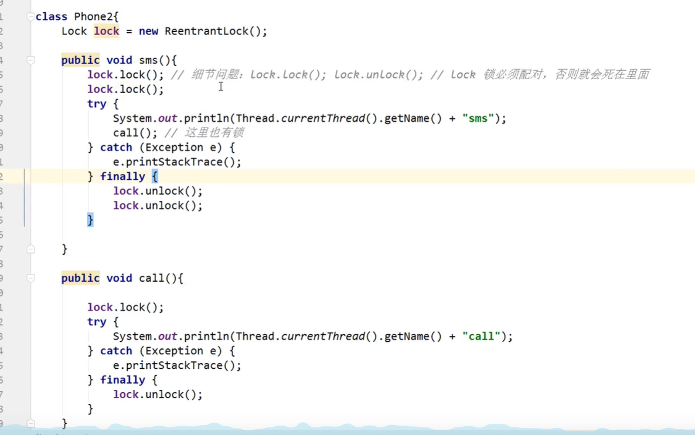

# Java并发秋招学习笔记

## 绪论

### 1.线程与进程

> Java中的线程

java中**默认**两个线程，main、GC

> 并发和并行

- 并发：多个线程操作同一资源（单核的多线程，交替执行模拟并行）
- 并行：多个线程同时运行（多核）

```java
//获取CPU的核心数
System.out.println(Runtime.getRuntime().availableProcessors());
```

并发编程的本质：**充分利用CPU的资源**

### 2.wait和sleep的区别

- wait() 是 Object 的方法，而 sleep() 是 Thread 的静态方法；
- wait() 会释放锁，sleep() 不会。
- wait必须在同步代码块中。wait不需要捕获异常。


## 一、如何使用线程

### 1.1 Thread

可以继承Thread类并重写run方法来使用多线程

```java
public class ByThread extends Thread{//1.继承Thread类
    @Override
    public void run() {//2.重写run方法
        for (int i = 0; i < 10; i++) {
            System.out.println(getName()+" "+i);
        }
    }

    public static void main(String[] args) {
        ByThread byThread1 = new ByThread();
        ByThread byThread2 = new ByThread();
        ByThread byThread3 = new ByThread();
        byThread1.setName("窗口1");
        byThread2.setName("窗口2");
        byThread3.setName("窗口3");
        byThread1.start();//3. 调用start方法
        byThread2.start();
        byThread3.start();
    }
}
```

### 1.2 Runnable

可以实现Runnable接口并重写run方法来使用多线程

```java
public class ByRunnable implements Runnable{//1.实现Runnable接口
    @Override
    public void run() {//2.重写run方法
        for (int i = 0; i < 10; i++) {
            System.out.println(Thread.currentThread().getName()+" "+i);
        }
    }

    public static void main(String[] args) {
        Thread thread1 = new Thread(new ByRunnable());//3. 通过Thread类来实例化
        Thread thread2 = new Thread(new ByRunnable());
        Thread thread3 = new Thread(new ByRunnable());
        thread1.setName("窗口1");
        thread2.setName("窗口2");
        thread3.setName("窗口3");
        thread1.start();//4. 调用start方法
        thread2.start();
        thread3.start();
    }
}
```

### 1.3 Callable

可以实现Callable接口并重写call，通过FutureTask类来使用多线程

> Callable使用

```java
import java.util.Random;
import java.util.concurrent.Callable;
import java.util.concurrent.ExecutionException;
import java.util.concurrent.FutureTask;
/*
* 使用线程的第三种方法，实现Callable接口（JUC包）
*/
public class ByCallable implements Callable<Integer> {//1.实现Callable接口
    @Override
    public Integer call(){//2.重写call方法
        for (int i = 0; i < 10; i++) {
            System.out.println(Thread.currentThread().getName()+"===="+i);
        }
        return new Random().nextInt();
    }

    public static void main(String[] args) throws ExecutionException, InterruptedException {
        ByCallable byCallable1 = new ByCallable();//3.实例化对象
        ByCallable byCallable2 = new ByCallable();
        ByCallable byCallable3 = new ByCallable();
        FutureTask<Integer> task1 = new FutureTask<>(byCallable1);//4.实例化FutureTask对象
        FutureTask<Integer> task2 = new FutureTask<>(byCallable2);
        FutureTask<Integer> task3 = new FutureTask<>(byCallable3);
        new Thread(task1,"窗口1").start();//5.实例化Thread，并start
        new Thread(task2,"窗口2").start();
        new Thread(task3,"窗口3").start();
        System.out.println(task1.get());//6.接受结果
        System.out.println(task2.get());
        System.out.println(task3.get());
    }
}
```

> FutureTask类源码分析

FutureTask是Runnable接口的间接实现类，因此该类的实现类可以作为Thread构造的参数传入，同时在FutureTask类的run方法中条用了Callable的call方法。

```java
public class FutureTask<V> implements RunnableFuture<V>;
public interface RunnableFuture<V> extends Runnable, Future<V>;

Callable<V> c = callable;
if (c != null && state == NEW) {
    V result;
    boolean ran;
    try {
        result = c.call();//在FutureTask的run方法中调用了Callable的call方法。
        ran = true;
    } catch (Throwable ex) {
        result = null;
        ran = false;
        setException(ex);
    }
    if (ran)
        set(result);
}
```

### 1.4 各种方式的比较

> Thread和Runnable比较

Runnable**较优**。java不支持多继承，且继承整个类开销过大。

> Runnable和Callable比较

- Callable和Runnable相比可以有返回值
- Callable和Runnable相比可能会抛出异常
- Callable中需要实现call方法，Runnable中则需要实现run方法


## 二、基础线程机制

### 2.1 线程池

> 池化技术

程序运行的本质：占用系统的资源，优化资源的使用=>池化技术

创建和销毁耗费资源（线程池、连接池、内存池）

池化技术：事先创建好一些资源，等待使用，使用完归还

> 线程池的好处

- 降低资源的消耗
- 提高响应的速度
- 方便管理（**复用**、**控制最大并发数**、**线程管理**）

> 线程池三大方法

```java
public class Demo01 {
    public static void main(String[] args) {
        ExecutorService pool = Executors.newSingleThreadExecutor();//池中只有一个线程的线程池
        ExecutorService pool = Executors.newFixedThreadPool(5);//池中有固定数量线程的线程池
        ExecutorService pool = Executors.newCachedThreadPool();//可伸缩的线程池

        try {
            for (int i = 0; i < 10; i++) {
                pool.execute(()->{
                    System.out.println(Thread.currentThread().getName()+"  Ok");
                });
            }
        } catch (Exception e) {
            e.printStackTrace();
        } finally {
            pool.shutdown();
        }
    }
}
//三个池子的运行情况
//SingleThreadExecutor中，只存在一个线程
//FixedThreadPool中，存在固定数量的线程
//CachedThreadPool中，最多可能存在n条线程，可扩展
```

> 线程池三大方法的弊端

- SingleThreadExecutor和FixedThreadPool的等待队列的最大值为Integer.MAX_VALUE。有OOM的隐患。
- CachedThreadPool线程上限为Integer.MAX_VALUE。有OOM的隐患。

```java
/*
* SingleThreadExecutor和FixedThreadPool问题源码剖析
*/
public static ExecutorService newSingleThreadExecutor() {
    return new FinalizableDelegatedExecutorService
        (new ThreadPoolExecutor(1, 1,
                                0L, TimeUnit.MILLISECONDS,
                                new LinkedBlockingQueue<Runnable>()));//此处直接new了一个LinkedBlockingQueue
}
public LinkedBlockingQueue() {
    this(Integer.MAX_VALUE);//调用有参构造，参数为Integer.MAX_VALUE
}
public LinkedBlockingQueue(int capacity) {
    if (capacity <= 0) throw new IllegalArgumentException();
    this.capacity = capacity;//大小被定义为了Integer.MAX_VALUE
    last = head = new Node<E>(null);
}
```

```java
/*
* CachedThreadPool问题源码剖析
*/
public static ExecutorService newCachedThreadPool() {
    //maximumPoolSize，线程池可容纳的最大线程数设定为Integer.MAX_VALUE
    return new ThreadPoolExecutor(0, Integer.MAX_VALUE,
                                  60L, TimeUnit.SECONDS,
                                  new SynchronousQueue<Runnable>());
}
```

因此，虽然Executors提供的三个方法使用起来很爽，但是会有严重的**安全隐患**！所以一般使用线程池，都是采用ThreadPoolExecutor来自己写明7大参数！

> 线程池七大参数

- **corePoolSize**（必须）核心线程数，永远是开着的。
- **maximumPoolSize**（必须）线程池可容纳的最大线程数，在任务队列满时，会开放
- **keepAliveTime**（必须）线程闲置超时时长，除核心线程外，超过多少时间没有被访问会被回收
- **unit**（必须）TimeUnit.MILLISECONDS（毫秒）、TimeUnit.SECONDS（秒）、TimeUnit.MINUTES（分）
- **workQueue**（必须）阻塞队列，候客区，通过线程池的execute()方法提交的Runnable对象将存储在该参数中
- **threadFactory**（可选）线程工厂。Executors.defaultThreadFactory()一般是这个。
- **handler**（可选）拒绝策略。当线程池满，阻塞队列也满时，采用。有4种拒绝策略。

```java
public class Demo01 {
    public static void main(String[] args) {
        ThreadPoolExecutor pool = new ThreadPoolExecutor(2,//核心线程数
                5,//最大线程数
                3, //闲置时长
                TimeUnit.SECONDS,//时长单位
                new ArrayBlockingQueue<>(3),//阻塞队列
                Executors.defaultThreadFactory(),//线程工厂
                new ThreadPoolExecutor.AbortPolicy());//拒绝策略，默认不处理抛出异常
        try {
            for (int i = 0; i < 10; i++) {
                pool.execute(()->{
                    System.out.println(Thread.currentThread().getName()+"  Ok");
                });
            }
        } catch (Exception e) {
            e.printStackTrace();
        } finally {
            pool.shutdown();
        }
    }
}
//1个人情况
pool-1-thread-1  Ok
//3个人情况，可以看到只有两个核心线程，并没有开启其他的线程
pool-1-thread-2  Ok
pool-1-thread-1  Ok
pool-1-thread-2  Ok
//5个人情况，也只有2个核心线程，因为阻塞队列并没有满
pool-1-thread-2  Ok
pool-1-thread-1  Ok
pool-1-thread-1  Ok
pool-1-thread-2  Ok
pool-1-thread-1  Ok
//6个人情况，因为阻塞队列满了，会开启第三条线程
pool-1-thread-2  Ok
pool-1-thread-3  Ok
pool-1-thread-1  Ok
pool-1-thread-2  Ok
pool-1-thread-1  Ok
pool-1-thread-3  Ok
//9个人情况，此时会抛出异常，因为触发了拒绝
java.util.concurrent.RejectedExecutionException: Task com.hkb.pool.Demo01$$Lambda$1/1831932724@7699a589 rejected from java.util.concurrent.ThreadPoolExecutor@58372a00[Running, pool size = 5, active threads = 5, queued tasks = 3, completed tasks = 0]
pool-1-thread-1  Ok
pool-1-thread-5  Ok
pool-1-thread-3  Ok
pool-1-thread-2  Ok
pool-1-thread-4  Ok
pool-1-thread-5  Ok
pool-1-thread-3  Ok
pool-1-thread-1  Ok
```

> 4种拒绝策略

- AbortPolicy 抛出异常
- CallerRunsPolicy，请求者自己运行，如是main线程访问，则由main线程来执行
- DiscardPolicy 不抛出异常，丢掉任务
- DiscardOldestPolicy 会和队列中的任务竞争，不会抛出异常

> 如何定义最大线程数

- CPU密集型：电脑几核就是几，可以保证电脑的CPU运行效率最高。Runtime.getRuntime().availableProcessors()
- IO密集型：判断程序中IO操作的线程数，保证最大线程数大于这个数量就可以了。

### 2.2 守护线程

守护线程是程序运行时在后台提供服务的线程，不属于程序中不可或缺的部分。

当所有非守护线程结束时，程序也就终止，同时会杀死所有守护线程。

main() 属于非守护线程。常见的守护线程有java的GC线程。

在线程启动之前使用 setDaemon() 方法可以将一个线程设置为守护线程。

```java
public static void main(String[] args) {
    Thread thread = new Thread(new MyRunnable());
    thread.setDaemon(true);
}
```

### 2.3 sleep()

> Thread.sleep()

Thread.sleep(millisec) 方法会休眠当前正在执行的线程，millisec 单位为毫秒。

sleep() 可能会抛出 InterruptedException，因为异常不能跨线程传播回 main() 中，因此必须在本地进行处理。线程中抛出的其它异常也同样需要在本地进行处理。

```java
public void run() {
    try {
        Thread.sleep(3000);
    } catch (InterruptedException e) {
        e.printStackTrace();
    }
}
```

> TimeUnit.XXX.sleep

TimeUnit.XXX.sleep()方法会休眠当前正在执行的线程，单位为XXX。

sleep() 可能会抛出 InterruptedException。

```java
try {
    TimeUnit.SECONDS.sleep(2);
} catch (InterruptedException e) {
    e.printStackTrace();
}
```

> 两者的区别

TimeUnit是对Thread.sleep的一次包装，从可读性上是TimeUnit更好，因为原先的sleep函数只能用毫秒做单位。

```java
//TimeUnit中的sleep函数
public void sleep(long timeout) throws InterruptedException {
    if (timeout > 0) {
        long ms = toMillis(timeout);
        int ns = excessNanos(timeout, ms);
        Thread.sleep(ms, ns);
    }
}
```

### 2.4 yield()

对静态方法 Thread.yield() 的调用声明了当前线程已经完成了生命周期中最重要的部分，可以切换给其它线程来执行。该方法只是对线程调度器的一个**建议**，最终调换不调换线程还是有调度器说了算！而且也只是建议具有相同优先级的其它线程可以运行。

```java
public void run() {
    Thread.yield();
}
```

### 2.5 线程优先级

java提供一个线程调度器来监控程序中启动后进入就绪状态的所有线程，线程调度器按照优先级决定应该调度哪一个线程来执行。

优先级的值为1~10，使用setPriority方法设置。优先级值越大表示优先级越高。

```java
public final static int MIN_PRIORITY = 1;
public final static int NORM_PRIORITY = 5;
public final static int MAX_PRIORITY = 10;

public final void setPriority(int newPriority) {
    ThreadGroup g;
    checkAccess();
    if (newPriority > MAX_PRIORITY || newPriority < MIN_PRIORITY) {//大于最大值，小于最小值会抛出异常
        throw new IllegalArgumentException();
    }
    if((g = getThreadGroup()) != null) {
        if (newPriority > g.getMaxPriority()) {
            newPriority = g.getMaxPriority();
        }
        setPriority0(priority = newPriority);
    }
}
```


## 三、中断

一个线程执行完毕之后会自动结束，如果在运行过程中发生异常也会提前结束。

### 3.1 InterruptedException

通过调用一个线程的 interrupt() 来中断该线程，如果该线程处于阻塞、限期等待或者无限期等待状态，那么就会抛出 InterruptedException，从而提前结束该线程。但是不能中断 I/O 阻塞和 synchronized 锁阻塞。

对于以下代码，在 main() 中启动一个线程之后再中断它，由于线程中调用了 Thread.sleep() 方法，因此会抛出一个 InterruptedException，从而提前结束线程，不执行之后的语句。

```java
public class InterruptExample {

    private static class MyThread1 extends Thread {
        @Override
        public void run() {
            try {
                Thread.sleep(2000);
                System.out.println("Thread run");
            } catch (InterruptedException e) {
                e.printStackTrace();
            }
        }
    }
}
```

```java
public static void main(String[] args) throws InterruptedException {
    Thread thread1 = new MyThread1();
    thread1.start();
    thread1.interrupt();
    System.out.println("Main run");
}
```

```html
Main run
java.lang.InterruptedException: sleep interrupted
    at java.lang.Thread.sleep(Native Method)
    at InterruptExample.lambda$main$0(InterruptExample.java:5)
    at InterruptExample$$Lambda$1/713338599.run(Unknown Source)
    at java.lang.Thread.run(Thread.java:745)
```

### 3.2 interrupted()

如果一个线程的 run() 方法执行一个无限循环，并且没有执行 sleep() 等会抛出 InterruptedException 的操作，那么调用线程的 interrupt() 方法就无法使线程提前结束。

但是调用 interrupt() 方法会设置线程的中断标记，此时调用 interrupted() 方法会返回 true。因此可以在循环体中使用 interrupted() 方法来判断线程是否处于中断状态，从而提前结束线程。

```java
public class InterruptExample {

    private static class MyThread2 extends Thread {
        @Override
        public void run() {
            while (!interrupted()) {
                // ..
            }
            System.out.println("Thread end");
        }
    }
}
```

```java
public static void main(String[] args) throws InterruptedException {
    Thread thread2 = new MyThread2();
    thread2.start();
    thread2.interrupt();
}
```

```html
Thread end
```

### 3.3 线程池的中断操作

调用 Executor 的 shutdown() 方法会等待线程都执行完毕之后再关闭，但是如果调用的是 shutdownNow() 方法，则相当于调用每个线程的 interrupt() 方法。

如果只想中断 Executor 中的一个线程，可以通过使用 submit() 方法来提交一个线程，它会返回一个 Future<?> 对象，通过调用该对象的 cancel(true) 方法就可以中断线程。

```java
Future<?> future = executorService.submit(() -> {
    // ..
});
future.cancel(true);
```


## 四、互斥同步

Java 提供了两种锁机制来控制多个线程对共享资源的互斥访问，第一个是 JVM 实现的 synchronized即java的**内置关键字**，而另一个是 JDK 实现的 JUC包下的ReentrantLock。这两种锁机制即所谓的悲观锁。

### 4.1 synchronized

> 同步一个代码块

```java
public void func() {
    synchronized (obj) {
        // ...
    }
}
```

它只作用于同一个对象，如果调用两个对象上的同步代码块，就不会进行同步。

> 同步一个普通方法

synchronized锁在普通方法上时，锁的目标是调用方法的对象，即phone实例对象，两个线程使用了同一个锁，谁先拿到谁执行。如果说两个线程使用的对象是两个不同的，就不会受影响。

```java
/*
* 8锁问题，关于锁的8个问题
* 1. 标准情况下，先打印发短信还是打电话？
* 解：发短信，synchronized锁在方法上时，锁的目标是调用方法的对象，即phone实例对象，两个线程使用了同一个锁，谁先拿到谁执行。
* 2. sendSms延迟4s，先打印发短信还是打电话？
* 解：发短信，理由同1
*/
public class Test1 {
    public static void main(String[] args) {
        Phone phone = new Phone();
        new Thread(phone::sendSms,"A").start();

        try {
            TimeUnit.SECONDS.sleep(1);
        } catch (InterruptedException e) {
            e.printStackTrace();
        }
        new Thread(phone::call,"B").start();
    }
}

class Phone{
    //synchronized锁，锁住的对象是调用的方法，即phone实例对象
    public synchronized void sendSms(){
        try {
            TimeUnit.SECONDS.sleep(4);
        } catch (InterruptedException e) {
            e.printStackTrace();
        }
        System.out.println("发短信");
    }

    public synchronized void call(){
        System.out.println("打电话");
    }
}
```

```java
/*
 * 8锁问题，关于锁的8个问题
 * 3. 新增普通方法hello，先打印hello还是发短信？
 * 解：hello，hello不是同步方法，不受锁的影响。
 * 4. 两个手机对象，两个线程分别调用发短信和打电话，先打印打电话还是发短信？
 * 解：打电话，因为是两个不同的调用者，是两把不同的锁。
 */
public class Test2 {
    public static void main(String[] args) {
        Phone1 phone = new Phone1();
        Phone1 phone2 = new Phone1();
        new Thread(phone::sendSms,"A").start();

        try {
            TimeUnit.SECONDS.sleep(1);
        } catch (InterruptedException e) {
            e.printStackTrace();
        }
        new Thread(phone2::call,"B").start();
    }
}

class Phone1{
    //synchronized锁，锁住的对象是调用的方法，即phone实例对象
    public synchronized void sendSms(){
        try {
            TimeUnit.SECONDS.sleep(4);
        } catch (InterruptedException e) {
            e.printStackTrace();
        }
        System.out.println("发短信");
    }

    public synchronized void call(){
        System.out.println("打电话");
    }

    public void hello(){
        System.out.println("hello");
    }
}
```

> 同步一个静态方法

static方法是一开始就有的，此处锁的对象是类的Class对象即模板对象。两个方法用的是同一个锁。

```java
/*
 * 8锁问题，关于锁的8个问题
 * 5. 静态方法，打印发短信还是打电话？
 * 解：发短信，static方法是一开始就有的，此处锁的对象是类的Class对象即模板对象。两个方法用的是同一个锁
 * 6. 两个对象的静态方法，打印发短信还是打电话？
 * 解：发短信，锁的是Class对象，类模板只有一个，所以两个方法用的是同一个锁。
 */
public class Test3 {
    public static void main(String[] args) {
        Phone2 phone = new Phone2();
        Phone2 phone1 = new Phone2();
        new Thread(()->{
            phone.sendSms();
        },"A").start();

        try {
            TimeUnit.SECONDS.sleep(1);
        } catch (InterruptedException e) {
            e.printStackTrace();
        }
        new Thread(()->{
            phone1.call();
        },"B").start();
    }
}
class Phone2{
    //synchronized锁，锁住的对象是调用的方法，即phone实例对象
    public static synchronized void sendSms(){
        try {
            TimeUnit.SECONDS.sleep(4);
        } catch (InterruptedException e) {
            e.printStackTrace();
        }
        System.out.println("发短信");
    }

    public static synchronized void call(){
        System.out.println("打电话");
    }

    public void hello(){
        System.out.println("hello");
    }
}
```

```java
/*
 * 8锁问题，关于锁的8个问题
 * 7. 1个静态同步方法，1个普通同步方法，打印发短信还是打电话？
 * 解：打电话，两个不同的锁,一个是类模板锁，一个是实例锁
 * 8. 2个电话，打印发短信还是打电话？
 * 解：打电话，两个不同的锁
 */
public class Test4 {
    public static void main(String[] args) {
        Phone3 phone = new Phone3();
        Phone3 phone1 = new Phone3();
        new Thread(()->{
            phone.sendSms();
        },"A").start();

        try {
            TimeUnit.SECONDS.sleep(1);
        } catch (InterruptedException e) {
            e.printStackTrace();
        }
        new Thread(()->{
            phone1.call();
        },"B").start();
    }
}
class Phone3{
    //synchronized锁，锁住的对象是调用的方法，即phone实例对象
    public static synchronized void sendSms(){
        try {
            TimeUnit.SECONDS.sleep(4);
        } catch (InterruptedException e) {
            e.printStackTrace();
        }
        System.out.println("发短信");
    }

    public synchronized void call(){
        System.out.println("打电话");
    }
}
```

### 4.2 ReentrantLock

> Lock简述

lock类位于java.util.concurrent.locks包下。

有三个实现类，ReentrantLock ， ReentrantReadWriteLock.ReadLock ， ReentrantReadWriteLock.WriteLock

> Lock实现

```java
//ReentrantLock源码的构造函数
public ReentrantLock() {
    sync = new NonfairSync();//默认非公平锁
}
public ReentrantLock(boolean fair) {
    sync = fair ? new FairSync() : new NonfairSync();//传入true，公平锁
}
//公平锁：公平，先来后到
//非公平锁：不公平，可以插队
```

```java
//使用Lock来实现
public class SaleTicket {
    public static void main(String[] args) {
        Ticket ticket = new Ticket();
        new Thread(()->{
            for (int i = 0; i < 60; i++) {
                ticket.sell();
            }},"A").start();
        new Thread(()->{
            for (int i = 0; i < 60; i++) {
                ticket.sell();
            }},"B").start();
        new Thread(()->{
            for (int i = 0; i < 60; i++) {
                ticket.sell();
            }},"C").start();
    }
}

class Ticket{
    private int ticket = 50;
    Lock lock = new ReentrantLock();
    public void sell(){
        lock.lock();//上锁
        try {
            if(ticket > 0) {
                System.out.println(Thread.currentThread().getName()+"卖出了第"+(ticket--)+"票");
            }
        } catch (Exception e) {
            e.printStackTrace();
        } finally {
            lock.unlock();//关锁
        }
    }
}

```

### 4.3 Lock 与synchronized的区别

1. **锁的实现**

   synchronized是内置关键字，Lock是java类

2. **性能**  

   新版本 Java 对 synchronized 进行了很多优化，例如自旋锁等，synchronized 与 ReentrantLock 大致相同。

3. **锁的状态**

   synchronized无法判断锁的状态，Lock可以

4. **释放锁**

   synchronized会自动释放锁，Lock需要手动释放，不释放会导致死锁

5. **锁的等待**

   synchronized线程1获得锁，线程2则会一直等待。而Lock有tryLock（）方法尝试获得锁。

6. **公平锁**

   synchronized可重入（某个线程已经获得某个锁，可以再次获取锁而不会出现死锁）、不可中断、非公平锁。Lock可重入、可以判断锁状态、非公平锁（可设定为公平锁）

### 4.4 使用选择

除非需要使用 ReentrantLock 的高级功能，否则优先使用 synchronized。这是因为 synchronized 是 JVM 实现的一种锁机制，JVM 原生地支持它，而 ReentrantLock 不是所有的 JDK 版本都支持。并且使用 synchronized 不用担心没有释放锁而导致死锁问题，因为 JVM 会确保锁的释放。


## 五、线程之间的协作

当多个线程可以一起工作去解决某个问题时，如果某些部分必须在其它部分之前完成，那么就需要对线程进行协调。

### 5.1 join()

在线程中调用另一个线程的 join() 方法，会将当前线程挂起，而不是忙等待，直到目标线程结束。

对于以下代码，虽然 b 线程先启动，但是因为在 b 线程中调用了 a 线程的 join() 方法，b 线程会等待 a 线程结束才继续执行，因此最后能够保证 a 线程的输出先于 b 线程的输出。

```java
public class JoinExample {

    private class A extends Thread {
        @Override
        public void run() {
            System.out.println("A");
        }
    }

    private class B extends Thread {

        private A a;

        B(A a) {
            this.a = a;
        }

        @Override
        public void run() {
            try {
                a.join();
            } catch (InterruptedException e) {
                e.printStackTrace();
            }
            System.out.println("B");
        }
    }

    public void test() {
        A a = new A();
        B b = new B(a);
        b.start();
        a.start();
    }
}
```

```java
public static void main(String[] args) {
    JoinExample example = new JoinExample();
    example.test();
}
```

```
A
B
```

### 5.2 wait() notify() notifyAll()

调用 wait() 使得线程等待某个条件满足，线程在等待时会被挂起，当其他线程的运行使得这个条件满足时，其它线程会调用 notify() 或者 notifyAll() 来唤醒挂起的线程。

它们都属于 Object 的一部分，而不属于 Thread。

只能用在同步方法或者同步控制块中使用，否则会在运行时抛出 IllegalMonitorStateException。

使用 wait() 挂起期间，线程会释放锁。这是因为，如果没有释放锁，那么其它线程就无法进入对象的同步方法或者同步控制块中，那么就无法执行 notify() 或者 notifyAll() 来唤醒挂起的线程，造成死锁。

```java
public class WaitNotifyExample {

    public synchronized void before() {
        System.out.println("before");
        notifyAll();
    }

    public synchronized void after() {
        try {
            wait();
        } catch (InterruptedException e) {
            e.printStackTrace();
        }
        System.out.println("after");
    }
}
```

```java
public static void main(String[] args) {
    ExecutorService executorService = Executors.newCachedThreadPool();
    WaitNotifyExample example = new WaitNotifyExample();
    executorService.execute(() -> example.after());
    executorService.execute(() -> example.before());
}
```

```html
before
after
```

### 5.3 await() signal() signalAll()

java.util.concurrent 类库中提供了 Condition 类来实现线程之间的协调，可以在 Condition 上调用 await() 方法使线程等待，其它线程调用 signal() 或 signalAll() 方法唤醒等待的线程。

相比于 wait() 这种等待方式，await() 可以指定等待的条件，因此更加灵活。

使用 Lock 来获取一个 Condition 对象。

```java
public class AwaitSignalExample {

    private Lock lock = new ReentrantLock();
    private Condition condition = lock.newCondition();

    public void before() {
        lock.lock();
        try {
            System.out.println("before");
            condition.signalAll();
        } finally {
            lock.unlock();
        }
    }

    public void after() {
        lock.lock();
        try {
            condition.await();
            System.out.println("after");
        } catch (InterruptedException e) {
            e.printStackTrace();
        } finally {
            lock.unlock();
        }
    }
}
```

```java
public static void main(String[] args) {
    ExecutorService executorService = Executors.newCachedThreadPool();
    AwaitSignalExample example = new AwaitSignalExample();
    executorService.execute(() -> example.after());
    executorService.execute(() -> example.before());
}
```

```html
before
after
```

### 5.4 生产者消费者问题

> synchronized

```java
public class A {
    public static void main(String[] args) {
        Data data = new Data();
        new Thread(()->{
            try {
                for (int i = 0; i < 10; i++) {
                    data.add();
                }
            } catch (InterruptedException e) {
                e.printStackTrace();
            }
        },"线程A").start();

        new Thread(()->{
            try {
                for (int i = 0; i < 10; i++) {
                    data.delete();
                }
            } catch (InterruptedException e) {
                e.printStackTrace();
            }
        },"线程B").start();
    }
}

class Data{
    private int number = 0;

    public synchronized void add() throws InterruptedException {
        if(number != 0){
            this.wait();
        }
        number++;
        System.out.println(Thread.currentThread().getName()+"==>"+number);
        this.notifyAll();
    }

    public synchronized void delete() throws InterruptedException {
        if(number == 0){
            this.wait();
        }
        number--;
        System.out.println(Thread.currentThread().getName()+"==>"+number);
        this.notifyAll();
    }
}
```

> 当新增两个线程后，会出现问题--虚假唤醒


```java
public class A {
    public static void main(String[] args) {
        Data data = new Data();
        new Thread(()->{
            try {
                for (int i = 0; i < 10; i++) {
                    data.add();
                }
            } catch (InterruptedException e) {
                e.printStackTrace();
            }
        },"线程A").start();

        new Thread(()->{
            try {
                for (int i = 0; i < 10; i++) {
                    data.delete();
                }
            } catch (InterruptedException e) {
                e.printStackTrace();
            }
        },"线程B").start();

        new Thread(()->{
            try {
                for (int i = 0; i < 10; i++) {
                    data.add();
                }
            } catch (InterruptedException e) {
                e.printStackTrace();
            }
        },"线程C").start();

        new Thread(()->{
            try {
                for (int i = 0; i < 10; i++) {
                    data.delete();
                }
            } catch (InterruptedException e) {
                e.printStackTrace();
            }
        },"线程D").start();
    }
}

class Data{
    private int number = 0;

    public synchronized void add() throws InterruptedException {
        while(number != 0){//使用while而不用if，确保线程在不满足条件时持续等待
            this.wait();
        }
        number++;
        System.out.println(Thread.currentThread().getName()+"==>"+number);
        this.notifyAll();
    }

    public synchronized void delete() throws InterruptedException {
        while(number == 0){
            this.wait();
        }
        number--;
        System.out.println(Thread.currentThread().getName()+"==>"+number);
        this.notifyAll();
    }
}
```

> JUC实现

```java
import java.util.concurrent.locks.Condition;
import java.util.concurrent.locks.Lock;
import java.util.concurrent.locks.ReentrantLock;

public class B {
    public static void main(String[] args) {
        Data1 data1 = new Data1();
        new Thread(()->{
            try {
                for (int i = 0; i < 10; i++) {
                    data1.add();
                }
            } catch (InterruptedException e) {
                e.printStackTrace();
            }
        },"线程A").start();

        new Thread(()->{
            try {
                for (int i = 0; i < 10; i++) {
                    data1.delete();
                }
            } catch (InterruptedException e) {
                e.printStackTrace();
            }
        },"线程B").start();

        new Thread(()->{
            try {
                for (int i = 0; i < 10; i++) {
                    data1.add();
                }
            } catch (InterruptedException e) {
                e.printStackTrace();
            }
        },"线程C").start();

        new Thread(()->{
            try {
                for (int i = 0; i < 10; i++) {
                    data1.delete();
                }
            } catch (InterruptedException e) {
                e.printStackTrace();
            }
        },"线程D").start();
    }
}

class Data1{
    private int number = 0;
    Lock lock = new ReentrantLock();
    Condition condition = lock.newCondition();
    public void add() throws InterruptedException {
        try {
            lock.lock();
            while(number != 0){
                condition.await();
            }
            number++;
            System.out.println(Thread.currentThread().getName()+"==>"+number);
            condition.signalAll();
        } catch (InterruptedException e) {
            e.printStackTrace();
        } finally {
            lock.unlock();
        }
    }

    public void delete() throws InterruptedException {
        try {
            lock.lock();
            while(number == 0){
                condition.await();
            }
            number--;
            System.out.println(Thread.currentThread().getName()+"==>"+number);
            condition.signalAll();
        } catch (InterruptedException e) {
            e.printStackTrace();
        } finally {
            lock.unlock();
        }
    }
}
```

> 问题：和synchronized实际没有区别，新技术的意义？使用condition实现ABCD顺序执行

```JAVA
import java.util.concurrent.locks.Condition;
import java.util.concurrent.locks.Lock;
import java.util.concurrent.locks.ReentrantLock;

public class C {
    public static void main(String[] args) {
        Data2 data2 = new Data2();
        new Thread(()->{
            for (int i = 0; i < 10; i++) {
                data2.printA();
            }
        },"A").start();
        new Thread(()->{
            for (int i = 0; i < 10; i++) {
                data2.printB();
            }
        },"B").start();
        new Thread(()->{
            for (int i = 0; i < 10; i++) {
                data2.printC();
            }
        },"C").start();
    }
}

class Data2{
    private int number = 1;
    private Lock lock = new ReentrantLock();
    private Condition condition1 = lock.newCondition();//通过三个Condition分别控制三个线程来做到精准唤醒
    private Condition condition2 = lock.newCondition();
    private Condition condition3 = lock.newCondition();
    public void printA(){
        try {
            lock.lock();
            while(number != 1){
                condition1.await();
            }
            System.out.println(Thread.currentThread().getName()+"--> A");
            number = 2;
            condition2.signal();
        } catch (Exception e) {
            e.printStackTrace();
        } finally {
            lock.unlock();
        }
    }
    public void printB(){
        try {
            lock.lock();
            while(number != 2){
                condition2.await();
            }
            System.out.println(Thread.currentThread().getName()+"--> B");
            number = 3;
            condition3.signal();
        } catch (Exception e) {
            e.printStackTrace();
        } finally {
            lock.unlock();
        }
    }
    public void printC(){
        try {
            lock.lock();
            while(number != 3){
                condition3.await();
            }
            System.out.println(Thread.currentThread().getName()+"--> C");
            number = 1;
            condition1.signal();//
        } catch (Exception e) {
            e.printStackTrace();
        } finally {
            lock.unlock();
        }
    }
}
```


## 六、线程状态

### 6.1 新建态（NEW）

即线程刚创建而没有start的时段。

```java
public static void main(String[] args) {
	Thread thread1 = new Thread(new TestState());
	System.out.println(thread1.getState());
}
//NEW
```

### 6.2运行态（Runnable）

正在 Java 虚拟机中运行。但是在操作系统层面，它可能处于运行状态，也可能等待资源调度（如CPU资源）。包含所谓的就绪态（准备就绪，等待CPU调度）和运行态（真正在运行）。

```java
public class TestState implements Runnable{
    @Override
    public void run() {
        for (int i = 0; i < 10; i++) {
            System.out.println(Thread.currentThread().getName()+"=="+Thread.currentThread().getState()+"=="+i);
        }
    }

    public static void main(String[] args) {
        Thread thread1 = new Thread(new TestState());
        Thread thread2 = new Thread(new TestState());
        Thread thread3 = new Thread(new TestState());
        thread1.start();
        thread2.start();
        thread3.start();
    }
}
//Thread-0==RUNNABLE==0
//Thread-2==RUNNABLE==0
//...
```

### 6.3 阻塞态（Blocked）

一般是线程等待获取一个锁，来继续执行下一步的操作，如`synchronized`关键字，这个关键字修饰的代码块或者方法，均需要获取到对应的锁。在线程获取到锁之前就是阻塞态。

```java
public class TestState implements Runnable{
    private byte[] lock = new byte[0];
    
    TestState(byte[] lock){
        this.lock = lock;
    }
    
    @Override
    public void run() {
        synchronized (lock){//锁
            try {
                Thread.sleep(10000);
            } catch (InterruptedException e) {
                e.printStackTrace();
            }
            System.out.println(Thread.currentThread().getName()+"=="+Thread.currentThread().getState());
        }
    }

    public static void main(String[] args) throws InterruptedException {
        byte[] lock = new byte[0];
        Thread thread1 = new Thread(new TestState(lock));
        Thread thread2 = new Thread(new TestState(lock));
        thread1.start();
        thread2.start();
        System.out.println(thread1.getState());
        System.out.println(thread2.getState());
    }
}
//RUNNABLE
//BLOCKED
//Thread-0==RUNNABLE
//Thread-1==RUNNABLE
```

### 2.4 无限期等待（WAITING）

等待其它线程显式地唤醒。

阻塞和等待的区别在于，阻塞是被动的，它是在等待获取 monitor lock。而等待是主动的，通过调用  Object.wait() 等方法进入。

| 进入方法                                   | 退出方法                             |
| ------------------------------------------ | ------------------------------------ |
| 没有设置 Timeout 参数的 Object.wait() 方法 | Object.notify() / Object.notifyAll() |
| 没有设置 Timeout 参数的 Thread.join() 方法 | 被调用的线程执行完毕                 |
| LockSupport.park() 方法                    | LockSupport.unpark(Thread)           |

### 2.5 超时等待（TIMED_WAITING）

无需等待其它线程显式地唤醒，在一定时间之后会被系统自动唤醒。

| 进入方法                                 | 退出方法                                        |
| ---------------------------------------- | ----------------------------------------------- |
| Thread.sleep() 方法                      | 时间结束                                        |
| 设置了 Timeout 参数的 Object.wait() 方法 | 时间结束 / Object.notify() / Object.notifyAll() |
| 设置了 Timeout 参数的 Thread.join() 方法 | 时间结束 / 被调用的线程执行完毕                 |
| LockSupport.parkNanos() 方法             | LockSupport.unpark(Thread)                      |
| LockSupport.parkUntil() 方法             | LockSupport.unpark(Thread)                      |

调用 Thread.sleep() 方法使线程进入限期等待状态时，常常用“使一个线程睡眠”进行描述。调用 Object.wait() 方法使线程进入限期等待或者无限期等待时，常常用“挂起一个线程”进行描述。睡眠和挂起是用来描述行为，而阻塞和等待用来描述状态。

### 2.6 终止态（TERMINATED）

可以是线程结束任务之后自己结束，或者产生了异常而结束。


## 七、JUC-AQS

所谓AQS，指的是AbstractQueuedSynchronizer，它提供了一种实现阻塞锁和一系列依赖FIFO等待队列的同步器的框架，ReentrantLock、Semaphore、CountDownLatch、CyclicBarrier等并发类均是基于AQS来实现的，具体用法是通过继承AQS实现其模板方法，然后将子类作为同步组件的内部类。

### 7.1 CountDownLatch

用来控制一个或者多个线程等待多个线程。

维护了一个计数器 cnt，每次调用 countDown() 方法会让计数器的值减 1，减到 0 的时候，那些因为调用 await() 方法而在等待的线程就会被唤醒。

减法计数器，用于必须完成任务，例题：教室中有6个学生，另外有一个保安负责放学后关门，必须等待6个学生都出教室后再关门。

```java
public class CountDownLatchTest {
    public static void main(String[] args) throws InterruptedException {
        CountDownLatch countDownLatch = new CountDownLatch(6);//初始值为6的计数器
        for (int i = 0; i < 6; i++) {
            new Thread(()->{
                System.out.println(Thread.currentThread().getName()+"Out");
                countDownLatch.countDown();//每条线程减1
            },String.valueOf(i)).start();
        }
        countDownLatch.await();//主线程等待归0后关门
        System.out.println("关门");
    }
}
```

### 7.2 CyclicBarrier

用来控制多个线程互相等待，只有当多个线程都到达时，这些线程才会继续执行。

和 CountdownLatch 相似，都是通过维护计数器来实现的。线程执行 await() 方法之后计数器会减 1，并进行等待，直到计数器为 0，所有调用 await() 方法而在等待的线程才能继续执行。

CyclicBarrier 和 CountdownLatch 的一个区别是，CyclicBarrier 的计数器通过调用 reset() 方法可以循环使用，所以它才叫做循环屏障。

CyclicBarrier 有两个构造函数，其中 parties 指示计数器的初始值，barrierAction 在所有线程都到达屏障的时候会执行一次。

加法计数器，例题：7个龙珠召唤神龙

```java
public class CyclicBarrierTest {
    public static void main(String[] args) {
        CyclicBarrier cyclicBarrier = new CyclicBarrier(7,()->{
            System.out.println("召唤神龙");
        });
        for (int i = 1; i <= 7; i++) {
            final int temp = i;
            new Thread(()->{
                System.out.println(Thread.currentThread().getName()+"-->"+temp);
                try {
                    cyclicBarrier.await();//线程执行后等待计数器达到阀值才会结束，如果一直达不到阀值就会一直等待。
                } catch (InterruptedException e) {
                    e.printStackTrace();
                } catch (BrokenBarrierException e) {
                    e.printStackTrace();
                }
            },String.valueOf(i)).start();
        }
    }
}
```

### 7.3 Semaphore

Semaphore 类似于操作系统中的信号量，可以控制对互斥资源的访问线程数。

以下代码模拟了对某个服务的并发请求，每次只能有 3 个客户端同时访问，请求总数为 10。

信号量，例题：抢车位。

```java
public class SemaphoreTest {
    public static void main(String[] args) {
        //线程数量：停车位,限流
        Semaphore semaphore = new Semaphore(3);//3个入口
        for (int i = 0; i < 6; i++) {
            new Thread(()->{
                try {
                    semaphore.acquire();//获得一个资源
                    System.out.println(Thread.currentThread().getName()+"得到车位");
                    TimeUnit.SECONDS.sleep(2);
                    System.out.println(Thread.currentThread().getName()+"离开车位");
                } catch (InterruptedException e) {
                    e.printStackTrace();
                }finally {
                    semaphore.release();//释放资源
                }
            },String.valueOf(i)).start();
        }
    }
}
```


## 八、JUC其他组件

### 8.1 阻塞队列

什么情况下用到阻塞队列：多线程并发处理，线程池。

> 4组API

| 方式       | 抛出异常  | 有返回值 | 阻塞等待 | 超时等待    |
| ---------- | --------- | -------- | -------- | ----------- |
| 添加       | add()     | offer()  | put()    | offer(有参) |
| 删除       | remove()  | poll()   | take()   | poll(有参)  |
| 判断队列首 | element() | peek()   | -        | -           |

```java
/**
* 抛出异常情况
*/
public static void test1(){
    ArrayBlockingQueue queue = new ArrayBlockingQueue<>(3);//3个位置的队列
    System.out.println(queue.add("a"));
    System.out.println(queue.add("b"));
    System.out.println(queue.add("c"));

    System.out.println(queue.add("d"));//存放第四个时
}
//Exception in thread "main" java.lang.IllegalStateException: Queue full 队列满

public static void test1(){
    ArrayBlockingQueue queue = new ArrayBlockingQueue<>(3);
    queue.remove();//取空队列
}
//Exception in thread "main" java.util.NoSuchElementException 没有这样的元素
```

```java
/**
* 有返回值
*/
public static void test2(){
    ArrayBlockingQueue queue = new ArrayBlockingQueue<>(3);
    System.out.println(queue.offer("a"));
    System.out.println(queue.offer("b"));
    System.out.println(queue.offer("c"));

    System.out.println(queue.offer("d"));
}
/*
true
true
true
false
*/
public static void test2(){
    ArrayBlockingQueue queue = new ArrayBlockingQueue<>(3);
    System.out.println(queue.poll());
}
//null
```

```java
/**
* 阻塞等待
*/
public static void test3() throws InterruptedException {
    ArrayBlockingQueue queue = new ArrayBlockingQueue<>(3);
    queue.put("a");
    queue.put("b");
    queue.put("c");
    queue.put("d");
}
//程序无法正常结束
public static void test3() throws InterruptedException {
    ArrayBlockingQueue queue = new ArrayBlockingQueue<>(3);
    System.out.println(queue.take());
}
//程序无法正常结束
```

```java
/**
* 超时等待
*/
public static void test4() throws InterruptedException {
    ArrayBlockingQueue queue = new ArrayBlockingQueue<>(3);
    System.out.println(queue.offer("a"));
    System.out.println(queue.offer("b"));
    System.out.println(queue.offer("c"));
    System.out.println(queue.offer("d", 2, TimeUnit.SECONDS));//等待两秒，如果还失败则返回false
}
/*
true
true
true（两秒后）
false
*/
public static void test4() throws InterruptedException {
    ArrayBlockingQueue queue = new ArrayBlockingQueue<>(3);
    System.out.println(queue.poll(2, TimeUnit.SECONDS));//等待两秒，没取到返回null
}
//null
```

> SynchronousQueue同步队列

每个插入操作必须等待另一个线程相应的删除操作。put、take。

```java
public class Synchronized {
    public static void main(String[] args) {
        SynchronousQueue<String> queue = new SynchronousQueue<>();
        new Thread(()->{
            try {
                System.out.println(Thread.currentThread().getName()+"-->存入1");
                queue.put("1");
                System.out.println(Thread.currentThread().getName()+"-->存入2");
                queue.put("2");
                System.out.println(Thread.currentThread().getName()+"-->存入3");
                queue.put("3");
            } catch (InterruptedException e) {
                e.printStackTrace();
            }
        },"A").start();
        new Thread(()->{
            try {
                TimeUnit.SECONDS.sleep(2);
                System.out.println(Thread.currentThread().getName()+"-->取出"+queue.take());
                TimeUnit.SECONDS.sleep(2);
                System.out.println(Thread.currentThread().getName()+"-->取出"+queue.take());
                TimeUnit.SECONDS.sleep(2);
                System.out.println(Thread.currentThread().getName()+"-->取出"+queue.take());
            } catch (InterruptedException e) {
                e.printStackTrace();
            }
        },"B").start();

    }
}
/*
A-->存入1
B-->取出1
A-->存入2
B-->取出2
A-->存入3
B-->取出3
*/
```

分析以上代码的运行结果。可以看到在线程A存入一个元素后，再次存入时就在等待线程B取出，在取出之后才会再次存入。

### 8.2 读写锁

> 没有锁的情况

```java
import java.util.HashMap;
import java.util.Map;
import java.util.concurrent.locks.ReadWriteLock;
import java.util.concurrent.locks.ReentrantReadWriteLock;

public class ReadWriteLockTest {
    public static void main(String[] args) {
        MyCache myCache = new MyCache();
        for (int i = 1; i <= 5; i++) {
            final int temp = i;
            new Thread(()->{
                myCache.put(temp+"",temp+"");
            },String.valueOf(i)).start();
        }
        for (int i = 1; i <= 5 ; i++) {
            final int temp = i;
            new Thread(()->{
                myCache.get(temp+"");
            },String.valueOf(i)).start();
        }
    }
}
class MyCache{
    private volatile Map<String,Object> map = new HashMap<>();
    ReadWriteLock lock = new ReentrantReadWriteLock();
    //写
    public void put(String key,Object value){
        System.out.println(Thread.currentThread().getName()+"写入开始");
        map.put(key,value);
        System.out.println(Thread.currentThread().getName()+"写入完毕");
    }

    //读
    public void get(String key){
        System.out.println(Thread.currentThread().getName()+"读取开始");
        Object o = map.get(key);
        System.out.println(Thread.currentThread().getName()+"读取完毕");
    }
}

3写入开始
2写入开始
2写入完毕
1写入开始
1写入完毕
//结果可以看到写入操作被插队了
```

```java
import java.util.HashMap;
import java.util.Map;
import java.util.concurrent.locks.ReadWriteLock;
import java.util.concurrent.locks.ReentrantReadWriteLock;
/*
* 独占锁（写锁）一次只能被一个线程占有
* 共享锁（读锁）多个线程可以同时占有
* ReadWriteLock
* 读-读可共享
* 写-读不可共享
* 写-写不可共享
*/
public class ReadWriteLockTest {
    public static void main(String[] args) {
        MyCache myCache = new MyCache();
        for (int i = 1; i <= 5; i++) {
            final int temp = i;
            new Thread(()->{
                myCache.put(temp+"",temp+"");
            },String.valueOf(i)).start();
        }
        for (int i = 1; i <= 5 ; i++) {
            final int temp = i;
            new Thread(()->{
                myCache.get(temp+"");
            },String.valueOf(i)).start();
        }
    }
}
class MyCache{
    private volatile Map<String,Object> map = new HashMap<>();
    ReadWriteLock lock = new ReentrantReadWriteLock();
    //写
    public void put(String key,Object value){
        lock.writeLock().lock();
        try {
            System.out.println(Thread.currentThread().getName()+"写入开始");
            map.put(key,value);
            System.out.println(Thread.currentThread().getName()+"写入完毕");
        } catch (Exception e) {
            e.printStackTrace();
        } finally {
            lock.writeLock().unlock();
        }
    }

    //读
    public void get(String key){
        lock.readLock().lock();
        try {
            System.out.println(Thread.currentThread().getName()+"读取开始");
            Object o = map.get(key);
            System.out.println(Thread.currentThread().getName()+"读取完毕");
        } catch (Exception e) {
            e.printStackTrace();
        } finally {
            lock.readLock().unlock();
        }
    }
}
```

> 读写锁小结

要实现互斥，synchronized锁和lock锁都可以做到，但是无法做到读的共享，即锁的粒度不够小，因此需要使用到读写锁。

### 8.3 ForkJoin

> 什么是ForkJoin

ForkJoin是一种并行执行任务，提高效率，大数据量下使用的技术。

> ForkJoin的特点

**工作窃取**，会把线程的任务分为很多块，当某个线程执行完毕后就会去执行其他线程的子任务。

> ForkJoin怎么用

```java
import java.util.concurrent.RecursiveTask;

public class ForkJoinDemo extends RecursiveTask<Long> {
    private Long start;
    private Long end;

    private Long temp = 10000L;

    public ForkJoinDemo(Long start, Long end) {
        this.start = start;
        this.end = end;
    }

    @Override
    protected Long compute() {
        if(end - start < temp){
            long sum = 0L;
            for (long i = start;i <= end;i++){
                sum += i;
            }
            return sum;
        }
        else{
            long middle = (start + end)/2;
            ForkJoinDemo fork1 = new ForkJoinDemo(start, middle);
            fork1.fork();//把任务压入队列
            ForkJoinDemo fork2 = new ForkJoinDemo(middle + 1, end);
            fork2.fork();
            return fork1.join() + fork2.join();
        }
    }
}
```

```java
import java.util.concurrent.ExecutionException;
import java.util.concurrent.ForkJoinPool;
import java.util.concurrent.ForkJoinTask;
import java.util.stream.LongStream;

public class Test {
    public static void main(String[] args) throws ExecutionException, InterruptedException {
        test3();
    }

    public static void test1(){//418
        long start = System.currentTimeMillis();
        long sum = 0L;
        for (long i = 1L;i <= 10_0000_0000L;i++){
            sum += i;
        }
        long end = System.currentTimeMillis();
        System.out.println("sum="+sum+"时间:"+(end-start));
    }

    public static void test2() throws ExecutionException, InterruptedException {//322
        long start = System.currentTimeMillis();
        ForkJoinPool pool = new ForkJoinPool();
        ForkJoinTask<Long> submit = pool.submit(new ForkJoinDemo(1L, 10_0000_0000L));
        Long sum = submit.get();
        long end = System.currentTimeMillis();
        System.out.println("sum="+sum+"时间:"+(end-start));
    }

    public static void test3(){//213
        long start = System.currentTimeMillis();
        long sum = LongStream.rangeClosed(0L, 10_0000_0000L).parallel().reduce(0, Long::sum);
        long end = System.currentTimeMillis();
        System.out.println("sum="+sum+"时间:"+(end-start));
    }
}
```


## 九、集合不安全

### 9.1 ArrayList

```java
public class ListTest {
    public static void main(String[] args) {
        List<String> strings = new ArrayList<>();
        for (int i = 0; i < 10; i++) {
            new Thread(()->{
                strings.add(UUID.randomUUID().toString());
                System.out.println(strings);
            }).start();
        }
    }
}

//java.util.ConcurrentModificationException 并发修改异常
/*解决方案：
* 1. Vector(不推荐)
* 2. Collections.synchronizedList()方法
* 3. new CopyOnWriteArrayList<>();（JUC）CopyOnWrite，写入时候避免覆盖而是复制一份，避免造成数据问题。
*/
```

```java
public boolean add(E e) {
    final ReentrantLock lock = this.lock;
    lock.lock();
    try {
        Object[] elements = getArray();
        int len = elements.length;
        Object[] newElements = Arrays.copyOf(elements, len + 1);//复制一份
        newElements[len] = e;
        setArray(newElements);//再赋值
        return true;
    } finally {
        lock.unlock();
    }
}
```

### 9.2 Set

```java
public class SetTest {
    public static void main(String[] args) {
        Set<String> strings = new HashSet<>();
        for (int i = 0; i < 300; i++) {
            new Thread(()->{
                strings.add(UUID.randomUUID().toString());
                System.out.println(strings);
            }).start();
        }
    }
}
//java.util.ConcurrentModificationException 并发修改异常
/*解决方案：
* 1. Collections.synchronizedSet()方法
* 2. new CopyOnWriteArraySet<>();（JUC）
*/
```

### 9.3 map

```java
Map<String,Object> strings = new HashMap<>();
//1. 实际开发中会这样用？
//不会，不用HashMap
//2. 默认等价于什么
Map<String,Object> strings = new HashMap<>(16,0.75);

static final int DEFAULT_INITIAL_CAPACITY = 1 << 4;//初始容量
static final float DEFAULT_LOAD_FACTOR = 0.75f;//加载因子

public HashMap(int initialCapacity, float loadFactor) {
    if (initialCapacity < 0)
        throw new IllegalArgumentException("Illegal initial capacity: " +
                                           initialCapacity);
    if (initialCapacity > MAXIMUM_CAPACITY)
        initialCapacity = MAXIMUM_CAPACITY;
    if (loadFactor <= 0 || Float.isNaN(loadFactor))
        throw new IllegalArgumentException("Illegal load factor: " +
                                           loadFactor);
    this.loadFactor = loadFactor;
    this.threshold = tableSizeFor(initialCapacity);
}
```

```java
public static void main(String[] args) {
    Map<String,Object> strings = new HashMap<>();
    for (int i = 0; i < 300; i++) {
        new Thread(()->{
            strings.put(UUID.randomUUID().toString(),"null");
            System.out.println(strings);
        }).start();
    }
}
//java.util.ConcurrentModificationException 并发修改异常
/*解决方案：
* 1. Collections.synchronizedMap()方法
* 2. new CurrentHashMap<>();（JUC）
*/
```


## 十、java内存模型

### 10.1 JMM

> 什么是JMM

java内存模型，是一个约定，并不是实际存在的。

> JMM同步约定

- 线程解锁前，必须把共享变量**立刻**刷回主存
- 线程加锁前，必须要读取主存中的最新值到自己的存储区域
- 加锁和解锁是同一把锁

> JMM中使用内存的大致流程图

包含8个（4组）操作


- lock(锁定)：作用于主内存，它把一个变量标记为一条线程独占状态；
- read(读取)：作用于主内存，它把变量值从主内存传送到线程的工作内存中，以便随后的load动作使用；
- load(载入)：作用于工作内存，它把read操作的值放入工作内存中的变量副本中；
- use(使用)：作用于工作内存，它把工作内存中的值传递给执行引擎，每当虚拟机遇到一个需要使用这个变量的指令时候，将会执行这个动作；
- assign(赋值)：作用于工作内存，它把从执行引擎获取的值赋值给工作内存中的变量，每当虚拟机遇到一个给变量赋值的指令时候，执行该操作；
- store(存储)：作用于工作内存，它把工作内存中的一个变量传送给主内存中，以备随后的write操作使用；
- write(写入)：作用于主内存，它把store传送值放到主内存中的变量中。
- unlock(解锁)：作用于主内存，它将一个处于锁定状态的变量释放出来，释放后的变量才能够被其他线程锁定；

**Java内存模型还规定了执行上述8种基本操作时必须满足如下规则**

- 不允许read和load、store和write操作之一单独出现（即不允许一个变量从主存读取了但是工作内存不接受，或者从工作内存发起会写了但是主存不接受的情况），以上两个操作必须按顺序执行，但没有保证必须连续执行，也就是说，read与load之间、store与write之间是可插入其他指令的。

- 不允许一个线程丢弃它的最近的assign操作，即变量在工作内存中改变了之后必须把该变化同步回主内存。

- 不允许一个线程无原因地（没有发生过任何assign操作）把数据从线程的工作内存同步回主内存中。

- 一个新的变量只能从主内存中“诞生”，不允许在工作内存中直接使用一个未被初始化（load或assign）的变量，换句话说就是对一个变量实施use和store操作之前，必须先执行过了assign和load操作。

- 一个变量在同一个时刻只允许一条线程对其执行lock操作，但lock操作可以被同一个条线程重复执行多次，多次执行lock后，只有执行相同次数的unlock操作，变量才会被解锁。

- 如果对一个变量执行lock操作，将会清空工作内存中此变量的值，在执行引擎使用这个变量前，需要重新执行load或assign操作初始化变量的值。

- 如果一个变量实现没有被lock操作锁定，则不允许对它执行unlock操作，也不允许去unlock一个被其他线程锁定的变量。

- 对一个变量执行unlock操作之前，必须先把此变量同步回主内存（执行store和write操作）。

> 问题引出


```java
public class Demo01 {
    static int number = 0;
    public static void main(String[] args) throws InterruptedException {
        new Thread(()->{
            while(number == 0){

            }
        }).start();

        TimeUnit.SECONDS.sleep(1);

        number = 1;
        System.out.println(number);
    }
}
//线程并不会停止，也就是说线程工作内存中的这个number依旧为0
```

上述例子中。因为在main线程中，对number的操作对于A线程是**不可见**的，也就是说A线程并不会知道主存中的number已经变化了。解决方案：**volatile**

### 10.2 volitale

> 对于volatile的理解

volatile是java虚拟机提供的**轻量**级的同步机制

- 保证可见性（JMM）
- 不保证原子性
- 禁止指令重排

> 保证可见性

可以看到程序正常结束，证明线程A中是对number的变化可见的。

```java
public class Demo01 {
    static volatile int number = 0;//使用volatile
    public static void main(String[] args) throws InterruptedException {
        new Thread(()->{
            while(number == 0){

            }
        }).start();

        TimeUnit.SECONDS.sleep(1);

        number = 1;
        System.out.println(number);
    }
}
//1
//
//Process finished with exit code 0
```

> 不保证原子性

原子性：不可分割，即某线程在运行时是不能被打断的。

```java
public class Demo02 {
    static volatile int number = 0;
    public static void add(){
        number ++;
    }
    public static void main(String[] args) {
        for (int i = 1; i <= 20; i++) {
            new Thread(()->{
                for (int j = 0; j < 1000; j++) {
                    add();//理论上的值为20000
                }
            }).start();
        }

        while (Thread.activeCount() > 2) {
            Thread.yield();
        }
        System.out.println(number);
    }
}
//根据运行结果，可见还是有线程在运行时被中断，可见volatile不保证原子性
//19132
```

> 为什么number++不是原子性操作

使用javap -c可以获得程序对应的字节码，可以看到number++有多步操作，确实可能被中断。

```shell
D:\program\java\concurrent\target\classes\com\hkb\volitaleT>javap -c Demo02.class
Compiled from "Demo02.java"
public class com.hkb.volitaleT.Demo02 {
  static volatile int number;

  public com.hkb.volitaleT.Demo02();
    Code:
       0: aload_0
       1: invokespecial #1                  // Method java/lang/Object."<init>":()V
       4: return

  public static void add();
    Code:
       0: getstatic     #2                  // Field number:I
       3: iconst_1
       4: iadd
       5: putstatic     #2                  // Field number:I
       8: return

  public static void main(java.lang.String[]);
    Code:
       0: iconst_1
       1: istore_1
       2: iload_1
       3: bipush        20
       5: if_icmpgt     29
       8: new           #3                  // class java/lang/Thread
      11: dup
      12: invokedynamic #4,  0              // InvokeDynamic #0:run:()Ljava/lang/Runnable;
      17: invokespecial #5                  // Method java/lang/Thread."<init>":(Ljava/lang/Runnable;)V
      20: invokevirtual #6                  // Method java/lang/Thread.start:()V
      23: iinc          1, 1
      26: goto          2
      29: invokestatic  #7                  // Method java/lang/Thread.activeCount:()I
      32: iconst_2
      33: if_icmple     39
      36: goto          29
      39: getstatic     #8                  // Field java/lang/System.out:Ljava/io/PrintStream;
      42: getstatic     #2                  // Field number:I
      45: invokevirtual #9                  // Method java/io/PrintStream.println:(I)V
      48: return

  static {};
    Code:
       0: iconst_0
       1: putstatic     #2                  // Field number:I
       4: return
}
```

> 如果解决原子性的问题

- synchronized
- Lock
- juc下的atomic包，使用原子类（高效）

```java
public class Demo02 {
    static volatile AtomicInteger number = new AtomicInteger(0);
    public static void add(){
        number.getAndIncrement();//并不是简单的++，CAS
    }
    public static void main(String[] args) {
        for (int i = 1; i <= 20; i++) {
            new Thread(()->{
                for (int j = 0; j < 1000; j++) {
                    add();
                }
            }).start();
        }

        while (Thread.activeCount() > 2) {
            Thread.yield();
        }
        System.out.println(number);
    }
}
//20000
```

> 禁止指令重排

什么是指令重排？

编写的程序，计算机并不是按照这个顺序去执行的（编译原理）

源代码-->编译器优化重排-->指令并行重排-->内存系统重排-->执行

```java
int x = 1;//1
int y = 2;//2
x = x + 5;//3
y = x * x;//4
我们的顺序：1234
实际可能顺序：2134 1324
可不可能是4123？不可能。
```

> 如何实现指令重排

内存屏障，CPU指令。作用：

1. 保证特定操作的执行顺序
2. 保证某些变量的内存可见性


### 10.3 先行发生原则

上面提到了可以用 volatile 和 synchronized 来保证有序性。除此之外，JVM 还规定了先行发生原则，让一个操作无需控制就能先于另一个操作完成。

#### 10.3.1 单一线程原则

> Single Thread rule

在一个线程内，在程序前面的操作先行发生于后面的操作。

<div align="center">  </div><br>

#### 10.3.2 管程锁定规则

> Monitor Lock Rule

一个 unlock 操作先行发生于后面对同一个锁的 lock 操作。

<div align="center">  </div><br>

#### 10.3.3 volatile 变量规则

> Volatile Variable Rule

对一个 volatile 变量的写操作先行发生于后面对这个变量的读操作。

<div align="center">  </div><br>

#### 10.3.4 线程启动规则

> Thread Start Rule

Thread 对象的 start() 方法调用先行发生于此线程的每一个动作。

<div align="center">  </div><br>

#### 10.3.5 线程加入规则

> Thread Join Rule

Thread 对象的结束先行发生于 join() 方法返回。

<div align="center">  </div><br>

#### 10.3.6 线程中断规则

> Thread Interruption Rule

对线程 interrupt() 方法的调用先行发生于被中断线程的代码检测到中断事件的发生，可以通过 interrupted() 方法检测到是否有中断发生。

#### 10.3.7 对象终结规则

> Finalizer Rule

一个对象的初始化完成（构造函数执行结束）先行发生于它的 finalize() 方法的开始。

#### 10.3.8 传递性

> Transitivity

如果操作 A 先行发生于操作 B，操作 B 先行发生于操作 C，那么操作 A 先行发生于操作 C。


## 十一、单例模式

### 11.1 饿汉式

饿汉式单例模式，即类创建的时候就把所有的资源new好，比如资源比较庞大就会造成内存的浪费。

```java
public class EHan {
    private static EHan single = new EHan();
    private EHan(){

    }

    public static EHan getInstance(){
        return single;
    }
}
```

### 11.2 懒汉式

懒汉式单例模式，当你需要时再去new，在单线程下没有问题，并发情况就会出现不单例的问题（因为不是原子性操作）。

```java
public class LazyMan {
    private static LazyMan single;
    private LazyMan(){
        System.out.println(Thread.currentThread().getName());
    }
    public static LazyMan getInstance(){
        if(single == null){
            single = new LazyMan();
        }
        return single;
    }

    public static void main(String[] args) {
        for (int i = 0; i < 5; i++) {
            new Thread(()->{
                LazyMan.getInstance();
            }).start();
        }
    }
}
```

> 如何解决并发的问题？

双重锁单例模式，使用synchronized锁+两层检测可以达到效果—DCL懒汉式。

```java
private volatile static LazyMan single;
private LazyMan(){
    System.out.println(Thread.currentThread().getName());
}
public static LazyMan getInstance(){
    if(single == null){
        synchronized (LazyMan.class){
            if(single == null){
                single = new LazyMan();
                /*
                * 并不是绝对安全！
                * new操作不是一个原子性操作
                * 1. 分配内存空间
                * 2. 执行构造，初始化对象
                * 3. 把对象指向该空间
                * 期望的顺序：123
                * 指令重排可能的顺序132
                * 当A线程132运行至3时，B线程进入，则single已经不为null，直接return，这样B会得到一个空的对象！
                * 必须给single加上volatile，禁止指令重排
                */
            }
        }
    }
    return single;
}
```

### 11.3 静态内部类

```java
public class Inner {
    private Inner(){}

    public static Inner getInstance(){
        return InnerSingle.HOLDER;
    }
    
    public static class InnerSingle{
        private static final Inner HOLDER = new Inner();
    }
}
```

### 11.4 安全隐患

可以通过反射来破坏单例

```java
public class LazyMan {
    private static LazyMan single;
    private static boolean my = false;
    private LazyMan(){
        if(!my){
            my = true;
        }
        else{
            throw new RuntimeException("反射");
        }
        System.out.println(Thread.currentThread().getName());
    }
    public static LazyMan getInstance(){
        if(single == null){
            synchronized (LazyMan.class){
                if(single == null){
                    single = new LazyMan();
                }
            }
        }
        return single;
    }

    public static void main(String[] args) throws NoSuchMethodException, IllegalAccessException, InvocationTargetException, InstantiationException, NoSuchFieldException {
        //LazyMan obj1 = LazyMan.getInstance();
        Field my = LazyMan.class.getDeclaredField("my");
        Constructor<LazyMan> constructor = LazyMan.class.getDeclaredConstructor(null);
        constructor.setAccessible(true);
        LazyMan lazyMan = constructor.newInstance();
        my.setAccessible(true);
        my.set(lazyMan,false);
        LazyMan obj1 = constructor.newInstance();
        System.out.println(lazyMan.hashCode());
        System.out.println(obj1.hashCode());
    }
}
//356573597
//1735600054
```

> 如何从根源防止

```java
if ((clazz.getModifiers() & Modifier.ENUM) != 0)//反射的源码中表明，不能用反射创建枚举对象
    throw new IllegalArgumentException("Cannot reflectively create enum objects");
```

> 枚举

1. 什么是枚举？

   枚举本身也是一个类。

2. 使用JAD反编译后看到枚举的构造

   ```java
   private EnumSingle(String s, int i)
   {
       super(s, i);
   }
   ```

```java
public enum EnumSingle {
    INSTANCE;
    public EnumSingle getInstance(){
        return INSTANCE;
    }
}

class Test{
    public static void main(String[] args) throws NoSuchMethodException, IllegalAccessException, InvocationTargetException, InstantiationException {
        EnumSingle instance1 = EnumSingle.INSTANCE;
        EnumSingle instance2 = EnumSingle.INSTANCE;
        System.out.println(instance1.hashCode());
        System.out.println(instance2.hashCode());


        Constructor<EnumSingle> declaredConstructor = 
                EnumSingle.class.getDeclaredConstructor(String.class,int.class);
        //Exception in thread "main" java.lang.IllegalArgumentException: Cannot reflectively create enum objects
        declaredConstructor.setAccessible(true);
        EnumSingle enumSingle = declaredConstructor.newInstance();
        System.out.println(enumSingle.hashCode());
    }
}
```


## 十二、CAS

### 12.1 unsafe类

```java
private static final Unsafe unsafe = Unsafe.getUnsafe();//相当于java的后门，去调用C++来操作底层
private static final long valueOffset;//内存偏移量

static {
    try {
        valueOffset = unsafe.objectFieldOffset
            (AtomicInteger.class.getDeclaredField("value"));
    } catch (Exception ex) { throw new Error(ex); }
}

private volatile int value;
```

```java
public final int getAndIncrement() {
    return unsafe.getAndAddInt(this, valueOffset, 1);
}

public final int getAndAddInt(Object var1, long var2, int var4) {
    int var5;
    do {//自旋锁
        var5 = this.getIntVolatile(var1, var2);//获取内存中的值
    } while(!this.compareAndSwapInt(var1, var2, var5, var5 + var4));//前两个参数对应其内存中的值为var5，就+1

    return var5;
}
```

### 12.2 CAS小结

比较工作内存中的值和主内存中的值是否是期望值，如果是则修改，不是则循环。

缺点：

1、循环会耗时

2、只能保证一个共享变量的原子性

3、存在ABA问题

### 12.3 ABA问题

ABA问题：例如有两个线程操作同一个资源，主存中值为1，A希望执行操作CAS(1,2)，而B执行了CAS(1,3),CAS(3,1)，A并不知道拿到的1已经被修改过了。

```java
public class CASdemo {
    //CAS compareAndSet 比较并交换
    public static void main(String[] args) {
        AtomicInteger integer = new AtomicInteger(2020);
        //捣乱的线程
        System.out.println(integer.compareAndSet(2020, 2021));
        System.out.println(integer.get());

        System.out.println(integer.compareAndSet(2021, 2020));
        System.out.println(integer.get());

        //操作线程
        System.out.println(integer.compareAndSet(2020, 6666));
        System.out.println(integer.get());
    }
}
```

### 12.4 原子引用

> 乐观锁和悲观锁

悲观锁：即synchronized和Lock，做最坏的打算，认为只要操作数据就会修改他，当你修改时，其他人就不能修改。

乐观锁：使用CAS、原子引用来实现，做最好的打算，每次去拿数据的时候都认为别人不会修改，所以不会上锁，但是在更新的时候会判断一下在此期间别人有没有去更新这个数据。

> 解决ABA问题

通过带版本的原子类，可以解决ABA问题，即乐观锁

```java
public class CASdemo {
    //CAS compareAndSet 比较并交换
    public static void main(String[] args) {
        AtomicStampedReference<Integer> reference = new AtomicStampedReference<Integer>(1,1);
        new Thread(()->{
            int stamp = reference.getStamp();//获得版本号
            System.out.println("a1->"+stamp);

            try {
                TimeUnit.SECONDS.sleep(1);
            } catch (InterruptedException e) {
                e.printStackTrace();
            }

            System.out.println(reference.compareAndSet(1, 2, reference.getStamp(), reference.getStamp() + 1));
            System.out.println("a2->"+reference.getStamp());

            System.out.println(reference.compareAndSet(2, 1, reference.getStamp(), reference.getStamp() + 1));
            System.out.println("a3->"+reference.getStamp());
        },"A").start();
        new Thread(()->{
            int stamp = reference.getStamp();//获得版本号
            System.out.println("b1->"+stamp);

            try {
                TimeUnit.SECONDS.sleep(2);
            } catch (InterruptedException e) {
                e.printStackTrace();
            }

            System.out.println(reference.compareAndSet(1, 2, stamp, stamp + 1));
            System.out.println("b2->"+reference.getStamp());
        },"B").start();
    }
}
```


## 十三、锁

### 13.1 公平锁、非公平锁

- 公平锁：不能插队，必须先来后到
- 非公平锁：可以插队，默认非公平锁，详情看第4节

### 13.2 可重入锁

拿到外面的锁，就自动获得里面的锁

```java
//看结果可以知道，A线程拿到第一把锁后，就会自动获得第二把锁
public class Demo01 {
    public static void main(String[] args) {
        Phone phone = new Phone();
        new Thread(phone::sendSms,"A").start();
        new Thread(phone::sendSms,"B").start();
    }
}

class Phone{
    //第一把锁
    public synchronized void sendSms(){
        System.out.println(Thread.currentThread().getName()+"发短信");
        call();//第二把锁
    }

    public synchronized void call(){
        System.out.println(Thread.currentThread().getName()+"打电话");
    }
}
/*
A发短信
A打电话
B发短信
B打电话
*/
```



### 13.3 自旋锁

不断的尝试，知道成功为止

```java
public final int getAndAddInt(Object var1, long var2, int var4) {
    int var5;
    do {//自旋锁
        var5 = this.getIntVolatile(var1, var2);//获取内存中的值
    } while(!this.compareAndSwapInt(var1, var2, var5, var5 + var4));//前两个参数对应其内存中的值为var5，就+1

    return var5;
}
```

基于自旋锁的自定义锁

```java
public class Demo03 {
    AtomicReference<Thread> reference = new AtomicReference<>();

    public void lock(){
        Thread thread = Thread.currentThread();
        while (!reference.compareAndSet(null,thread)){
            System.out.println(Thread.currentThread().getName()+"waiting");
        }
        System.out.println(Thread.currentThread().getName()+"lock");
    }

    public void unlock(){
        Thread thread = Thread.currentThread();
        System.out.println(Thread.currentThread().getName()+"unlock");
        reference.compareAndSet(thread,null);
    }
}
```

```java
public class Test {
    public static void main(String[] args){
        //底层使用CAS自旋锁
        Demo03 lock = new Demo03();
        new Thread(()->{
            lock.lock();
            try {
                TimeUnit.SECONDS.sleep(5);
            } catch (InterruptedException e) {
                e.printStackTrace();
            }finally {
                lock.unlock();
            }
        },"A").start();
        new Thread(()->{
            try {
                TimeUnit.SECONDS.sleep(1);
            } catch (InterruptedException e) {
                e.printStackTrace();
            }
            lock.lock();
            lock.unlock();
        },"B").start();
    }
}
```

### 13.4 死锁

死锁：两个线程各自占有互斥资源且不释放，并且想要对方的资源。

- 互斥条件：互斥资源，即只有一个线程可以访问
- 不可剥夺条件：线程占有后不完成任务就不释放
- 请求与保持条件：占有资源后还需要请求其他资源
- 循环等待条件：即你要我的，我要你的

```java
public class Demo04 {
    public static void main(String[] args) {
        String a = "a";
        String b = "b";
        new Thread(new myThread(a,b),"A").start();//A占有a，想要获得b
        new Thread(new myThread(b,a),"B").start();//B占有b，想要获得a
    }
}

class myThread implements Runnable{
    private String a;
    private String b;

    public myThread(String a, String b) {
        this.a = a;
        this.b = b;
    }

    @Override
    public void run() {
        synchronized (a){
            System.out.println(Thread.currentThread().getName()+"lock"+a+"get"+b);
            try {
                TimeUnit.SECONDS.sleep(2);
            } catch (InterruptedException e) {
                e.printStackTrace();
            }
            synchronized (b){
                System.out.println(Thread.currentThread().getName()+"lock"+b+"get"+a);
                try {
                    TimeUnit.SECONDS.sleep(2);
                } catch (InterruptedException e) {
                    e.printStackTrace();
                }
            }
        }
    }
}
```

> 死锁怎么排查

1. 使用`jps -l` 定位进程号

   

2. 使用`jstack 进程号`查看进程信息

   

> 面试工作中排查问题

- 输出异常
- 日志
- 堆栈信息