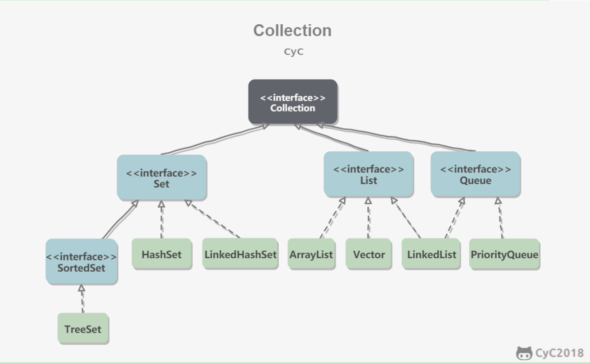
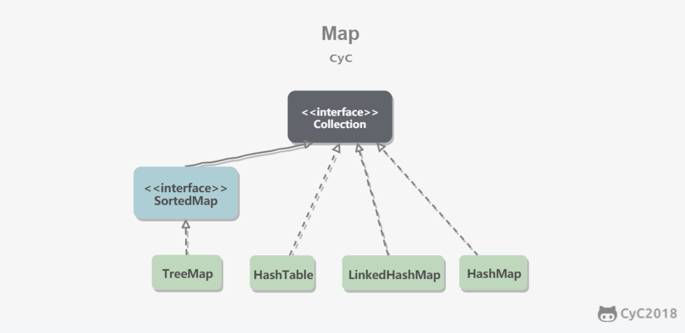
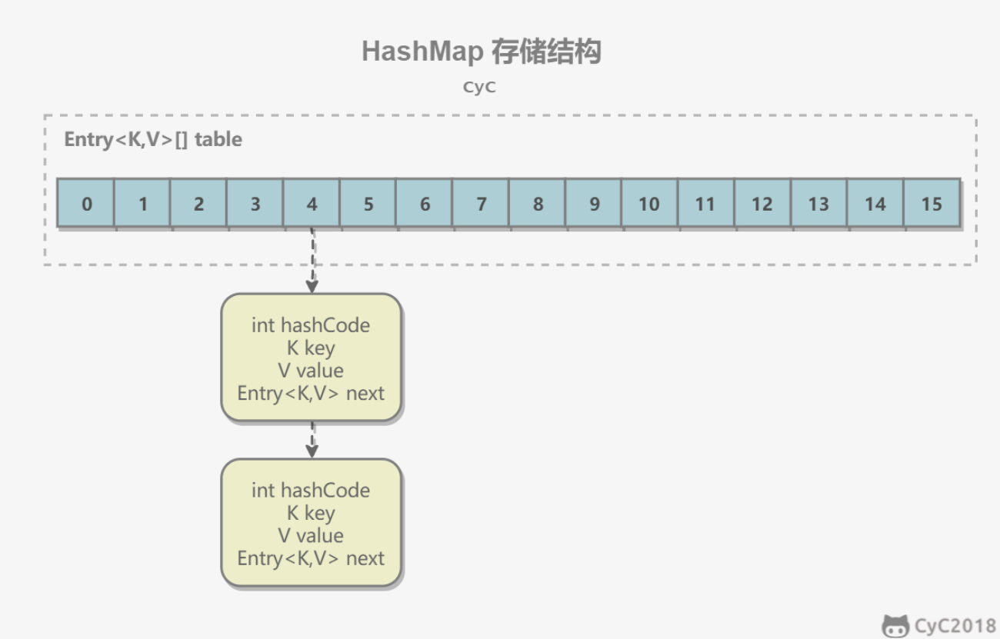
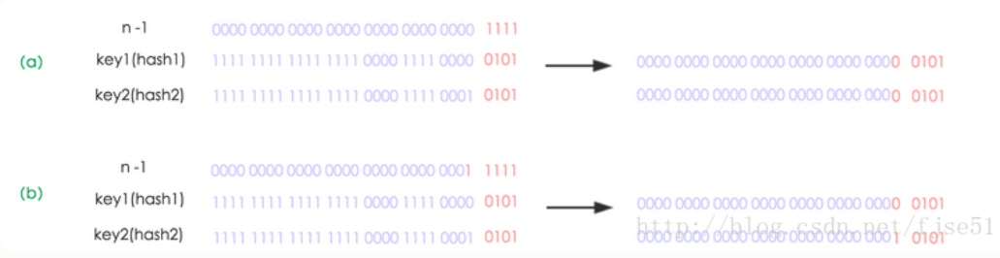
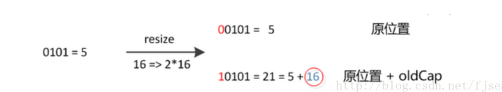
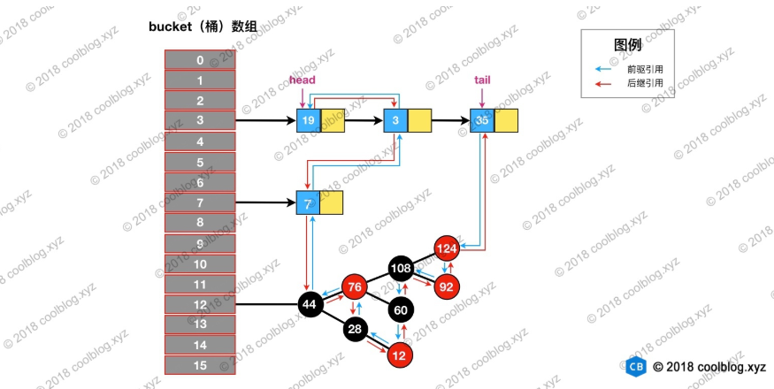

# Java集合秋招复习笔记

## 一、概述

容器主要包括 Collection 和 Map 两种，Collection 存储着对象的集合，而 Map 存储着键值对（两个对象）的映射表。

因为是准备秋招为目的的复习，所以很多方法都只是简略的描述，为了**知晓一些底层源码的思想、编码风格等内容**前期会读的比较详细，后期就只读核心方法了。

### 1.1 Collection简要概览



> Set

- TreeSet：基于红黑树实现，支持有序性操作，例如根据一个范围查找元素的操作。但是查找效率不如 HashSet，HashSet 查找的时间复杂度为 O(1)，TreeSet 则为 O(logN)。

- HashSet：基于哈希表实现，支持快速查找，但不支持有序性操作。并且失去了元素的插入顺序信息，也就是说使用 Iterator 遍历 HashSet 得到的结果是不确定的。

- LinkedHashSet：具有 HashSet 的查找效率，并且内部使用双向链表维护元素的插入顺序。

> List

- ArrayList：基于动态数组实现，支持随机访问。

- Vector：和 ArrayList 类似，但它是线程安全的。

- LinkedList：基于双向链表实现，只能顺序访问，但是可以快速地在链表中间插入和删除元素。不仅如此，LinkedList 还可以用作栈、队列和双向队列。

> Queue

- LinkedList：可以用它来实现双向队列。

- PriorityQueue：基于堆结构实现，可以用它来实现优先队列。

### 1.2 Map简要概述



- TreeMap：基于红黑树实现。

- HashMap：基于哈希表实现。

- HashTable：和 HashMap 类似，但它是线程安全的，这意味着同一时刻多个线程同时写入 HashTable 不会导致数据不一致。它是遗留类，不应该去使用它，而是使用 ConcurrentHashMap 来支持线程安全，ConcurrentHashMap 的效率会更高，因为 ConcurrentHashMap 引入了分段锁。

- LinkedHashMap：使用双向链表来维护元素的顺序，顺序为插入顺序或者最近最少使用（LRU）顺序。


## 二、Iterable接口

> Iterable接口的方法

实现此接口的类可以使用增强for。

1. `Iterator<T> iterator()`

   获得迭代器

2. `default void forEach(Consumer<? super T> action)`

   forEach方法，是JDK1.8新增的，参数为消费型接口

   ```java
   default void forEach(Consumer<? super T> action) {
       Objects.requireNonNull(action);
       for (T t : this) {//其内部使用增强for，对每一个元素执行action中的操作
           action.accept(t);
       }
   }
   ```

3. `default Spliterator<T> spliterator()`

   获得可分割迭代器，具体在第七节工具类中详细说明

   ```java
   default Spliterator<T> spliterator() {
       return Spliterators.spliteratorUnknownSize(iterator(), 0);
   }
   ```

> Iterable接口测试代码

```java
//测试
public class ArrayListTest {
    public static void main(String[] args) {
        List<String> list = new ArrayList<>();
        list.add("1");
        list.add("1");
        list.forEach(System.out::println);//可以调用forEach方法
        for(String str:list){//可以直接使用增强for循环
            System.out.println(str);
        }
        System.out.println(list.size());
    }
}
```


## 三、List系列的接口与抽象类

List是有顺序的、可重复的、元素可为null的集合。

### 3.1 Collection接口

> Collection接口的方法

这个接口中的一些方法会抛出异常，均为RuntimeException，由JVM接管，因此不需要显示的声明也不需要捕获。

1. `int size()`
   size（）方法返回一个int类型的值，代表集合中元素的个数，如果集合中的元素个数超过正数的最大值，那么**只能返回正数的最大值**。

2. `boolean isEmpty()`
   返回一个boolean类型的值，代表当前集合是否为集合。

3. `boolean contains(Object o)`
   返回boolean值代表集合中是否含有这个元素，这个方法比较依赖对象中的重写过的equals方法，如果没有重写equals方法，那么代表是否含有该内存位置的对象。
   参数o如果不是Collection指定的泛型类型，会报ClassCastException异常。
   参数为null，但是Collection要求不能存在null值的时候报NullPointerException异常。

4. `Iterator<E> iterator()`
   重写Iterable中的方法，依然未实现，返回元素迭代器的一个方法。

5. `Object[] toArray()`

6. `<T> T[] toArray(T[] a)`
   两个方法都是将集合中的元素以数组的形式返回，如果集合规定了一个迭代器，那么集合返回的数组会按照迭代器规定的顺序排列后返回。

   第二个方法会返回一个指定类型的结合，这里的参数T[] a的作用只是提供一个泛型的类型以及一个数组的长度，如果集合的长度大于传入参数a数组的长度，返回的数组长度与集合长度相同，如果集合长度小于传入参数a数组的长度，返回的数组长度与参数a数组的长度相同，但是比集合元素多出来的所有位置的都为null。

   如果指定数组a的运行时类型跟数组内元素的类型不同时，会报java.lang.ArrayStoreException
   如果数组a为null，报NullPointerException

7. `boolean add(E e)`

8. `boolean addAll(Collection<? extends E> c)`
   作用：7、向集合中添加元素 8、向集合中添加参数集合的所有元素
   返回：boolean类型的值，是否添加成功
   异常：

   1. 如果集合不支持添加操作，报UnsupportedOperationException
   2. 如果e的类型被集合指定不允许添加，报ClassCastException
   3. 如果元素的某些属性导致元素不能被添加到集合中，报IllegalArgumentException
   4. 如果元素不能在这个时候被添加到集合中，报IllegalStateException
   5. 如果元素为null，但是集合中不允许出现null元素，报NullPointerException.

9. `boolean remove(Object o)`

10. `boolean removeAll(Collection<?> c)`
    作用：9、移除集合中的指定元素 10、移除原集合中所有在参数集合中出现过的元素
    返回：boolean类型的值，是否删除成功
    异常：

    1. 指定的元素o的运行时类型与集合指定的泛型不匹配时，报ClassCastException
    2. 指定对象中包含一到多个null元素，但是集合中不允许出现null时，报NullPointerException
    3. 如果该集合不支持移除操作，报UnsupportedOperationException

11. `boolean containsAll(Collection<?> c)`
    作用：检验该集合是否包含指定集合的所有元素
    返回：boolean类型的值，是否包含
    异常：

    1. 参数集合中有元素的类型跟原集合指定的泛型类型不一致时，报ClassCastException
    2. 参数集合中包含null元素，但原集合不允许出现null时，报NullPointerException

12. `default boolean removeIf(Predicate<? super E> filter)`

    ```java
    default boolean removeIf(Predicate<? super E> filter) {
        Objects.requireNonNull(filter);
        boolean removed = false;
        final Iterator<E> each = iterator();
        while (each.hasNext()) {
            if (filter.test(each.next())) {
                each.remove();
                removed = true;
            }
        }
        return removed;
    }
    ```

    作用：删除集合中所有满足删除条件的元素,参数是一个判定性接口
    返回：boolean类型的值，是否有成功的删除
    异常：

    1. 如果判断条件为null时，报NullPointerException
    2. 如果满足条件的元素不能被移除，报UnsupportedOperationException

13. `boolean retainAll(Collection<?> c)`
    作用：原集合只保留在指定集合中存在的元素，简单点说就是取交集
    返回：boolean类型的值，如果原集合发生改变返回true
    异常：包含contains方法和remove方法的所有可能抛出异常

14. `void clear()`
    作用：清楚集合内的所有元素
    异常：如果clear操作不被集合支持，抛出UnsupportedOperationException异常

15. `default Stream<E> stream()`

16. `default Stream<E> parallelStream()`

    ```java
    default Stream<E> stream() {
        return StreamSupport.stream(spliterator(), false);
    }
    ```

    ```java
    default Stream<E> parallelStream() {//并行流
        return StreamSupport.stream(spliterator(), true);
    }
    ```

    1.8新加的方法，结合Stream使用，简单点理解就是一个增强型的迭代器。
    两个方法前者获取一个单通道的流处理起，后者获得一个多通道的流处理器

### 3.2 AbstractCollection抽象类

AbstractCollection类是Collection接口的第一层抽象实现类

```java
public abstract class AbstractCollection<E> implements Collection<E>
```

该类提供了Collection接口的**骨架**实现，以尽量减少实现此接口所需的工作量。 

#### 3.2.1 AbstractCollection构造器

```java
protected AbstractCollection() {}//无参构造，protected不允许外部包使用
```

#### 3.2.2 AbstractCollection字段

定义了集合的最大值为`int类型的最大值 - 8`，这是为了减少出错的概率，实际上真正的最大值是`Integer.MAX_VALUE`

```java
private static final int MAX_ARRAY_SIZE = Integer.MAX_VALUE - 8;
```

**为什么最大值是int类型的最大值-8呢？**

数组对象有一个额外的元数据，用于表示数组的大小。

数组的最大尺寸为2^31 = 2147483648，但是需要8bytes的存储大小表示数组的长度等元数据。所以数组的大小定义为Integer.MAX_VALUE - 8。

数组对象的**元数据**：

- Class：只想描述对象类型的类信息的指针。
- Flag：描述对象状态的标志的集合，包括对象的散列码以及对象的形状（即对象是否为数组）。
- Lock：对象的同步信息（即对象当前是否同步）。
- Size：数组的大小。

#### 3.2.3 AbstractCollection方法

这里只说明有实现的方法，对于Collection接口中的方法，该类只是实现了一部分！

1. `isEmpty()`

   ```java
   public boolean isEmpty() {
       return size() == 0;
   }
   ```

   调用size方法，返回值为0则集合为空。

2. `contains(Object o)`

   ```java
   public boolean contains(Object o) {
       Iterator<E> it = iterator();
       if (o==null) {//避免空指针异常
           while (it.hasNext())
               if (it.next()==null)
                   return true;//存在null，返回true
       } else {
           while (it.hasNext())
               if (o.equals(it.next()))//使用equals方法比较
                   return true;//存在相同值，返回true
       }
       return false;//遍历完毕没有找到值，返回false
   }
   ```

   contains方法，使用了迭代器，调用`iterator`方法来获得迭代器对象

   使用迭代器的好处是：**可以屏蔽集合的底层实现，使用统一的方式遍历集合！**

3. `toArray()`

   ```java
   public Object[] toArray() {
       Object[] r = new Object[size()];//定义一个长度为size的数组
       Iterator<E> it = iterator();//获得迭代器
       for (int i = 0; i < r.length; i++) {
           if (! it.hasNext()) //集合的个数期望的值
               return Arrays.copyOf(r, i);//截断数组，并返回
           r[i] = it.next();//否则就正常的赋值
       }
       return it.hasNext() ? finishToArray(r, it) : r;//判定是否还有值，如果有执行finishToArray方法，否则返回r
   }
   ```

   toArray的简单版本，通过迭代器的next方法将集合中每一个元素赋值给新的数组，元素比期望少时实际上本质是Arrays.copy方法，元素个数跟期望一样是返回新写的数组，元素个数比期望多时调用本类的 finishToArray方法

4. `toArray(T [] a)`

   ```java
   public <T> T[] toArray(T[] a) {
       int size = size();
       //下面一句代码后，r的长度为a和集合中的大者
       T[] r = a.length >= size ? a ://如果a的长度大于等于size，r = a
                 (T[])java.lang.reflect.Array//否则调用本地方法创建一个数组，其类型为第一个参数，长度为第二个参数
                 .newInstance(a.getClass().getComponentType(), size);//通过反射获得a数组的数据类型
       Iterator<E> it = iterator();
   
       for (int i = 0; i < r.length; i++) {
           if (! it.hasNext()) {//元素数量小于预期值
               if (a == r) {
                   r[i] = null; //多余的全部为空
               } else if (a.length < i) {//出现并发情况，集合已经被动过了，此时元素数量小于size但大于a的长度，返回集合值
                   return Arrays.copyOf(r, i);//截断
               } else {//此时元素数量已经小于a的长度，返回a，多余的空间为null
                   System.arraycopy(r, 0, a, 0, i);//数组拷贝，从r的0开始的i个元素，拷贝至a的从0开始的位置，native方法
                   if (a.length > i) {
                       a[i] = null;
                   }
               }
               return a;
           }
           r[i] = (T)it.next();
       }
       //元素数量超过预期值
       return it.hasNext() ? finishToArray(r, it) : r;
   }
   ```

   toArray的反射版本通过参数的数组类型创建指定类型的数组，处理过程大致一直，不同的一点是多余的位置会用null元素替代，中间的一段代码是为了适应并发的情况出现，单线程情况下是不存在这个情况的。

5. `finishToArray(T[] r, Iterator<?> it)`

   ```java
   private static <T> T[] finishToArray(T[] r, Iterator<?> it) {
       int i = r.length;
       while (it.hasNext()) {
           int cap = r.length;
           if (i == cap) {
               int newCap = cap + (cap >> 1) + 1;//扩容1.5倍+1
               if (newCap - MAX_ARRAY_SIZE > 0)//如果值大于最大值
                   newCap = hugeCapacity(cap + 1);
               r = Arrays.copyOf(r, newCap);//拷贝一个长度为newCap的数组
           }
           r[i++] = (T)it.next();//赋值
       }
       return (i == r.length) ? r : Arrays.copyOf(r, i);//确保最终返回的数组没有null
   }
   ```

6. `hugeCapacity(int minCapacity)`

   ```java
   private static int hugeCapacity(int minCapacity) {
       if (minCapacity < 0)//新数组的长度 + 1如果大于正数的最大值，就会变成负数，提示Required array size too large
           throw new OutOfMemoryError
               ("Required array size too large");
       return (minCapacity > MAX_ARRAY_SIZE) ?
           Integer.MAX_VALUE :
           MAX_ARRAY_SIZE;//传入参数大于最大值，返回int的最大值，否则返回最大值
   }
   ```

   注意：**其集合的最大值依旧是int的最大值，即`Integer.MAX_VALUE`，`MAX_ARRAY_SIZE`只是为了减少出错的概率。**

7. `remove(Object o)`

   ```java
   public boolean remove(Object o) {
       Iterator<E> it = iterator();
       if (o==null) {//防止空指针异常
           while (it.hasNext()) {
               if (it.next()==null) {
                   it.remove();//找到值，remove
                   return true;
               }
           }
       } else {
           while (it.hasNext()) {
               if (o.equals(it.next())) {//使用equals方法
                   it.remove();
                   return true;
               }
           }
       }
       return false;
   }
   ```

   同contains方法原理大致相同，分null和其他两种区别，同样需要依赖对象的equals方法和迭代器。

8. `containsAll(Collection<?> c)`

   ```java
   public boolean containsAll(Collection<?> c) {
       for (Object e : c)
           if (!contains(e))//在for循环中依次调用contains方法，如果有一个不相等则表示不包含，返回false
               return false;
       return true;
   }
   ```
   
9. `addAll(Collection<? extends E> c)`

   ```java
   public boolean addAll(Collection<? extends E> c) {
       boolean modified = false;
       for (E e : c)
           if (add(e))
               modified = true;
       return modified;
   }
   ```

   只要有一个元素添加成功就返回true

10. `removeAll(Collection<?> c)`

    ```java
    public boolean removeAll(Collection<?> c) {
        Objects.requireNonNull(c);//检验是否为null，为null抛出空指针异常
        boolean modified = false;
        Iterator<?> it = iterator();
        while (it.hasNext()) {
            if (c.contains(it.next())) {
                it.remove();
                modified = true;
            }
        }
        return modified;
    }
    ```

    通过迭代器遍历集合，如果元素包含在c中，移除，只要有一个元素被移除就返回true

11. `retainAll(Collection<?> c)`

    ```java
    public boolean retainAll(Collection<?> c) {
        Objects.requireNonNull(c);
        boolean modified = false;
        Iterator<E> it = iterator();
        while (it.hasNext()) {
            if (!c.contains(it.next())) {//移除不包含在c中的元素
                it.remove();
                modified = true;
            }
        }
        return modified;
    }
    ```

    通过迭代器遍历集合，如果元素不包含在c中，移除，只要有一个元素被移除就返回true

12. `clear()`

    ```java
    public void clear() {
        Iterator<E> it = iterator();
        while (it.hasNext()) {
            it.next();
            it.remove();
        }
    }
    ```

    通过迭代器遍历集合，移除所有元素

### 3.3 List接口

List接口继承了Collection接口

```java
public interface List<E> extends Collection<E>
```

**这里仅描述Collection之外的方法**

> List接口的方法

1. `replaceAll(UnaryOperator<E> operator)`

   ```java
   default void replaceAll(UnaryOperator<E> operator) {//参数是一个功能型接口
       Objects.requireNonNull(operator);
       final ListIterator<E> li = this.listIterator();//迭代器
       while (li.hasNext()) {
           li.set(operator.apply(li.next()));//调用功能型接口中的apply方法，接受list中的值，返回一个值存入list
       }
   }
   ```

2. `sort(Comparator<? super E> c)`

   ```java
   default void sort(Comparator<? super E> c) {//参数是一个比较型接口
       Object[] a = this.toArray();
       Arrays.sort(a, (Comparator) c);//调用Arrays的sort方法
       ListIterator<E> i = this.listIterator();
       for (Object e : a) {//把sort后的结果，依次填入集合中
           i.next();
           i.set((E) e);
       }
   }
   ```

3. `get(int index)`

   作用：根据下表获取list中的元素
   返回：指定下标出的元素
   异常：给定下标如果不在list的范围之内，报IndexOutOfBoundsException异常

4. `set(int index, E element)`

   作用：设置list的指定下标处的元素
   返回：返回的是**之前在指定下标出的元素**
   异常：

   - list的实现类不支持set操作的时候，报UnsupportedOperationException 异常
   - 如果参数元素的类型被禁止加入到集合中时，报ClassCastException 异常
   - 指定元素为null但list不允许出现null元素时，报NullPointerException 异常
   - 指定元素的一些属性导致元素不能被添加到list中时，报IllegalArgumentException 异常
   - 指定的下标超出list的范围时，报IndexOutOfBoundsException 异常

5. `add(int index, E element)`

   作用：添加指定元素到list的指定位置，**如果指定位置已有元素，则将指定元素右移**
   参数，异常跟set方法一样

6. `remove(int index)`

   作用：删除指定位置的元素
   返回：删除前指定位置上的元素
   异常：
   1、list的实现类不支持remove操作的时候，报UnsupportedOperationException 异常
   2、指定的下标超出list的范围时，报IndexOutOfBoundsException 异常

7. `indexOf(Object o)`

   作用：获取指定元素**第一次**出现的下标
   返回：指定元素第一次出现的下标
   异常：
   1、参数元素的类型与list指定的泛型类型不同时，报ClassCastException 异常
   2、指定元素为null但list不允许出现null元素时，报NullPointerException 异常

8. `lastIndexOf(Object o)`

   参数：想要查找的元素
   作用：获取指定元素最后一次出现的下标

   返回、异常与indexOf方法类似

9. `listIterator()`

   list特有的迭代器

10. `listIterator(int index)`

    返回从index开始的迭代器

11. `subList(int fromIndex, int toIndex)`

    作用：获取list的一个子list
    参数：fromIndex 开始下标 toIndex结束下标
    返回：与之前list类型完全相同的子list
    异常：开始下标小于0、结束下标大于list的size、开始下标大于结束下标时，报IndexOutOfBoundsException

### 3.4 AbstractList抽象类

AbstractList是List接口的第一层实现类，该类继承了AbstractCollection类，实现了List接口

```java
public abstract class AbstractList<E> extends AbstractCollection<E> implements List<E> 
```

该类具备AbstractCollection类的骨架实现之余，还实现了List接口的骨架。

#### 3.4.1 AbstractList的构造器

同样是只有无参构造，protected不允许外部包使用

```java
protected AbstractList() {}
```

#### 3.4.2 AbstractList的字段

modCount是AbstractList中一个transient修饰的变量，表示集合结构大小变化的次数，这里个人认为是乐观锁的体现。

```java
protected transient int modCount = 0;
```

#### 3.4.3 AbstractList的方法

1. `add(E e)`

   获取当前的size，调用add的重载方法，即插入到List的末尾

   ```java
   public boolean add(E e) {
       add(size(), e);
       return true;
   }
   ```

2. `indexOf(Object o)`

   通过迭代器遍历List，并返回第一个相同的元素下标，如果找不到返回-1

   ```java
   public int indexOf(Object o) {
       ListIterator<E> it = listIterator();
       if (o==null) {
           while (it.hasNext())
               if (it.next()==null)
                   return it.previousIndex();
       } else {
           while (it.hasNext())
               if (o.equals(it.next()))
                   return it.previousIndex();
       }
       return -1;
   }
   ```

3. `lastIndexOf(Object o)`

   通过list迭代器，向前遍历

   ```java
   public int lastIndexOf(Object o) {
       ListIterator<E> it = listIterator(size());//从最后一个元素开始的迭代器
       if (o==null) {
           while (it.hasPrevious())//往前遍历
               if (it.previous()==null)
                   return it.nextIndex();
       } else {
           while (it.hasPrevious())
               if (o.equals(it.previous()))
                   return it.nextIndex();
       }
       return -1;
   }
   ```

4. `clear()`

   重写了clear方法，调用了removeRange方法清空List

   ```java
   public void clear() {
       removeRange(0, size());
   }
   ```

5. `addAll(int index, Collection<? extends E> c)`

   ```java
   public boolean addAll(int index, Collection<? extends E> c) {
       rangeCheckForAdd(index);//判定index是否超出范围
       boolean modified = false;
       for (E e : c) {//把集合c中的元素依次调用add方法插入
           add(index++, e);
           modified = true;
       }
       return modified;//一个插入成功即返回true
   }
   ```

6. `iterator()`

   这里具体定义了迭代器的方法，是一个内部类，在内部类板块说明

   ```java
   public Iterator<E> iterator() {
       return new Itr();//返回一个内部类
   }
   ```

7. `listIterator()`

   调用重载方法，获得一个从头开始的list迭代器

   ```java
   public ListIterator<E> listIterator() {
       return listIterator(0);
   }
   ```

8. `listIterator(final int index)`

   ```java
   public ListIterator<E> listIterator(final int index) {
       rangeCheckForAdd(index);//检查范围
   
       return new ListItr(index);//通过检查后返回一个迭代器实例，也是一个内部类
   }
   ```

9. `equals(Object o)`

   ```java
   public boolean equals(Object o) {
       if (o == this)
           return true;
       if (!(o instanceof List))//o不是List的实例，返回false
           return false;
   
       ListIterator<E> e1 = listIterator();
       ListIterator<?> e2 = ((List<?>) o).listIterator();
       while (e1.hasNext() && e2.hasNext()) {//遍历两个集合
           E o1 = e1.next();
           Object o2 = e2.next();
           if (!(o1==null ? o2==null : o1.equals(o2)))//是否均为null，或者是否相等
               return false;
       }
       return !(e1.hasNext() || e2.hasNext());//两者的长度是否相等
   }
   ```

10. `hashCode()`

    ```java
    public int hashCode() {
        int hashCode = 1;
        for (E e : this)
            hashCode = 31*hashCode + (e==null ? 0 : e.hashCode());
        return hashCode;
    }
    ```

11. `removeRange(int fromIndex, int toIndex)`

    ```java
    protected void removeRange(int fromIndex, int toIndex) {
        ListIterator<E> it = listIterator(fromIndex);//构建一个从fromIndex开始的list迭代器
        for (int i=0, n=toIndex-fromIndex; i<n; i++) {//在fromIndex-toIndex这个范围内遍历集合
            it.next();
            it.remove();//移除
        }
    }
    ```

12. `rangeCheckForAdd(int index)`

    ```java
    private void rangeCheckForAdd(int index) {
        if (index < 0 || index > size())//index小于0或者大于集合的大小，抛出异常
            throw new IndexOutOfBoundsException(outOfBoundsMsg(index));
    }
    ```

13. `outOfBoundsMsg(int index)`

    错误信息生成方法

    ```java
    private String outOfBoundsMsg(int index) {
        return "Index: "+index+", Size: "+size();
    }
    ```

14. `subList(int fromIndex, int toIndex)`

    RandomAccess，这是一个标记接口，用于标明实现该接口的集合支持快速随机访问，如ArrayList支持随机访问，而LinkedList不支持

    ```java
    public List<E> subList(int fromIndex, int toIndex) {
        return (this instanceof RandomAccess ?//当前集合是不是RandomAccess的实例
                new RandomAccessSubList<>(this, fromIndex, toIndex) ://是，返回RandomAccessSubList
                new SubList<>(this, fromIndex, toIndex));//不是，返回SubList
    }
    ```

#### 3.4.4 AbstractList的内部类

1. `Itr`类

   ```java
   private class Itr implements Iterator<E> {//迭代器的实现类
       //下一个的位置
       int cursor = 0;
   
      	//最近一次返回的元素的下标，执行删除操作会变回-1
       int lastRet = -1;
   
       //期望的修改次数，如果两个值不相同时，迭代器就发生了并发修改
       int expectedModCount = modCount;
   
       //是否还有下一个
       public boolean hasNext() {
           return cursor != size();
       }
   
       public E next() {
           //检查修改期望值，防止并发修改的现象出现，乐观锁！
           checkForComodification();
           try {
               int i = cursor;
               E next = get(i);
               lastRet = i;
               cursor = i + 1;
               return next;//取出下一个值
           } catch (IndexOutOfBoundsException e) {
               checkForComodification();//越界异常后，检查是否是因为并发导致的
               throw new NoSuchElementException();
           }
       }
   
       public void remove() {
           if (lastRet < 0)
               throw new IllegalStateException();
            //检查修改期望值，防止并发修改的现象出现，乐观锁！
           checkForComodification();
   
           try {
               //移除游标前一位置的元素，同时游标前移，lastRet变为-1，期望改变次数同步
               AbstractList.this.remove(lastRet);
               if (lastRet < cursor)
                   cursor--;
               lastRet = -1;
               expectedModCount = modCount;
           } catch (IndexOutOfBoundsException e) {
               throw new ConcurrentModificationException();
           }
       }
   
       final void checkForComodification() {
           if (modCount != expectedModCount)
               throw new ConcurrentModificationException();
       }
   }
   ```

2. `ListItr`类

   ```java
   private class ListItr extends Itr implements ListIterator<E> {//继承自Itr，实现了ListIterator接口
       ListItr(int index) {//有参构造，把游标设置为index
           cursor = index;
       }
   
       public boolean hasPrevious() {//是否有前值
           return cursor != 0;
       }
   
       public E previous() {//获取前值
           checkForComodification();
           try {
               int i = cursor - 1;
               E previous = get(i);
               lastRet = cursor = i;
               return previous;
           } catch (IndexOutOfBoundsException e) {
               checkForComodification();
               throw new NoSuchElementException();
           }
       }
   
       public int nextIndex() {
           return cursor;
       }
   
       public int previousIndex() {
           return cursor-1;
       }
   
       //新增的set方法，元素替换，同样不能出现在游标未移动或删除元素操作之后原因与上面的next方法一致
       public void set(E e) {
           if (lastRet < 0)
               throw new IllegalStateException();
           checkForComodification();
   
           try {
               AbstractList.this.set(lastRet, e);
               expectedModCount = modCount;
           } catch (IndexOutOfBoundsException ex) {
               throw new ConcurrentModificationException();
           }
       }
   
       //新增的add方法，实现方式与Itr中remove方法类似，添加的元素出现在原游标的位置，同时游标后移
       public void add(E e) {
           checkForComodification();
   
           try {
               int i = cursor;
               AbstractList.this.add(i, e);
               lastRet = -1;
               cursor = i + 1;
               expectedModCount = modCount;
           } catch (IndexOutOfBoundsException ex) {
               throw new ConcurrentModificationException();
           }
       }
   }
   ```

3. `RandomAccessSubList`类

   ```java
   class RandomAccessSubList<E> extends SubList<E> implements RandomAccess {//是SubList的子类，同时实现了RandomAccess接口
       RandomAccessSubList(AbstractList<E> list, int fromIndex, int toIndex) {
           super(list, fromIndex, toIndex);//调用父类构造器
       }
   
       public List<E> subList(int fromIndex, int toIndex) {//重写方法
           return new RandomAccessSubList<>(this, fromIndex, toIndex);
       }
   }
   ```

4. `SubList`类

   他实现了AbstractList中的方法，但是**并没有实现存储结构**，而这个子list用的还是原本的list实例，只不过通过offset字段，只能修改list实例的一部分，所以在外部感觉就是一个子list。

   ```java
   class SubList<E> extends AbstractList<E> {//AbstractList的子类
       private final AbstractList<E> l;
       private final int offset;
       private int size;
   
       SubList(AbstractList<E> list, int fromIndex, int toIndex) {
           //排除数据错误情况
           if (fromIndex < 0)
               throw new IndexOutOfBoundsException("fromIndex = " + fromIndex);
           if (toIndex > list.size())
               throw new IndexOutOfBoundsException("toIndex = " + toIndex);
           if (fromIndex > toIndex)
               throw new IllegalArgumentException("fromIndex(" + fromIndex +
                                                  ") > toIndex(" + toIndex + ")");
           //通过验证后，进行赋值
           l = list;
           offset = fromIndex;
           size = toIndex - fromIndex;
           this.modCount = l.modCount;
       }
   }
   ```

### 3.5 AbstractSequentialList抽象类

是AbstractList的抽象子类，对于其父类中的方法做了进一步的实现，方法实现原理基本类似(基于迭代器)，不再赘述。

```java
public abstract class AbstractSequentialList<E> extends AbstractList<E> 
```


## 四、ArrayList

ArrayList继承了AbstractList抽象类，实现了List接口。此外还有RandomAccess，表示该类支持随机访问。Cloneable，表示该类支持克隆。Serializable，表示可以序列化。**看了这么久了，终于见到了第一个不是抽象类的实现类了！**

```java
public class ArrayList<E> extends AbstractList<E>
        implements List<E>, RandomAccess, Cloneable, java.io.Serializable
```

### 4.1 ArrayList的构造器

> 无参构造

把一个空数组赋给elementData

```java
public ArrayList() {
	this.elementData = DEFAULTCAPACITY_EMPTY_ELEMENTDATA;
}
```

> int的有参构造

```java
public ArrayList(int initialCapacity) {
    if (initialCapacity > 0) {//如果值大于0
        this.elementData = new Object[initialCapacity];//new一定长度的数组
    } else if (initialCapacity == 0) {
        this.elementData = EMPTY_ELEMENTDATA;//为0则把一个空数组赋值给elementData
    } else {//否则抛出异常
        throw new IllegalArgumentException("Illegal Capacity: "+
                                           initialCapacity);
    }
}
```

> 参数为集合的有参构造

```java
public ArrayList(Collection<? extends E> c) {
	elementData = c.toArray();//把集合c转化为数组并赋值
    if ((size = elementData.length) != 0) {//size = 数组的长度，且判断是否为0
		//如果elementData的类型不是Object，那么就重新创建一个Object的数组
        if (elementData.getClass() != Object[].class)
            elementData = Arrays.copyOf(elementData, size, Object[].class);
	} else {
	//若size = 0,把空数组赋值给elementData
		this.elementData = EMPTY_ELEMENTDATA;
	}
}
```

### 4.2 ArrayList的字段

```java
private static final long serialVersionUID = 8683452581122892189L;
private static final int DEFAULT_CAPACITY = 10;//默认初始容量
private static final Object[] EMPTY_ELEMENTDATA = {};//用于空实例的共享空数组实例
private static final Object[] DEFAULTCAPACITY_EMPTY_ELEMENTDATA = {};//用于默认大小（无参构造）的空实例的共享空数组实例。将其与空的元素数据区分开来，以了解添加第一个元素时要膨胀多少。
transient Object[] elementData; //存储ArrayList元素的数组缓冲区
private int size;//数组当前的大小
```

### 4.3 ArrayList的重点方法

#### 4.3.1 ArrayList插入

添加元素时使用 ensureCapacityInternal() 方法来保证容量足够，如果不够时，需要使用 grow() 方法进行扩容，新容量的大小为 `oldCapacity + (oldCapacity >> 1)`，也就是旧容量的 1.5 倍。

扩容操作需要调用 `Arrays.copyOf()` 把原数组整个复制到新数组中，这个操作代价很高，因此最好在创建 ArrayList 对象时就**指定大概的容量大小**，减少扩容操作的次数。

```java
public boolean add(E e) {
    ensureCapacityInternal(size + 1);  //对数组的大小做一些操作
    elementData[size++] = e;//这一步是把值存放到数组中
    return true;
}

private void ensureCapacityInternal(int minCapacity) {
	ensureExplicitCapacity(calculateCapacity(elementData, minCapacity));
}

private static int calculateCapacity(Object[] elementData, int minCapacity) {
	if (elementData == DEFAULTCAPACITY_EMPTY_ELEMENTDATA) {//如果当前的data是空的话
		return Math.max(DEFAULT_CAPACITY, minCapacity);//返回参数和10之中的较大者
	}
	return minCapacity;
}

private void ensureExplicitCapacity(int minCapacity) {
	modCount++;//标志符会+1
	if (minCapacity - elementData.length > 0)
		grow(minCapacity);
}

private void grow(int minCapacity) {
	// overflow-conscious code
	int oldCapacity = elementData.length;
    /*>>右移一位，即为1/2
    * 即newCapacity约为oldCapacity的1.5倍（偶数为1.5倍）*/
	int newCapacity = oldCapacity + (oldCapacity >> 1);
	if (newCapacity - minCapacity < 0)
		newCapacity = minCapacity;
	if (newCapacity - MAX_ARRAY_SIZE > 0)//过长检测
		newCapacity = hugeCapacity(minCapacity);
    //使用Arrays.copyOf（） 底层采用native本地方法实现，效率最高。复制数组。
	elementData = Arrays.copyOf(elementData, newCapacity);
}
```

#### 4.3.2 ArrayList移除

需要调用 System.arraycopy() 将 index+1 后面的元素都复制到 index 位置上，该操作的时间复杂度为 O(N)，可以看到 ArrayList 删除元素的代价是非常高的。

```java
public E remove(int index) {
    rangeCheck(index);
    modCount++;
    E oldValue = elementData(index);
    int numMoved = size - index - 1;
    if (numMoved > 0)
        System.arraycopy(elementData, index+1, elementData, index,numMoved);//调用arraycopy方法，把index+1之后的元素移动到index上
    elementData[--size] = null; // clear to let GC do its work
    return oldValue;
}
```

#### 4.3.3 序列化

ArrayList 基于数组实现，并且具有动态扩容特性，因此保存元素的数组不一定都会被使用，那么就**没必要全部**进行序列化。

保存元素的数组 elementData 使用 transient 修饰，让数组本身不能被序列化，而使用指定的方法对数组持有的对象进行序列化。

```java
transient Object[] elementData; // non-private to simplify nested class access
```

ArrayList 实现了 writeObject() 和 readObject() 来控制**只序列化数组中有元素填充那部分内容**。

```java
private void writeObject(java.io.ObjectOutputStream s)
    throws java.io.IOException{
    //获取期待值
    int expectedModCount = modCount;
    s.defaultWriteObject();

    //写入容量
    s.writeInt(size);

    //依次写入数组的值
    for (int i=0; i<size; i++) {
        s.writeObject(elementData[i]);
    }

    if (modCount != expectedModCount) {
        throw new ConcurrentModificationException();
    }
}
```

```java
private void readObject(java.io.ObjectInputStream s)
    throws java.io.IOException, ClassNotFoundException {
    elementData = EMPTY_ELEMENTDATA;

    // 读入size和其他隐藏的内容
    s.defaultReadObject();

    // 读入容量
    s.readInt(); 

    if (size > 0) {
        int capacity = calculateCapacity(elementData, size);
        SharedSecrets.getJavaOISAccess().checkArray(s, Object[].class, capacity);
        ensureCapacityInternal(size);

        Object[] a = elementData;
       	//读取数组中的每一个元素
        for (int i=0; i<size; i++) {
            a[i] = s.readObject();
        }
    }
}
```

序列化时需要使用 ObjectOutputStream 的 writeObject() 将对象转换为字节流并输出。而 writeObject() 方法在传入的对象存在 writeObject() 的时候会去**反射调用**该对象的 writeObject() 来实现序列化。反序列化使用的是 ObjectInputStream 的 readObject() 方法，原理类似。

### 4.4 ArrayList的Fail-Fast

> 什么是Fail-Fast

**fail-fast 机制是java集合(Collection)中的一种错误机制。**当多个线程对同一个集合的内容进行操作时，就可能会产生fail-fast事件。例如：当某一个线程A通过iterator去遍历某集合的过程中，若该集合的内容被其他线程所改变了；那么线程A访问集合时，就会抛出ConcurrentModificationException异常，产生fail-fast事件。

> ArrayList中的体现

modCount 用来记录 ArrayList 结构发生变化的次数。结构发生变化是指添加或者删除至少一个元素的所有操作，或者是调整内部数组的大小，仅仅只是设置元素的值不算结构发生变化。

在进行序列化或者迭代等操作时，需要比较操作前后 modCount 是否改变，如果改变了需要抛出 ConcurrentModificationException

```java
final void checkForComodification() {
    if (modCount != expectedModCount)
        throw new ConcurrentModificationException();
}
```


## 五、Vector

可以看到Vector和ArrayList都是继承了AbstractList抽象类，实现了List接口和其他三个标记接口，可以说这两个是非常相似的。

```java
public class Vector<E>
    extends AbstractList<E>
    implements List<E>, RandomAccess, Cloneable, java.io.Serializable
```

### 5.1 Vector的构造器

> 无参构造

```java
public Vector() {
    this(10);
}
```

可以看到调用了重载的构造器，参数为10

> 单个参数的构造器

```java
public Vector(int initialCapacity) {
    this(initialCapacity, 0);
}
```

可以看到这个构造器同样调用了重载的构造器，其第二个参数为0

> 两个参数的构造器

```java
public Vector(int initialCapacity, int capacityIncrement) {
    super();
    if (initialCapacity < 0)//初始长度小于0
        throw new IllegalArgumentException("Illegal Capacity: "+
                                           initialCapacity);
    this.elementData = new Object[initialCapacity];//创建一个长为init..的数组
    this.capacityIncrement = capacityIncrement;//赋值
}
```

在这个构造器中，真正的new了实例，如果不带长度，默认长度为10

> 参数为集合的构造器

```java
public Vector(Collection<? extends E> c) {
    elementData = c.toArray();
    elementCount = elementData.length;
    // c.toArray might (incorrectly) not return Object[] (see 6260652)
    if (elementData.getClass() != Object[].class)
        elementData = Arrays.copyOf(elementData, elementCount, Object[].class);
}
```

这个构造器和ArrayList的基本一致

### 5.2 Vector的字段

```java
protected Object[] elementData;//存放数据的数组
protected int elementCount;//元素的数量

//向量的大小大于其容量时，容量自动增加的量。如果在创建Vector时，指定了capacityIncrement的大小；则，每次当Vector中动态数组容量增加时，增加的大小都是capacityIncrement。如果容量的增量小于等于零，则每次需要增大容量时，向量的容量将增大一倍。
protected int capacityIncrement;

private static final long serialVersionUID = -2767605614048989439L;
private static final int MAX_ARRAY_SIZE = Integer.MAX_VALUE - 8;
```

### 5.3 Vector的重点方法

Vector的实现和ArrayList基本相似，主要的区别在于**线程安全**和**扩容**上，下面主要说明这两点。

#### 5.3.1 Vector的同步

为什么Vector是线程安全的呢？很简单，因为在其add、remove等方法中使用了synchronized关键字。使用了同步锁之后，那自然就是线程安全的了！

```java
public synchronized boolean add(E e) {
    modCount++;
    ensureCapacityHelper(elementCount + 1);
    elementData[elementCount++] = e;
    return true;
}

public synchronized E remove(int index) {
    modCount++;
    if (index >= elementCount)
        throw new ArrayIndexOutOfBoundsException(index);
    E oldValue = elementData(index);

    int numMoved = elementCount - index - 1;
    if (numMoved > 0)
        System.arraycopy(elementData, index+1, elementData, index,
                         numMoved);
    elementData[--elementCount] = null; // Let gc do its work

    return oldValue;
}
```

#### 5.3.2 Vector的扩容

Vector的add和ArrayList基本相同，最大的区别在于ArrayList固定扩容1.5倍，而Vector不是。

```java
private void grow(int minCapacity) {
    int oldCapacity = elementData.length;
    //capacityIncrement可在构造器中指定，如果大于0，那么每次扩容capacityIncrement，否则扩容两倍
    int newCapacity = oldCapacity + ((capacityIncrement > 0) ?
                                     capacityIncrement : oldCapacity);
    if (newCapacity - minCapacity < 0)
        newCapacity = minCapacity;
    if (newCapacity - MAX_ARRAY_SIZE > 0)
        newCapacity = hugeCapacity(minCapacity);
    elementData = Arrays.copyOf(elementData, newCapacity);
}
```

### 5.4 ArrayList与Vector比较

- Vector 是同步的，在很多不需要并发的场合下开销就比 ArrayList 要大，访问速度更慢。最好使用 ArrayList 而不是 Vector，因为同步操作完全可以由程序员自己来控制；
- Vector 每次扩容请求其大小的 2 倍（也可以通过构造函数设置增长的容量），而 ArrayList 是 1.5 倍。

### 5.5 并发下替代方式

可以使用 `Collections.synchronizedList();` 得到一个线程安全的 ArrayList。

```java
List<String> list = new ArrayList<>();
List<String> synList = Collections.synchronizedList(list);
```

也可以使用JUC下的 CopyOnWriteArrayList 类。

```java
List<String> list = new CopyOnWriteArrayList<>();
```


## 六、CopyOnWriteArrayList

CopyOnWriteArrayList，实现了List接口，以及其余三个标记接口。这个容器是JUC包下的，已经非常深入了，因此这里不会涉及很多源码。

```java
public class CopyOnWriteArrayList<E>
    implements List<E>, RandomAccess, Cloneable, java.io.Serializable 
```

### 6.1 CopyOnWriteArrayList字段

```java
private static final long serialVersionUID = 8673264195747942595L;
final transient ReentrantLock lock = new ReentrantLock();//Lock锁
private transient volatile Object[] array;//volatite修饰的数组
private static final sun.misc.Unsafe UNSAFE;
private static final long lockOffset;
```

### 6.2 CopyOnWriteArrayList重点方法

#### 6.2.1 读写分离

> add方法

```java
public boolean add(E e) {
    final ReentrantLock lock = this.lock;
    lock.lock();
    try {
        Object[] elements = getArray();//获得数组，至一个新开的数组中
        int len = elements.length;
        Object[] newElements = Arrays.copyOf(elements, len + 1);//拷贝一个新的数组
        newElements[len] = e;//存入元素
        setArray(newElements);//赋值
        return true;
    } finally {
        lock.unlock();
    }
}

final void setArray(Object[] a) {
    array = a;
}
```

> get方法

```java
public E get(int index) {//读方法并没有加锁
    return get(getArray(), index);
}
```

> 总结

- 写操作在一个复制的数组上进行，读操作还是在原始数组中进行，读写分离，互不影响。
- 读操作并没有加锁，可以多个线程同时进行
- 在写操作进行的过程中，读操作依然可以进行，不过他读的是原数据
- 写操作需要加锁，防止并发写入时导致写入数据丢失。

- 写操作结束之后需要把原始数组指向新的复制数组。

#### 6.2.2 适用场景

CopyOnWriteArrayList 在写操作的同时允许读操作，大大提高了读操作的性能，因此很适合读多写少的应用场景。

但是 CopyOnWriteArrayList 有其缺陷：

- 内存占用：在写操作时需要复制一个新的数组，使得内存占用为原来的两倍左右；
- 数据不一致：读操作不能读取实时性的数据，因为部分写操作的数据还未同步到读数组中。

所以 CopyOnWriteArrayList 不适合内存敏感以及对实时性要求很高的场景。


## 七、LinkedList

LinkedList继承了AbstractSequentialList抽象类，并且实现了List、Deque接口和两个标记接口。LinkedList的底层是双端链表，因此他具备双端队列的基本特性，所以实现了Deque接口。

其方法的实现大体上没有太大的改变，这里不再赘述了。

```java
public class LinkedList<E>
    extends AbstractSequentialList<E>
    implements List<E>, Deque<E>, Cloneable, java.io.Serializable
```

### 7.1 LinkedList的构造器

> 无参构造

```java
public LinkedList() {
}
```

> 参数为集合的有参构造

```java
public LinkedList(Collection<? extends E> c) {
    this();
    addAll(c);//调用addAll方法
}
```

### 7.2 LinkedList的字段

```java
transient int size = 0;//元素数量
transient Node<E> first;//头指针
transient Node<E> last;//尾指针
```

### 7.3 LinkedList的存储结构

可以看到存储节点Node类是一个双向链表的节点

```java
private static class Node<E> {
    E item;
    Node<E> next;
    Node<E> prev;

    Node(Node<E> prev, E element, Node<E> next) {//构造
        this.item = element;
        this.next = next;
        this.prev = prev;
    }
}
```

### 7.4 LinkedList与ArrayList的区别

- ArrayList 和 LinkedList 都是不同步的
- ArrayList底层基于数组实现，LinkedList底层基于双向链表实现
- ArrayList倘若是插入到末尾，这复杂度为O(1)，但是在任意位置插入或删除结点，则复杂度为O(n-1)；LinkedList对于任意位置的插入或删除复杂度都为O(1)
- ArrayList支持通过下标来访问，而LinkedList不支持
- ArrayList浪费一些预留的空间，而LinkedList则花费在指向其他结点上（数组和链表的区别）


## 八、Set系列的抽象类和接口

Set注重数据的唯一性

### 8.1 Set接口

Set接口继承了Collection接口

```java
public interface Set<E> extends Collection<E>
```

其方法和List基本一致，此处不再赘述

### 8.2 AbstractSet抽象类

继承了AbstractCollection类，实现了Set接口

```java
public abstract class AbstractSet<E> extends AbstractCollection<E> implements Set<E> 
```

这个抽象类除了空的无参构造外只有三个方法，`equals`、`hashcode`、`removeAll`都是基于迭代器的实现，不是本次复习的重点。

### 8.3 SortedSet接口

SortedSet接口继承了Set接口

```java
public interface SortedSet<E> extends Set<E>
```

> SortedSet的方法

1. `comparator()`

   比较大小的方法，是有序Set的核心方法之一

2. `subSet(E fromElement, E toElement)`

   获得子Set

3. `headSet(E toElement)`

4. `tailSet(E fromElement)`

5. `first()`

6. `last()`

   获得首部元素、末尾元素

### 8.4 NavigableSet接口

NavigableSet继承了SortedSet接口，其方法在TreeSet中说明。

```java
public interface NavigableSet<E> extends SortedSet<E>
```


## 九、HashSet

继承了AbstractSet抽象类，实现了Set接口，以及两个标记接口，**HashSet说白了就是基于HashMap的Key来实现的。**

HashSet不允许出现重复元素，且不保证顺序，允许包含值为 null 的元素，但最多只能一个，线程不安全

```java
public class HashSet<E>
    extends AbstractSet<E>
    implements Set<E>, Cloneable, java.io.Serializable
```

### 9.1 HashSet的构造器

HashSet有很多构造器，但是可以发现，归根到底都是调用了HashMap的构造器，所以我们在讲到HashMap的时候再详细说明

```java
public HashSet() {
    map = new HashMap<>();
}

public HashSet(Collection<? extends E> c) {
    map = new HashMap<>(Math.max((int) (c.size()/.75f) + 1, 16));
    addAll(c);
}

public HashSet(int initialCapacity, float loadFactor) {
    map = new HashMap<>(initialCapacity, loadFactor);
}

public HashSet(int initialCapacity) {
    map = new HashMap<>(initialCapacity);
}

//default权限，提供给LinkedHashSet的构造方法，使用LinkedHashSet构建
HashSet(int initialCapacity, float loadFactor, boolean dummy) {
    map = new LinkedHashMap<>(initialCapacity, loadFactor);
}
```

### 9.2 HashSet的字段

```java
static final long serialVersionUID = -5024744406713321676L;
private transient HashMap<E,Object> map;//HashSet的底层存储结构是HashMap！
private static final Object PRESENT = new Object();//该对象是执行add方法时，作为k-v中的v传入的
```

### 9.3 HashSet的方法

说实话，不太想写这一部分的。意思意思吧~

因为每个HashSet的方法，都是调用了map的方法，甚至连迭代器都是map的，so！没什么好说的。

```java
public boolean add(E e) {
    return map.put(e, PRESENT)==null;
}
```


## 十、LinkedHashSet

LinkedHashSet继承自HashSet，实现了Set接口，两个标记接口。有序，允许为null，不允许出现重复元素。线程不安全。

```java
public class LinkedHashSet<E>
    extends HashSet<E>
    implements Set<E>, Cloneable, java.io.Serializable
```

### 10.1 LinkedHashSet的构造器

可以看到，这里的构造函数都调用了父类那个default构造方法，创建了LinkedHashMap

```java
public LinkedHashSet(int initialCapacity, float loadFactor) {
    super(initialCapacity, loadFactor, true);
}

public LinkedHashSet(int initialCapacity) {
    super(initialCapacity, .75f, true);
}

public LinkedHashSet() {
    super(16, .75f, true);
}

public LinkedHashSet(Collection<? extends E> c) {
    super(Math.max(2*c.size(), 11), .75f, true);
    addAll(c);
}
```

其余都是采用了HashSet的实现，和HashSet的最大区别在于一个使用LinkedHashMap、一个使用了HashMap。因此这两个集合的区别也就是这两个Map的区别。


## 十一、TreeSet

TreeSet继承了AbstractSet，实现了NavigableSet接口。基于 TreeMap 实现的有序集合，线程不同步，不允许null，可以按照顺序排列

```java
public class TreeSet<E> extends AbstractSet<E>
    implements NavigableSet<E>, Cloneable, java.io.Serializable
```

### 11.1 TreeSet的构造器

和HashSet一样，HashSet在构造器中调用了HashMap的构造器，而TreeSet在构造器中调用了TreeMap的构造器。

```java
TreeSet(NavigableMap<E,Object> m) {
    this.m = m;
}

public TreeSet() {
    this(new TreeMap<E,Object>());
}

public TreeSet(Comparator<? super E> comparator) {
    this(new TreeMap<>(comparator));
}

public TreeSet(Collection<? extends E> c) {
    this();
    addAll(c);
}

public TreeSet(SortedSet<E> s) {
    this(s.comparator());
    addAll(s);
}
```

### 11.2 TreeSet的字段

字段和HashSet相似，一个map，一个填充Value的对象。

```java
private transient NavigableMap<E,Object> m;
private static final Object PRESENT = new Object();
```

其方法暂时不做讨论。

### 11.3 3种Set比较

- 这三者都是线程不安全
- 三者的底层对应三种map
- TreeSet是SortedSet接口的唯一实现类，TreeSet可以确保集合元素处于排序状态。
- LinkedHashSet将会以元素的添加顺序访问集合的元素
- **LinkedHashSet在迭代访问Set中的全部元素时，性能比HashSet好，但是插入时性能稍微逊色于HashSet**

### 11.4 并发下的Set

1. 通过Collections工具包下的方法获得线程安全的Set

   ```java
   Collections.synchronizedNavigableSet();
   Collections.synchronizedSortedSet();
   Collections.synchronizedSet();
   ```

2. CopyOnWriteArraySet

   使用JUC包下的工具类。这个类是基于CopyOnWriteArrayList来实现的。


## 十二、Map系列的抽象类和接口

### 12.1 Map接口

```java
public interface Map<K,V>
```

> Map接口的方法

罗列一下重点方法

```java
V put(K key, V value);
V get(Object key);
V remove(Object key);
boolean containsKey(Object key);
```

> Map中的基本存储结构

```java
interface Entry<K,V> {
    K getKey();

    V getValue();

    V setValue(V value);

    boolean equals(Object o);

    int hashCode();
}
```

### 12.2 AbstractMap抽象类

```java
public abstract class AbstractMap<K,V> implements Map<K,V>
```

在该类中实现了部分Map接口中的方法，但是绝大多数都是基于`entrySet().iterator()`也就是Set的迭代器，但是在该类中entrySet是一个抽象方法，所以只能在实现类中探讨了。

```java
public abstract Set<Entry<K,V>> entrySet();
```

### 12.3 SortMap接口

和SortSet类似

```java
public interface SortedMap<K,V> extends Map<K,V>
```

### 12.4 NavigableMap接口

和NavigableSet类似

```java
public interface NavigableMap<K,V> extends SortedMap<K,V>
```


## 十三、HashMap

HashMap继承了AbstractMap抽象类，并且实现了Map接口，以及两个标记接口。

key可以接受一个NULL值，无序，线程不安全。

```java
public class HashMap<K,V> extends AbstractMap<K,V>
    implements Map<K,V>, Cloneable, Serializable
```

### 13.1 HashMap的构造器

> 无参构造

```java
public HashMap() {
    //负载因子赋值为默认值0.75
    this.loadFactor = DEFAULT_LOAD_FACTOR;
}
```

> 单参数构造

```java
public HashMap(int initialCapacity) {
    //把初始容量设置为传入值，负载因子为默认值，调用了双参构造器
    this(initialCapacity, DEFAULT_LOAD_FACTOR);
}
```

> 双参数构造

```java
public HashMap(int initialCapacity, float loadFactor) {
    if (initialCapacity < 0)//初始容量为负数，报错
        throw new IllegalArgumentException("Illegal initial capacity: " +
                                           initialCapacity);
    if (initialCapacity > MAXIMUM_CAPACITY)//初始容量过大，则取最大值
        initialCapacity = MAXIMUM_CAPACITY;
    if (loadFactor <= 0 || Float.isNaN(loadFactor))//如果加载因子小于等于0，或者not a number，报错
        throw new IllegalArgumentException("Illegal load factor: " +
                                           loadFactor);
    this.loadFactor = loadFactor;
    this.threshold = tableSizeFor(initialCapacity);
}
```

> 参数为map的构造器

```java
public HashMap(Map<? extends K, ? extends V> m) {
    this.loadFactor = DEFAULT_LOAD_FACTOR;//加载因子为默认值
    putMapEntries(m, false);
}
```

### 13.2 HashMap的字段

```java
static final int DEFAULT_INITIAL_CAPACITY = 1 << 4; // 默认容量16

static final int MAXIMUM_CAPACITY = 1 << 30;//最大容量2^30

static final float DEFAULT_LOAD_FACTOR = 0.75f;//默认加载因子为0.75

static final int TREEIFY_THRESHOLD = 8;//树化阙值

static final int UNTREEIFY_THRESHOLD = 6;//退化阙值

static final int MIN_TREEIFY_CAPACITY = 64;//最小树形化阙值

transient Node<K,V>[] table;//一个Node的对象数组

transient Set<Map.Entry<K,V>> entrySet;//所有存储元素组成的Set

transient int size;//元素数量

transient int modCount;//fast-fail

int threshold;//threshold表示当HashMap的size大于threshold时会执行resize操作，threshold=capacity*loadFactor

final float loadFactor;//加载因子
```

### 13.3 HashMap的存储结构

内部包含了一个 Node类型的数组 table。Node存储着键值对。它包含了四个字段，从 next 字段我们可以看出 Node 是一个链表。即数组中的每个位置被当成一个桶，一个桶存放一个链表。HashMap 使用**拉链法**(拉链法见数据结构笔记)来解决冲突，同一个链表中存放哈希值和散列桶取模运算结果相同的 Node。



```java
static class Node<K,V> implements Map.Entry<K,V> {
    final int hash;//节点哈希值
    final K key;
    V value;
    Node<K,V> next;//如果存在碰撞，下一位地址

    Node(int hash, K key, V value, Node<K,V> next) {
        this.hash = hash;
        this.key = key;
        this.value = value;
        this.next = next;
    }

    public final K getKey()        { return key; }
    public final V getValue()      { return value; }
    public final String toString() { return key + "=" + value; }

    public final int hashCode() {
        return Objects.hashCode(key) ^ Objects.hashCode(value);
    }

    public final V setValue(V newValue) {
        V oldValue = value;
        value = newValue;
        return oldValue;
    }

    public final boolean equals(Object o) {
        if (o == this)
            return true;
        if (o instanceof Map.Entry) {
            Map.Entry<?,?> e = (Map.Entry<?,?>)o;
            if (Objects.equals(key, e.getKey()) &&
                Objects.equals(value, e.getValue()))
                return true;
        }
        return false;
    }
}
```

### 13.4 HashMap的内部类

因为在HashMap中存在了大量的内部类，实在没有精力去全部研究了。

1. `final class KeySet extends AbstractSet<K>`

   由Map的key组成的Set

2. `final class Values extends AbstractCollection<V> `

   由Map的Value组成的Collection

3. `final class EntrySet extends AbstractSet<Map.Entry<K,V>>`

   一个包含了k-v键值对的Set

4. `static final class TreeNode<K,V> extends LinkedHashMap.Entry<K,V>`

   二叉树实现的节点

5. 除了以上几个内部类之外，还有很多迭代器实现类，这里不再说明

### 13.5 HashMap的方法

#### 13.5.1 put方法

传入key和value，调用putVal方法进行存入

```java
public V put(K key, V value) {
    return putVal(hash(key), key, value, false, true);
}
```

> putVal方法

参数列表

- key的hash值
- key
- value
- onlyIfAbsent，如果当前位置已存在一个值，是否替换，false是替换，true是不替换
- evict，表是否在创建模式，如果为false，则表是在创建模式

```java
final V putVal(int hash, K key, V value, boolean onlyIfAbsent,boolean evict) {
    Node<K,V>[] tab;
    Node<K,V> p;
    int n, i;
    //判断table是否为空，如果是空的就创建一个table，并获取他的长度
    if ((tab = table) == null || (n = tab.length) == 0)
        n = (tab = resize()).length;
    
    //如果计算出来的索引位置之前没有放过数据，就直接放入
    //(n - 1) & hash 散列函数
    if ((p = tab[i = (n - 1) & hash]) == null)
        tab[i] = newNode(hash, key, value, null);
    else {//发生哈希碰撞的情况
        Node<K,V> e; 
        K k;
        //判断put的数据和之前的数据是否重复
        if (p.hash == hash &&
            ((k = p.key) == key || (key != null && key.equals(k))))
            e = p;
        
        //判断是否是红黑树，如果是红黑树就直接插入树中
        else if (p instanceof TreeNode)
            e = ((TreeNode<K,V>)p).putTreeVal(this, tab, hash, key, value);
        
        //如果不是红黑树，就遍历每个节点，判断链表长度是否大于8，如果大于就转换为红黑树
        else {
            for (int binCount = 0; ; ++binCount) {
                if ((e = p.next) == null) {
                    p.next = newNode(hash, key, value, null);
                    if (binCount >= TREEIFY_THRESHOLD - 1) // -1 for 1st
                        treeifyBin(tab, hash);
                    break;
                }
                //判断索引每个元素的key是否可要插入的key相同，如果相同就直接覆盖
                if (e.hash == hash &&
                    ((k = e.key) == key || (key != null && key.equals(k))))
                    break;
                p = e;
            }
        }
        
        //如果e不是null，说明没有迭代到最后就跳出了循环，说明链表中有相同的key，因此只需要将value覆盖，并将oldValue返回
        if (e != null) {
            V oldValue = e.value;
            if (!onlyIfAbsent || oldValue == null)
                e.value = value;
            afterNodeAccess(e);
            return oldValue;
        }
    }
    
    //说明没有key相同，因此要插入一个key-value，并记录内部结构变化次数
    ++modCount;
    if (++size > threshold)
        resize();
    afterNodeInsertion(evict);
    return null;
}
```

#### 13.5.2 get方法

通过key来获得value的方法，如果为null，则返回null，否则返回value

```java
public V get(Object key) {
    Node<K,V> e;
    return (e = getNode(hash(key), key)) == null ? null : e.value;
}
```

> getNode方法

 实现思路：

- 判断表或key是否是null，如果是直接返回null
- 判断索引处第一个key与传入key是否相等，如果相等直接返回
- 如果不相等，判断链表是否是红黑二叉树，如果是，直接从树中取值
- 如果不是树，就遍历链表查找

```java
final Node<K,V> getNode(int hash, Object key) {
    Node<K,V>[] tab; Node<K,V> first, e; int n; K k;
    //如果表不是空的，并且要查找索引处有值，就判断位于第一个的key是否是要查找的key
    if ((tab = table) != null && (n = tab.length) > 0 &&
        (first = tab[(n - 1) & hash]) != null) {
        
        //如果根节点是要找的key，直接返回
        if (first.hash == hash && 
            ((k = first.key) == key || (key != null && key.equals(k))))
            return first;
        
        if ((e = first.next) != null) {
            if (first instanceof TreeNode)//如果是红黑树，通过getTreeNode获取值
                return ((TreeNode<K,V>)first).getTreeNode(hash, key);
            do {//否则遍历链表
                if (e.hash == hash &&
                    ((k = e.key) == key || (key != null && key.equals(k))))
                    return e;
            } while ((e = e.next) != null);
        }
    }
    //没有找到返回null
    return null;
}
```

#### 13.5.3 resize扩容方法

我们使用的是2次幂的扩展(指长度扩为原来2倍)，所以，元素的位置要么是在原位置，要么是在原位置再移动2次幂的位置。看下图可以明白这句话的意思，n为table的长度，图（a）表示扩容前的key1和key2两种key确定索引位置的示例，图（b）表示扩容后key1和key2两种key确定索引位置的示例，其中hash1是key1对应的哈希与高位运算结果。



元素在重新计算hash之后，因为n变为2倍，那么n-1的mask范围在高位多1bit(红色)，因此新的index就会发生这样的变化：



因此，我们在扩充HashMap的时候，不需要像JDK1.7的实现那样**重新计算hash**，只需要看看原来的hash值新增的那个bit是1还是0就好了，是0的话索引没变，是1的话索引变成“原索引+oldCap”，这个设计确实非常的巧妙，既省去了重新计算hash值的时间，而且同时，由于新增的1bit是0还是1可以认为是随机的，因此resize的过程，均匀的把之前的冲突的节点分散到新的bucket了。这一块就是JDK1.8新增的优化点。有一点注意区别，JDK1.7中rehash的时候，旧链表迁移新链表的时候，如果在新表的数组索引位置相同，则链表元素会倒置，但是从上图可以看出，JDK1.8不会倒置。

#### 13.5.4 tableSizeFor方法

HashMap 构造函数允许用户传入的容量不是 2 的 n 次方，因为它可以自动地将传入的容量转换为 2 的 n 次方。

先考虑如何求一个数的掩码，对于 10010000，它的掩码为 11111111，可以使用以下方法得到：

```
mask |= mask >> 1    11011000 //|= 与等于，mask右移一位，并和原值做与操作
mask |= mask >> 2    11111110
mask |= mask >> 4    11111111
```

mask+1 是大于原始数字的最小的 2 的 n 次方。

```
num     10010000
mask+1 100000000
```

以下是 HashMap 中计算数组容量的代码：

```java
static final int tableSizeFor(int cap) {
    int n = cap - 1;
    n |= n >>> 1;
    n |= n >>> 2;
    n |= n >>> 4;
    n |= n >>> 8;
    n |= n >>> 16;//获得cap的掩码n
    //如果n<0,则大小为1。否则如果n大于最大容量，则取最大容量，不然取大于原始数组的最小的2的n次方
    return (n < 0) ? 1 : (n >= MAXIMUM_CAPACITY) ? MAXIMUM_CAPACITY : n + 1;
}
```

### 13.6 红黑树

从 JDK 1.8 开始，一个桶存储的链表长度大于等于 8 时会将链表转换为红黑树。

### 13.7 JDK1.7和1.8中HashMap的区别

1. 最重要的一点是底层结构不一样，1.7是数组+链表，1.8则是数组+链表+红黑树结构（当链表长度大于8时会把链表转化为红黑树）;
2. jdk1.7中当哈希表为空时，会先调用inflateTable()初始化一个数组；而1.8则是直接调用resize()扩容;
3. 插入键值对的put方法的区别，1.8中会将节点插入到**链表尾部**，而1.7中是采用**头插**；
4. jdk1.7中的hash函数对哈希值的计算直接使用key的hashCode值，而1.8中则是采用**key的hashCode异或上key的hashCode进行无符号右移16位的结果，避免了只靠低位数据来计算哈希时导致的冲突**，计算结果由高低位结合决定，使元素分布更均匀；
   扩容时1.8会保持原链表的顺序，而1.7会颠倒链表的顺序；而且1.8是在元素插入后检测是否需要扩容，1.7则是在元素插入前；
   jdk1.8是扩容时通过hash&cap==0将链表分散，无需改变hash值，而1.7是通过更新hashSeed来修改hash值达到分散的目的；
5. 扩容策略：1.7中是只要不小于阈值就直接扩容2倍；而1.8的扩容策略会更优化，当数组容量未达到64时，以2倍进行扩容，超过64之后若桶中元素个数不小于7就将链表转换为红黑树，但如果红黑树中的元素个数小于6就会还原为链表，当红黑树中元素不小于32的时候才会再次扩容。


## 十四、LinkedHashMap

LinkedHashMap继承了HashMap，实现了Map接口。

LinkedHashMap在HashMap的允许一个key为null、线程不安全的基础上。保证了元素的有序（可以记住插入、访问顺序）

**注意：这里的有序是因为在HashMap的基础之上，又增加了一条双向链表**

```java
public class LinkedHashMap<K,V> extends HashMap<K,V> implements Map<K,V>
```

### 14.1 LinkedHashMap的构造器

LinkedHashMap的构造器，核心是调用HashMap的构造器。

```java
public LinkedHashMap(int initialCapacity, float loadFactor) {
    super(initialCapacity, loadFactor);
    accessOrder = false;
}

public LinkedHashMap(int initialCapacity) {
    super(initialCapacity);
    accessOrder = false;
}

public LinkedHashMap() {
    super();
    accessOrder = false;
}

public LinkedHashMap(Map<? extends K, ? extends V> m) {
    super();
    accessOrder = false;
    putMapEntries(m, false);
}
```

### 14.2 LinkedHashMap的字段

```java
transient LinkedHashMap.Entry<K,V> head;//首节点
transient LinkedHashMap.Entry<K,V> tail;//尾节点
final boolean accessOrder;//accessOrder（有序性的标志）
//accessOrder=true 即会记录访问的顺序
//默认为false 记录插入的顺序
```

### 14.3 LinkedHashMap的存储结构

在HashMap的Node的基础之上又增加了前后指针

```java
static class Entry<K,V> extends HashMap.Node<K,V> {
    Entry<K,V> before, after;
    Entry(int hash, K key, V value, Node<K,V> next) {
        super(hash, key, value, next);
    }
}
```

可以看到在原本基础上，这个节点即使HashMap的一个节点，也是一个双向链表的节点。因此可以通过before、after确定前后关系，这样就可以做到保留插入顺序、访问顺序的目的。[图片出处，同时这也把LinkedHashMap讲的很好，可以参考](https://segmentfault.com/a/1190000012964859)



### 14.4 LinkedHashMap的内部类

1. `final class LinkedKeySet extends AbstractSet<K> `

   `final class LinkedValues extends AbstractCollection<V>`

   `final class LinkedEntrySet extends AbstractSet<Map.Entry<K,V>>`

   分别为key、value、k-v对的集合

2. 还有4个迭代器和HashMap的一一对应

### 14.5 LinkedHashMap的方法

#### 14.5.1 afterNodeAccess方法

```java
void afterNodeAccess(Node<K,V> e) { // move node to last
    LinkedHashMap.Entry<K,V> last;
    if (accessOrder && (last = tail) != e) {
        LinkedHashMap.Entry<K,V> p =
            (LinkedHashMap.Entry<K,V>)e, b = p.before, a = p.after;
        p.after = null;
        if (b == null)
            head = a;
        else
            b.after = a;
        if (a != null)
            a.before = b;
        else
            last = b;
        if (last == null)
            head = p;
        else {
            p.before = last;
            last.after = p;
        }
        tail = p;
        ++modCount;
    }
}
```

当一个节点被访问时，如果 accessOrder 为 true，则会将该节点移到链表尾部。也就是说指定为 LRU 顺序之后，在每次访问一个节点时，会将这个节点移到链表尾部，保证链表尾部是最近访问的节点，那么链表首部就是最近最久未使用的节点。

#### 14.5.2 afterNodeInsertion方法

在 put 等操作之后执行，当 removeEldestEntry() 方法返回 true 时会移除最晚的节点，也就是链表首部节点 first。

evict 只有在构建 Map 的时候才为 false，在这里为 true。

```java
void afterNodeInsertion(boolean evict) { // possibly remove eldest
    LinkedHashMap.Entry<K,V> first;
    if (evict && (first = head) != null && removeEldestEntry(first)) {
        K key = first.key;
        removeNode(hash(key), key, null, false, true);
    }
}
```

removeEldestEntry() 默认为 false，如果需要让它为 true，需要继承 LinkedHashMap 并且覆盖这个方法的实现，这在实现 LRU 的缓存中特别有用，通过移除最近最久未使用的节点，从而保证缓存空间足够，并且缓存的数据都是热点数据。

```java
protected boolean removeEldestEntry(Map.Entry<K,V> eldest) {
    return false;
}
```

#### 14.5.3 链表的建立

```java
private void linkNodeLast(LinkedHashMap.Entry<K,V> p) {
    LinkedHashMap.Entry<K,V> last = tail;
    tail = p;
    if (last == null)
        head = p;
    else {
        p.before = last;
        last.after = p;
    }
}
```

### 14.6 保证访问顺序

可以在构造器中，设置为true。这样每当访问一个元素之后，这个元素会被移动到双端队列的末尾。

> 基于LinkedList的LRU缓存(最近最少使用)

以下是使用 LinkedHashMap 实现的一个 LRU 缓存：

- 设定最大缓存空间 MAX_ENTRIES  为 3；
- 使用 LinkedHashMap 的构造函数将 accessOrder 设置为 true，开启 LRU 顺序；
- 覆盖 removeEldestEntry() 方法实现，在节点多于 MAX_ENTRIES 就会将最近最久未使用的数据移除。

```java
class LRUCache<K, V> extends LinkedHashMap<K, V> {
    private static final int MAX_ENTRIES = 3;

    protected boolean removeEldestEntry(Map.Entry eldest) {
        return size() > MAX_ENTRIES;
    }

    LRUCache() {
        super(MAX_ENTRIES, 0.75f, true);
    }
}
```

```java
public static void main(String[] args) {
    LRUCache<Integer, String> cache = new LRUCache<>();
    cache.put(1, "a");//1
    cache.put(2, "b");//12
    cache.put(3, "c");//123
    cache.get(1);//231
    cache.put(4, "d");//314
    System.out.println(cache.keySet());
}
```

```html
[3, 1, 4]
```


## 十五、WeakHashMap

WeakHashMap做了解即可，他继承了AbstractMap，实现了Map接口

```java
public class WeakHashMap<K,V> extends AbstractMap<K,V> implements Map<K,V> 
```

### 15.1 WeakHashMap的存储结构

可以看到这个Map的节点继承了WeakReference，这个在JVM里有提到过。被 WeakReference 关联的对象在下一次垃圾回收时会被回收

```java
private static class Entry<K,V> extends WeakReference<Object> implements Map.Entry<K,V>
```

### 15.2 用途

WeakHashMap 主要用来实现缓存，通过使用 WeakHashMap 来引用缓存对象，由 JVM 对这部分缓存进行回收。

> ConcurrentCache

Tomcat 中的 ConcurrentCache 使用了 WeakHashMap 来实现缓存功能。

ConcurrentCache 采取的是分代缓存：

- 经常使用的对象放入 eden 中，eden 使用 ConcurrentHashMap 实现，不用担心会被回收（伊甸园）；
- 不常用的对象放入 longterm，longterm 使用 WeakHashMap 实现，这些老对象会被垃圾收集器回收。
- 当调用  get() 方法时，会先从 eden 区获取，如果没有找到的话再到 longterm 获取，当从 longterm 获取到就把对象放入 eden 中，从而保证经常被访问的节点不容易被回收。
- 当调用 put() 方法时，如果 eden 的大小超过了 size，那么就将 eden 中的所有对象都放入 longterm 中，利用虚拟机回收掉一部分不经常使用的对象。

```java
public final class ConcurrentCache<K, V> {

    private final int size;

    private final Map<K, V> eden;

    private final Map<K, V> longterm;

    public ConcurrentCache(int size) {
        this.size = size;
        this.eden = new ConcurrentHashMap<>(size);
        this.longterm = new WeakHashMap<>(size);
    }

    public V get(K k) {
        V v = this.eden.get(k);
        if (v == null) {
            v = this.longterm.get(k);
            if (v != null)
                this.eden.put(k, v);
        }
        return v;
    }

    public void put(K k, V v) {
        if (this.eden.size() >= size) {
            this.longterm.putAll(this.eden);
            this.eden.clear();
        }
        this.eden.put(k, v);
    }
}
```

## 十六、TreeMap

不能有NULL键（因为需要比较），无序，线程不安全，但是TreeMap集合默认会对键进行排序，所以键必须实现自然排序和定制排序中的一种

```java
public class TreeMap<K,V>
    extends AbstractMap<K,V>
    implements NavigableMap<K,V>, Cloneable, java.io.Serializable
```

### 16.1 TreeMap的构造器

```java
public TreeMap() {
    comparator = null;
}

//指定排序的方法
public TreeMap(Comparator<? super K> comparator) {
    this.comparator = comparator;
}

//参数为map
public TreeMap(Map<? extends K, ? extends V> m) {
    comparator = null;
    putAll(m);
}

//参数为sortedMap
public TreeMap(SortedMap<K, ? extends V> m) {
    comparator = m.comparator();
    try {
        buildFromSorted(m.size(), m.entrySet().iterator(), null, null);
    } catch (java.io.IOException cannotHappen) {
    } catch (ClassNotFoundException cannotHappen) {
    }
}
```

### 16.2 并发下的Map

> 工具类

```java
Collections.synchronizedMap();
Collections.synchronizedNavigableMap();
Collections.synchronizedSortedMap();
```

> ConcurrentHashMap

#### 16.2.1 存储结构

```java
static class Node<K,V> implements Map.Entry<K,V> {
    final int hash;
    final K key;
    volatile V val;
    volatile Node<K,V> next;
}
```

ConcurrentHashMap 和 HashMap 实现上类似，最主要的差别是 ConcurrentHashMap 采用了分段锁（Segment），每个分段锁维护着几个桶（HashEntry），多个线程可以同时访问不同分段锁上的桶，从而使其并发度更高（并发度就是 Segment 的个数）。

Segment 继承自 ReentrantLock。

```java
static final class Segment<K,V> extends ReentrantLock implements Serializable {

    private static final long serialVersionUID = 2249069246763182397L;

    static final int MAX_SCAN_RETRIES =
        Runtime.getRuntime().availableProcessors() > 1 ? 64 : 1;

    transient volatile HashEntry<K,V>[] table;

    transient int count;

    transient int modCount;

    transient int threshold;

    final float loadFactor;
}
```

```java
final Segment<K,V>[] segments;
```

默认的并发级别为 16，也就是说默认创建 16 个 Segment。

```java
static final int DEFAULT_CONCURRENCY_LEVEL = 16;
```

#### 16.2.2 size 操作

每个 Segment 维护了一个 count 变量来统计该 Segment 中的键值对个数。

```java
/**
 * The number of elements. Accessed only either within locks
 * or among other volatile reads that maintain visibility.
 */
transient int count;
```

在执行 size 操作时，需要遍历所有 Segment 然后把 count 累计起来。

ConcurrentHashMap 在执行 size 操作时先尝试不加锁，如果连续两次不加锁操作得到的结果一致，那么可以认为这个结果是正确的。

尝试次数使用 RETRIES_BEFORE_LOCK 定义，该值为 2，retries 初始值为 -1，因此尝试次数为 3。

如果尝试的次数超过 3 次，就需要对每个 Segment 加锁。

```java
/**
 * Number of unsynchronized retries in size and containsValue
 * methods before resorting to locking. This is used to avoid
 * unbounded retries if tables undergo continuous modification
 * which would make it impossible to obtain an accurate result.
 */
static final int RETRIES_BEFORE_LOCK = 2;

public int size() {
    // Try a few times to get accurate count. On failure due to
    // continuous async changes in table, resort to locking.
    final Segment<K,V>[] segments = this.segments;
    int size;
    boolean overflow; // true if size overflows 32 bits
    long sum;         // sum of modCounts
    long last = 0L;   // previous sum
    int retries = -1; // first iteration isn't retry
    try {
        for (;;) {
            // 超过尝试次数，则对每个 Segment 加锁
            if (retries++ == RETRIES_BEFORE_LOCK) {
                for (int j = 0; j < segments.length; ++j)
                    ensureSegment(j).lock(); // force creation
            }
            sum = 0L;
            size = 0;
            overflow = false;
            for (int j = 0; j < segments.length; ++j) {
                Segment<K,V> seg = segmentAt(segments, j);
                if (seg != null) {
                    sum += seg.modCount;
                    int c = seg.count;
                    if (c < 0 || (size += c) < 0)
                        overflow = true;
                }
            }
            // 连续两次得到的结果一致，则认为这个结果是正确的
            if (sum == last)
                break;
            last = sum;
        }
    } finally {
        if (retries > RETRIES_BEFORE_LOCK) {
            for (int j = 0; j < segments.length; ++j)
                segmentAt(segments, j).unlock();
        }
    }
    return overflow ? Integer.MAX_VALUE : size;
}
```

#### 16.2.3 JDK 1.8 的改动

JDK 1.7 使用分段锁机制来实现并发更新操作，核心类为 Segment，它继承自重入锁 ReentrantLock，并发度与 Segment 数量相等。

JDK 1.8 使用了 CAS 操作来支持更高的并发度，在 CAS 操作失败时使用内置锁 synchronized。

并且 JDK 1.8 的实现也在链表过长时会转换为红黑树。

### 16.3 各种Map归纳

- Map：Map是所有map集合的顶级父接口，用于key/value形式的键值对，其中每一个key都映射到一个值，key不能重复。
- TreeMap:该map将存储的键值对进行默认排序，并且还能够指定排序的比较器，是线程不安全的。TreeMap不允许键值为null，无序。
- HashMap:这也是我们平时开发中最常用的map，底层实现为数组+链表，它根据键key的HashCode值存储数据，可以使用get(key)来获取键对应的值，是线程不安全的。HashMap允许存在一条键为null的记录。在数据量小的时候，HashMap是以链表的模式存储数据；当数据量变大后，为了进行快速查找，会将这个链表变为红黑树来进行保存，使用key的哈希值来进行查找，无序。
- Hashtable:与HashMap类似，不同的是，Hashtable是线程安全的，类似ArrayList和Vector的关系，在进行插入是会比HashMap慢，并且key和value的值均不允许为null。对个线程同时访问Hashtable对象时，第一个线程获取锁后，会引发其他线程进行等待，知道第一个线程释放掉锁。
- LinkedHashMap：该map保证了对面在插入值得顺序，在查询遍历的时候会比HashMap慢，是线程不安全的。允许key和value均为空。
- ConcurrentHashMap:该map对象时线程安全的，与Hashtable不同的是，ConcurrentHashMap采用了分段锁技术，没有同Hashtable一样锁住全部数据，而是锁定线程访问的那一段数据。对个线程在访问不同段数据时就不会存在等待。


## 十七、工具类

### 17.1 迭代器

迭代器是集合中非常重要的一个内容，对于不同的数据集合，有不同的遍历方式。但对于迭代器而言，它屏蔽了数据集合的底层实现，编码者只需要使用迭代器提供的方法就可以遍历各种各样的集合。

其优点总结如下：

- 迭代器可以提供统一的迭代方式(统一的遍历)。
- 迭代器也可以在对客户端透明的情况下，提供各种不同的迭代方式。
- 迭代器提供一种快速失败机制，防止多线程下迭代的不安全操作(Fast-Fail)。

#### 17.1.1 Iterator接口

Iterator接口没有继承任何其他接口。

```java
public interface Iterator<E>
```

> Iterator接口的方法

1. `hasNext`

   ```java
   //是否还有下一个
   boolean hasNext();
   ```

2. `next`

   ```java
   //获取下一个元素
   E next();
   ```

3. `remove`

   ```java
   //移除这个元素
   default void remove() {
       throw new UnsupportedOperationException("remove");
   }
   ```

4. `forEachRemaining`

   ```java
   default void forEachRemaining(Consumer<? super E> action) {
       Objects.requireNonNull(action);//检验是否为空
       while (hasNext())
           action.accept(next());
   }
   ```

#### 17.1.2 Itr类

这个类是ArrayList中一个内部类，是ArrayList的迭代器实现。

```java
private class Itr implements Iterator<E>
```

> Itr的方法

1. `hasNext`

   ```java
   //是否还有下一个
   public boolean hasNext() {
       return cursor != size;
   }
   ```

2. `next`

   ```java
   //获取下一个元素
   public E next() {
       checkForComodification();//确保版本号
       int i = cursor;
       if (i >= size)//越界错误
           throw new NoSuchElementException();
       Object[] elementData = ArrayList.this.elementData;
       if (i >= elementData.length)//防止并发的情况出现问题
           throw new ConcurrentModificationException();
       cursor = i + 1;
       return (E) elementData[lastRet = i];//取值
   }
   ```

3. `checkForComodification`

   ```java
   final void checkForComodification() {
       if (modCount != expectedModCount)
           throw new ConcurrentModificationException();
   }
   ```

#### 17.1.3 ListIterator接口

这个类是List的迭代器接口，他在Iterator接口的基础之上，结合List又做了一些扩展。这里不做叙述。

### 17.2 XXXs工具类

有且不局限于Objects，Collections，Arrays

这些工具类里的方法大多都是静态方法，其目的是对传入的参数做一些处理，算是集合的一个扩展功能。

包含了很多的方法，无法一一说明。


## 十八、Java8 Stream详解

Stream流式计算是Java8的四大特性之一。所谓Java8之后，集合只负责存储数据，而操作数据则交给流。

### 18.1 AutoCloseable接口

这个接口是流式计算的顶层接口，顾名思义，自动关闭，它有一个方法，close方法

```java
package java.lang;
public interface AutoCloseable {
    void close() throws Exception;
}
```

### 18.2 BaseStream接口

这个接口是AutoCloseable的继承接口

```java
package java.util.stream;

//通过导入的包，可以看到Stream中运用到了NIO，集合，迭代器，函数式接口
import java.nio.charset.Charset;
import java.nio.file.Files;
import java.nio.file.Path;
import java.util.Collection;
import java.util.Iterator;
import java.util.Spliterator;
import java.util.concurrent.ConcurrentHashMap;
import java.util.function.IntConsumer;
import java.util.function.Predicate;

public interface BaseStream<T, S extends BaseStream<T, S>>
        extends AutoCloseable {
    //获得迭代器
    Iterator<T> iterator();

  	//获得spl迭代器
    Spliterator<T> spliterator();

    boolean isParallel();

    S sequential();

    //并行流
    S parallel();

    S unordered();
    
    S onClose(Runnable closeHandler);

    //close方法
    @Override
    void close();
}
```

### 18.3 Stream接口

继承了BaseStream接口，其中定义了很多流式计算使用的方法

```java
public interface Stream<T> extends BaseStream<T, Stream<T>> 
```

### 18.4 StreamSupport类

看完了前三个接口，对于流式计算的方法已经有了大概的了解，那么怎么使用呢？

> 集合中使用Stream

```java
ArrayList<Object> list = new ArrayList<>();
Stream<Object> stream = list.stream();
```

对于ArrayList而言，可以使用stream()方法获得流，该方法在Collection接口中定义。在该方法中，看到了调用了StreamSupport类的stream方法

```java
default Stream<E> stream() {
    return StreamSupport.stream(spliterator(), false);
}
```

> StreamSupport类

可以看到私有的构造器，且其余方法均为static方法，因此是个典型的工具类

```java
public final class StreamSupport {
    private StreamSupport() {}
}
```

返回一个Stream，所以说这个工具类，大概就是获得流的类

```java
public static <T> Stream<T> stream(Spliterator<T> spliterator, boolean parallel) {
    Objects.requireNonNull(spliterator);
    return new ReferencePipeline.Head<>(spliterator,
                                        StreamOpFlag.fromCharacteristics(spliterator),
                                        parallel);
}
```

另外，Stream流计算的实现均在XXXPipeline类中。

### 18.5 Stream的使用

那么Stream如何使用呢，详细可以参考下方的链接。

[Stream流式计算使用概览](https://www.cnblogs.com/gaopengfirst/p/10813803.html)

```java
public class Stream {
    /*
    * 存储交给集合
    * 计算使用流
    * 1. 筛选出序号为偶数的
    * 2. 筛选出年龄大于23的
    * 3. 把姓名转为大写
    * 4. 按照姓名倒序输出
    * 5. 只输出第一个
    */
    public static void main(String[] args) {
        User u1 = new User(1, "a", 21);
        User u2 = new User(2, "b", 22);
        User u3 = new User(3, "c", 23);
        User u4 = new User(4, "d", 24);
        User u5 = new User(6, "e", 25);
        List<User> users = Arrays.asList(u1, u2, u3, u4, u5);

        //链式编程、Stream流式计算
        users.stream()
                .filter(user-> user.getId()%2 == 0)
                .filter(user-> user.getAge()>23)
                .map(user-> user.getName().toUpperCase())
                .sorted(Comparator.reverseOrder())
                .limit(1)
                .forEach(System.out::println);
    }
}
```

这些方法大多都是函数式接口，可以配合lambda表达式来做。

```java
public static void main(String[] args) {
    IntStream strem = IntStream.rangeClosed(1, 1000);
    int sum = strem.parallel().sum();//使用并行流
    System.out.println(sum);
}
```

### 18.6 Spliterator

> Spliterator

Spliterator接口是1.8新加的接口，字面意思可分割的迭代器，不同以往的iterator需要顺序迭代，Spliterator可以分割为若干个小的迭代器进行并行操作，既可以实现多线程操作提高效率，又可以避免普通迭代器的fail-fast机制所带来的异常。Spliterator可以配合1.8新加的Stream进行并行流的实现，大大提高处理效率。

### 18.7 总结

[stream总览](https://developer.ibm.com/zh/articles/j-lo-java8streamapi/)