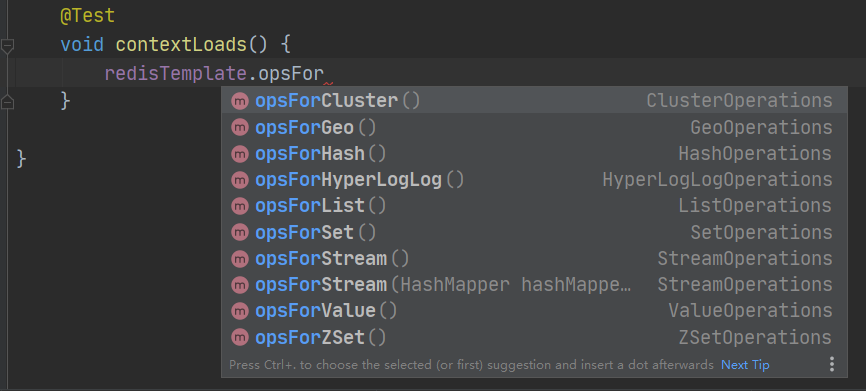

# Redis秋招学习笔记

## 一、NoSQL

### 1.1 为什么要用Nosql

2020年，大数据时代。一般的数据库无法进行分析处理了

> Mysql单机时代

从Java应用到数据库访问层(原生SQL->JDBC->持久层框架)，再到Mysql。90年代经典架构。**访问量不会很大，单个数据库足够**


瓶颈：

1. 数据量如果太大，一个Mysql放不下
2. 数据库索引，一个机器内存放不下
3. 访问量(读写混合)，一个服务器承受不了

> Memcached(缓存)+mysql+垂直拆分

**缓存可以解决读的问题**

发展过程

- 优化mysql底层接口和索引
- 文件缓存IO
- Memcached(当时最热门的技术)


> 分库分表，水平拆分(集群)

分库分表解决写的压力

- 分库，不同的数据做成不同的数据库
- 分表，同样的数据分到几个表中


> 最近的年代

定位、音乐、热榜。动态的、快速刷新的数据。

MySQL等关系型数据库很难支撑，数据量大、刷新快。

当存储一些大的文件时，如博客、图片，效率低下

需要一种数据库来处理这些文件，减小MySQL的压力

### 1.2 什么是Nosql

Not only sql泛指非关系型数据库，传统的关系型数据库已经没有办法处理web2.0，尤其是超大规模的高并发的社区。

关系型：表格，行、列

非关系型：K-V，没有固定的格式

> redis特点

1. 方便扩展，数据之间没有关系
2. 大数据量高性能（读11万/秒，写8万/秒）
3. 数据类型多样性(不需要设计数据库，随取随用)

> RDBMS和Nosql

- RDBMS
  - 结构化组织
  - sql
  - 数据和关系都存在单独的表中
  - 操作语言，定义语言
  - 严格一致性，ACID
- NoSQL
  - 不仅仅是数据
  - 没有固定的查询语言
  - 键值对，列存储，文档存储，图形数据库
  - 最终一致性
  - CAP定理、Base理论
  - 高性能，高可用，高扩展

Nosql+RDBMS真正实践

### 1.3 阿里演进

一个商品页包含了很多的信息

1. 商品的基本信息

   名称、价格、商家信息--关系型数据库

2. 商品的描述、评论

   文字较多，文档型数据库MongoDB

3. 图片

   分布式文件系统，FastDFS、TFS、GFS、Hadoop HDFS、oss

4. 商品的关键字

   用于搜索、搜索引擎 elasticsearch

5. 热门波段信息

   内存数据库、redis

6. 商品的交易、外部支付接口

   三方应用

### 1.4 Nosql的四大分类

**KV键值对**

- 新浪：**redis**
- 美团：redis + tair
- 阿里、百度：redis+memecache

**文档型数据库**

- bson格式
- **mongoDB**
  - 基于分布式文件存储的数据库，C++编写，主要用来处理大量的文档
  - mongoBD是介于关系型和非关系型数据库之间的产品

**列存储数据库**

- **HBase**
- 分布式文件系统

**图形关系数据库**

- 存放的拓扑图之间的关系
- **Neo4j**
- InfoGrid


## 二、Redis入门

### 2.1 什么是Redis

Redis（**R**emote **D**ictionary **S**erver )，即远程字典服务

是一个开源的使用ANSI C语言编写、支持网络、可基于内存亦可持久化的日志型、Key-Value数据库，并提供多种语言的API。

redis会周期性的把更新的数据写入磁盘或者把修改操作写入追加的记录文件，并且在此基础上实现了master-slave(主从)同步

Redis 是一个开源（BSD许可）的，内存中的数据结构存储系统，它可以用作数据库、缓存和消息中间件。 它支持多种类型的数据结构，如 字符串（strings）， 散列（hashes）， 列表（lists）， 集合（sets）， 有序集合（sorted sets） 与范围查询， bitmaps， hyperloglogs 和 地理空间（geospatial） 索引半径查询。 Redis 内置了 复制（replication），LUA脚本（Lua scripting）， LRU驱动事件（LRU eviction），事务（transactions） 和不同级别的 磁盘持久化（persistence）， 并通过 Redis哨兵（Sentinel）和自动 分区（Cluster）提供高可用性（high availability）。

### 2.2 Redis能干嘛

1. 内存存储、持久化，内存是断电即失。（RDB/AOF）

2. 效率高，用于高速缓存

   测试完成了50个并发执行100000个请求。设置和获取的值是一个256字节字符串。Linux box是运行Linux 2.6,这是X3320 Xeon 2.5 ghz。文本执行使用loopback接口(127.0.0.1)。结果:读的速度是110000次/s,写的速度是81000次/s 。

3. 发布订阅系统

4. 地图信息分析

5. 计时器、计数器（浏览量）

### 2.3 Redis特性

1. 开源
2. 支持多种数据类型
3. 支持多种语言
4. 支持事务
5. 持久化
6. 集群

https://www.redis.net.cn/ redis中文网

### 2.4 测试性能

redis-benchmark是一个测试压力的工具，官方自带。

```bash
$ redis-benchmark -[选项]
```


```bash
$ 测试100个连接数，100000个请求数
$ redis-benchmark -h localhost -p 6379 -c 100 -n 100000
```

```bash
====== SET ======
  100000 requests completed in 1.00 seconds
  100 parallel clients
  3 bytes payload
  keep alive: 1
  host configuration "save": 900 1 300 10 60 10000
  host configuration "appendonly": no
  multi-thread: no

98.59% <= 1 milliseconds
99.90% <= 3 milliseconds
99.96% <= 4 milliseconds
100.00% <= 4 milliseconds
100200.40 requests per second

====== GET ======
  100000 requests completed in 0.99 seconds
  100 parallel clients
  3 bytes payload
  keep alive: 1
  host configuration "save": 900 1 300 10 60 10000
  host configuration "appendonly": no
  multi-thread: no

94.29% <= 1 milliseconds
100.00% <= 2 milliseconds
100.00% <= 2 milliseconds
100603.62 requests per second
```

都是秒级的相应。

### 2.5 基本知识

`set [key] [value]`

`get [key]`

这两个是最基本的

#### 2.5.1 select

```bash
databases 16
```

默认有16个数据库，默认使用第0个，可以使用`select [index]`切换数据库

```bash
127.0.0.1:6379> set name 123
OK
127.0.0.1:6379> get name
"123"
127.0.0.1:6379> select 3
OK
127.0.0.1:6379[3]> get name
(nil)
127.0.0.1:6379[3]> select 0
OK
127.0.0.1:6379> get name
"123"
127.0.0.1:6379> 
```

看到，切换到3后，原来的name不见了，所以说每个数据库之间是独立的。

#### 2.5.2 dbsize

使用`dbsize`查看当前数据库的大小

```bash
127.0.0.1:6379> dbsize
(integer) 1
```

#### 2.5.3 keys

使用`keys [pattern]`查看指定模式的key。

pattern为匹配规则，`*`表示匹配所有，例如`123*`表示匹配123开头的key

```bash
127.0.0.1:6379> keys *
1) "sex"
2) "name"
```

#### 2.5.4 flushall

使用`flushall`，清空所有库

#### 2.5.5 flushdb

使用`flushdb`，清空当前库

### 2.6 redis单线程

redis是单线程的，基于内存操作，redis的瓶颈是根据机器的内存和网络带宽。

**redis为什么单线程还这么快？**

1. 误区1，高性能的服务器都是多线程的？
2. 误区2，多线程(CPU上下切换)一定比单线程效率高？

redis是将所有数据都放在内存中的，所以说使用单线程去操作效率就是最高的。多线程会有CPU上下切换的操作，对于内存系统而说，没有上下文切换的效率就是最高的


## 三、五大数据类型

### 3.1 redis-key

来自菜鸟教程，是redis中key相关的一些命令

| No   | 命令及描述                                                   |
| :--- | :----------------------------------------------------------- |
| 1    | [DEL key](https://www.runoob.com/redis/keys-del.html) 该命令用于在 key 存在时删除 key。 |
| 2    | [DUMP key](https://www.runoob.com/redis/keys-dump.html) 序列化给定 key ，并返回被序列化的值。 |
| 3    | [EXISTS key](https://www.runoob.com/redis/keys-exists.html) 检查给定 key 是否存在。 |
| 4    | [EXPIRE key](https://www.runoob.com/redis/keys-expire.html) seconds 为给定 key 设置过期时间，以秒计。 |
| 5    | [EXPIREAT key timestamp](https://www.runoob.com/redis/keys-expireat.html) EXPIREAT 的作用和 EXPIRE 类似，都用于为 key 设置过期时间。 不同在于 EXPIREAT 命令接受的时间参数是 UNIX 时间戳(unix timestamp)。 |
| 6    | [PEXPIRE key milliseconds](https://www.runoob.com/redis/keys-pexpire.html) 设置 key 的过期时间以毫秒计。 |
| 7    | [PEXPIREAT key milliseconds-timestamp](https://www.runoob.com/redis/keys-pexpireat.html) 设置 key 过期时间的时间戳(unix timestamp) 以毫秒计 |
| 8    | [KEYS pattern](https://www.runoob.com/redis/keys-keys.html) 查找所有符合给定模式( pattern)的 key 。 |
| 9    | [MOVE key db](https://www.runoob.com/redis/keys-move.html) 将当前数据库的 key 移动到给定的数据库 db 当中。 |
| 10   | [PERSIST key](https://www.runoob.com/redis/keys-persist.html) 移除 key 的过期时间，key 将持久保持。 |
| 11   | [PTTL key](https://www.runoob.com/redis/keys-pttl.html) 以毫秒为单位返回 key 的剩余的过期时间。 |
| 12   | [TTL key](https://www.runoob.com/redis/keys-ttl.html) 以秒为单位，返回给定 key 的剩余生存时间(TTL, time to live)。 |
| 13   | [RANDOMKEY](https://www.runoob.com/redis/keys-randomkey.html) 从当前数据库中随机返回一个 key 。 |
| 14   | [RENAME key newkey](https://www.runoob.com/redis/keys-rename.html) 修改 key 的名称 |
| 15   | [RENAMENX key newkey](https://www.runoob.com/redis/keys-renamenx.html) 仅当 newkey 不存在时，将 key 改名为 newkey 。 |
| 16   | [SCAN cursor [MATCH pattern\] [COUNT count]](https://www.runoob.com/redis/keys-scan.html) 迭代数据库中的数据库键。 |
| 17   | [TYPE key](https://www.runoob.com/redis/keys-type.html) 返回 key 所储存的值的类型。 |

### 3.2 string类型

字符串类型，有如下的命令。除了字符之外，还可以用来做数字的处理，粉丝量，计数器等操作。

| No   | 命令及描述                                                   |
| :--- | :----------------------------------------------------------- |
| 1    | [SET key value](https://www.runoob.com/redis/strings-set.html) 设置指定 key 的值 |
| 2    | [GET key](https://www.runoob.com/redis/strings-get.html) 获取指定 key 的值。 |
| 3    | [GETRANGE key start end](https://www.runoob.com/redis/strings-getrange.html) 返回 key 中字符串值的子字符 |
| 4    | [GETSET key value](https://www.runoob.com/redis/strings-getset.html) 将给定 key 的值设为 value ，并返回 key 的旧值(old value)。 |
| 5    | [GETBIT key offset](https://www.runoob.com/redis/strings-getbit.html) 对 key 所储存的字符串值，获取指定偏移量上的位(bit)。 |
| 6    | [MGET key1 [key2..\]](https://www.runoob.com/redis/strings-mget.html) 获取所有(一个或多个)给定 key 的值。 |
| 7    | [SETBIT key offset value](https://www.runoob.com/redis/strings-setbit.html) 对 key 所储存的字符串值，设置或清除指定偏移量上的位(bit)。 |
| 8    | [SETEX key seconds value](https://www.runoob.com/redis/strings-setex.html) 将值 value 关联到 key ，并将 key 的过期时间设为 seconds (以秒为单位)。 |
| 9    | [SETNX key value](https://www.runoob.com/redis/strings-setnx.html) 只有在 key 不存在时设置 key 的值。 |
| 10   | [SETRANGE key offset value](https://www.runoob.com/redis/strings-setrange.html) 用 value 参数覆写给定 key 所储存的字符串值，从偏移量 offset 开始。 |
| 11   | [STRLEN key](https://www.runoob.com/redis/strings-strlen.html) 返回 key 所储存的字符串值的长度。 |
| 12   | [MSET key value [key value ...\]](https://www.runoob.com/redis/strings-mset.html) 同时设置一个或多个 key-value 对。 |
| 13   | [MSETNX key value [key value ...\]](https://www.runoob.com/redis/strings-msetnx.html) 同时设置一个或多个 key-value 对，当且仅当所有给定 key 都不存在。 |
| 14   | [PSETEX key milliseconds value](https://www.runoob.com/redis/strings-psetex.html) 这个命令和 SETEX 命令相似，但它以毫秒为单位设置 key 的生存时间，而不是像 SETEX 命令那样，以秒为单位。 |
| 15   | [INCR key](https://www.runoob.com/redis/strings-incr.html) 将 key 中储存的数字值增一。 |
| 16   | [INCRBY key increment](https://www.runoob.com/redis/strings-incrby.html) 将 key 所储存的值加上给定的增量值（increment） 。 |
| 17   | [INCRBYFLOAT key increment](https://www.runoob.com/redis/strings-incrbyfloat.html) 将 key 所储存的值加上给定的浮点增量值（increment） 。 |
| 18   | [DECR key](https://www.runoob.com/redis/strings-decr.html) 将 key 中储存的数字值减一。 |
| 19   | [DECRBY key decrement](https://www.runoob.com/redis/strings-decrby.html) key 所储存的值减去给定的减量值（decrement） 。 |
| 20   | [APPEND key value](https://www.runoob.com/redis/strings-append.html) 如果 key 已经存在并且是一个字符串， APPEND 命令将指定的 value 追加到该 key 原来值（value）的末尾，如果不存在相当于set |

> GETRANGE

获得子串，为闭区间即下例中为取[2,4]的字符

```bash
127.0.0.1:6379> set key1 hello
OK
127.0.0.1:6379> getrange key1 2 4
"llo"
127.0.0.1:6379> getrange key1 0 -1 #-1表示全部
"hello"
```

> SETRANGE

```BASH
127.0.0.1:6379> set key2 abcdefg
OK
127.0.0.1:6379> get key2
"abcdefg"
127.0.0.1:6379> setrange key2 1 test #从第一个字符开始，把test覆盖上去
(integer) 7
127.0.0.1:6379> get key2
"atestfg"
```

> SETEX、PSETEX

SETEX以秒为单位，PSETEX以毫秒为单位

```bash
127.0.0.1:6379> setex key3 10 test
OK
127.0.0.1:6379> ttl key3
(integer) 6
127.0.0.1:6379> ttl key3
(integer) 5
127.0.0.1:6379> get key3
"test"
127.0.0.1:6379> get key3
"test"
127.0.0.1:6379> ttl key3
(integer) -2
127.0.0.1:6379> get key3
(nil)
```

> SETNX

```bash
127.0.0.1:6379> setnx key3 3
(integer) 1
127.0.0.1:6379> setnx key2 3
(integer) 0
127.0.0.1:6379> get key3
"3"
127.0.0.1:6379> get key2 # 可以看到没有覆盖掉原来的值
"atestfg"
```

> GETSET

如果存在替换值，返回旧值，如果不存在，和set一样，且返回nil

```bash
127.0.0.1:6379> getset key2 abc
"atestfg"
127.0.0.1:6379> getset key4 abc
(nil)
127.0.0.1:6379> get key4
"abc"
```

> MSET/MGET

一次性存入、读取多个值

```bash
127.0.0.1:6379> mset key1 a key2 b key3 c key4 d
OK
127.0.0.1:6379> keys *
1) "key4"
2) "key3"
3) "key2"
4) "key1"

127.0.0.1:6379> mget key1 key2 key3 key4
1) "a"
2) "b"
3) "c"
4) "d"
```

> MSETNX

set多个键值对，如果其中任意一个已存在，则整个命令都不能插入数据，是一个原子性的操作，要么一起成功，要么一起失败

```bash
127.0.0.1:6379> msetnx key6 f key5 x key7 h
(integer) 0
127.0.0.1:6379> keys *
1) "key3"
2) "key4"
3) "key1"
4) "key2"
5) "key5"
```

> INCR 命令

播放量、浏览量等等可以使用这个

```bash
127.0.0.1:6379> set key2 0
OK
127.0.0.1:6379> incr key2
(integer) 1
127.0.0.1:6379> get key2
"1"
```

> DECR命令

```bash
127.0.0.1:6379> decr key2
(integer) 0
127.0.0.1:6379> get key2
"0"
```

> INCRBY命令

按一定步长增加，DECRBY同理

```bash
127.0.0.1:6379> incrby key2 20
(integer) 20
127.0.0.1:6379> get key2
"20"
```

> 存储对象

```bash
#使用json的格式存储对象
127.0.0.1:6379> set key1 {name:abc,age:2}
OK
127.0.0.1:6379> get key1
"{name:abc,age:2}"

#使用user:{id}:{field}格式存储对象
127.0.0.1:6379> mset user:1:name abc user:1:age 2
OK
127.0.0.1:6379> keys *
1) "user:1:name"
2) "user:1:age"
```

### 3.3 list类型

列表，在redis中可以用做队列、栈等，相当于一个链表，一个列表最多可以包含 232 - 1 个元素 (4294967295, 每个列表超过40亿个元素)。

| No   | 命令及描述                                                   |
| :--- | :----------------------------------------------------------- |
| 1    | [BLPOP key1 [key2 \] timeout](https://www.runoob.com/redis/lists-blpop.html) 移出并获取列表的第一个元素， 如果列表没有元素会阻塞列表直到等待超时或发现可弹出元素为止。 |
| 2    | [BRPOP key1 [key2 \] timeout](https://www.runoob.com/redis/lists-brpop.html) 移出并获取列表的最后一个元素， 如果列表没有元素会阻塞列表直到等待超时或发现可弹出元素为止。 |
| 3    | [BRPOPLPUSH source destination timeout](https://www.runoob.com/redis/lists-brpoplpush.html) 从列表中弹出一个值，将弹出的元素插入到另外一个列表中并返回它； 如果列表没有元素会阻塞列表直到等待超时或发现可弹出元素为止。 |
| 4    | [LINDEX key index](https://www.runoob.com/redis/lists-lindex.html) 通过索引获取列表中的元素 |
| 5    | [LINSERT key BEFORE\|AFTER pivot value](https://www.runoob.com/redis/lists-linsert.html) 在列表的元素前或者后插入元素 |
| 6    | [LLEN key](https://www.runoob.com/redis/lists-llen.html) 获取列表长度 |
| 7    | [LPOP key](https://www.runoob.com/redis/lists-lpop.html) 移出并获取列表的第一个元素 |
| 8    | [LPUSH key value1 [value2\]](https://www.runoob.com/redis/lists-lpush.html) 将一个或多个值插入到列表头部 |
| 9    | [LPUSHX key value](https://www.runoob.com/redis/lists-lpushx.html) 将一个值插入到已存在的列表头部 |
| 10   | [LRANGE key start stop](https://www.runoob.com/redis/lists-lrange.html) 获取列表指定范围内的元素 |
| 11   | [LREM key count value](https://www.runoob.com/redis/lists-lrem.html) 移除列表元素 |
| 12   | [LSET key index value](https://www.runoob.com/redis/lists-lset.html) 通过索引设置列表元素的值，**如果列表不存在，不能使用** |
| 13   | [LTRIM key start stop](https://www.runoob.com/redis/lists-ltrim.html) 对一个列表进行修剪(trim)，就是说，让列表只保留指定区间内的元素，不在指定区间之内的元素都将被删除。 |
| 14   | [RPOP key](https://www.runoob.com/redis/lists-rpop.html) 移除列表的最后一个元素，返回值为移除的元素。 |
| 15   | [RPOPLPUSH source destination](https://www.runoob.com/redis/lists-rpoplpush.html) 移除列表的最后一个元素，并将该元素添加到另一个列表并返回 |
| 16   | [RPUSH key value1 [value2\]](https://www.runoob.com/redis/lists-rpush.html) 在列表中添加一个或多个值 |
| 17   | [RPUSHX key value](https://www.runoob.com/redis/lists-rpushx.html) 为已存在的列表添加值 |

> LPUSH/RPUSH

LPUSH每次添加元素都添加在list的左边，RPUSH每次添加元素都添加在list的右边

```bash
127.0.0.1:6379> lpush list 1 2 3 4 5 6 7 8 9 0
(integer) 10
127.0.0.1:6379> lrange list 0 -1
 1) "0"
 2) "9"
 3) "8"
 4) "7"
 5) "6"
 6) "5"
 7) "4"
 8) "3"
 9) "2"
10) "1"
127.0.0.1:6379> rpush list 11 12
(integer) 12
127.0.0.1:6379> lrange list 0 -1
 1) "0"
 2) "9"
 3) "8"
 4) "7"
 5) "6"
 6) "5"
 7) "4"
 8) "3"
 9) "2"
10) "1"
11) "11"
12) "12"
```

> LPUSHX/RPUSHX

和LPUSH当key存在时，没有区别，若key不存在，LPUSHX不会插入元素

```bash
127.0.0.1:6379> lpushx list1 0 1 2
(integer) 0
127.0.0.1:6379> keys *
1) "list"
```

> LPOP/RPOP

LPOP移除头部第一个元素，RPOP移除尾部的第一个元素

```bash
127.0.0.1:6379> lpop list
"0"
127.0.0.1:6379> rpop list
"12"
127.0.0.1:6379> lrange list 0 -1
 1) "9"
 2) "8"
 3) "7"
 4) "6"
 5) "5"
 6) "4"
 7) "3"
 8) "2"
 9) "1"
10) "11"
```

> LREM

当指定移除的数量大于存在的数量时，就全部移除该元素

```bash
127.0.0.1:6379> lrem list 1 11
(integer) 1
127.0.0.1:6379> lrange list 0 -1
1) "9"
2) "8"
3) "7"
4) "6"
5) "5"
6) "4"
7) "3"
8) "2"
9) "1"

127.0.0.1:6379> lrem list 2 2
(integer) 1
127.0.0.1:6379> lrange list 0 -1
1) "9"
2) "8"
3) "7"
4) "6"
5) "5"
6) "4"
7) "3"
8) "1"
```

> LTRIM

保留一个闭区间

```bash
127.0.0.1:6379> lrange list 0 -1
1) "9"
2) "8"
3) "7"
4) "6"
5) "5"
6) "4"
7) "3"
8) "1"
127.0.0.1:6379> ltrim list 1 5
OK
127.0.0.1:6379> lrange list 0 -1
1) "8"
2) "7"
3) "6"
4) "5"
5) "4"
```

> RPOPLPUSH

取出source中的末尾最后一个，放入一个新列表中，**这个新列表可以是已存在的，放入新列表的头部**

```bash
127.0.0.1:6379> rpoplpush list list1
"4"
127.0.0.1:6379> lrange list 0 -1
1) "8"
2) "7"
3) "6"
4) "5"
127.0.0.1:6379> lrange list1 0 -1
1) "4"
```

> LINSERT

在指定元素的前/后插入值，**如果参考值不存在，就不插入**

```bash
127.0.0.1:6379> linsert list before 7 8
(integer) 4
127.0.0.1:6379> lrange list 0 -1
1) "9"
2) "8"
3) "7"
4) "6"

127.0.0.1:6379> linsert list before 5 8
(integer) -1
127.0.0.1:6379> lrange list 0 -1
1) "9"
2) "8"
3) "7"
4) "6"
```

> BLPOP/BRPOP/BRPOPLPUSH

这三个都是用于读取元素，如果有元素可以弹出，则和普通的LPOP没区别。**当没有元素时，会等待超时或者有元素可弹**。

```bash
127.0.0.1:6379> blpop list2 2
(nil)
(2.06s)
```

> 小结

- 可以看成一个链表
- 当list为空时，这个list也就不存在了
- 可以用做消息队列，类似MQ

### 3.4 set类型

Redis 中集合是通过哈希表实现的，所以添加，删除，查找的复杂度都是 O(1)。

| No   | 命令及描述                                                   |
| :--- | :----------------------------------------------------------- |
| 1    | [SADD key member1 [member2\]](https://www.runoob.com/redis/sets-sadd.html) 向集合添加一个或多个成员 |
| 2    | [SCARD key](https://www.runoob.com/redis/sets-scard.html) 获取集合的成员数 |
| 3    | [SDIFF key1 [key2\]](https://www.runoob.com/redis/sets-sdiff.html) 返回第一个集合与其他集合之间的差异。 |
| 4    | [SDIFFSTORE destination key1 [key2\]](https://www.runoob.com/redis/sets-sdiffstore.html) 返回给定所有集合的差集并存储在 destination 中 |
| 5    | [SINTER key1 [key2\]](https://www.runoob.com/redis/sets-sinter.html) 返回给定所有集合的交集 |
| 6    | [SINTERSTORE destination key1 [key2\]](https://www.runoob.com/redis/sets-sinterstore.html) 返回给定所有集合的交集并存储在 destination 中 |
| 7    | [SISMEMBER key member](https://www.runoob.com/redis/sets-sismember.html) 判断 member 元素是否是集合 key 的成员 |
| 8    | [SMEMBERS key](https://www.runoob.com/redis/sets-smembers.html) 返回集合中的所有成员 |
| 9    | [SMOVE source destination member](https://www.runoob.com/redis/sets-smove.html) 将 member 元素从 source 集合移动到 destination 集合 |
| 10   | [SPOP key](https://www.runoob.com/redis/sets-spop.html) 移除并返回集合中的一个随机元素 |
| 11   | [SRANDMEMBER key [count\]](https://www.runoob.com/redis/sets-srandmember.html) 返回集合中一个或多个随机数 |
| 12   | [SREM key member1 [member2\]](https://www.runoob.com/redis/sets-srem.html) 移除集合中一个或多个成员 |
| 13   | [SUNION key1 [key2\]](https://www.runoob.com/redis/sets-sunion.html) 返回所有给定集合的并集 |
| 14   | [SUNIONSTORE destination key1 [key2\]](https://www.runoob.com/redis/sets-sunionstore.html) 所有给定集合的并集存储在 destination 集合中 |
| 15   | [SSCAN key cursor [MATCH pattern\] [COUNT count]](https://www.runoob.com/redis/sets-sscan.html) 迭代集合中的元素 |

> SADD/SMEMBERS

set不会有重复的值

```bash
127.0.0.1:6379> sadd set 1 2 3 4 5 6 1
(integer) 6
127.0.0.1:6379> smembers set
1) "1"
2) "2"
3) "3"
4) "4"
5) "5"
6) "6"
```

> SISMEMBER

```bash
127.0.0.1:6379> sismember set 6
(integer) 1
127.0.0.1:6379> sismember set 7
(integer) 0
```

> SREM/SPOP

SREM移除一个或多个指定元素，没有则不移除

```bash
127.0.0.1:6379> srem set 5 6
(integer) 2
127.0.0.1:6379> smembers set
1) "1"
2) "2"
3) "3"
4) "4"
```

SPOP移除随意指定数量的元素

```bash
127.0.0.1:6379> spop set 1
1) "1"
127.0.0.1:6379> spop set 1
1) "2"
127.0.0.1:6379> spop set 1
1) "4"
```

> SRANDMEMBER

获得随机指定数量的元素

```bash
127.0.0.1:6379> SRANDMEMBER SET 3
1) "6"
2) "3"
3) "1"
127.0.0.1:6379> SRANDMEMBER SET 3
1) "3"
2) "2"
3) "5"
```

> SMOVE

将set中的一个元素移动到另一个set中

```bash
127.0.0.1:6379> smove set set1 1
(integer) 1
127.0.0.1:6379> smembers set
1) "2"
2) "3"
3) "4"
4) "5"
5) "6"
127.0.0.1:6379> smembers set1
1) "1"

127.0.0.1:6379> smove set set1 5
(integer) 1
127.0.0.1:6379> smembers set
1) "2"
2) "3"
3) "4"
4) "6"
127.0.0.1:6379> smembers set1
1) "1"
2) "5"
```

> SUNION/SINTER/SDIFF

SUNION，返回几个set的并集

```bash
127.0.0.1:6379> smembers set
1) "2"
2) "3"
3) "4"
4) "6"
127.0.0.1:6379> smembers set1
1) "1"
2) "2"
3) "4"
4) "5"
127.0.0.1:6379> sunion set set1
1) "1"
2) "2"
3) "3"
4) "4"
5) "5"
6) "6"
```

SINTER，返回几个set的交集

```bash
127.0.0.1:6379> smembers set
1) "2"
2) "3"
3) "4"
4) "6"
127.0.0.1:6379> smembers set1
1) "1"
2) "2"
3) "4"
4) "5"
127.0.0.1:6379> sinter set set1
1) "2"
2) "4"
```

SDIFF，返回第一个set和其他set不同的元素

```bash
127.0.0.1:6379> smembers set
1) "2"
2) "3"
3) "4"
4) "6"
127.0.0.1:6379> smembers set1
1) "1"
2) "2"
3) "4"
4) "5"
127.0.0.1:6379> sdiff set set1
1) "3"
2) "6"
```

还有三个命令是把这些结果放到另一个集合中，不再测试了

### 3.5 hash类型

hash类型相当于一个map，其key是唯一的。Redis 中每个 hash 可以存储 232 - 1 键值对（40多亿）

| No   | 命令及描述                                                   |
| :--- | :----------------------------------------------------------- |
| 1    | [HDEL key field1 [field2\]](https://www.runoob.com/redis/hashes-hdel.html) 删除一个或多个哈希表字段 |
| 2    | [HEXISTS key field](https://www.runoob.com/redis/hashes-hexists.html) 查看哈希表 key 中，指定的字段是否存在。 |
| 3    | [HGET key field](https://www.runoob.com/redis/hashes-hget.html) 获取存储在哈希表中指定字段的值。 |
| 4    | [HGETALL key](https://www.runoob.com/redis/hashes-hgetall.html) 获取在哈希表中指定 key 的所有字段和值 |
| 5    | [HINCRBY key field increment](https://www.runoob.com/redis/hashes-hincrby.html) 为哈希表 key 中的指定字段的整数值加上增量 increment 。 |
| 6    | [HINCRBYFLOAT key field increment](https://www.runoob.com/redis/hashes-hincrbyfloat.html) 为哈希表 key 中的指定字段的浮点数值加上增量 increment 。 |
| 7    | [HKEYS key](https://www.runoob.com/redis/hashes-hkeys.html) 获取所有哈希表中的字段 |
| 8    | [HLEN key](https://www.runoob.com/redis/hashes-hlen.html) 获取哈希表中字段的数量 |
| 9    | [HMGET key field1 [field2\]](https://www.runoob.com/redis/hashes-hmget.html) 获取所有给定字段的值 |
| 10   | [HMSET key field1 value1 [field2 value2 \]](https://www.runoob.com/redis/hashes-hmset.html) 同时将多个 field-value (域-值)对设置到哈希表 key 中。 |
| 11   | [HSET key field value](https://www.runoob.com/redis/hashes-hset.html) 将哈希表 key 中的字段 field 的值设为 value 。 |
| 12   | [HSETNX key field value](https://www.runoob.com/redis/hashes-hsetnx.html) 只有在字段 field 不存在时，设置哈希表字段的值。 |
| 13   | [HVALS key](https://www.runoob.com/redis/hashes-hvals.html) 获取哈希表中所有值。 |
| 14   | [HSCAN key cursor [MATCH pattern\] [COUNT count]](https://www.runoob.com/redis/hashes-hscan.html) 迭代哈希表中的键值对。 |

> HSET/HGET

HSET当key存在时，会进行替换

```bash
127.0.0.1:6379> hset hash name1 123 name2 1234 name3 123
(integer) 3
127.0.0.1:6379> hset hash name1 123
(integer) 0
127.0.0.1:6379> hget hash name1
"123"
```

> HSETNX

当key存在时，不替换

```bash
127.0.0.1:6379> hsetnx hash name1 123
(integer) 0
127.0.0.1:6379> hget hash name1
"123456"
```

> HMSET/HMGET

和HSET/HGET类似，HMSET/HMGET支持多个值操作

> HGETALL/HKEYS/HVALS

HGETALL获得所有的键值对，HKEYS获得所有的键，HVALS获取所有的值

```bash
127.0.0.1:6379> hgetall hash
1) "name1"
2) "123"
3) "name2"
4) "1234"
5) "name3"
6) "123"
127.0.0.1:6379> hkeys hash
1) "name1"
2) "name2"
3) "name3"
127.0.0.1:6379> hvals hash
1) "123"
2) "1234"
3) "123"
```

> HDEL

当存在key时，删除，不存在则不操作

```bash
127.0.0.1:6379> hdel hash name1 name4
(integer) 1
127.0.0.1:6379> hkeys hash
1) "name2"
2) "name3"
```

> HINCRBY/HINCRBYFLOAT

给值为数值的值加上一个整型数值(浮点不可以)

```bash
127.0.0.1:6379> hset hash name 12
(integer) 1
127.0.0.1:6379> hincrby hash name 4
(integer) 16
127.0.0.1:6379> hget hash name
"16"
```

HINCRBYFLOAT给一个值为数值的值加上一个浮点型的数值(整型也可以)

```bash
127.0.0.1:6379> hincrbyfloat hash name 4.2
"20.2"
127.0.0.1:6379> hget hash name
"20.2"
127.0.0.1:6379> hincrbyfloat hash name 4
"24.2"
```

可以做用户信息的保存，经常变动的信息等。hash更适合于对象的存储，string更适合字符串。

### 3.6 zset类型

不同的是每个元素都会关联一个double类型的分数。redis正是通过分数来为集合中的成员进行从小到大的排序。有序集合的成员是唯一的,但分数(score)却可以重复。

| No   | 命令及描述                                                   |
| :--- | :----------------------------------------------------------- |
| 1    | [ZADD key score1 member1 [score2 member2\]](https://www.runoob.com/redis/sorted-sets-zadd.html) 向有序集合添加一个或多个成员，或者更新已存在成员的分数 |
| 2    | [ZCARD key](https://www.runoob.com/redis/sorted-sets-zcard.html) 获取有序集合的成员数 |
| 3    | [ZCOUNT key min max](https://www.runoob.com/redis/sorted-sets-zcount.html) 计算在有序集合中指定区间分数的成员数 |
| 4    | [ZINCRBY key increment member](https://www.runoob.com/redis/sorted-sets-zincrby.html) 有序集合中对指定成员的分数加上增量 increment |
| 5    | [ZINTERSTORE destination numkeys key [key ...\]](https://www.runoob.com/redis/sorted-sets-zinterstore.html) 计算给定的一个或多个有序集的交集并将结果集存储在新的有序集合 key 中 |
| 6    | [ZLEXCOUNT key min max](https://www.runoob.com/redis/sorted-sets-zlexcount.html) 在有序集合中计算指定字典区间内成员数量 |
| 7    | [ZRANGE key start stop [WITHSCORES\]](https://www.runoob.com/redis/sorted-sets-zrange.html) 通过索引区间返回有序集合指定区间内的成员 |
| 8    | [ZRANGEBYLEX key min max [LIMIT offset count\]](https://www.runoob.com/redis/sorted-sets-zrangebylex.html) 通过字典区间返回有序集合的成员 |
| 9    | [ZRANGEBYSCORE key min max [WITHSCORES\] [LIMIT]](https://www.runoob.com/redis/sorted-sets-zrangebyscore.html) 通过分数返回有序集合指定区间内的成员 |
| 10   | [ZRANK key member](https://www.runoob.com/redis/sorted-sets-zrank.html) 返回有序集合中指定成员的索引 |
| 11   | [ZREM key member [member ...\]](https://www.runoob.com/redis/sorted-sets-zrem.html) 移除有序集合中的一个或多个成员 |
| 12   | [ZREMRANGEBYLEX key min max](https://www.runoob.com/redis/sorted-sets-zremrangebylex.html) 移除有序集合中给定的字典区间的所有成员 |
| 13   | [ZREMRANGEBYRANK key start stop](https://www.runoob.com/redis/sorted-sets-zremrangebyrank.html) 移除有序集合中给定的排名区间的所有成员 |
| 14   | [ZREMRANGEBYSCORE key min max](https://www.runoob.com/redis/sorted-sets-zremrangebyscore.html) 移除有序集合中给定的分数区间的所有成员 |
| 15   | [ZREVRANGE key start stop [WITHSCORES\]](https://www.runoob.com/redis/sorted-sets-zrevrange.html) 返回有序集中指定区间内的成员，通过索引，分数从高到低 |
| 16   | [ZREVRANGEBYSCORE key max min [WITHSCORES\]](https://www.runoob.com/redis/sorted-sets-zrevrangebyscore.html) 返回有序集中指定分数区间内的成员，分数从高到低排序 |
| 17   | [ZREVRANK key member](https://www.runoob.com/redis/sorted-sets-zrevrank.html) 返回有序集合中指定成员的排名，有序集成员按分数值递减(从大到小)排序 |
| 18   | [ZSCORE key member](https://www.runoob.com/redis/sorted-sets-zscore.html) 返回有序集中，成员的分数值 |
| 19   | [ZUNIONSTORE destination numkeys key [key ...\]](https://www.runoob.com/redis/sorted-sets-zunionstore.html) 计算给定的一个或多个有序集的并集，并存储在新的 key 中 |
| 20   | [ZSCAN key cursor [MATCH pattern\] [COUNT count]](https://www.runoob.com/redis/sorted-sets-zscan.html) 迭代有序集合中的元素（包括元素成员和元素分值） |

> ZADD/ZRANGE

```bash
127.0.0.1:6379> zadd set 1 a 2 b 3 c
(integer) 3
127.0.0.1:6379> zrange set 0 -1 withscores
1) "a"
2) "1"
3) "b"
4) "2"
5) "c"
6) "3"
```

> ZRANGEBYSCORE

按照score排序

```bash
127.0.0.1:6379> zrangebyscore set 0 4 
1) "a"
2) "b"
3) "c"
4) "e"
```

> ZCARD/ZCOUNT

```bash
127.0.0.1:6379> zcard set #集合中的元素个数
(integer) 5
127.0.0.1:6379> zcount set 1 2 #集合分数区间内的元素个数，闭区间
(integer) 2
```

> ZINCRBY

给指定元素的分数加一个值

```bash
127.0.0.1:6379> zincrby set 3 a
"4"
127.0.0.1:6379> zrangebyscore set -inf +inf
1) "b"
2) "c"
3) "a"
4) "e"
5) "d"
```

带权操作、topN


## 四、三大特殊类型

### 4.1 geospatial地理位置

定位，附近的人，距离计算

| No   | 描述                                           |
| ---- | ---------------------------------------------- |
| 1    | GEOADD 新增地理位置                            |
| 2    | GEODIST 查看两个位置之间的距离                 |
| 3    | GEOHASH 查看hash值                             |
| 4    | GEOPOS 查看某个位置的经纬度                    |
| 5    | GEORADIUS 获得经纬度为点，获得半径内的城市     |
| 6    | GEORADIUSBYMEMBER 以成员为点，获得半径内的城市 |

> GEOADD

```bash
127.0.0.1:6379> geoadd china:city 120.12 30.29 hangzhou
(integer) 1
127.0.0.1:6379> geoadd china:city 121.47 31.23 shanghai
(integer) 1
```

> GEOPOS

获得存入的经纬度

```bash
127.0.0.1:6379> geopos china:city hangzhou shanghai
1) 1) "120.11999756097793579"
   2) "30.29000023253814078"
2) 1) "121.47000163793563843"
   2) "31.22999903975783553"
```

> GEODIST

km 千米，m米，mi 英尺，ft 英里

```bash
127.0.0.1:6379> geodist china:city hangzhou shanghai km
"166.0705"
```

> GEORADIUS

```bash
127.0.0.1:6379> georadius china:city 110 30 1000 km
1) "hangzhou"
127.0.0.1:6379> georadius china:city 110 30 1500 km
1) "hangzhou"
2) "shanghai"
```

> GEORADIUSBYMEMBER

```bash
127.0.0.1:6379> georadiusbymember china:city hangzhou 1000 km
1) "hangzhou"
2) "shanghai"
```

> 原理

```bash
127.0.0.1:6379> type china:city
zset

127.0.0.1:6379> zrem china:city hangzhou
(integer) 1
127.0.0.1:6379> zrange china:city 0 -1
1) "shanghai"
```

可以看到，这个地理位置，底层是zset，因此可以使用zset的命令操作地理位置

### 4.2 HyperLogLog

> 什么是基数?

比如数据集 {1, 3, 5, 7, 5, 7, 8}， 那么这个数据集的基数集为 {1, 3, 5 ,7, 8}, 基数(不重复元素)为5。 基数估计就是在误差可接受的范围内，快速计算基数。

> 应用场景

网站的UV(user view)，一个人多次浏览只计算一次。

有如下命令

| 序号 | 命令及描述                                                   |
| :--- | :----------------------------------------------------------- |
| 1    | [PFADD key element [element ...\]](https://www.runoob.com/redis/hyperloglog-pfadd.html) 添加指定元素到 HyperLogLog 中。 |
| 2    | [PFCOUNT key [key ...\]](https://www.runoob.com/redis/hyperloglog-pfcount.html) 返回给定 HyperLogLog 的基数估算值。 |
| 3    | [PFMERGE destkey sourcekey [sourcekey ...\]](https://www.runoob.com/redis/hyperloglog-pfmerge.html) 将多个 HyperLogLog 合并为一个 HyperLogLog |

```bash
127.0.0.1:6379> pfadd mypf a b a c d e f
(integer) 1
127.0.0.1:6379> pfcount mypf
(integer) 6
127.0.0.1:6379> pfadd myfp a z x c b m
(integer) 1
127.0.0.1:6379> pfcount myfp
(integer) 6
127.0.0.1:6379> pfmerge mykey mypf myfp
OK
127.0.0.1:6379> pfcount mykey
(integer) 9
```

### 4.3 bitmap

> 位存储

活跃信息、不活跃信息，登录、未登录，打卡、未打卡

| 序号 | 描述                 |
| ---- | -------------------- |
| 1    | SETBIT set位         |
| 2    | GETBIT 获得位        |
| 3    | BITCOUNT 统计1的数量 |

> SETBIT

```bash
127.0.0.1:6379> setbit login 0 1 
(integer) 0
127.0.0.1:6379> setbit login 1 1
(integer) 0
127.0.0.1:6379> setbit login 2 0
(integer) 0
```

> GITBIT

```bash
127.0.0.1:6379> getbit login 0
(integer) 1
```

> BITCOUNT

```bash
127.0.0.1:6379> BITCOUNT login
(integer) 2
127.0.0.1:6379> BITCOUNT login 0 1
(integer) 2
127.0.0.1:6379> bitcount login 1 2
(integer) 0
```


## 五、事务

Redis不同于关系型数据库

- 单条Redis命令是保证原子性的，但是Redis的事务不保证原子性。
- Redis事务没有隔离性，所有命令在事务中并没有执行，只有发起执行命令的时候才会执行

### 5.1 什么叫事务

事务本质上是：一组命令的集合。

原本是3条独立的set命令，现在需要放到一个块中，一起执行，出错了执行相应的策略。

```bash
$ set
$ set
$ set
###################
#事务
----队列set set set -----
```

事务具有一次性，顺序性，排他性，执行一些命令。

### 5.2 Redis事务命令

1. 开启事务

   `MULTI`命令用于标记一个事务块开始

2. 命令入队

   这里即正常的使用第三章、第四章的命令，区别是：原本的命令是立即给出结果，事务中会等到执行事务命令后一起执行。

3. 执行事务

   `EXEC`命令，用于执行事务

   ```bash
   127.0.0.1:6379> multi
   OK
   127.0.0.1:6379> set user:1:name nao
   QUEUED
   127.0.0.1:6379> set user:2:name niao
   QUEUED
   127.0.0.1:6379> get user:3:name
   QUEUED
   127.0.0.1:6379> get user:2:name
   QUEUED
   127.0.0.1:6379> exec
   1) OK
   2) OK
   3) (nil)
   4) "niao"
   ```

4. 删除事务

   `DISCARD`命令，用于取消事务

   ```bash
   127.0.0.1:6379> multi
   OK
   127.0.0.1:6379> get user:4:name
   QUEUED
   127.0.0.1:6379> discard
   OK
   127.0.0.1:6379> get user:4:name
   "zan"
   ```


### 5.3 Redis事务的异常

> 编译错误

所谓编译错误，指的是命令错误，即如原本的get命令，输入为getg命令或者原本get命令的参数为 get key，写成了get name 1，都是命令错误。即命令本身错误和命令参数列表错误。

```bash
127.0.0.1:6379> multi
OK
127.0.0.1:6379> getg key 13
(error) ERR unknown command `getg`, with args beginning with: `key`, `13`, 
127.0.0.1:6379> get key
QUEUED
127.0.0.1:6379> exec
(error) EXECABORT Transaction discarded because of previous errors.
```

这样的情况，整个事务都不会执行

> 运行错误

语法错误，incr只能对数值操作，这样就是一个运行错误

```bash
127.0.0.1:6379> multi
OK
127.0.0.1:6379> set key v2
QUEUED
127.0.0.1:6379> incr key
QUEUED
127.0.0.1:6379> set key1 v1
QUEUED
127.0.0.1:6379> exec
1) OK
2) (error) ERR value is not an integer or out of range
3) OK
```

这样的情况，只会抛出一个异常，其他的命令依旧会执行，这就是所谓的不保证原子性。

### 5.4 监控

使用watch可以实现乐观锁。

> 正常情况

```bash
127.0.0.1:6379> set money 100
OK
127.0.0.1:6379> set out 0
OK
127.0.0.1:6379> watch money
OK
127.0.0.1:6379> multi
OK
127.0.0.1:6379> decrby money 20
QUEUED
127.0.0.1:6379> incrby out 20
QUEUED
127.0.0.1:6379> exec
1) (integer) 80
2) (integer) 20
```

> 错误情况

使用另一个线程修改值后，事务将无法提交

另外可以使用`unwatch`命令放弃监视，再重新监视后即可重新操作。


## 六、Jedis

### 6.1 什么是Jedis

是redis官方推荐的java连接开发工具，使用java操作redis，必须学会jedis。

### 6.2 如何使用

> 导入依赖

```xml
<dependency>
    <groupId>redis.clients</groupId>
    <artifactId>jedis</artifactId>
    <version>3.3.0</version>
</dependency>
```

> 使用

```java
import redis.clients.jedis.Jedis;

public class TestPing {
    public static void main(String[] args) {
        Jedis jedis = new Jedis("xxx.xxx.xxx.xxx", 6379);//通过Jedis类的构造创建连接
        jedis.auth("123456");
        System.out.println(jedis.ping());
    }
}
```

> 注意点

如果是远程连接，需要在redis.conf中修改配置，把bind修改为0.0.0.0，最好再设置一个密码，然后使用auth方法输入密码，阿里云的话，端口别忘记开放！

然后jedis里的方法，和三四章一致，不多说了。

### 6.3 jedis事务

```java
import com.alibaba.fastjson.JSONObject;
import redis.clients.jedis.Jedis;
import redis.clients.jedis.Transaction;

public class TestPing {
    public static void main(String[] args) {
        Jedis jedis = new Jedis("xxx.xxx.xxx.xxx", 6379);
        jedis.auth("123456");
        
        Transaction multi = jedis.multi();//开启事务
        JSONObject jsonObject = new JSONObject();
        jsonObject.put("hello","world");
        jsonObject.put("name","ddj");

        String result = jsonObject.toJSONString();

        try {
            multi.set("user1",result);
            multi.set("user2",result);
            multi.exec();//执行
            System.out.println(jedis.get("user1"));
        } catch (Exception e) {
            multi.discard();//出现问题，取消事务
            e.printStackTrace();
        } finally {
            jedis.close();
        }
    }
}
```


## 七、整合Spring Boot

Spring Boot，对于数据库的操作，都是使用Spring Data来整合的，Redis也一样。

在Spring Boot 2.x后，jedis被替换成了lettuce

### 7.1 Jedis vs lettuce

Jedis：采用了直连，多个线程操作是不安全的，需要使用jedis pool连接池，类似BIO

lettuce：采用Netty，实例可以在多个线程共享，不存在线程不安全情况，减少线程数据，类似NIO

### 7.2 源码分析

```java
public class RedisAutoConfiguration {
   @Bean
   @ConditionalOnMissingBean(name = "redisTemplate")//没有这个bean时才生效，可以自定义
   public RedisTemplate<Object, Object> redisTemplate(RedisConnectionFactory redisConnectionFactory)
         throws UnknownHostException {
      RedisTemplate<Object, Object> template = new RedisTemplate<>();
      template.setConnectionFactory(redisConnectionFactory);
      return template;
   }

   @Bean
   @ConditionalOnMissingBean
   //String是最常用的
   public StringRedisTemplate stringRedisTemplate(RedisConnectionFactory redisConnectionFactory)
         throws UnknownHostException {
      StringRedisTemplate template = new StringRedisTemplate();
      template.setConnectionFactory(redisConnectionFactory);
      return template;
   }
}
```

### 7.3 使用

```yaml
spring:
  redis:
    host: xxx.xxx.xxx.xxx
    port: 6379
    password: 123456
```



对于不同的数据类型，使用不同的方法即可，再往后就是一样的。

```java
@Test
void contextLoads() {
    RedisConnection connection = Objects.requireNonNull(redisTemplate.getConnectionFactory()).getConnection();
    connection.flushAll();
    redisTemplate.opsForValue().set("name","ddj");
    System.out.println(redisTemplate.opsForValue().get("name1"));
}
```

通过调用方法来实现Redis的访问。

### 7.4 自定义Template

在默认的Template中，使用的是JDK的序列化器，这会导致编码出现问题。

```java
if (defaultSerializer == null) {

   defaultSerializer = new JdkSerializationRedisSerializer(
         classLoader != null ? classLoader : this.getClass().getClassLoader());
}
```

在代码中存储了key为name的键值对，但是到了redis-cli中且不是

```bash
127.0.0.1:6379> keys *
1) "\xac\xed\x00\x05t\x00\x04name"
```

为此我们需要自定义Template来解决这些问题。

> 序列化

直接存储对象必须先序列化，所以通常我们的pojo都需要序列化

```java
@Test
void test() throws JsonProcessingException {
    User user = new User("ddj", 3);
    String json = new ObjectMapper().writeValueAsString(user);
    redisTemplate.opsForValue().set("user",user);
    System.out.println(redisTemplate.opsForValue().get("user"));
}
```

```bash
Caused by: org.springframework.core.serializer.support.SerializationFailedException: Failed to serialize object using DefaultSerializer; nested exception is java.lang.IllegalArgumentException: DefaultSerializer requires a Serializable payload but received an object of type [com.hkb.redis.pojo.User]
```

> 自定义Template

我们的Template默认采用了jdk的编码，但是我们在上面已经看过了，这种方式，java程序可以读，但是在redis-cli中无法正常读写，意味着对于其他语言来说，很可能也无法正常读写

我们对于value采用json的序列化，key采用string的序列化，因为String-Object是用的最多的

```java
@Component
public class RedisConfig {
    @Bean
    public RedisTemplate<String,Object> redisTemplate(RedisConnectionFactory redisConnectionFactory){
        RedisTemplate<String, Object> template = new RedisTemplate<>();
        template.setConnectionFactory(redisConnectionFactory);

        //Json序列化方式
        Jackson2JsonRedisSerializer<Object> serializer = new Jackson2JsonRedisSerializer<>(Object.class);
        ObjectMapper mapper = new ObjectMapper();
        mapper.setVisibility(PropertyAccessor.ALL, JsonAutoDetect.Visibility.ANY);
        mapper.activateDefaultTyping(mapper.getPolymorphicTypeValidator());
        serializer.setObjectMapper(mapper);

        //String序列化
        StringRedisSerializer stringRedisSerializer = new StringRedisSerializer();

        template.setKeySerializer(stringRedisSerializer);
        template.setHashKeySerializer(stringRedisSerializer);
        template.setValueSerializer(serializer);
        template.setHashValueSerializer(serializer);
        template.afterPropertiesSet();

        return template;
    }
}
```

```bash
127.0.0.1:6379> keys *
1) "user"
```

### 7.5 工具类

因为redisTemplate比较的麻烦，通常开发中会封装一个工具类。


## 八、Redis.conf基本配置

我们就是通过这个配置文件启动的redis-server

### 8.1 单位

单位对大小写不敏感

```bash
# 1k => 1000 bytes
# 1kb => 1024 bytes
# 1m => 1000000 bytes
# 1mb => 1024*1024 bytes
# 1g => 1000000000 bytes
# 1gb => 1024*1024*1024 bytes
#
# units are case insensitive so 1GB 1Gb 1gB are all the same.
```

### 8.2 INCLUDES包含

可以包含其他的配置文件，就像spring、jsp一样。

```bash
################################## INCLUDES ###################################
# include /path/to/local.conf
# include /path/to/other.conf
```

### 8.3 NETWORK网络

```bash
################################## NETWORK #####################################

# 默认情况下，如果没有指定“bind”配置指令，Redis将侦听用于来自服务器上所有可用网络接口的连接。
# 可以通过bind指定连接的ip地址，甚至端口号
# 例子
# bind 192.168.1.100 10.0.0.1
# bind 127.0.0.1 ::1
# 如果不写bind，相当于接受来自所有连接127.0.0.1 表示只能本机
# bind 0.0.0.0

# 保护模式，一般开启！但是前提是必须设置了密码才行
protected-mode yes

# 端口号
port 6379

tcp-backlog 511

timeout 0

tcp-keepalive 300
```

### 8.4 GENERAL通用

```bash
################################# GENERAL #####################################

# 是否以守护进程方式运行，默认为no，需要yes，不然一退出就关闭了
daemonize yes

supervised no

# 配置文件的pid文件，如果以后台方式运行，需要制定pid文件
pidfile /var/run/redis_6379.pid

# 日志
# debug (a lot of information, useful for development/testing)
# verbose (many rarely useful info, but not a mess like the debug level)
# notice (moderately verbose, what you want in production probably)
# warning (only very important / critical messages are logged)
loglevel notice

# 日志的文件，空则为标准输出
logfile ""

# 数据库的数量
databases 16

# 是否总是显示logo
always-show-logo yes
```

### 8.5 SECURITY安全

```bash
################################## SECURITY ###################################

# ACL日志存储在内存中并消耗内存，设置此项可以设置最大值来回收内存。
acllog-max-len 128

# 设置连接密码
requirepass 123456

# 将命令重命名。为了安全考虑，可以将某些重要的、危险的命令重命名。当你把某个命令重命名成空字符串的时候就等于取消了这个命令。
# rename-command CONFIG ""
```

### 8.6 CLIENTS客户端

```bash
################################### CLIENTS ####################################
# 客户端最大连接数
# maxclients 10000
```

### 8.7 MEMORY内存

```bash
############################## MEMORY MANAGEMENT ################################

# 指定Redis最大内存限制。达到内存限制时，Redis将尝试删除已到期或即将到期的Key。
# maxmemory <bytes>

# 说明：Redis达到最大内存时将如何选择要删除的内容，有以下选项。
# 1.volatile-lru：利用LRU算法移除设置过过期时间的key (LRU:最近使用 Least Recently Used )
# 2.allkeys-lru：利用LRU算法移除任何key
# 3.volatile-random：移除设置过过期时间的随机key
# 4.allkeys-random：移除随机key
# 5.volatile-ttl：移除即将过期的key(minor TTL)
# 6.noeviction：不移除任何key，只是返回一个写错误 。默认选项
# 内存上限的处理策略
# maxmemory-policy noeviction

# LRU 和 minimal TTL 算法都不是精准的算法，但是相对精确的算法(为了节省内存)，随意你可以选择样本大小进行检测。redis默认选择3个样本进行检测，你可以通过maxmemory-samples进行设置 样本数。
# maxmemory-samples 5

# 从 Redis 5 开始，默认情况下，replica 节点会忽略 maxmemory 设置（除非在发生 failover 后，此节点被提升为 master 节点）。 这意味着只有 master 才会执行过期删除策略，并且 master 在删除键之后会对 replica 发送 DEL 命令。

#这个行为保证了 master 和 replicas 的一致性，并且这通常也是你需要的，但是若你的 replica 节点是可写的， 或者你希望 replica #节点有不同的内存配置，并且你确保所有到 replica 写操作都幂等的，那么你可以修改这个默认的行为 （请确保你明白你在做什么）。
# replica-ignore-maxmemory yes
```


## 九、Redis持久化

- RDB持久化方式能够在指定的时间间隔能对你的数据进行快照存储.
- AOF持久化方式记录每次对服务器写的操作,当服务器重启的时候会重新执行这些命令来恢复原始的数据,AOF命令以redis协议追加保存每次写的操作到文件末尾.Redis还能对AOF文件进行后台重写,使得AOF文件的体积不至于过大.
- 如果你只希望你的数据在服务器运行的时候存在,你也可以不使用任何持久化方式.
- 你也可以同时开启两种持久化方式, 在这种情况下, 当redis重启的时候会**优先载入AOF文件**来恢复原始的数据,因为在通常情况下AOF文件保存的数据集要比RDB文件保存的数据集要完整.

### 9.1 RDB

Redis DataBase


在指定的时间间隔内将内存中的数据集快照写入磁盘中，恢复时就把快照内容读入内存里。

Redis会单独创建一个fork子进程来进行持久化，会先把数据写入一临时文件，在用这个文件**替换**原来的持久化好的文件，整个过程，主进程是不进行IO操作的，确保了极高的性能。

如果需要大规模的数据恢复，且对数据完整性要求不高，RDB比AOF的效率高很多，但是RDB最后一次持久化后的数据可能丢失。

一般情况下使用RDB

如下所示，默认文件名为dump.rdb

> 快照相关的配置文件

```bash
################################ SNAPSHOTTING  ################################
# Save the DB on disk:
#   save <seconds> <changes>
# 900秒内，至少有1个key进行了修改，进行持久化
save 900 1
# 300秒内，至少有10个key进行了修改，进行持久化
save 300 10
# 60秒内，至少有10000个key进行了修改，进行持久化
save 60 10000
# 之后可以设置自己的

# 持久化出错，是否还需要继续工作
stop-writes-on-bgsave-error yes

# 是否压缩rdb文件，需要消耗一点资源
rdbcompression yes

# 保存rdb文件时候，进行错误的校验，检查
rdbchecksum yes

# 文件名
dbfilename dump.rdb

# rdb文件是否删除同步锁
rdb-del-sync-files no

# 保存的目录
dir ./
```

### 9.2 RDB测试与理解

```bash
#修改配置文件，一分钟之内修改5次触发一次rdb
save 60 5
```

```bash
127.0.0.1:6379> set k1 v1
OK
127.0.0.1:6379> set k2 v2
OK
127.0.0.1:6379> set k3 v3
OK
127.0.0.1:6379> set k4 v4
OK
#修改4次后查看一下当前的目录
[root@hope redis]# ls
redis.conf
#没有rdb文件
#执行第五次后
127.0.0.1:6379> set k5 v5
OK
#查看当前目录，发现rdb文件出现了
[root@hope redis]# ls
dump.rdb  redis.conf
```

> 触发条件

1. save条件满足时，触发rdb
2. flushdb、flushall
3. 退出redis服务

触发后自动生成一个rdb文件，放在当前目录下

> 数据恢复

因为数据是在上一次运行的目录之下，如果要恢复数据，那么这个rdb文件必须要在运行目录里。

> 优点

- RDB是一个非常紧凑的文件,它保存了某个时间点得数据集,非常适用于数据集的备份,比如你可以在每个小时报保存一下过去24小时内的数据,同时每天保存过去30天的数据,这样即使出了问题你也可以根据需求恢复到不同版本的数据集.
- RDB是一个紧凑的单一文件,很方便传送到另一个远端数据中心或者亚马逊的S3（可能加密），非常适用于灾难恢复.
- RDB在保存RDB文件时父进程唯一需要做的就是fork出一个子进程,接下来的工作全部由子进程来做，父进程不需要再做其他IO操作，所以RDB持久化方式可以最大化redis的性能.
- 与AOF相比,在恢复大的数据集的时候，RDB方式会更快一些.

> 缺点

- 如果你希望在redis意外停止工作（例如电源中断）的情况下丢失的数据最少的话，那么RDB不适合你.虽然你可以配置不同的save时间点(例如每隔5分钟并且对数据集有100个写的操作),是Redis要完整的保存整个数据集是一个比较繁重的工作,你通常会每隔5分钟或者更久做一次完整的保存,万一在Redis意外宕机,你可能会丢失几分钟的数据.
- RDB 需要经常fork子进程来保存数据集到硬盘上,当数据集比较大的时候,fork的过程是非常耗时的,可能会导致Redis在一些毫秒级内不能响应客户端的请求.如果数据集巨大并且CPU性能不是很好的情况下,这种情况会持续1秒,AOF也需要fork,但是你可以调节重写日志文件的频率来提高数据集的耐久度.

### 9.3 AOF

将我们执行的命令都记录下来，类似history，恢复的时候把命令全部执行一遍

父进程通过追加，把命令载入到aof文件中，当aof文件过大时，fork子进程创建新的aof文件，重构原有文件并替换。


以日志的形式来记录每一个写操作，将redis执行的所有写操作记录下来，只许追加不能修改文件，redis重启之初会读取该文件重新构建数据

> AOF配置

```bash
############################## APPEND ONLY MODE ###############################
# 是否启用aof持久化方式 。即是否在每次更新操作后进行日志记录，默认配置是no，即在采用异步方式把数据写入到磁盘，如果不开启，可能会在断电时导致部分数据丢失。
appendonly no

# 更新日志文件名，默认为appendonly.aof。
appendfilename "appendonly.aof"

# aof文件刷新的频率。有三种：
# 1.no 依靠OS进行刷新，redis不主动刷新AOF，这样最快，但安全性就差。
# 2.always 每提交一个修改命令都调用fsync刷新到AOF文件，非常非常慢，但也非常安全。
# 3.everysec 每秒钟都调用fsync刷新到AOF文件，很快，但可能会丢失一秒以内的数据。
appendfsync everysec

# 指定是否在后台aof文件rewrite期间调用fsync，默认为no，表示要调用fsync（无论后台是否有子进程在刷盘）。Redis在后台写RDB文件或重写AOF文件期间会存在大量磁盘IO，此时，在某些linux系统中，调用fsync可能会阻塞。
no-appendfsync-on-rewrite no

# aof默认无限追加，会越来越大，如果aof文件大于64mb，fork一个新的进程来将文件进行重写
auto-aof-rewrite-percentage 100
auto-aof-rewrite-min-size 64mb
```

### 9.4 AOF测试与理解

添加三条数据

```bash
127.0.0.1:6379> set k1 v1
OK
127.0.0.1:6379> set k2 v2
OK
127.0.0.1:6379> set k3 v3
OK
```

打开appendonly.aof文件

```bash
*2
$6
SELECT
$1
0
*3
$3
set
$2
k1
$2
v1
*3
$3
set
$2
k2
$2
v2
*3
$3
set
$2
k3
$2
v3
```

可以看到他把写命令都记录了下来

> 错误问题

如果这个文件有错位，redis就无法启动了，需要使用`redis-check-aof --fix 文件名 `修复，当然这个redis-check-aof必须要在usr/bin目录下才能在任意目录下访问

执行后，显示修复成功，如果文件正常，就可以正常执行了。

```bash
[root@hope redis]# redis-check-aof --fix appendonly.aof
0x              28: Expected \r\n, got: 6b31
AOF analyzed: size=112, ok_up_to=23, diff=89
This will shrink the AOF from 112 bytes, with 89 bytes, to 23 bytes
Continue? [y/N]: y
Successfully truncated AOF
```

> 优点

- 使用AOF 会让你的Redis更加耐久: 你可以使用不同的fsync策略：无fsync,每秒fsync,每次写的时候fsync.使用默认的每秒fsync策略,Redis的性能依然很好(fsync是由后台线程进行处理的,主线程会尽力处理客户端请求),一旦出现故障，你最多丢失1秒的数据.
- AOF文件是一个只进行追加的日志文件,所以不需要写入seek,即使由于某些原因(磁盘空间已满，写的过程中宕机等等)未执行完整的写入命令,你也也可使用redis-check-aof工具修复这些问题.
- Redis 可以在 AOF 文件体积变得过大时，自动地在后台对 AOF 进行重写： 重写后的新 AOF 文件包含了恢复当前数据集所需的最小命令集合。 整个重写操作是绝对安全的，因为 Redis 在创建新 AOF 文件的过程中，会继续将命令追加到现有的 AOF 文件里面，即使重写过程中发生停机，现有的 AOF 文件也不会丢失。 而一旦新 AOF 文件创建完毕，Redis 就会从旧 AOF 文件切换到新 AOF 文件，并开始对新 AOF 文件进行追加操作。
- AOF 文件有序地保存了对数据库执行的所有写入操作， 这些写入操作以 Redis 协议的格式保存， 因此 AOF 文件的内容非常容易被人读懂， 对文件进行分析（parse）也很轻松。 导出（export） AOF 文件也非常简单： 举个例子， 如果你不小心执行了 FLUSHALL 命令， 但只要 AOF 文件未被重写， 那么只要停止服务器， 移除 AOF 文件末尾的 FLUSHALL 命令， 并重启 Redis ， 就可以将数据集恢复到 FLUSHALL 执行之前的状态。

> 缺点

- 对于相同的数据集来说，AOF 文件的体积通常要大于 RDB 文件的体积。
- 根据所使用的 fsync 策略，AOF 的速度可能会慢于 RDB 。 在一般情况下， 每秒 fsync 的性能依然非常高， 而关闭 fsync 可以让 AOF 的速度和 RDB 一样快， 即使在高负荷之下也是如此。 不过在处理巨大的写入载入时，RDB 可以提供更有保证的最大延迟时间（latency）

### 9.5 比较总结

> 如何选择使用哪种持久化方式？

一般来说， 如果想达到足以媲美 PostgreSQL 的数据安全性， 你应该同时使用两种持久化功能。

如果你非常关心你的数据， 但仍然可以承受数分钟以内的数据丢失， 那么你可以只使用 RDB 持久化。

有很多用户都只使用 AOF 持久化， 但我们并不推荐这种方式： 因为定时生成 RDB 快照（snapshot）非常便于进行数据库备份， 并且 RDB 恢复数据集的速度也要比 AOF 恢复的速度要快， 除此之外， 使用 RDB 还可以避免之前提到的 AOF 程序的 bug 。


## 十、Redis发布订阅

Redis发布订阅是一种消息通信模式，发送者发送消息，接受者接受消息，即消息队列的功能。


当访问这个队列时


### 10.1 相关命令

| 序号 | 命令及描述                                                   |
| :--- | :----------------------------------------------------------- |
| 1    | [PSUBSCRIBE pattern [pattern ...\]](https://www.runoob.com/redis/pub-sub-psubscribe.html) 订阅一个或多个符合给定模式的频道。 |
| 2    | [PUBSUB subcommand [argument [argument ...\]]](https://www.runoob.com/redis/pub-sub-pubsub.html) 查看订阅与发布系统状态。 |
| 3    | [PUBLISH channel message](https://www.runoob.com/redis/pub-sub-publish.html) 将信息发送到指定的频道。 |
| 4    | [PUNSUBSCRIBE [pattern [pattern ...\]]](https://www.runoob.com/redis/pub-sub-punsubscribe.html) 退订所有给定模式的频道。 |
| 5    | [SUBSCRIBE channel [channel ...\]](https://www.runoob.com/redis/pub-sub-subscribe.html) 订阅给定的一个或多个频道的信息。 |
| 6    | [UNSUBSCRIBE [channel [channel ...\]]](https://www.runoob.com/redis/pub-sub-unsubscribe.html) 指退订给定的频道。 |

### 10.2 测试

订阅端

```bash
127.0.0.1:6379> subscribe ddj
Reading messages... (press Ctrl-C to quit)
1) "subscribe"
2) "ddj"
3) (integer) 1
1) "message"
2) "ddj"
3) "nnmmb"
1) "message"
2) "ddj"
3) "nao"
```

发送端

```bash
127.0.0.1:6379> publish ddj nnmmb
(integer) 1
127.0.0.1:6379> publish ddj nao
(integer) 1
```


## 十一、主从复制

主从复制，将一台redis的服务，复制到其他redis服务，前者称为主节点，后者称为从节点。数据的复制是单向的，只能从主节点到从节点，主节点以写入为主，从节点以读取为主。


主从复制、读写分离，80%都在做读操作，把读分离到从机，缓解读的压力。

> 主从复制的主要作用

1. 数据冗余，实现了数据的热备份，是持久化之外的一种数据冗余的形式
2. 故障恢复，当主节点出现问题，可以由从节点提供服务
3. 负载均衡，主节点提供写，从节点提供读
4. 高可用基石，哨兵模式、集群的基础

### 11.1 集群配置

无需配置主库，因为默认都是主库，只需要配置从库。

```bash
127.0.0.1:6379> info replication
# Replication
role:master #此处我们看到默认就是master
connected_slaves:0 #没有从机
master_replid:5495c249fe7d09155df2597e130a4b46fe3b26fb
master_replid2:0000000000000000000000000000000000000000
master_repl_offset:0
second_repl_offset:-1
repl_backlog_active:0
repl_backlog_size:1048576
repl_backlog_first_byte_offset:0
repl_backlog_histlen:0
```

> 配置主机

主机没什么需要配置的，只需要把以下内容进行区分加以重新命名

- 日志文件
- 端口
- pid文件
- RDB文件

分别配置3个配置文件后，可通过这3个配置文件，开启3个redis服务，但是这3个都是主机，还需要进一步的配置。

### 11.2 主从配置

使用`slaveof -host -port`命令来设置从机，但是当主机设有密码时，就会显示如下的信息。虽然是从机，但是显示的连接信息为：master_link_status:`down` 这是密码导致的。

```bash
127.0.0.1:8848> slaveof 127.0.0.1 6379
OK
127.0.0.1:8848> info replication
# Replication
role:slave
master_host:127.0.0.1
master_port:6379
master_link_status:down
master_last_io_seconds_ago:-1
master_sync_in_progress:0
slave_repl_offset:0
master_link_down_since_seconds:1597798721
slave_priority:100
slave_read_only:1
connected_slaves:0
master_replid:bbe7d107e2946760ba785cf1ed8b3e6a0a49015d
master_replid2:0000000000000000000000000000000000000000
master_repl_offset:0
second_repl_offset:-1
repl_backlog_active:0
repl_backlog_size:1048576
repl_backlog_first_byte_offset:0
repl_backlog_histlen:0
```

也可以通过配置文件的REPLICATION来配置，这种配置方式是持久的，一旦修改完毕，只要不去修改就一直不会变，而**通过命令修改，倘若不同步到配置文件，那么重启后就会失效**。

```bash
#配置主机的ip+port
replicaof 127.0.0.1 6379

# 配置主机密码
masterauth 123456
```

配置完成后再次执行`info replication`

主机显示如下

```bash
127.0.0.1:6379> info replication
# Replication
role:master #主机
connected_slaves:2 #显示有两个从机
slave0:ip=127.0.0.1,port=8848,state=online,offset=140,lag=1 #端口号分别为8848
slave1:ip=127.0.0.1,port=8849,state=online,offset=140,lag=1 #8849
......
```

8848从机如下

```bash
127.0.0.1:8848> info replication
# Replication
role:slave #从机
master_host:127.0.0.1 #主机ip
master_port:6379 #主机端口
```

8849从机和8848一致

> 注意点

1. 主机可以写，从机只能读，数据会被从机自动保存

   ```bash
   127.0.0.1:6379> set k1 v1
   OK
   127.0.0.1:6379> get k1
   "v1"
   127.0.0.1:8848> get k1
   "v1"
   127.0.0.1:8849> set k2 v2
   (error) READONLY You can't write against a read only replica. 
   ```

2. 当主机断开连接之后，**从机还是从机**；主机恢复后的写操作，从机依旧能读到

   ```bash
   127.0.0.1:6379> shutdown #主机shutdown
   127.0.0.1:8848> info replication #我们看到从机依旧是从机，但是连接状态为down
   # Replication
   role:slave
   master_host:127.0.0.1
   master_port:6379
   master_link_status:down
   127.0.0.1:8848> get k2 #获得k2此时为空
   (nil)
   127.0.0.1:6379> set k2 v2 #重连主机，setk2的值
   OK
   127.0.0.1:8848> get k2 #从机依旧可以读出k2的值
   "v2"
   ```

   但是这样会有一些问题，当主机断开，从机没有写的权限！此时外部访问业务，就无法进行写操作了，**因此应当在从机中选择一个使他变为主机**

3. 当从机断开连接后，主机在这段时间内写入数据，从机重启后，依旧可以获得到。**但是如果是使用的命令设置的从机，那么需要重新配置**

   ```bash
   127.0.0.1:8849> shutdown
   127.0.0.1:6379> info replication #看到只有一个从机
   # Replication
   role:master
   connected_slaves:1
   slave0:ip=127.0.0.1,port=8848,state=online,offset=500,lag=0
   127.0.0.1:6379> set k3 v3 #重启之前写入了数据
   OK
   127.0.0.1:8849> get k3 #重连后依旧能读取到
   "v3"
   ```

### 11.3 复制原理

Slave启动成功连接到master后会发送一个sync同步命令

master接受到命令之后，启动后台存盘进程，同时收集所有接受到的用于修改数据集的命令，在后台进程执行完毕之后，**master将整个文件发送到slave，完成一次完全同步**

- 全量复制：而slave服务在接受到数据库文件数据后，将其存盘并保存到内存中
- 增量复制：master继续将新的所有收集到的修改命令依次传给slave，完成同步(后来增加的数据)

但只要重新连接master，一次全量复制将被自动执行

### 11.4 第二种模型链路

按照链表的形式，第一个从机作为第二个从机的主机，第一个从机本质上还是从机，不能做写操作

这里说了两种模型，在实际开发中，都不会使用。

### 11.5 手动配置主机

当主机断开连接后，而彻底坏了，无法重连，那么我们需要在从机中选择一个作为主机，在没有哨兵的前提下，只能手动的配置。

使用`slaveof no one`配置为主机，当然也可以在配置文件中把**从机的相关配置注释**，其他的从机也需要手动的配置。

### 11.6 REPLICATION 复制配置

```bash
################################# REPLICATION #################################

# 主机的ip port
replicaof <masterip> <masterport>

# 主机的密码
masterauth <master-password>

# 当本机为从服务时，设置主服务的用户名
masteruser <username>

# 当slave失去与master的连接，或正在拷贝中，如果为yes，slave会响应客户端的请求但是数据可能不同步甚至没有数据，如果为no，slave会返回错误"SYNC with master in progress"
replica-serve-stale-data yes

# 如果为yes，slave实例只读，如果为no，slave实例可读可写。
replica-read-only yes
```

### 11.7 哨兵模式

> 概述

当服务器宕机之后，需要手动把一台从服务器切换成主服务器，费时费力，还会造成一段时间的服务中断，因此使用哨兵模式，自动的切换。

哨兵模式，能够自动的监控服务是否正常，当出现问题时，根据投票自动将从库切换成主库

哨兵模式是一种特殊的模式，首先redis提供了哨兵的命令，哨兵是一个独立的进程，作为进程，他会独立运行。其原理是**哨兵通过发送命令，等待各个服务器的响应，从而达到监视服务器的效果**。


哨兵的两个作用

- 通过发送命令，让redis服务器返回监控其运行状态，包括主服务器和从服务器
- 当哨兵检测到master宕机，会自动将slave切换成master，然后通过**发布订阅模式**通知其他从服务器，修改其配置文件，让他们切换主机

然而一个哨兵进程对redis监控可能会出现问题，为此，我们通常采用多个哨兵，各个哨兵之间相互监控


假设哨兵1发现master宕机，系统不会马上执行failover操作，仅仅哨兵1认为不可用称为**主观下线**。当其他哨兵也检测到master不可用，数量达到一定值时，就会发起投票，进行failover操作。切换成功后，通过发布订阅，修改配置，称为**客观下线**

> 开启哨兵

redis中一共提供了6个相关的进程

```bash
redis-benchmark #测试性能
redis-check-aof #修复aof
redis-check-rdb #修复rdb
redis-cli #客户端
redis-sentinel #哨兵 
redis-server #服务
```

> 测试

创建配置文件

```bash
[root@hope redis]# vim sentinel.conf
```

填写配置文件

```bash
#sentinel monitor <master-name> <ip> <redis-port> <quorum>
# 1 告诉sentinel去监听地址为ip:port的一个master，这里的master-name可以自定义，quorum是一个数字，指明当有多少个sentinel认为一个master失效时，master才算真正失效。
sentinel monitor myredis 127.0.0.1 6379 1

#sentinel auth-pass <master-name> <password>
#如果设置了密码，那么哨兵会无法连通主机，误认为主机宕机，另外sentinel不能分别为master和slave设置不同的密码，因此master和slave的密码应该设置相同。
sentinel auth-pass myredis 123456
```

启动哨兵

```bash
redis-sentinel sentinel.conf
```

```bash
#如果设置了密码，记得要去sentinel配置文件配置相关的信息
[root@hope redis]# redis-sentinel sentinel.conf
7061:X 20 Aug 2020 08:25:25.472 # oO0OoO0OoO0Oo Redis is starting oO0OoO0OoO0Oo
7061:X 20 Aug 2020 08:25:25.472 # Redis version=6.0.6, bits=64, commit=00000000, modified=0, pid=7061, just started
7061:X 20 Aug 2020 08:25:25.472 # Configuration loaded
                _._                                                  
           _.-``__ ''-._                                             
      _.-``    `.  `_.  ''-._           Redis 6.0.6 (00000000/0) 64 bit
  .-`` .-```.  ```\/    _.,_ ''-._                                   
 (    '      ,       .-`  | `,    )     Running in sentinel mode
 |`-._`-...-` __...-.``-._|'` _.-'|     Port: 26379
 |    `-._   `._    /     _.-'    |     PID: 7061
  `-._    `-._  `-./  _.-'    _.-'                                   
 |`-._`-._    `-.__.-'    _.-'_.-'|                                  
 |    `-._`-._        _.-'_.-'    |           http://redis.io        
  `-._    `-._`-.__.-'_.-'    _.-'                                   
 |`-._`-._    `-.__.-'    _.-'_.-'|                                  
 |    `-._`-._        _.-'_.-'    |                                  
  `-._    `-._`-.__.-'_.-'    _.-'                                   
      `-._    `-.__.-'    _.-'                                       
          `-._        _.-'                                           
              `-.__.-'                                               

7061:X 20 Aug 2020 08:25:25.473 # WARNING: The TCP backlog setting of 511 cannot be enforced because /proc/sys/net/core/somaxconn is set to the lower value of 128.
7061:X 20 Aug 2020 08:25:25.473 # Sentinel ID is 70fc9d18263ecd29ba9d9e521462d1c1a4ab418a
7061:X 20 Aug 2020 08:25:25.473 # +monitor master myredis 127.0.0.1 6379 quorum 1
7061:X 20 Aug 2020 08:25:25.475 * +slave slave 127.0.0.1:8849 127.0.0.1 8849 @ myredis 127.0.0.1 6379
7061:X 20 Aug 2020 08:25:25.478 * +slave slave 127.0.0.1:8848 127.0.0.1 8848 @ myredis 127.0.0.1 6379
```

此时shutdown主机，哨兵中打印出如下信息，大体意思是主机从6379转移到了8848

```bash
7061:X 20 Aug 2020 08:29:55.630 # +sdown master myredis 127.0.0.1 6379
7061:X 20 Aug 2020 08:29:55.630 # +odown master myredis 127.0.0.1 6379 #quorum 1/1
7061:X 20 Aug 2020 08:29:55.630 # +new-epoch 4
7061:X 20 Aug 2020 08:29:55.630 # +try-failover master myredis 127.0.0.1 6379
7061:X 20 Aug 2020 08:29:55.633 # +vote-for-leader 70fc9d18263ecd29ba9d9e521462d1c1a4ab418a 4
7061:X 20 Aug 2020 08:29:55.633 # +elected-leader master myredis 127.0.0.1 6379
7061:X 20 Aug 2020 08:29:55.633 # +failover-state-select-slave master myredis 127.0.0.1 6379
7061:X 20 Aug 2020 08:29:55.689 # +selected-slave slave 127.0.0.1:8848 127.0.0.1 8848 @ myredis 127.0.0.1 6379
7061:X 20 Aug 2020 08:29:55.689 * +failover-state-send-slaveof-noone slave 127.0.0.1:8848 127.0.0.1 8848 @ myredis 127.0.0.1 6379
7061:X 20 Aug 2020 08:29:55.747 * +failover-state-wait-promotion slave 127.0.0.1:8848 127.0.0.1 8848 @ myredis 127.0.0.1 6379
7061:X 20 Aug 2020 08:29:55.833 # +promoted-slave slave 127.0.0.1:8848 127.0.0.1 8848 @ myredis 127.0.0.1 6379
7061:X 20 Aug 2020 08:29:55.833 # +failover-state-reconf-slaves master myredis 127.0.0.1 6379
7061:X 20 Aug 2020 08:29:55.913 * +slave-reconf-sent slave 127.0.0.1:8849 127.0.0.1 8849 @ myredis 127.0.0.1 6379
7061:X 20 Aug 2020 08:29:56.883 * +slave-reconf-inprog slave 127.0.0.1:8849 127.0.0.1 8849 @ myredis 127.0.0.1 6379
7061:X 20 Aug 2020 08:29:56.883 * +slave-reconf-done slave 127.0.0.1:8849 127.0.0.1 8849 @ myredis 127.0.0.1 6379
7061:X 20 Aug 2020 08:29:56.945 # +failover-end master myredis 127.0.0.1 6379
7061:X 20 Aug 2020 08:29:56.945 # +switch-master myredis 127.0.0.1 6379 127.0.0.1 8848
7061:X 20 Aug 2020 08:29:56.945 * +slave slave 127.0.0.1:8849 127.0.0.1 8849 @ myredis 127.0.0.1 8848
7061:X 20 Aug 2020 08:29:56.945 * +slave slave 127.0.0.1:6379 127.0.0.1 6379 @ myredis 127.0.0.1 8848
7061:X 20 Aug 2020 08:30:26.981 # +sdown slave 127.0.0.1:6379 127.0.0.1 6379 @ myredis 127.0.0.1 8848
7061:X 20 Aug 2020 08:35:51.626 # -sdown slave 127.0.0.1:6379 127.0.0.1 6379 @ myredis 127.0.0.1 8848
7061:X 20 Aug 2020 08:36:01.625 * +convert-to-slave slave 127.0.0.1:6379 127.0.0.1 6379 @ myredis 127.0.0.1 8848
7061:X 20 Aug 2020 08:37:12.124 # +sdown slave 127.0.0.1:6379 127.0.0.1 6379 @ myredis 127.0.0.1 8848
7061:X 20 Aug 2020 08:39:09.610 * +reboot slave 127.0.0.1:6379 127.0.0.1 6379 @ myredis 127.0.0.1 8848
7061:X 20 Aug 2020 08:39:09.677 # -sdown slave 127.0.0.1:6379 127.0.0.1 6379 @ myredis 127.0.0.1 8848
```

此时8848中打印info replication，已经变为主机

```bash
127.0.0.1:8848> info replication
# Replication
role:master
connected_slaves:1
slave0:ip=127.0.0.1,port=8849,state=online,offset=23834,lag=0
master_replid:5473c76665aa42aa7acaafae324456d9b97d1b90
master_replid2:2d6348d87199b258d41583f25fc592bddad68034
master_repl_offset:23834
second_repl_offset:16266
repl_backlog_active:1
repl_backlog_size:1048576
repl_backlog_first_byte_offset:1
repl_backlog_histlen:23834
127.0.0.1:8848> info replication
```

重新连接6379，已经变为从机

```bash
127.0.0.1:6379> info replication
# Replication
role:slave
master_host:127.0.0.1
master_port:8848
master_link_status:up# 此处如果配置了密码，需要小心
master_last_io_seconds_ago:1
master_sync_in_progress:0
slave_repl_offset:60399
slave_priority:100
slave_read_only:1
connected_slaves:0
master_replid:5473c76665aa42aa7acaafae324456d9b97d1b90
master_replid2:0000000000000000000000000000000000000000
master_repl_offset:60399
second_repl_offset:-1
repl_backlog_active:1
repl_backlog_size:1048576
repl_backlog_first_byte_offset:52963
repl_backlog_histlen:7437
```

> Tips

因为教程中没有配置密码，个人认为还是配置了密码比较好！于是就遇到了各种各样的连不上...后来发现都是密码的问题。最好所有的机子都配一样的密码，不管主机还是从机masterauth <master-password>中最好都配置上密码，这样哪怕是主机宕机后哨兵重新选举了主机，旧主机重新上线后，依旧可以连上新的主机。

> 优点

1. 哨兵集群，基于主从复制，所有主从配置的优先都具备
2. 主从可以切换，故障可以转移，系统的可用性更好
3. 哨兵就是主从模式的升级，手动到自动，更加健壮

> 缺点

1. redis不方便在线扩容，集群容量一旦达到上限，就十分麻烦
2. 配置哨兵、集群非常的麻烦


## 十二、缓存穿透与雪崩

Redis缓存的使用，极大的提升了应用程序的性能和效率，特别是数据查询方面。但同时，它也带来的一些问题，其中最要害的问题是数据的一致性问题。这个问题无解，如果堆一致性要求较高，不建议使用缓存。

其次是缓存穿透、雪崩、击穿

### 12.1 缓存穿透(查不到)

缓存穿透，用户想要查询一个数据，发现redis缓存中没有，即缓存没有命中，于是向持久层数据库查询。发现也没有，于是查询失败当很多用户查询时，都去请求持久层，会给持久层大量的请求，即缓存穿透。

> 解决方案

**布隆过滤器**

布隆过滤器是一种数据结构，对所有可能查询的参数以hash形式存储，在控制层先进行校验，不符合则丢弃，从而避免了对底层数据结构的查询压力。


**缓存空对象**

当数据查询失败后，即使返回空对象也设置一个空的缓存，并设置一个过期时间，也能起到保护的作用


1. 空的缓存会使得键的数量增加
2. 即使有过期时间，这段时间内也会造成缓存的数据不一致

### 12.2 缓存击穿(查太多)

是指一个key非常热点，在不停的扛着大并发，当key失效的一瞬间，持续的大并发就击破了缓存，直接请求数据库。

当某个key过期的瞬间，有大量的请求并发访问，这类数据一般是热点数据，由于缓存过期，会同时访问数据库来查询最新数据，并回写缓存，这里导致数据库压力过大

> 解决方案

**设置key永不过期**

从缓存层面看，不过期，就不会被击穿

**加互斥锁**

分布式锁：使用分布式锁，保证对于一个key，只有一个线程去查询后端服务，其他没有获得锁的权限，因此只需要等待即可。这种方式，把压力转移到了分布式锁上

### 12.3 缓存雪崩

某一个时间段，缓存集中失效，redis宕机

一波内容在0点时集中存储到了缓存中，一小时后，集中失效，所有请求都会到数据库中，导致压力过大。


集中过期不是最致命的，这种属于自然形成的雪崩，这个时候数据库也可以顶住压力，无非是周期性的压力。但是对于突然的宕机，断网，对于数据库的压力是不可测的，很可能瞬间的把数据库压垮

> 解决方案

**redis高可用**

多几台redis，其实就是搭建集群。

**限流降级**

在缓存失效后，通过加锁或者队列来控制数据库写缓存的数量。比如对某一个key只允许一个线程查询数据和写缓存，其他线程等待。

**数据预热**

先把可能的数据访问一遍，大量的数据会加载到缓存中，在即将发生大规模的并发前，手动的触发缓存，设置不同的过期时间，使得缓存尽可能的均匀。


