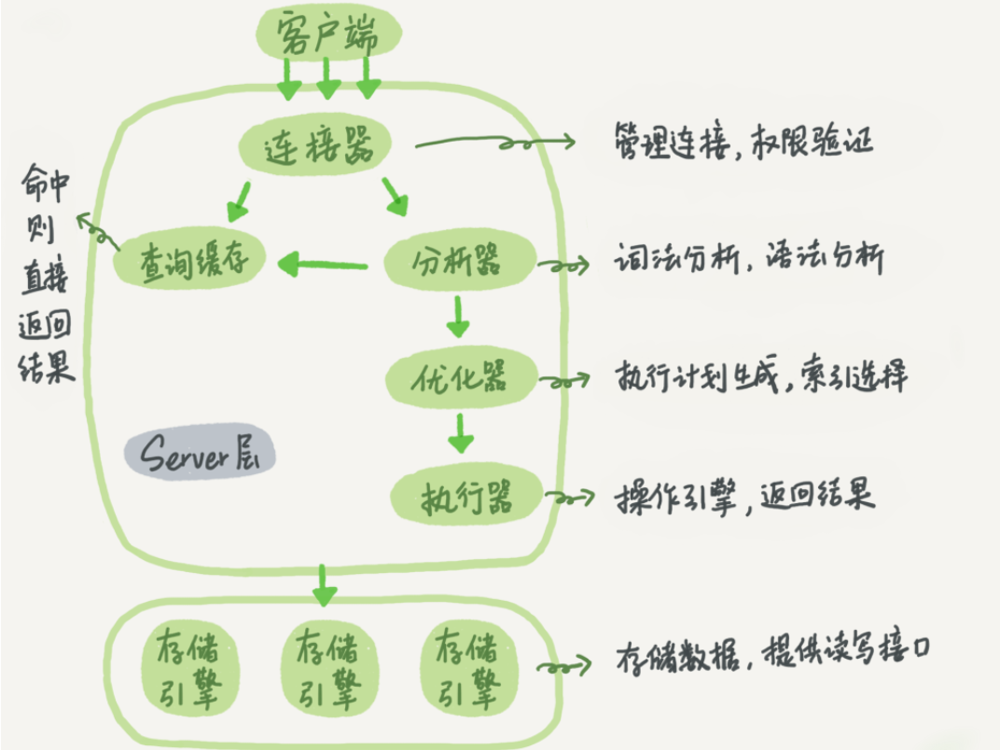

# 秋招复习笔记关系型数据库MySQL

## 第一部分 SQL语句

### 1.1 SQL语句是什么？

- SQL 指结构化查询语言
- SQL 使我们有能力访问数据库
- SQL 是一种 ANSI 的标准计算机语言

### 1.2 SQL基础语句

> SQL的注释

SQL语句有三种注释方式，分别为`#`、`--space  `、`/**/`
```mysql
#注释方式1
use sqllearn -- 注释方式2
/*注释多行注释*/
```

> 数据库的创建和使用

```mysql
CREATE DATABASE pks;
USE pks;
```

> 数据库的修改

```mysql
ALTER DATABASE;
```

[ALTER DATABASE用法汇总](https://blog.csdn.net/oradbm/article/details/85006086)（不是重点）

### 1.3 新建表

```mysql
CREATE TABLE user  (
  username char(20) CHARACTER SET utf8mb4 COLLATE utf8mb4_0900_ai_ci NOT NULL,
  password char(20) CHARACTER SET utf8mb4 COLLATE utf8mb4_0900_ai_ci NOT NULL,
  PRIMARY KEY (username) USING BTREE
) ENGINE = InnoDB CHARACTER SET = utf8mb4 COLLATE = utf8mb4_0900_ai_ci ROW_FORMAT = Dynamic;
/*
设置编码
CHARACTER SET utf8mb4 
COLLATE utf8mb4_0900_ai_ci
指定innoDB引擎
ENGINE = InnoDB
静态表、动态表
ROW_FORMAT = Dynamic
为了方便使用默认值，即忽略这些属性的设置
*/
```

```mysql
CREATE TABLE car(
    carNo varchar(12) PRIMARY KEY CHECK (carNo REGEXP '^[京津沪渝冀豫云辽黑湘皖鲁新苏浙赣鄂桂甘晋蒙陕吉闽贵粤青藏川宁琼使领A-Z][A-Z][A-Z0-9]{4}[A-Z0-9挂学警港澳]$'),
    carType INT(1) NOT NULL
)
```

```mysql
CREATE TABLE record(
    id INT NOT NULL AUTO_INCREMENT PRIMARY KEY ,
    parkNo varchar(2) not null CHECK ( parkNo REGEXP '^[A-C][0-9]$'),
    carNo varchar(12) not null CHECK (carNo REGEXP '^[京津沪渝冀豫云辽黑湘皖鲁新苏浙赣鄂桂甘晋蒙陕吉闽贵粤青藏川宁琼使领A-Z][A-Z][A-Z0-9]{4}[A-Z0-9挂学警港澳]$'),
    inTime TIMESTAMP not null,
    outTime TIMESTAMP not null,
    stayTime INT not null check ( stayTime >= 0 ),
    cost INT NOT NULL check ( cost >= 0 ),
    CONSTRAINT fk_carNo FOREIGN KEY (carNo) REFERENCES car(carNo)
)
```

### 1.4 修改表

> 新增列

```mysql
ALTER TABLE car
ADD COLUMN price INT CHECK ( price > 0 )
```

> 删除列

```mysql
ALTER TABLE car
DROP COLUMN price
```

> 新增约束

```mysql
ALTER TABLE car
ADD CONSTRAINT fk_carNo FOREIGN KEY (carNo) REFERENCES car(carNo)
```

> 删除约束

```mysql
ALTER TABLE car
DROP CONSTRAINT fk_carNo
```

> 删除表

```mysql
DROP TABLE car
```

### 1.5 插入数据

> 插入全部数据

```mysql
INSERT INTO car VALUES ('浙A12122',1);
INSERT INTO car VALUES ('浙A12138',2);
INSERT INTO car VALUES ('浙A77777',2);
INSERT INTO car VALUES ('浙A12125',2);
INSERT INTO record VALUES (1,'B0','浙A12138','2020-7-12 12:00:00','2020-7-13 12:00:00',1440,2880);
INSERT INTO record VALUES (2,'B1','浙A12122','2020-7-10 12:00:00','2020-7-11 12:00:00',1440,2880);
INSERT INTO record VALUES (3,'B2','浙A12138','2020-7-11 12:00:00','2020-7-12 12:00:00',1440,2880);
```

> 插入部分数据

```mysql
#前提条件是，没有数据的部分要求不是必须
INSERT INTO record (parkNo, carNo, inTime, outTime, stayTime, cost) VALUES ('B3', '浙A77777', '2020-07-13 08:25:15', '2020-07-13 08:25:19', 0, 0)
```

> 插入检索出来的数据

```mysql
#把car中的数据插入到car2中
INSERT INTO car2(CARNO, CARTYPE)
SELECT * FROM car
```

### 1.6 删除数据

> 删除表中指定的数据

```mysql
DELETE FROM car2
WHERE carNo = '浙A77777'
#使用where语句，即删除搜索出来的内容
```

> 清空表

```mysql
DELETE FROM car2;
#该删除语句，如果没有where子句，则会删除所有的行

TRUNCATE TABLE car2;
```

### 1.7 更新数据

```mysql
UPDATE car
SET carNo = '浙A88888'
WHERE carNo = '浙A12345'
```

### 1.8 查询基础

> SELECT语句

```mysql
SELECT *#*代表全部列
FROM record
WHERE carNo = '浙A12122';

SELECT id
FROM record
WHERE carNo = '浙A12138'
```

> DISTINCT

```mysql
#这样会列出重复的值
SELECT cost
FROM record

#当某些需求要求你找出不重复的所有值，则需要使用DISTINCT
SELECT DISTINCT cost
FROM record
```

> LIMIT

LIMIT用于限制返回的行数，经典的使用方式比如后端分页查询。

通常数据库里的行可以理解为数组，即从0开始。

```mysql
#返回前两行，即0-1行
SELECT *
FROM record
LIMIT 2
```

```mysql
#返回第1条（包括）的后两行，即1-2行
SELECT *
FROM record
LIMIT 2 OFFSET 1-- LIMIT 2代表返回的总行数，OFFSET 1代表起始行数为1（包括该行，从0开始）
```

```mysql
#这种写法和上述写法结果一致
SELECT *
FROM record
LIMIT 1,2 -- 第一个参数代表起始行数（包括该行，从0开始），第二个参数代表返回的总行数
```

> ORDER BY

排序，**ASC 默认**（升序，小到大） **DESC**（降序，大到小）

```mysql
SELECT cost
FROM record
ORDER BY cost #如果不写明则默认升序

SELECT cost
FROM record
ORDER BY cost DESC#写明降序
```

```mysql
#可以在ORDER BY中指定多列进行排序，使用多列如下例中则整体stayTime降序排序，如果stayTime中出现相同情况，则按照cost降序排序
SELECT *
FROM record
ORDER BY stayTime DESC ,cost DESC
```

> WHERE条件过滤

通过WHERE子句，对于数据库中的数据做一定成功的筛选，避免网络传输过程中传输多余的数据。

下表显示了 WHERE 子句可用的操作符

| 操作符  |          说明          |
| :-----: | :--------------------: |
|    =    |          等于          |
|  &lt;   |          小于          |
|  &gt;   |          大于          |
|   !=    |         不等于         |
|   <=    |        小于等于        |
|  `>=`   |        大于等于        |
| BETWEEN | 在两个值之间（闭区间） |
| IS NULL |       为 NULL 值       |

```mysql
SELECT *
FROM record
WHERE cost BETWEEN 1500 and 2000
```

应该注意到，NULL 与 0、空字符串都不同。

**AND 和 OR**   用于连接多个过滤条件。优先处理 AND，当一个过滤表达式涉及到多个 AND 和 OR 时，可以使用 () 来决定优先级，使得优先级关系更清晰。

**IN**   操作符用于匹配一组值，其后也可以接一个 SELECT 子句，从而匹配子查询得到的一组值。

**NOT**   操作符用于否定一个条件。

> 通配符

- **%** 可以匹配>=0长度的字符
- **_** 可以匹配1个字符
- **[ ]**   可以匹配集合内的字符，例如 [ab] 将匹配字符 a 或者 b。用脱字符 ^ 可以对其进行否定，也就是不匹配集合内的字符。

前两个使用LIKE关键字匹配，[]在mysql中使用REGEXP/NOT REGEXP来进行匹配。

```mysql
SELECT *
FROM car
WHERE carNo REGEXP '^浙[AB]12138$'
```

> GROUP BY

把具有相同的数据值的行放在同一组中。

```mysql
SELECT COUNT(cost) AS num,cost #使用函数可以对该分组的数据进行操作
FROM record
WHERE cost BETWEEN 1500 AND 2000 #where子句过滤行
GROUP BY cost #对查询结果按照cost进行分组
HAVING num > 1 #HAVING子句对组进行过滤
ORDER BY cost DESC #按组排序
```

分组规定：

- GROUP BY 子句出现在 WHERE 子句之后，ORDER BY 子句之前；
- NULL 的行会单独分为一组；
- 大多数 SQL 实现不支持 GROUP BY 列具有可变长度的数据类型。

### 1.9 函数

对于每个不同的数据库、其函数部分都有差异。

> 计算字段

在数据库服务器上完成数据的转换和格式化的工作往往比客户端上快得多，并且转换和格式化后的数据量更少的话可以减少网络通信量。

计算字段通常需要使用   **AS**   来取别名，否则输出的时候字段名为计算表达式。

```mysql
SELECT stayTime / cost AS rate
FROM record
```

**CONCAT()**   用于连接两个字段。许多数据库会使用空格把一个值填充为列宽，因此连接的结果会出现一些不必要的空格，使用 **TRIM()** 可以去除首尾空格（中间的空格不会被去除）。

```mysql
SELECT CONCAT(carNo,TRIM(' 在'),parkNo,TRIM('车 位')) as tips
FROM record
```

> 通用函数

|  函 数  |            说 明            |
| :-----: | :-------------------------: |
|  AVG()  | 返回某列的平均值,忽略NULL行 |
| COUNT() |       返回某列的行数        |
|  MAX()  |      返回某列的最大值       |
|  MIN()  |      返回某列的最小值       |
|  SUM()  |       返回某列值之和        |

```mysql
SELECT SUM(DISTINCT cost)#使用DISTINCT 对查询出来的数据的不同值做操作
FROM record
WHERE cost BETWEEN 1000 AND 2000
```

> 文本处理

|       函数        |      说明      |
| :---------------: | :------------: |
| LEFT(str,length)  | 左边的x个字符  |
| RIGHT(str,length) | 右边的x个字符  |
|    LOWER(str)     | 转换为小写字符 |
|    UPPER(str)     | 转换为大写字符 |
|    LTRIM(str)     | 去除左边的空格 |
|    RTRIM(str)     | 去除右边的空格 |
|    LENGTH(str)    |      长度      |
|   SOUNDEX(str)    |  转换为语音值  |

其中，  **SOUNDEX()**   可以将一个字符串转换为描述其语音表示的字母数字模式。

```sql
SELECT *
FROM mytable
WHERE SOUNDEX(col1) = SOUNDEX('apple')
```

> 时间日期处理

- 日期格式：YYYY-MM-DD
- 时间格式：HH:MM:SS

|     函 数     |             说 明              |
| :-----------: | :----------------------------: |
|   ADDDATE()   |    增加一个日期（天、周等）    |
|   ADDTIME()   |    增加一个时间（时、分等）    |
|   CURDATE()   |          返回当前日期          |
|   CURTIME()   |          返回当前时间          |
|    DATE()     |     返回日期时间的日期部分     |
|  DATEDIFF()   |        计算两个日期之差        |
|  DATE_ADD()   |     高度灵活的日期运算函数     |
| DATE_FORMAT() |  返回一个格式化的日期或时间串  |
|     DAY()     |     返回一个日期的天数部分     |
|  DAYOFWEEK()  | 对于一个日期，返回对应的星期几 |
|    HOUR()     |     返回一个时间的小时部分     |
|   MINUTE()    |     返回一个时间的分钟部分     |
|    MONTH()    |     返回一个日期的月份部分     |
|     NOW()     |       返回当前日期和时间       |
|   SECOND()    |      返回一个时间的秒部分      |
|    TIME()     |   返回一个日期时间的时间部分   |
|    YEAR()     |     返回一个日期的年份部分     |

[DATE_FORMAT函数第二个参数](https://www.w3school.com.cn/sql/func_date_format.asp)

```mysql
SELECT DATE_ADD(inTime,INTERVAL 1 MONTH)# DATE_ADD方法
FROM record
```

> 数值处理

|    函数    |            说明            |
| :--------: | :------------------------: |
|   SIN()    |            正弦            |
|   COS()    |            余弦            |
|   TAN()    |            正切            |
|   ABS()    |           绝对值           |
|   SQRT()   |           平方根           |
|   MOD()    |            余数            |
|   EXP()    |           e的n次           |
|    PI()    |           圆周率           |
|   RAND()   |           随机数           |
|  POW(x,y)  |            幂次            |
| CEILING(n) |  返回不小于n的最小整数值   |
|  FLOOR(n)  |  返回不大于n的最大整数值   |
|  SIGN(n)   | 返回参数的符号(为-1、0或1) |

### 1.10 联表查询

> 子查询

即嵌套查询，把查询出来的数据作为筛选的条件再次查询。

问题：查询浙A12138车辆停靠过的所有停车位上停靠的所有的停车记录。

首先需要查询12138车辆的停靠过的停车位，然后通过查询出来的停车位去查询所有停车记录

```mysql
SELECT *
FROM record
WHERE parkNo IN (#使用查询出来的parkNo
    SELECT parkNo
    FROM record
    WHERE carNo = '浙A12138')
```

> 内连接

内连接又称等值连接，使用 INNER JOIN 关键字。显示的是两个表的数据交集部分。

```mysql
SELECT car.carNo,carType,inTime,outTime,stayTime,parkNo,cost
FROM record INNER JOIN car
ON record.carNo = car.carNo
```

以上写法可以简化为以下写法，把INNER JOIN-ON 替换为WHERE，是平时用的很多的一种写法。

```mysql
SELECT car.carNo,carType,inTime,outTime,stayTime,parkNo,cost
FROM record,car
WHERE record.carNo = car.carNo
```

> 自连接

自连接可以看成一个特殊的内连接，即连接自己。给出子查询问题的自连接写法

```mysql
SELECT *
FROM record as r1,record as r2
WHERE r1.parkNo = r2.parkNo and r2.carNo = '浙A12138'
```

> 自然连接

自然连接是把同名列通过等值测试连接起来的，同名列可以有多个。使用NATURAL JOIN，会自动连接同名列，使用where子句过滤。

内连接和自然连接的区别：内连接提供连接的列，而自然连接自动连接所有同名列。

```mysql
SELECT car.carNo,carType,inTime,outTime,stayTime,parkNo,cost
FROM record NATURAL JOIN car
```

> 外连接

外连接保留了没有关联的那些行。分为左外连接，右外连接以及全外连接，左外连接就是保留左表没有关联的行。

问题：搜索出全部车辆，有记录的输出记录id，否则输出空。

```mysql
SELECT car.carNo,car.carType,record.id
FROM car LEFT JOIN record #使用左外连接来保留左边表没有关联的行
ON car.carNo = record.carNo
```

> 组合查询

- 使用   **UNION**   来组合两个查询，如果第一个查询返回 M 行，第二个查询返回 N 行，那么组合查询的结果一般为 M+N 行。

- 每个查询必须包含相同的列、表达式和聚集函数。

- 默认会去除相同行，如果需要保留相同行，使用 UNION ALL。

- 只能包含一个 ORDER BY 子句，并且必须位于语句的最后。

```mysql
SELECT car.carNo,car.carType,record.id
FROM car LEFT JOIN record
ON car.carNo = record.carNo
UNION ALL #保留相同行
SELECT car.carNo,car.carType,record.id
FROM car LEFT JOIN record
ON car.carNo = record.carNo
```

### 1.11 空值

> SQL NULL 值

如果表中的某个列是可选的，那么我们可以在不向该列添加值的情况下插入新记录或更新已有的记录。这意味着该字段将以 NULL 值保存。

NULL 值的处理方式与其他值不同。

NULL 用作未知的或不适用的值的占位符。

**注释：**无法比较 NULL 和 0；它们是不等价的。

> 如何操作NULL值

使用IS NULL/IS NOT NULL

```mysql
SELECT *
FROM test
WHERE age IS NULL
```

> IFNULL()

mysql中有IFNULL函数，这个函数有两个参数，如果第一个参数为NULL，则返回第二个参数。反之，返回第一个参数。

```mysql
SELECT IFNULL(NULL,1)
```

### 1.12 视图

视图是虚拟的表，本身不包含数据，也就不能对其进行索引操作。

对视图的操作和对普通表的操作一样。

视图具有如下好处：

- 简化复杂的 SQL 操作，比如复杂的连接；
- 只使用实际表的一部分数据；
- 通过只给用户访问视图的权限，保证数据的安全性；
- 更改数据格式和表示。
- 修改视图中数据、表中数据也会改变

```mysql
CREATE VIEW records AS
SELECT record.id,record.carNo,car.carType,record.parkNo,record.cost
FROM car,record
WHERE car.carNo = record.carNo
```

### 1.13 存储过程

> 什么是存储过程

存储过程是在数据库系统中， 一组为了完成特定功能的sql语句集， 静编译后存储在数据库中，用户通过指定存储过程的名字并给出参数(如果该存储过程带有参数)来执行它。存储过程不仅仅是"批处理"，存储过程是**经过编译的sql语句集**。

> 储存过程与函数、触发器的区别

从语法上看， 存储过程和函数以及触发器是十分类似的。我们甚至可以说， 触发器和函数就是一种特别存储过程。
不过他们之间还是有一些区别的。

- 触发器用于完成一些触发条件所引发的操作。 触发器的执行是自动化的
- 自定义函数只能通过return语句返回单个值或者表对象， 而存储过程不能调用return语句， 但可以通过out参数返回多个值。函数可以在sql语句中结合使用。 函数不能用临时表， 只能用表变量， 还有一些系统函数都不可用等等
- 存储过程用于完成一系列的sql操作， 批量化的完成数据库操作工作， 由使用者调用执行。

> 存储过程的优点

1. **高效率**，存储过程只在创造时进行编译， 以后每次执行存储错过程都不需要在重新编译， 而一般SQL语句每执行一次就编译一次， 所以使用存储过程可提高数据库执行速度。
2. **封装性**，当丢数据库进行复杂操作时(如对多个表进行Update， Insert， Query， Delete)，可将此复杂操作用存储过程封装起来与数据库提供的事务处理结合一起使用。这些操作， 如果用程序来完成， 就变成了一条条的sql语句， 可能要多次连接数据库。而换成存储， 就只需要连接一次数据库就可以了
3. **可复用**，存储过程可以重复使用， 可减少数据库开发人员的工作量。
4. **安全性高**， 可设定只有某此用户才具有对指定存储过程的使用权。

> 存储过程的缺点

1. 可移植性差
2. 对于很简单的sql语句， 存储过程没有优势
3. 如果存储过程中不一定会减少网络传输（包含的sql数量并不多， 并且执行很快，就没必要了）
4. 如果只有一个用户使用数据库， 那么存储过程对于安全也没什么影响
5. 团队开发时需要先统一标准， 否则后期维护是个麻烦
6. 在大并发量访问的情况下， 不宜写过多涉及运算的存储过程
7. 业务逻辑复杂时， 特别是涉及到对很大的表进行操作的时候， 不如在前端先简化业务逻辑

> 定义存储过程

命令行中创建存储过程需要自定义分隔符，因为命令行是以 ; 为结束符，而存储过程中也包含了分号，因此会错误把这部分分号当成是结束符，造成语法错误。即如下所示的格式。

```mysql
delimiter //

...
//
delimiter ;
```

```mysql
delimiter //# 定界符， 用于修改结束符， 方便些多条sql语句， 最后在修改回来

create procedure my(out s int)
begin
select count(*) into s from record;
end ;

delimiter ;

call my(@s); #执行
select @s
```

包含 in、out 和 inout 三种参数，给变量赋值都需要用 select into 语句。每次只能给一个变量赋值，不支持集合的操作。

mysql存储过程的参数用于存储过程的定义， 共有三种参数类型， IN， OUT， INOUT，形式如下：
CREATE PROCEDURE （【in|out|inout】 函数名  函数类型...）

- IN 输入参数： 表示该参数的值必须在调用存储过程时指定， 在存储过程中修改该参数的值不能被返回， 为默认值。
- OUT 输出参数： 该值可在存储过程内部被改变， 并可返回。
- INOUT输入输出参数： 调用时指定， 并且可被改变和返回。

> 查看存储过程

```mysql
show create procedure my; #查看存储过程结构
show procedure status like 'my'; #查看存储过程的状态
```

> 定义变量

1. 局部变量：局部变量一般用在sql语句块中，比如存储过程的begin/end。
2. 用户变量：用户变量的作用域要比局部变量要广。用户变量可以作用于当前整个连接，但是当当前连接断开后，其所定义的用户变量都会消失。
3. 会话变量：服务器为每个连接的客户端维护一系列会话变量。
4. 全局变量：全局变量影响服务器整体操作。当服务器启动时，它将所有全局变量初始化为默认值

> 局部变量

局部变量一般用在sql语句块中，比如存储过程的begin/end。其作用域仅限于该语句块，在该语句块执行完毕后，局部变量就消失了。局部变量一般用declare来声明，可以使用default来说明默认值。

```mysql
drop procedure if exists add;
create procedure add
(
    in a int,
    in b int
)
begin
    declare c int default 0;
    set c = a + b;
    select c as c;
end;
```

> 用户变量

用户变量的作用域要比局部变量要广。用户变量可以作用于当前整个连接，但是当当前连接断开后，其所定义的用户变量都会消失。

用户变量使用如下(这里我们无须使用declare关键字进行定义，可以直接这样使用):

select @变量名

对用户变量赋值有两种方式，一种是直接用"="号，另一种是用":="号。其区别在于使用set命令对用户变量进行赋值时，两种方式都可以使用；当使用select语句对用户变量进行赋值时，只能使用":="方式，因为在select语句中，"="号被看作是比较操作符。

```mysql
drop procedure if exists math;
create procedure math
(
    in a int,
    in b int
)
begin
    set @var1 = 1;
    set @var2 = 2;
    select @sum:=(a + b) as sum, @dif:=(a - b) as dif;
end;
```

### 1.14 自定义函数

> 如何定义

```mysql
create function 函数名([参数列表]) returns 数据类型
begin
 sql语句;
 return 值;
end;
```

> IF语句

```mysql
IF  -- THEN  -- ELSE
例子：
delimiter //
create procedure proc2(IN p1 int)
begin
declare var int;
set var=p1 + 1;
IF var = 1 THen insert into t values(11);
end if;    /* if 结束*/

if var = 2 then insert into t values (22);
else insert into values (33);
end if;

end;
//

delimiter ;
```

> case语句

```mysql
-- case when-then when-then else end;
delimiter //
create procedure proc3(IN p1 int)
begin
declare var int;
set var  = p1 + 1;
case var
  when 1 then insert into t values(17);
  when 2 then insert into t values(18);
  else insert into t values(19);
end case;
end;
//
delimiter ;
```

> While语句

```mysql
DELIMITER //
create procedure proc4()
begin
declare var int;
set var=0;
while var < 6 do
  insert into t values(var);
  set var = var + 1;
end while;
end;
//
delimiter;
```

> Repeat语句

```mysql
delimiter //
create procedure proce5()
begin
declare v int;
set v=0;
repeat
  insert into t values(v);
  set v = v+1;
  until v < 5
end repeat;
end;
//
delimiter;
```

### 1.15 游标

在存储过程中使用游标可以对一个结果集进行移动遍历。

游标主要用于交互式应用，其中用户需要对数据集中的任意行进行浏览和修改。

使用游标的四个步骤：

1. 声明游标，这个过程没有实际检索出数据；
2. 打开游标；
3. 取出数据；
4. 关闭游标；

```mysql
delimiter //
create procedure myprocedure(out ret int)
    begin
        declare done boolean default 0;

        declare mycursor cursor for -- 声明一个结果集的游标
        select col1 from mytable;
        -- 定义了一个 continue handler，当 sqlstate '02000' 这个条件出现时，会执行 set done = 1
        declare continue handler for sqlstate '02000' set done = 1;

        open mycursor;-- 打开游标

        repeat
            fetch mycursor into ret; -- 取出数据
            select ret;
        until done end repeat;-- 直到02000这个条件的出现就停止循环

        close mycursor; -- 关闭游标
    end //
 delimiter ;
```

### 1.16 触发器

触发器会在某个表执行以下语句时而自动执行：DELETE、INSERT、UPDATE。

触发器必须指定在语句执行之前还是之后自动执行，之前执行使用 BEFORE 关键字，之后执行使用 AFTER 关键字。BEFORE 用于数据验证和净化，AFTER 用于审计跟踪，将修改记录到另外一张表中。

INSERT 触发器包含一个名为 NEW 的虚拟表。

```mysql
CREATE TRIGGER mytrigger AFTER INSERT ON mytable
FOR EACH ROW SELECT NEW.col into @result;

SELECT @result; -- 获取结果
```

DELETE 触发器包含一个名为 OLD 的虚拟表，并且是只读的。

UPDATE 触发器包含一个名为 NEW 和一个名为 OLD 的虚拟表，其中 NEW 是可以被修改的，而 OLD 是只读的。

MySQL 不允许在触发器中使用 CALL 语句，也就是不能调用存储过程。

### 1.17 事务

基本术语：

- 事务（transaction）指一组 SQL 语句；
- 回退（rollback）指撤销指定 SQL 语句的过程；
- 提交（commit）指将未存储的 SQL 语句结果写入数据库表；
- 保留点（savepoint）指事务处理中设置的临时占位符（placeholder），你可以对它发布回退（与回退整个事务处理不同）。

不能回退 SELECT 语句，回退 SELECT 语句也没意义；也不能回退 CREATE 和 DROP 语句。

MySQL 的事务提交默认是隐式提交，每执行一条语句就把这条语句当成一个事务然后进行提交。当出现 START TRANSACTION 语句时，会关闭隐式提交；当 COMMIT 或 ROLLBACK 语句执行后，事务会自动关闭，重新恢复隐式提交。

设置 autocommit 为 0 可以取消自动提交；autocommit 标记是针对每个连接而不是针对服务器的。

如果没有设置保留点，ROLLBACK 会回退到 START TRANSACTION 语句处；如果设置了保留点，并且在 ROLLBACK 中指定该保留点，则会回退到该保留点。

```sql
START TRANSACTION
// ...
SAVEPOINT delete1
// ...
ROLLBACK TO delete1
// ...
COMMIT
```

### 1.18 权限

MySQL 的账户信息保存在 mysql 这个数据库中。

```sql
USE mysql;
SELECT user FROM user;
```

> 创建账户  

新创建的账户没有任何权限。

```sql
CREATE USER myuser IDENTIFIED BY 'mypassword';
```

> 修改账户名  

```sql
RENAME USER myuser TO newuser;
```

> 删除账户

```sql
DROP USER myuser;
```

> 查看权限

```sql
SHOW GRANTS FOR myuser;
```

> 授予权限

账户用 username@host 的形式定义，username@% 使用的是默认主机名。

```sql
GRANT SELECT, INSERT ON mydatabase.* TO myuser;
```

> 删除权限  

GRANT 和 REVOKE 可在几个层次上控制访问权限：

- 整个服务器，使用 GRANT ALL 和 REVOKE ALL；
- 整个数据库，使用 ON database.\*；
- 特定的表，使用 ON database.table；
- 特定的列；
- 特定的存储过程。

```sql
REVOKE SELECT, INSERT ON mydatabase.* FROM myuser;
```

> 更改密码

必须使用 Password() 函数进行加密。

```sql
SET PASSWROD FOR myuser = Password('new_password');
```

## 第二部分 力扣SQL题

### 2.1 简单难度

> 上升的温度

考察点：`自联查询`、`时间函数`

给定一个 Weather 表，编写一个 SQL 查询，来查找与之前（昨天的）日期相比温度更高的所有日期的 Id。

| Id(INT) | RecordDate(DATE) | Temperature(INT) |
| :-----: | :--------------: | :--------------: |
|    1    |    2015-01-01    |        10        |
|    2    |    2015-01-02    |        25        |
|    3    |    2015-01-03    |        20        |
|    4    |    2015-01-04    |        30        |

例如，根据上述给定的 Weather 表格，返回如下 Id:

|  Id  |
| :--: |
|  2   |
|  4   |

```mysql
SELECT w1.Id
FROM Weather as w1,Weather as w2
WHERE w1.RecordDate = DATE_ADD(w2.RecordDate,INTERVAL 1 DAY) #这一天和前一天的联表
and w1.Temperature > w2.Temperature#比前一天温度高的
```

> 交换工资

考察点：`case语句`

给定一个 salary 表，如下所示，有 m = 男性 和 f = 女性 的值。交换所有的 f 和 m 值（例如，将所有 f 值更改为 m，反之亦然）。要求只使用一个更新（Update）语句，并且没有中间的临时表。

注意，您必只能写一个 Update 语句，请不要编写任何 Select 语句。

例如：

|  id  | name | sex  | salary |
| :--: | :--: | :--: | :----: |
|  1   |  A   |  m   |  2500  |
|  2   |  B   |  f   |  1500  |
|  3   |  C   |  m   |  5500  |
|  4   |  D   |  f   |  500   |
运行你所编写的更新语句之后，将会得到以下表:

|  id  | name | sex  | salary |
| :--: | :--: | :--: | :----: |
|  1   |  A   |  f   |  2500  |
|  2   |  B   |  m   |  1500  |
|  3   |  C   |  f   |  5500  |
|  4   |  D   |  m   |  500   |

```mysql
UPDATE salary
SET sex = 
CASE sex
WHEN 'f'
THEN 'm'
ELSE 'f'
end;
```

> 组合两个表

考察点：`外联查询`

表1: Person

|   列名    |  类型   |
| :-------: | :-----: |
| PersonId  |   int   |
| FirstName | varchar |
| LastName  | varchar |

PersonId 是上表主键
表2: Address

|   列名    |  类型   |
| :-------: | :-----: |
| AddressId |   int   |
| PersonId  |   int   |
|   City    | varchar |
|   State   | varchar |

AddressId 是上表主键


编写一个 SQL 查询，满足条件：无论 person 是否有地址信息，都需要基于上述两表提供 person 的以下信息：

FirstName, LastName, City, State

```mysql
SELECT FirstName,LastName,City,State
FROM Person LEFT OUTER JOIN Address
ON Person.PersonId = Address.PersonId
```

> 超过5名学生的课

考察点：`GROUPBY`、`HAVING`

有一个courses 表 ，有: student (学生) 和 class (课程)。

请列出所有超过或等于5名学生的课。

例如,表:
| student | class      |
| :-------: | :-----: |
| A       | Math       |
| B       | English    |
| C       | Math       |
| D       | Biology    |
| E       | Math       |
| F       | Computer   |
| G       | Math       |
| H       | Math       |
| I       | Math       |

应该输出:
| class   |
| :-------: |
| Math    |

Note:
学生在每个课中不应被重复计算。

```mysql
SELECT
    class
FROM
    courses
GROUP BY class
HAVING COUNT(DISTINCT student) >= 5
```

### 2.2 中等难度

> 连续出现的数字

考察点：`自定义变量`

编写一个 SQL 查询，查找所有至少连续出现三次的数字。

| Id | Num |
| :-------: | :-----: |
| 1  |  1  |
| 2  |  1  |
| 3  |  1  |
| 4  |  2  |
| 5  |  1  |
| 6  |  2  |
| 7  |  2  |

例如，给定上面的 Logs 表， 1 是唯一连续出现至少三次的数字。

| ConsecutiveNums |
| :-------: |
| 1               |

```mysql
SELECT DISTINCT a.Num ConsecutiveNums
FROM (
SELECT t.Num ,
       # 数据数据相等则cnt+1
       @cnt:=IF(@pre=t.Num, @cnt+1, 1) cnt,# 三元表达式，相当于java中的x?y:z
       @pre:=t.Num pre
  FROM Logs t, (SELECT @pre:=null, @cnt:=0) b) a#把数据结果，即Num，cnt，pre作为一个新表供外部select处理
WHERE a.cnt >= 3
```

> 交换位置

考察点：`IF`

小美是一所中学的信息科技老师，她有一张 seat 座位表，平时用来储存学生名字和与他们相对应的座位 id。

其中纵列的 id 是连续递增的

小美想改变相邻俩学生的座位。

你能不能帮她写一个 SQL query 来输出小美想要的结果呢？

示例：

|    id   | student |
| :-------: | :-----: |
|    1    | Abbot   |
|    2    | Doris   |
|    3    | Emerson |
|    4    | Green   |
|    5    | Jeames  |
假如数据输入的是上表，则输出结果如下：

|    id   | student |
| :-------: | :-----: |
|    1    | Doris   |
|    2    | Abbot   |
|    3    | Green   |
|    4    | Emerson |
|    5    | Jeames  |
注意：

如果学生人数是奇数，则不需要改变最后一个同学的座位。

```mysql
select 
    if(id%2=0,
        id-1,#如果是偶数，id-1
        if(id=(select count(distinct id) from seat),#如果是奇数，判断是否最后一个
            id,#是最后一个，不变
            id+1)) #不是最后一个，id+1
    as id,student 
from seat 
order by id;
```

### 2.3 困难难度

> 体育馆的人流量

X 市建了一个新的体育馆，每日人流量信息被记录在这三列信息中：序号 (id)、日期 (visit_date)、 人流量 (people)。

请编写一个查询语句，找出人流量的高峰期。高峰期时，至少连续三行记录中的人流量不少于100。

例如，表 stadium：

| id   | visit_date | people    |
| :-------: | :-----: | :-----: |
| 1    | 2017-01-01 | 10        |
| 2    | 2017-01-02 | 109       |
| 3    | 2017-01-03 | 150       |
| 4    | 2017-01-04 | 99        |
| 5    | 2017-01-05 | 145       |
| 6    | 2017-01-06 | 1455      |
| 7    | 2017-01-07 | 199       |
| 8    | 2017-01-08 | 188       |
对于上面的示例数据，输出为：

| id   | visit_date | people    |
| :-----: | :-----: | :-----: |
| 5    | 2017-01-05 | 145       |
| 6    | 2017-01-06 | 1455      |
| 7    | 2017-01-07 | 199       |
| 8    | 2017-01-08 | 188       |

提示：
每天只有一行记录，日期随着 id 的增加而增加。

```mysql
select distinct s.* 
from stadium s,
(select id,visit_date,people,(
    @cnt:=IF(people>99,@cnt+1,0)
) as cnt from stadium,(select @cnt:=0) b) c 
where c.cnt>2 and s.id between c.id-c.cnt+1 and c.id
```

## 第三部分 MySQL底层剖析

### 3.1 MySQL数据库的结构



大体来说，MySQL 可以分为 Server 层和存储引擎层两部分。

- Server 层包括连接器、查询缓存、分析器、优化器、执行器等，涵盖 MySQL 的大多数核心服务功能，以及所有的内置函数（如日期、时间、数学和加密函数等），所有跨存储引擎的功能都在这一层实现，比如存储过程、触发器、视图等。
- 存储引擎层负责数据的存储和提取。其架构模式是**插件式**的，支持 InnoDB、MyISAM、Memory 等多个存储引擎。现在最常用的存储引擎是 InnoDB，它从 MySQL 5.5.5 版本开始成为了默认存储引擎。如果不指定就默认InnoDB。

