# 数据结构秋招复习笔记

## 一、概述

因为数据结构属于基础内容，此处就不再手动的来实现了，Java中相关集合源码见另外的笔记。

https://www.cs.usfca.edu/~galles/visualization/Algorithms.html

这个网站可以可视化的展示数据结构和算法，对于理解很有用！

### 1.1 什么是数据结构

数据结构包括数据对象集以及它们在计算机中的组织方式，即他们逻辑结构和物理结构，一般我们可以认为数据结构指的是一种数据的存储结构。

### 1.2 线性表

线性表上的每个数据最多只有前后两个方向，例如数组、链表、栈、队列。

### 1.3 非线性表

不是简单的前后关系，如堆、树、图。

## 二、数组

### 2.1 什么是数组

数组是一种**线性**表数据结构用一组**连续**的内存空间，来存储一组具有**相同类型**的数据。

### 2.2 数组的优劣势

- 优势在于**随机访问效率高**，因为是连续的内存，只需要知道首地址和偏移量就可以轻松的找到目标值。
- 劣势在于插入和删除低效，尤其是中部的数据，因为必然会有数据搬迁的工作。

### 2.3 数组的实现

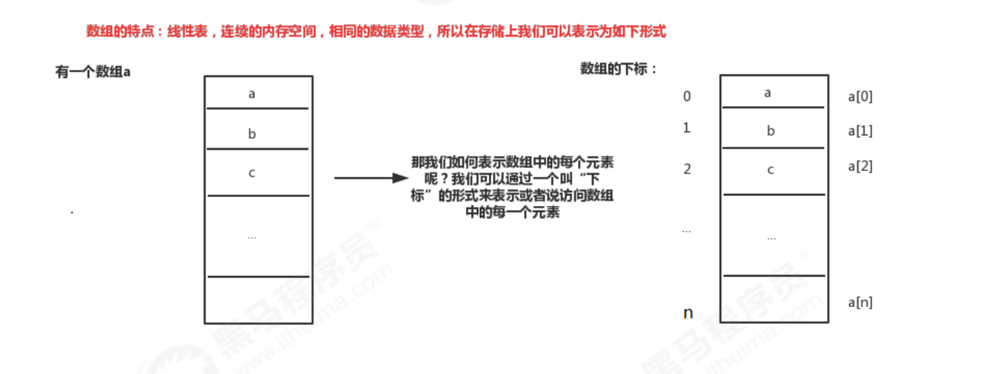

> 数组下标为什么从0开始？

下标最确切的解释应该是偏移（offset），即`目标地址=首地址+偏移量`

## 三、链表

### 3.1 什么是链表

链表是一种物理存储单位上非连续、非顺序的存储结构。数据元素之间的逻辑顺序是通过链表中的指针链接次序实现的。

链表不需要连续的内存空间，它可以通过指针将一组零散的内存块串联起来。

分为单链表、双链表、循环链表等等。

### 3.2 链表的优劣势

- 优势在于插入、删除结点，且天然支持动态扩容。
- 劣势在于随机访问。

### 3.3 链表的实现

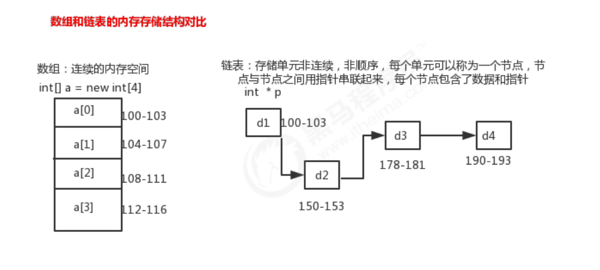

## 四、栈

### 4.1 什么是栈

栈的典型特点：**先进后出**，**后进先出**。

### 4.2 何时使用栈

栈就是一种操作受限的线性表，只允许在栈的一端进行数据的插入和删除，这两种操作分为叫做入栈和出栈。当某个数据集合如果只涉及在其一端进行数据的插入和删除操作，并且满足先进后出的特性时，便可使用栈。

### 4.3 栈的实现

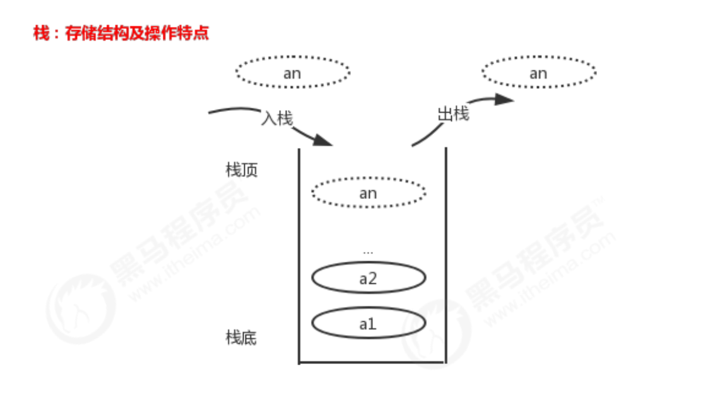

## 五、队列

#### 5.1 什么是队列

队列的特点是：**先进先出**

#### 5.2 何时使用队列

队列和栈一样都属于一种操作受限的线性表，队列的基本操作为入队列（在尾部插入数据）和出队列（在头部取出数据）。

#### 5.3 队列的实现

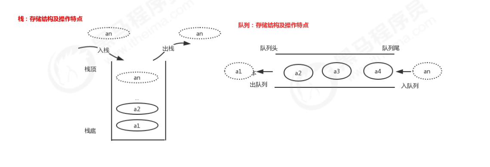

## 六、树

### 6.1 什么是树

树是一种抽象数据结构或是实现这种抽象数据结构类型的数据结构。它满足以下特点：

- 每个节点都只有有限个子节点或无子节点
- 没有父节点的节点称为根节点
- 每一个非根节点有且只有一个父节点
- 除了根节点外，每个子节点可以分为多个不相交的子树
- 树里面没有环路

> 树的一些概念

- 节点的高度：节点到叶子节点的最长路径，所有叶子节点的高度为0
- 节点的深度：根节点到这个节点所经历的边的个数，根的深度为0
- 节点的层数：节点的深度+1
- 树的高度：根节点的高度

### 6.2 二叉树

> 什么是二叉树

二叉树，每个节点最多只有两个子节点的树。

> 二叉树的遍历

二叉树有三种遍历方式：前序遍历、中序遍历、后续遍历。

- 前序遍历，本节点、左子树、右子树
- 中序遍历，左子树、本节点、右子树
- 后序遍历，左子树、右子树、本节点

### 6.3 二叉查找树

> 什么是二叉查找树

二叉查找树即要求在二叉树中的任意一个节点，其左子树的每个节点的值都要小于本节点的值，右子树的节点的值都要大于本节点的值。

- 若任意节点的左子树不空，则左子树上所有节点的值均小于它的根节点的值
- 若任意节点的右子树不空，则右子树上所有节点的值均大于它的根节点的值
- 任意节点的左右子树也分别为二叉查找树
- 没有键值相等的节点

> 二叉查找树的性能

二叉查找树支持动态数据的快速插入，删除，查找操作。天然的支持二分查找、动态扩容。

### 6.4 平衡二叉查找树

> 什么是平衡二叉查找树

查找二叉树在特定情况下会退化成链表，导致查找的时间复杂度从O(logn)变为O(n)。

平衡二叉查找树（AVL），任何一个节点的左子树和右子树高度之差的绝对值不超过1。

> 失衡调整

左旋、右旋、左右旋、右左旋，这些是数据结构的基础中涉及的。

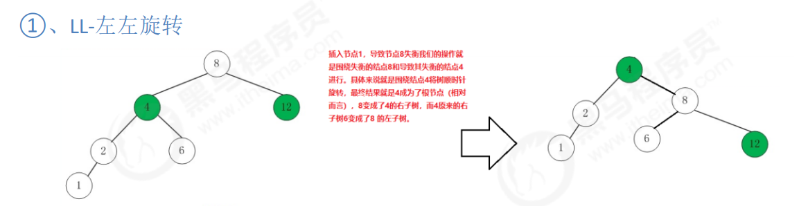

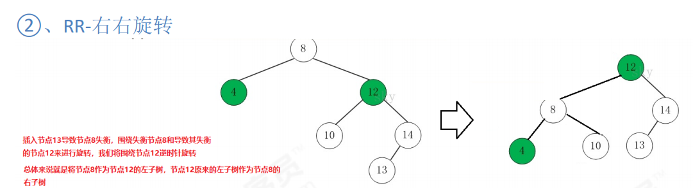

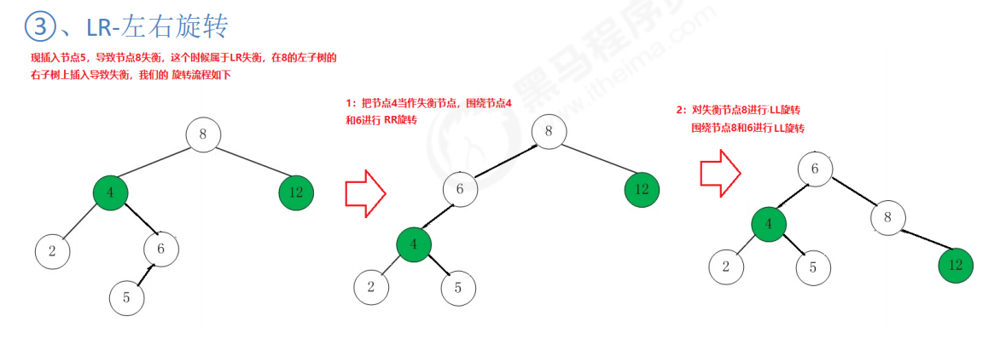

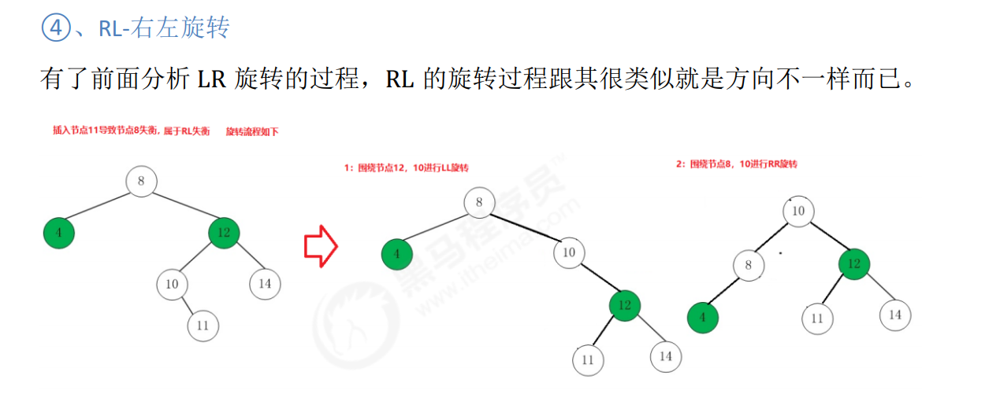

### 6.5 红黑树

红黑树也是一种平衡二叉树，因此红黑树应当和AVL平衡二叉树来比较。

#### 6.5.1 为什么需要红黑树

我们知道AVL树是一种严格按照定义来实现的平衡二叉查找树，所以它查找的效率非常稳定，为O(log n),由于其严格按照左右子树高度差不大于1的规则，插入和删除操作中需要大量且复杂的操作来保持AVL树的平衡（左旋和右旋），因此AVL树适用于大量查询，少量插入和删除的场景中

 那么假设现在假设有这样一种场景：大量查询，大量插入和删除，现在使用AVL树就不太合适了，因为AVL树大量的插入和删除会非常耗时间，那么我们是否可以降低AVL树对平衡性的要求从而达到快速的插入和删除呢？

答案肯定是有的，红黑树这种数据结构就应运而生了，**查找方面，红黑树较弱，但插入删除方面，红黑树性能强**

#### 6.5.2 什么是红黑树

红黑树是一种特殊的二叉查找树，每个结点都要储存位表示结点的颜色，或红或黑，通过对任何一条从根到叶子的路径上的各个节点着色方式的限制，红黑树确保没有一条路径会比其他路径长出两倍，因而是接近平衡的

红黑树的特性：

1）每个结点或红或黑

2）根结点是黑色

3）空叶子结点是黑色

4）如果一个结点是红色，那么它的子节点是黑色(因为红红不能出现，而又对每条路径黑节点的数量有要求，所以可以保证平衡)

5）从任意一个结点出发到空的叶子结点经过的黑结点个数相同

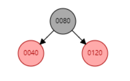

红黑树中也是使用旋转来操作，有左旋和右旋两种，同时还有重新着色，一共两种方法。

#### 6.5.3 红黑树插入节点

添加操作宏观过程：首先将红黑树当作一颗查找树一样将结点插入，然后将结点着为红色，最后通过旋转和重新着色的方法使之重新成为红黑树

对上图中的红黑树插入一个125节点

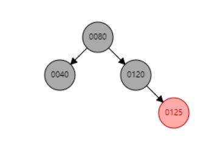

刚插入时125结点和120结点都是红色的，显然违背了规则4，那么就需要把父节点120变为黑色，但是又由于规则5，因此需要把叔节点40也变为黑色，同时爷节点80变为红色，又因为80为根，又变回黑色！

由此可以看出，变色的策略。最开始的时候，红和黑是交替变换的。即把父层(2个)变成黑色，爷层(1个)变成红色(这样子局部的黑色节点并没有增加)，除非爷层是根节点。

当颜色策略满足时，树可能依旧不满足规则5，所以此时需要旋转。**这种情况一般出现在父节点是红的，但是其叔节点是黑的(一般为空黑节点)**

当继续插入130时，经过颜色调整后，4满足了，但是5不满足，需要进行旋转操作

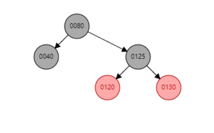

再次插入121，只需要根据颜色策略调整即可，但是注意到，如果按照AVL的策略，这棵树是不平衡的！但是对于红黑树，是一个标准的红黑树！由此可见，红黑树在调整平衡上花的时间远小于AVL

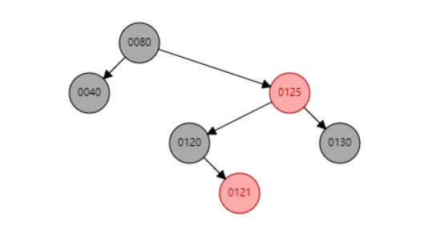

那么红黑树是怎么保证最短路径和最长路径的差距最多为2倍呢？

我们看到80-40,80-125-120-121两条路径，因为黑黑可以共存，但是红红不能出现！又跟节点是黑的，所以说4个节点的情况下，一定是黑红黑红，此时再插入一层的话，是黑红黑红红，需要变换颜色！所以必定会变为黑黑红黑红，又有规则5的限制，因此使用旋转操作来解决。

#### 6.5.4 红黑树删除节点

有如下几种情况！

一.删除结点没有儿子的情况：

1）删除结点为红色

2）删除结点为黑色，其兄弟结点没有儿子

3）删除结点为黑色，其兄弟结点有一个孩子不空，并且该孩子为右孩子

4）删除结点为黑色，其兄弟结点有一个孩子不空，并且该孩子为左孩子

5）删除结点为黑色，其兄弟结点有两个孩子，而且兄弟结点为红色

6）删除结点为黑色，其兄弟结点有两个孩子，而且兄弟结点为黑色

 

二.删除结点只有一个儿子的情况：

1）删除结点为黑色，其唯一的儿子结点为红色（必定是红色，要不然不符合红黑树的第5条性质）

2）删除结点为红色，其儿子结点只能为黑：红黑树中不存在这种情况，要不然无法满足红黑树第5条性质

 

三.删除结点有两个儿子的情况：

> 红色，没有儿子

这种情况，直接删除即可，没有任何影响

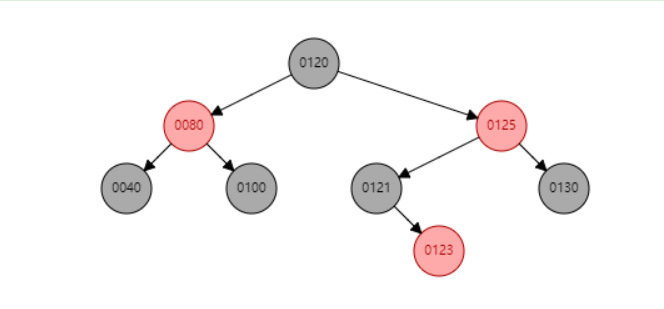

> 黑色，没有儿子

删除130，需要把兄弟节点121变为红色，父节点125变为黑色

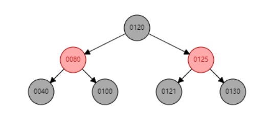

因为情况很多，就不一一演示了，可以发现一个规律就是删除的操作和二叉搜索树一致，删除之后按照红黑树的要求，使得最终重新变为红黑树！

### 6.6 B树

### 6.7 B+树

### 6.8 B*树

## 七、堆

### 7.1 什么是堆

堆是一个树，且满足以下要求：

- 堆是一个完全二叉树

如果堆还满足以下条件，被称为大顶堆和小顶堆：

- 堆中每一个节点的值都必须大于等于`(大顶堆)`（或小于等于`(小顶堆)`）其子树中每个节点的值

### 7.2 堆的存储结构

因为堆是一个完全二叉树，所以可以使用数组来代替二叉树来存储，这样子做就不需要存储左右子节点的指针。

### 7.3 堆的操作

> 插入元素

把新元素放在末位即可，如果是大顶堆、小顶堆的话，还需要进行**堆化**操作（自下而上堆化）。

> 删除堆顶元素

该操作是堆排序的核心操作，移除掉最大（小）值后，就需要用第二大（小）的值来代替堆顶。为了保持堆，需要把最后一个元素放到堆顶，并进行**堆化**（自上而下堆化）

> 堆化

- 自下而上堆化，因为原本是一个大顶堆、小顶堆，只需要不断的父节点比较交换，就可以找到合适的位置完成堆化。
- 自上而下堆化，例如大顶堆，分别比较子节点的值，如果不满足堆关系，那么就和子节点中大的节点交换，直到满足关系或者成为叶节点

## 八、哈希

### 8.1 什么是哈希表

哈希表又称散列表，是根据键直接访问在内存存储位置的数据结构，由数组演化而来，利用了数组支持按照下标进行随机访问数据的特性。所谓哈希，就是把**无限**的数据集映射到**有限**的集合内，因此哈希冲突问题无法避免。

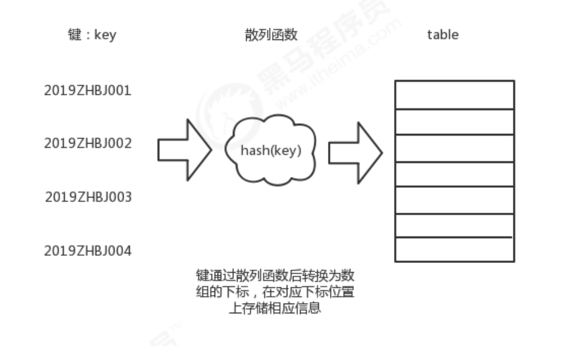

### 8.2 散列函数

散列函数就是一个函数，能够将给定的key转换为特定的散列值，`hashValue=hash（key）`

散列函数有以下要求

- 散列函数计算得到的散列值必须大于等于0，因为该值需要作为数组的下标。
- 如果key1 == key2，则其哈希值也必须相等。
- 相反如果key1 != key2，那么哈希值也必须不相等。
- 不能太复杂，否则会影响到散列表的性能
- 计算得出的哈希值应该尽量的随机且均匀分布，减少散列冲突

### 8.3 经典的散列函数

> 直接寻址法

比如对0-100岁的人口数字统计表，可以直接使用年龄的数字作为地址如`hash(0)=0`

当然还可以使用线性关系来进行散列`hash(key)=a*key+b`

> 除留余数法

对于散列表长为m的散列函数公式为`hash(key)=key mod p(p<=m)`

当p取小于哈希表长的最大质数时，产生的哈希函数较好。

> 平方取中法

先取关键字的平方，然后根据可使用空间的大小，选取平方数是中间几位为哈希地址。`hash(key)=key平方的中间几位`

> 折叠法

将关键码分割成位数相同的几部分，然后取这几部分的叠加和(舍弃进位)作为散列地址

- 移位叠加：将分割后的几部分低位对齐相加
- 边界叠加：从一端沿分割界来回折叠，然后对齐相加

如12320324111220，分为5段，123,203,241,112,20

移位叠加：123+203+241+112+20 = 879

边界叠加：321+203+142+112+02 = 780

### 8.4 散列冲突

散列冲突即本该放入的位置已经有元素了，又名哈希碰撞。一般有两种方式：开放寻址法、链表法。

> 开放寻址法

- 线性检测

  当存入时，发现位置上已有元素，则从当前位置开始，依次往后查找，知道找到为止。

  但是这种方式缺陷非常大，随着数据增多，碰撞越来越多，而且每次检测过后都会有可能影响下一次存放，使得取值的时间复杂度趋向于O(n)！

- 二次检测

  二次检测指的是每次检测的步长是原来的二次方，即hash(key)+0/1/4/9(线性检测是0/1/2/3)

- 双重散列

  使用一组散列函数，首次使用hash1，当发生碰撞时使用hash2，依次类推，直到找到为止。

**注意**：当剩余位置不足时，其碰撞的概率会大大提升，不管使用哪种冲突策略！所以本质上应该保证有一定比例的空余位置。`装载因子=散列表中的元素个数/散列表的长度`。当装载因子过大时，需要动态扩容！

**当动态因子小时，适合开放寻址法**

> 链表法

链表法，顾名思义就是当冲突时，构建一个链表，几个元素“共用”一个哈希值。

基于链表的散列冲突处理方法比较适合存储**大对象、大数据量**的散列表。而且更加的灵活、支持更多的优化策略，可以使用红黑树来替代链表。

### 8.5 散列表应当满足什么

散列表应该有如下特点：

- 支持快速的查询、插入、删除操作
- 内存占用合理，不能浪费过多的内存空间
- 性能稳定，极端情况下，性能也不会退化到无法接受的情况。

因此我们需要从以下几个方面来设计：

- 设计合适的散列函数
- 定义装载因子阀值，并设计动态扩容策略
- 选择合适的散列冲突解决方案

### 8.6 哈希算法

将任意长度的数据通过摘要函数，转化为长度固定的数据串的算法。但是哈希碰撞还是无法避免的问题。

> 哈希算法要求

- 对输入数据非常敏感，修改一个bit，其结果都要不同
- 对于不同的原始数据，哈希碰撞的概率要很小
- 不能被反向破译，即哈希算法是单向的
- 执行效率要尽量高

> 哈希算法的用途

哈希算法在加密中用途广泛，比如著名的MD5。

## 九、图

### 9.1 什么是图

图中的每一个元素称为**顶点**，图中的一个顶点可以和其他任意顶点建立连接关系，称为**边**，每个顶点有多少个边称为**度**。

> 无向图

边没有方向

> 有向图

边有方向，每个顶点通向其他的顶点的数量称为**出度**，反之为**入度**。

> 带权图

边上带有权重

### 9.2 图的存储方法

> 邻接矩阵存储图

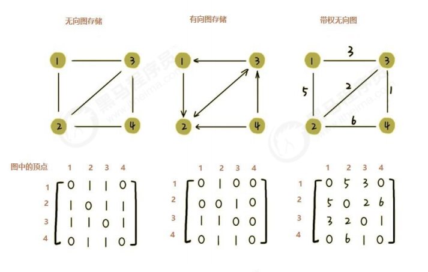

这种方式非常的直观，但是会浪费一些存储空间，**适合稠密的图**

> 邻接表存储表

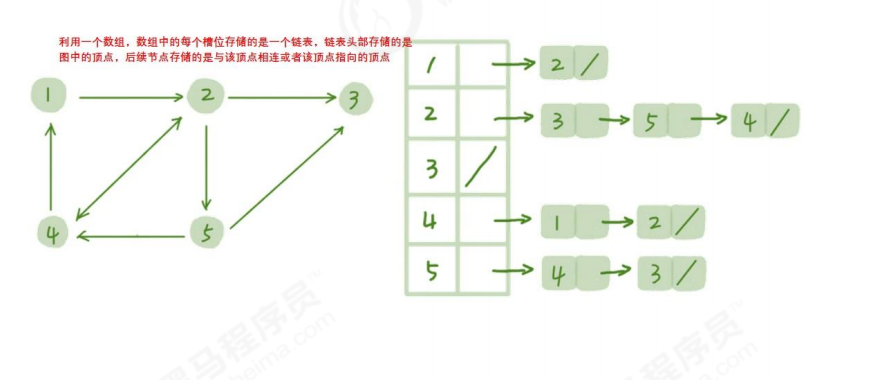

类似于散列表的链表，在实际开发中，可以用BST、AVL、红黑树等来替代链表提高查询效率。

