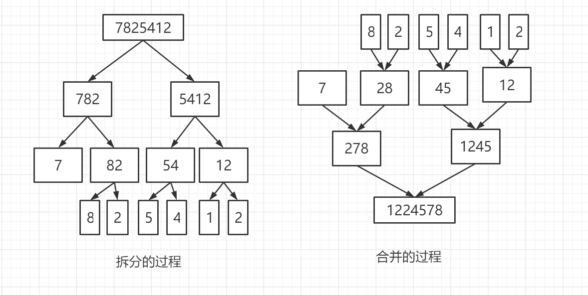

# 算法秋招复习笔记

## 一、时间复杂度

笔记中只会简要描述算法本质，附上最原生的代码实现，力扣刷题笔记见其他笔记。

### 1.1 什么是时间复杂度

算法的执行效率，简单地说就是算法代码的执行时间。

### 1.2 为什么要分析时间复杂度

1. 和性能测试相比，复杂度有不依赖执行环境、成本低、效率高、易操作、指导性强的特点
2. 掌握复杂度分析，将能编写出性能更优的代码，有利于降低系统开发和维护成本。

### 1.3 怎么计算时间复杂度

代码的执行时间T(n)与每行代码的执行次数n成正比，`T(n) = O(f(n))`

- **代码循环次数最多原则**，分析一个算法那或者一个代码的时间复杂度时，只需关注循环执行次数最多的那一段代码。
- **加法原则**，总的时间复杂度就等于量级最大的那段代码的时间复杂度。
- **乘法原则**，嵌套代码的复杂度等于嵌套内外代码复杂度的乘积。
- 复杂度忽略系数，只计算最高次幂

### 1.4 常见时间复杂度

> O(1)

只要代码的执行时间不随着n的增大而增大。

```java
//虽然有循环，但是其次数是固定的，因此也是O(1)
public void add(){
    int sum = 0;
    for(int i = 0;i<100;i++){
        sum = sum + i;
    }
    System.out.println(sum);
}
```

> O(n)

即单循环。

```java
public void add(int n){
    int sum = 0;
    for(int i = 0;i<n;i++){
        sum = sum + i;
    }
    System.out.println(sum);
}
```

> O（logn)

```java
//因为复杂度忽略系数，使用对数的换底公式就可以得出logn
public void add(int n){
    int i = 1;
    while(i<=n){
        i = i * 2;
    }
}
```

> O(nlogn)

### 1.5 三个概念

- 最好情况复杂度：在最理想情况下的代码时间复杂度
- 最坏情况复杂度：在最槽糕情况下的代码时间复杂度
- 平均情况复杂度：以上两个的加权平均值

### 1.6 评判算法好坏的标准

- 时间复杂度：最好情况、最坏情况、平均情况
- 空间复杂度：耗费多少额外的内存空间
- 算法稳定性：对于值相同的元素，排序后顺序是否会发生变化


## 二、排序算法

常见的八大排序算法：插入排序、选择排序、冒泡排序、希尔排序、堆排序、快速排序、归并排序、基数排序。算法均为**从小到大**排序。

### 2.1 冒泡排序

通过依次比较两个相邻的元素，看两个元素是否满足大小关系要求，如果不满足则交换两个元素。

- 比较相邻的元素。如果第一个比第二个大，就交换他们。
- 对每一个相邻元素作同样的工作，从开始第一对到结尾的最后一对，这样在最后的元素应该会是最大的数。
- 针对所有的元素重复以上的步骤，除了最后一个。
- 重复步骤1-3，直到排序完成

```java
public class MaoPao {
    //升序排序
    public void sort(int[] a){
        if(a.length <= 1);
        else{
            for (int i = 0; i < a.length; i++) {
                //随着i的增大，数组的最后i位就不会被比较
                for (int j = 0; j < a.length - i - 1; j++) {
                    if(a[j] > a[j+1]){//前值大于后值，交换
                        int temp = a[j+1];
                        a[j+1] = a[j];
                        a[j] = temp;
                    }
                }
            }
        }
    }

    public static void main(String[] args) {
        MaoPao maoPao = new MaoPao();
        int[] a = {2,5,3,6,8,1,7};
        System.out.println(Arrays.toString(a));
        maoPao.sort(a);
        System.out.println(Arrays.toString(a));
    }
}
```

> 冒泡排序的优化

如果有一次遍历后并没有进行一次交换，表明已经有序排列了，可以提前退出循环

```java
public class MaoPao {
    //升序排序
    public void sort(int[] a){
        if(a.length <= 1);
        else{
            for (int i = 0; i < a.length; i++) {
                boolean flag = true;
                //随着i的增大，数组的最后i位就不会被比较
                for (int j = 0; j < a.length - i - 1; j++) {
                    if(a[j] > a[j+1]){//前值大于后值，交换
                        int temp = a[j+1];
                        a[j+1] = a[j];
                        a[j] = temp;
                        flag = false;//有交换
                    }
                }
                if(flag){
                    break;//没有过交换，直接中断
                }
            }
        }
    }

    public static void main(String[] args) {
        MaoPao maoPao = new MaoPao();
        int[] a = {2,5,3,6,8,1,7};
        System.out.println(Arrays.toString(a));
        maoPao.sort(a);
        System.out.println(Arrays.toString(a));
    }
}
```

### 2.2 插入排序

插入排序的原理是：将数组中的数据分为两个区间，已排序区间和未排序区间。初始已排序区间只有一个元素，逐步取出未排序区间中的元素，插入到合适的已排序区间，确保其有序性，直到未排序区间为空。**把元素放入已排序区间时需要判断。**

- 取出第一个元素，放入已排序区间
- 取出下一个元素，在已排序的元素中从后向前扫描
- 如果该元素大于新元素，将该元素移到下一个位置
- 重复3，知道找到已排序的元素小于或者等于新元素的位置
- 将新元素插入到该位置
- 重复步骤2~5

```java
public class Insert {
    public void sort(int[] a){
        if(a.length <= 1);
        //把数组分为两部分，前部分为已排序区，后部分为未排序区
        else{
            for (int i = 1; i < a.length; i++) {//从第二个元素开始
                int current = a[i];
                int preIndex = i - 1;
                while(preIndex >= 0 && current < a[preIndex]){//如果前面还有值，且新插入的值小于当前的值
                    a[preIndex + 1] = a[preIndex];//把已排序的值后移
                    preIndex--;
                }
                a[preIndex + 1] = current;
            }
        }
    }
    public static void main(String[] args) {
        Insert insert = new Insert();
        int[] a = {2,5,3,6,8,1,7};
        System.out.println(Arrays.toString(a));
        insert.sort(a);
        System.out.println(Arrays.toString(a));
    }
}
```

### 2.3 选择排序

选择排序也分为已排序区和未排序区。每次选择会从未排序区中找到最小/最大的元素将其放到已排序区间的末尾。**把元素从未排序区间取出时需要判断。**

- 初始状态：无序区间R[1..n]，有序区为空
- 每次都在无序区间中找到最小的值，放入有序区中，放入采用的是交换，没有额外的辅助空间
- 重复2，直到无序区间为空

```java
public class Select {
    public void sort(int[] a){
        if(a.length <= 1);
        else {
            for (int i = 0; i < a.length; i++) {
                int minIndex = i;//记录最小的值的下标
                for (int j = i; j < a.length; j++) {
                    if(a[minIndex] > a[j]) minIndex = j;//寻找最小的值
                }
                //此处已经找到最小的值了
                if(i != minIndex){//如果当前位置就是最小的值，不做操作，否则就交换
                    int temp = a[i];
                    a[i] = a[minIndex];
                    a[minIndex] = temp;
                }
            }
        }
    }

    public static void main(String[] args) {
        Select select = new Select();
        int[] a = {2,5,3,6,8,1,7};
        System.out.println(Arrays.toString(a));
        select.sort(a);
        System.out.println(Arrays.toString(a));
    }
}
```

### 2.4 归并排序

如果要排列一个数组，我们先把数组从中间分成前后两部分，然后对这两部分分别排序，再讲排好序的两部分合并在一起。先把数组拆分成一定小的很多数组（下例中分为了单元素的数组），即递归的递的过程。然后再把这些数组并起来（排序实际上发生在这一阶段）即递归的归的过程。以为是递归实现，所以下图中的树型结构是按照深度优先的顺序来完成的。



```java
public class GuiBing {
    public int[] sort(int[] a){
        if(a.length <= 1) return a;
        else {
            int mid = a.length / 2;
            int[] left = Arrays.copyOfRange(a,0,mid);
            int[] right = Arrays.copyOfRange(a,mid,a.length);
            return merge(sort(left),sort(right));//一直划分，直到数组中只有一个元素
        }
    }

    //合并函数
    private int[] merge(int[] left,int[] right){
        int[] array = new int[left.length+right.length];
        int lIndex = 0;
        int rIndex = 0;
        for (int i = 0; i < array.length; i++) {
            //left全部插入后，一直插入右边
            if(lIndex >= left.length) array[i] = right[rIndex++];
            //right全部插入后，一直插入左边
            else if(rIndex >= right.length) array[i] = left[lIndex++];
            //left值小于right，插入left值
            else if(left[lIndex] < right[rIndex]) array[i] = left[lIndex++];
            //right值小于等于left，插入right值
            else array[i] = right[rIndex++];
        }
        return array;
    }

    public static void main(String[] args) {
        GuiBing guiBing = new GuiBing();
        int[] a = {2,5,3,6,8,1,7};
        System.out.println(Arrays.toString(a));
        a = guiBing.sort(a);
        System.out.println(Arrays.toString(a));
    }
}
```

### 2.5 快速排序

快排，使用了分治的思想。选择任意一个元素作为分区点。遍历元素，把小于分区点的放到左边，大于分区点的放到右边。直到区间缩小为1。

```java
public class Quick {
    public void sort(int[] a,int begin,int end){
        if(a.length <= 1||begin >= end);//递归终止条件
        else{
            int index = position(a, begin, end);//获得区分点
            sort(a,begin,index - 1);//分为两段继续递归
            sort(a,index + 1,end);
        }
    }

    //获得区分点并排序依次
    private int position(int[] a,int begin,int end){
        int point = a[end];//取了最后一个元素，快排中区分点的选择会直接影响到效率
        int index = begin;//最后区分点插入的位置
        for (int i = begin; i < end; i++) {
            if(a[i] < point){
                if(i > index){
                    swap(a,i,index);//确保比区分点小的元素都在index之前
                }
                index++;//每当存在一个比区分点小的值，index++
            }
        }
        swap(a,index,end);//最终交换
        return index;
    }

    private void swap(int[] a,int i,int j){
        int temp = a[i];
        a[i] = a[j];
        a[j] = temp;
    }

    public static void main(String[] args) {
        Quick quick = new Quick();
        int[] a = {2,5,3,6,8,1,7};
        System.out.println(Arrays.toString(a));
        quick.sort(a,0,a.length - 1);
        System.out.println(Arrays.toString(a));
    }
}
```

### 2.6 希尔排序

插入排序的一种。先把数组按照步长划分。每排序一次，就会缩小步长，同时保证按照步长划分的若干组上保证顺序。直到步长为1，排序后即可。

```java
public class Shell {
    public void sort(int[] arr){
        for (int step = arr.length / 2; step > 0; step /= 2) {
            //对一个步长区间进行比较 [step,arr.length)
            for (int i = step; i < arr.length; i++) {
                int value = arr[i];
                int j;

                //对步长区间中具体的元素进行比较
                for (j = i - step; j >= 0 && arr[j] > value; j -= step) {
                    //j为左区间的取值，j+step为右区间与左区间的对应值。
                    arr[j + step] = arr[j];
                }
                //此时step为一个负数，[j + step]为左区间上的初始交换值
                arr[j + step] = value;
            }
        }
    }

    public static void main(String[] args) {
        Shell shell = new Shell();
        int[] a = {2,5,3,6,8,1,7};
        System.out.println(Arrays.toString(a));
        shell.sort(a);
        System.out.println(Arrays.toString(a));
    }
}
```

### 2.7 基数排序

可以分为从高位开始、从低位开始，每次只考虑一位数字的大小比较。

按从低位讲，从个位开始，每次排序完毕后，保证数组在该位上是按照顺序排列的，逐步升高数位，直至最大值的数位。

```java
public class JiShu {
    public void sort(int[] arr){
        //待排序列最大值
        int max = arr[0];
        int exp;//指数

        //计算最大值
        for (int anArr : arr) {
            if (anArr > max) {
                max = anArr;
            }
        }

        //从个位开始，对数组进行排序
        for (exp = 1; max / exp > 0; exp *= 10) {
            //存储待排元素的临时数组
            int[] temp = new int[arr.length];
            //分桶个数
            int[] buckets = new int[10];

            //将数据出现的次数存储在buckets中
            for (int value : arr) {
                //(value / exp) % 10 :value的最底位(个位)
                buckets[(value / exp) % 10]++;
            }

            //更改buckets[i]，
            for (int i = 1; i < 10; i++) {
                buckets[i] += buckets[i - 1];
            }

            //将数据存储到临时数组temp中
            for (int i = arr.length - 1; i >= 0; i--) {
                temp[buckets[(arr[i] / exp) % 10] - 1] = arr[i];
                buckets[(arr[i] / exp) % 10]--;
            }

            //将有序元素temp赋给arr
            System.arraycopy(temp, 0, arr, 0, arr.length);
        }

    }

    public static void main(String[] args) {
        JiShu jiShu = new JiShu();
        int[] a = {63, 157, 189, 51, 101, 47, 141, 121, 157, 156,
                194, 117, 98, 139, 67, 133, 181, 12, 28, 0, 109};
        System.out.println(Arrays.toString(a));
        jiShu.sort(a);
        System.out.println(Arrays.toString(a));
    }
}
```

### 2.8 堆排序

> 什么是堆？

堆是一个树形结构，其实堆的底层是一棵完全二叉树。而完全二叉树是一层一层按照进入的顺序排成的。按照这个特性，我们可以用数组来按照完全二叉树实现堆。

> 什么是大顶堆，小顶堆

大顶堆原理：根结点（亦称为堆顶）的关键字是堆里所有结点关键字中最大者，称为大顶堆。大顶堆要求根节点的关键字既大于或等于左子树的关键字值，又大于或等于右子树的关键字值。    

小顶堆原理：根结点（亦称为堆顶）的关键字是堆里所有结点关键字中最小者，称为小顶堆。小堆堆要求根节点的关键字既小于或等于左子树的关键字值，又小于或等于右子树的关键字值。

> 如何堆排序

1. 构建初始堆，将待排序列构成一个大顶堆(或者小顶堆)，升序大顶堆，降序小顶堆；
2. 将堆顶元素与堆尾元素交换，并断开(从待排序列中移除)堆尾元素。
3. 重新构建堆。
4. 重复2~3，直到待排序列中只剩下一个元素(堆顶元素)。

其实堆排序就是一个重构堆的过程，因为其根节点永远是最大值或者最小值，只需要取出根节点之后重新构建堆直到取出最后一个元素即可完成排序。（如何重构堆呢？属于数据结构的范畴，算法笔记中不涉及！）

### 2.9 分析总结

| 排序方式 | 平均时间  |  最好时间  | 最坏时间  | 空间复杂度 | 稳定性 |
| :------: | :-------: | :--------: | :-------: | :--------: | :----: |
| 冒泡排序 |  O(n^2)   |    O(n)    |  O(n^2)   |    O(1)    |  稳定  |
| 插入排序 |  O(n^2)   |    O(n)    |  O(n^2)   |    O(1)    |  稳定  |
| 选择排序 |  O(n^2)   |   O(n^2)   |  O(n^2)   |    O(1)    | 不稳定 |
| 归并排序 | O(nlogn)  |  O(nlogn)  | O(nlogn)  |    O(n)    |  稳定  |
| 快速排序 | O(nlogn)  |  O(nlogn)  |  O(n^2)   |  O(nlogn)  | 不稳定 |
| 希尔排序 | O(n^1.3)  |    O(n)    |  O(n^2)   |    O(1)    | 不稳定 |
| 基数排序 | O(d(r+n)) | O(d(rd+n)) | O(d(r+n)) |  O(dr+n)   |  稳定  |
|  堆排序  | O(nlogn)  |  O(nlogn)  | O(nlogn)  |    O(1)    | 不稳定 |

基数排序中r代表关键字的基数，d代表长度，n代表关键字的个数。


## 三、查找算法

对于查找算法，最简单的方式是直接遍历一遍。这样的话其时间复杂度为O(n)。因此倘若一个算法其时间复杂度超过了这个值的话，就没有意义了。

### 3.1 二分查找

二分查找，也叫折半查找算法。二分查找是针对一个有序的数据集合，查找思想有点类似分治。每次都通过跟区间的中间元素对比，将区间缩小为一半，直到找到元素或者区间被缩小为0（即没有找到）

其时间复杂度为O(logn)

```java
public class BinarySearch {
    public int search(int[] a,int target){
        int low = 0;
        int high = a.length - 1;
        while(high >= low){
            int mid = low + ((high - low) >> 1);
            if(a[mid] == target) return mid;//正中目标
            else if(a[mid] < target) low = mid + 1;//取后半区
            else high = mid - 1;//取前半区
        }
        return -1;
    }

    public static void main(String[] args) {
        BinarySearch s = new BinarySearch();
        int[] a = {1,2,3,5,7,8,9};
        int i = s.search(a,6);
        System.out.println(i);
    }
}
```

> 无序的二分查找

我们知道二分查找呢是对于有序数列而言的。但是一般很少会有这种情况。基于快速排序的思想，结合二分查找可以实现无序的二分查找。

即在快速排序后比较那个区分点和目标点的值，即可舍弃到一部分了。

```java
public class BinarySearch {
    public int binarySearch(int[] arr,int left,int right,int target){
        if(left < right) {
            int partition = position(arr, left, right);
            if(target < arr[partition]) {
                return binarySearch(arr, left, partition - 1, target);
            } else if (target > arr[partition]) {
                return binarySearch(arr, partition + 1, right, target);
            } else {
                return partition;
            }
        }
        else if(arr[left] == target) return left;//只有一个值
        return -1;//没找到匹配
    }

    //获得区分点并排序依次
    private int position(int[] a,int begin,int end){
        int point = a[end];//取了最后一个元素，快排中区分点的选择会直接影响到效率
        int index = begin;//最后区分点插入的位置
        for (int i = begin; i < end; i++) {
            if(a[i] < point){
                if(i > index){
                    swap(a,i,index);//确保比区分点小的元素都在index之前
                }
                index++;//每当存在一个比区分点小的值，index++
            }
        }
        swap(a,index,end);//最终交换
        return index;
    }

    private void swap(int[] a,int i,int j){
        int temp = a[i];
        a[i] = a[j];
        a[j] = temp;
    }

    public static void main(String[] args) {
        BinarySearch s = new BinarySearch();
        int[] a = {2,5,3,6,8,1,7};
        int i = s.binarySearch(a,0,a.length -1,5);
        System.out.println(i);
    }
}
```


## 四、递归与分治

分治就是**分而治之**，将一个大问题分解成小的子问题来解决。小的问题解决了，大问题也就解决了。分治算法那一般都是用递归来实现的。分治是一种解决问题的处理思想，递归是一种编程技巧。

递归分治的实例见快速排序、无序二分查找。


## 五、动态规划

动态规划的核心是记住已解决过的子问题的解，有两种方式：自顶向下的备忘录法，自底向上

适用场景：

- 具有最优子结构性质
- 无后效性
- 具有重叠子问题

### 5.1 斐波那契数列

> 递归实现

```java
public int fib(int n){
    if(n <= 1){
        return 1;
    }
    if(n == 2){
        return 1;
    }
    return fib(n - 1) + fib(n - 2);
}
```

这样实现确实可以计算出结果，但是当n越大，所需要的的时间越来越大，最后无法得出结果！因为这种方式存在了大量的重复计算。

> 自顶向下备忘录法

```java
if(memo[n]!=-1) return memo[n];//如果已经有值了直接返回
if(n <= 2){
    memo[n] = 1;
}else{
    memo[n] = fib(n - 1,memo)+fib(n - 2,memo);//结果存放到memo中
}
return memo[n];
```

> 自底向上的动态规划

求斐波那契数列，都要求fib(1)、fib(2)等，动态规划的核心就是先计算子问题，再由子问题计算父问题。


## 六、贪心算法

贪心算法是一种在每一步选择中都采取在**当前状态下最优**的选择，贪心算法在最优子结构的问题中尤为有效。使用贪心算法的前提是**局部最优策略能导致产生全局最优解**。

实际上，这种情况很少，一般对一个问题是否适合贪心算法，可以先选择该问题下的几个实际数据进行分析，就可做出判断。

### 6.1 例题：股票最佳时机

给定一个数组，它的第 *i* 个元素是一支给定股票第 *i* 天的价格。

设计一个算法来计算你所能获取的最大利润。你可以尽可能地完成更多的交易（多次买卖一支股票）。

**注意：**你不能同时参与多笔交易（你必须在再次购买前出售掉之前的股票）。

**示例 1:**

```markdown
输入: [7,1,5,3,6,4]
输出: 7
解释: 在第 2 天（股票价格 = 1）的时候买入，在第 3 天（股票价格 = 5）的时候卖出, 这笔交易所能获得利润 = 5-1 = 4 。
     随后，在第 4 天（股票价格 = 3）的时候买入，在第 5 天（股票价格 = 6）的时候卖出, 这笔交易所能获得利润 = 6-3 = 3 。
```

**示例 2:**

```markdown
输入: [1,2,3,4,5]
输出: 4
解释: 在第 1 天（股票价格 = 1）的时候买入，在第 5 天 （股票价格 = 5）的时候卖出, 这笔交易所能获得利润 = 5-1 = 4 。
     注意你不能在第 1 天和第 2 天接连购买股票，之后再将它们卖出。
     因为这样属于同时参与了多笔交易，你必须在再次购买前出售掉之前的股票。
```

**示例 3:**

```markdown
输入: [7,6,4,3,1]
输出: 0
解释: 在这种情况下, 没有交易完成, 所以最大利润为 0。
```

**提示：**

- `1 <= prices.length <= 3 * 10 ^ 4`
- `0 <= prices[i] <= 10 ^ 4`

Related Topics

- 贪心算法
- 数组

**解答：**

```java
class Solution {
    public int maxProfit(int[] prices) {
        int result = 0;
        boolean buy = false;
        int buyPrice = 0;
        for (int i = 0; i < prices.length-1; i++) {
            if(prices[i] < prices[i+1] && !buy){//今天比明天的价低且没有购买，买入
                buy = true;
                buyPrice = prices[i];
                result -= prices[i];
            }
            if(prices[i] > prices[i+1] && buy){//今天的价比明天高且已经买入，抛出
                buy = false;
                result += prices[i];
            }
        }
        if(buy){
            result += prices[prices.length-1];
        }
        return result;
    }
}
```


## 七、回溯法

以深度优先方式搜索问题的解


## 八、分支限界法

以广度优先方式搜索问题的解

