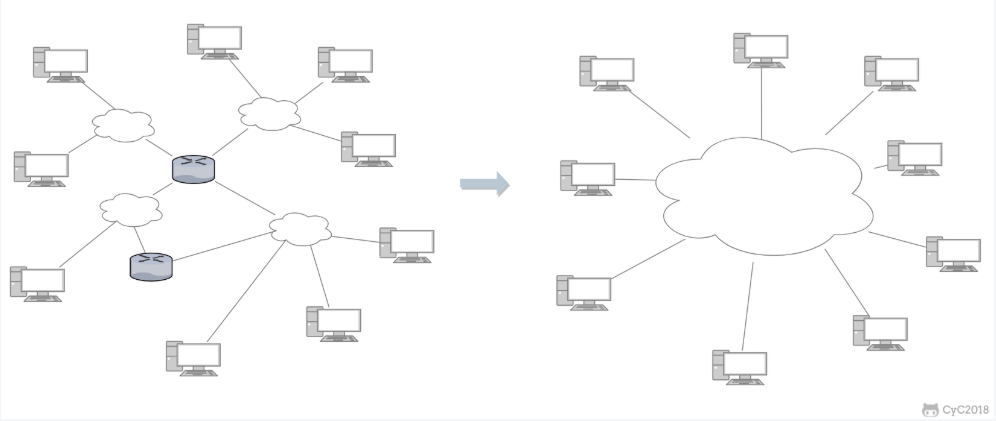

# 计算机网络秋招复习笔记

## 一、概述

### 	1.1 什么是互联网？

​		互联网（internet），又称国际网络，指的是网络与网络之间所串连成的庞大网络，这些网络以一组通用的协议相连，形成逻辑上的单一巨大国际网络。互联网具有**连通性**和**共享性**。


### 	1.2 互联网概述

- 网络：由若干**结点**（计算机、集线器、交换器、路由器）和连接这些结点的**链路**组成。
- 互连网：把网络通过路由器互连起来（网络的网络）。
- 互联网：全球范围的互连网。

网络把许多计算机连接在一起，而互连网则是把许多网络通过路由器连接在一起。与网络相连的计算机常称为主机。


### 	1.3 互连网基础结构发展三个阶段

- 第一阶段：从单个网络ARPANET（一个单个的分组交换网，所有要连接在ARPANET上的主机都直接与就近的结点交换机相连）向互连网发展的过程。

- 第二阶段：三级结构的互联网NSFNET。分为**主干网**、**地区网**、**校园/企业网**。

- 第三阶段：多层次**ISP**结构的互联网。ISP(Internet Service Provider)互联网服务提供商（电信、移动、联通）

  当前来说，所谓上网就是通过ISP获得IP地址接入互联网。


### 		1.4 ISP

​	ISP也分为不同层级：主干ISP、地区ISP、本地ISP

- 主干ISP，由几个专门的公司创建和维持，服务面积较大（一般能够覆盖国家范围），并且还拥有高速主干网。
- 地区ISP，一些较小的ISP，这些地区ISP通过一个或多个主干ISP连接起来。
- 本地ISP，给用户提供直接的服务，本地ISP可以连接到地区ISP，也可以直接连接到主干ISP
- 互联网交换点IXP（Internet eXchange Point），其作用就是允许两个网络直接相连并交换分组，而不需要再连通第三个网络来转发分组。使得互联网上的数据流量分布更加合理，同时也减少了分组转发的延迟时间，降低了分组转发的费用。


### 1.5 互联网的组成

​		互联网分为两大块：**边缘部分**（用户直接使用，用来进行通信和资源共享）、**核心部分**（由大量的网络和连接这些网络的路由器组成，为边缘部分提供服务）。


### 1.6 边缘部分的通信

- 客户-服务器方式（C/S）：客户（client）是服务请求方，服务器（server）是服务提供方
- 对等方式（P2P）：没有服务、客户之分，双方可以下载对方已经存储在硬盘中的共享文档。可支持大量对等用户同时工作。


### 1.7 核心部分的通信

​		网络核心部分中起特殊作用的是路由器，是实现分组交换的关键构建，其任务是转发收到的分组。

- 电路交换：电路交换用于电话通信系统，两个用户要通信之前需要建立一条**专用的物理链路**，并且在整个通信过程中**始终占用**该链路。由于通信的过程中不可能一直在使用传输线路，因此电路交换对线路的利用率很低，往往不到 10%，甚至1%。
- 报文交换：整个报文先传送到相邻结点，全部存储后查找转发表再转发到下个结点。
- 分组交换：每个分组都有首部和尾部，包含了源地址和目的地址等控制信息，在同一个传输线路上同时传输多个分组互相不会影响，因此在同一条传输线路上允许同时传输多个分组，也就是说分组交换不需要占用传输线路。高效、灵活、迅速、可靠。可能会有时延。


### 1.8 计算机网络的性能

- 速率：数据的传送速率，也叫数据率、比特率。在通信领域中，小写k代表1000，大写K既可以代表1000也可以代表1024。

- 带宽：网络中某通道传送数据的能力，表示在单位时间内网络中的某信道所能通过的最高数据率。

- 吞吐量：表示在单位时间内通过某个网络的实际的数据量。

- 时延：数据从网络的一端传送到另一端所需的时间。

  - 发送时延：主机或路由器发送数据帧所需要的的时间。
    $$
    发送时延=\frac{数据帧长度（bit）}{发送速率（bit/s）}
    $$

  - 传播时延：电磁波在信道中传播一定的距离需要花费的时间
    $$
    传播时延=\frac{信道长度（m）}{电磁波在信道上的传播速率（m/s）}
    $$

  - 处理时延：主机或路由收到分组时要花费一定的时间进行处理

  - 排队时延：分组进入路由器后要现在输入队列中排队等待处理、等待转发。

  - 总时延 = 发送时延+传播时延+处理时延+排队时延。

    ```markdown
    例题：收发两端之间的传输距离为1000km，信号在媒体上的传播速率为2*8^10m/s。试计算以下两种情况的发送时延和传播时延：
    （1） 数据长度为10^7bit，数据发送速率为100kbit/s
    （2） 数据长度为10^3bit，数据发送速率为1Gbit/s
    解：（1）发送时延=10^7bit/10^4(bit/s) = 10^3 s
    传播时延=10^5m/2*8^10（m/s） = 5*10^-4s
    （2） 发送时延 = 10^3bit/10^9(bit/s) = 10^-6s
    传播时延同1
    ```

    

- 时延带宽积：传播时延*带宽

- 往返时间RTT
  $$
  发送时间=\frac{数据长度}{发送速率}
  $$

  $$
  有效数据率=\frac{数据长度}{发送时间+RTT}
  $$

- 利用率
  $$
  D（网络当前的时延）= \frac{D0（网络空闲时的时延）}{1-U（利用率）}
  $$


### 1.9 计算机网络体系结构

1. 五层协议

-   **应用层**  ：为特定应用程序提供数据传输服务，例如 HTTP、DNS 等协议。数据单位为报文。

-   **传输层**  ：为进程提供通用数据传输服务。由于应用层协议很多，定义通用的传输层协议就可以支持不断增多的应用层协议。运输层包括两种协议：传输控制协议 TCP，提供面向连接、可靠的数据传输服务，数据单位为报文段；用户数据报协议 UDP，提供无连接、尽最大努力的数据传输服务，数据单位为用户数据报。TCP 主要提供完整性服务，UDP 主要提供及时性服务。

-   **网络层**  ：为主机提供数据传输服务。而传输层协议是为主机中的进程提供数据传输服务。网络层把传输层传递下来的报文段或者用户数据报封装成分组。

-   **数据链路层**  ：网络层针对的还是主机之间的数据传输服务，而主机之间可以有很多链路，链路层协议就是为同一链路的主机提供数据传输服务。数据链路层把网络层传下来的分组封装成帧。

-   **物理层**  ：考虑的是怎样在传输媒体上传输数据比特流，而不是指具体的传输媒体。物理层的作用是尽可能屏蔽传输媒体和通信手段的差异，使数据链路层感觉不到这些差异。

2. OSI

其中表示层和会话层用途如下：

-   **表示层**  ：数据压缩、加密以及数据描述，这使得应用程序不必关心在各台主机中数据内部格式不同的问题。

-   **会话层**  ：建立及管理会话。

五层协议没有表示层和会话层，而是将这些功能留给应用程序开发者处理。

3. TCP/IP

它只有四层，相当于五层协议中数据链路层和物理层合并为**网络接口层**。

TCP/IP 体系结构不严格遵循 OSI 分层概念，应用层可能会直接使用 IP 层或者网络接口层。


## 二、物理层

### 2.1 物理层的基本概念

- 物理层考虑的是怎么样才能在连接各种计算机的传输媒体上传输数据比特流，而不是指具体的传输媒体。

### 2.2 信道

- **单向通信**（单工通信），只能有一个方向的通信而没有反方向的交互。
- **双向交替通信**（半双工通信），双方都可以发送消息，但不能同时发送。
- **双向同时通信**（全双工通信），双方可以同时发送和接受消息。

### 2.3 常用编码方式

- **不归零制**，正电平=1，负电平=0

- **归零制**， 正脉冲=1，负脉冲=0

- **曼彻斯特编码**，位周期中心的向上跳变=0，位周期中心的向下跳变=1，也可反过来定义

- **差分曼彻斯特编码**，每一位的中心处始终有跳变，位开始边界有跳变=0，位开始边界没有跳变=1

### 2.4 基本的带通调制方法

- **调幅（AM）**载波的振幅随基带数字信号变化，例如1或0分别对应无载波和有载波输出。

- **调频（FM）** 载波的频率随基带数字信号变化，例如1或0分别对应频率f1或f2。

- **调相（PM）**载波的初始相位随基带数字信号变化，例如1或0分别对应相位0度或180度。

为达到更高信息传输速率，必须采用技术上更为复杂的多元制的振幅相位混合调制，如正交振幅调制QAM。


### 2.5 信道的极限容量

> 信道能通过的频率范围

**奈氏准则**：在任何信道上，码元传输的速率是有上限的，传输速率超过此上限，就会出现严重的码间串扰的问题，使接收端对码元的判决成为不可能。

信道的频带越宽，能够通过的信号高频分量越多，那么就可以用更高的速度传输码元而不出现码间串扰。

> 信噪比

**信噪比**即信号的平均功率和噪声的平均功率之比，记为S/N，用分贝（dB）作为度量单位。
$$
信噪比(dB) = 10log_{10}(S/N)(dB)
$$

$$
C(信道中的极限传输速率) = W(信道的带宽) log_2(1+S/N)
$$

信道的带宽或者信道中的信噪比越大，信息的极限传输速率就越高。


## 三、数据链路层

### 3.1 点对点通信

> 通信主要步骤

- 结点A的数据链路层把网络层交下来的IP数据报添加首部和尾部封装成帧
- 结点A把封装好的帧发送给结点B的数据链路层
- 若结点B的数据链路层收到的帧无差错，则提取出IP数据报上交网络层，否则丢弃这个帧

> 点对点使用的协议

点对点通信使用的是PPP协议，用户到ISP的链路使用PPP协议。

### 3.2 三个基本问题

> 封装成帧

**封装成帧**，就是在一段数据的前后分别添加首部（SOH）和尾部（EOT），这样就构成了一个帧。

> 透明传输

帧的开头和结尾都是特定的控制字符，但是在帧的数据部分是有可能存在这些字符的，因此为了防止被错误的解析，就有了透明传输。这些控制字符确实存在在数据中，但是不会被识别。

**字节填充**：在控制字符前插入一个转义字符ESC。如果数据部分出现转义字符，那么就在转义字符前面再加个转义字符。在接收端进行处理之后可以还原出原始数据。这个过程透明传输的内容是转义字符，用户察觉不到转义字符的存在。

> 差错检测

比特在传输过程中可能产生差错：1可能变成0，0可能变成1，这就叫比特差错。在数据链路层广泛使用了**循环冗余检验CRC**。


### 3.3 CSMA/CD协议

在广播通信中主要使用CSMA/CD协议

CSMA/CD 表示载波监听多点接入 / 碰撞检测。

-   **多点接入**  ：说明这是总线型网络，许多主机以多点的方式连接到总线上。
-   **载波监听**  ：每个主机都必须不停地监听信道。在发送前，如果监听到信道正在使用，就必须等待。
-   **碰撞检测**  ：在发送中，如果监听到信道已有其它主机正在发送数据，就表示发生了碰撞。虽然每个主机在发送数据之前都已经监听到信道为空闲，但是由于电磁波的传播时延的存在，还是有可能会发生碰撞。

记端到端的传播时延为 τ，最先发送的站点最多经过 2τ 就可以知道是否发生了碰撞，称 2τ 为   **争用期**  。只有经过争用期之后还没有检测到碰撞，才能肯定这次发送不会发生碰撞。

当发生碰撞时，站点要停止发送，等待一段时间再发送。这个时间采用   **截断二进制指数退避算法**   来确定。从离散的整数集合 {0, 1, .., (2<sup>k</sup>-1)} 中随机取出一个数，记作 r，然后取 r 倍的争用期作为重传等待时间。


### 3.4 MAC地址

在局域网中，硬件地址又称为物理地址或MAC地址。

MAC 地址是链路层地址，长度为 6 字节（48 位），用于唯一标识网络适配器（网卡）。

一台主机拥有多少个网络适配器就有多少个 MAC 地址。例如笔记本电脑普遍存在无线网络适配器和有线网络适配器，因此就有两个 MAC 地址。


### 3.5 以太网

以太网是一种星型拓扑结构局域网。

早期使用集线器进行连接，集线器是一种物理层设备， 作用于比特而不是帧，当一个比特到达接口时，集线器重新生成这个比特，并将其能量强度放大，从而扩大网络的传输距离，之后再将这个比特发送到其它所有接口。如果集线器同时收到两个不同接口的帧，那么就发生了碰撞。

目前以太网使用交换机替代了集线器，交换机是一种链路层设备，它不会发生碰撞，能根据 MAC 地址进行存储转发。

以太网帧格式：

-   **类型**  ：标记上层使用的协议；
-   **数据**  ：长度在 46-1500 之间，如果太小则需要填充；
-   **FCS**  ：帧检验序列，使用的是 CRC 检验方法；


### 3.6 交换机

交换机具有自学习能力，学习的是交换表的内容，交换表中存储着 MAC 地址到接口的映射。

正是由于这种自学习能力，因此交换机是一种即插即用设备，不需要网络管理员手动配置交换表内容。

下图中，交换机有 4 个接口，主机 A 向主机 B 发送数据帧时，交换机把主机 A 到接口 1 的映射写入交换表中。为了发送数据帧到 B，先查交换表，此时没有主机 B 的表项，那么主机 A 就发送广播帧，主机 C 和主机 D 会丢弃该帧，主机 B 回应该帧向主机 A 发送数据包时，交换机查找交换表得到主机 A 映射的接口为 1，就发送数据帧到接口 1，同时交换机添加主机 B 到接口 2 的映射。


### 3.7 虚拟以太网

虚拟局域网可以建立与物理位置无关的逻辑组，只有在同一个虚拟局域网中的成员才会收到链路层广播信息。

例如下图中 (A1, A2, A3, A4) 属于一个虚拟局域网，A1 发送的广播会被 A2、A3、A4 收到，而其它站点收不到。

使用 VLAN 干线连接来建立虚拟局域网，每台交换机上的一个特殊接口被设置为干线接口，以互连 VLAN 交换机。IEEE 定义了一种扩展的以太网帧格式 802.1Q，它在标准以太网帧上加进了 4 字节首部 VLAN 标签，用于表示该帧属于哪一个虚拟局域网。


## 四、网络层

### 4.1 网络层基本概念

网络层向上只提供简单灵活的、无连接的、尽最大努力交互的数据报服务。网络在发送分组时不需要先建立连接，**网络层不提供服务质量保证**。

IP协议是TCP/IP体系中两个最主要的协议之一。主要有IPv4，IPv6。

与 IP 协议配套使用的还有三个协议：

- 地址解析协议 ARP（Address Resolution Protocol）
- 网际控制报文协议 ICMP（Internet Control Message Protocol）
- 网际组管理协议 IGMP（Internet Group Management Protocol）

### 4.2 虚拟互连网络

由于用户需求是多样的，没有一种单一的网络能适应所有用户的需求。

将网络互相连接起来要使用一些**中间设备**，根据层次可划分为：

（1）物理层的中间设备叫做**转发器**

（2）数据链路层的中间设备叫做**网桥**或**桥接器**

（3）网络层的中间设备叫**路由器**

（4）网络层以上的中间设备叫**网关**，网关连接不兼容的系统要在高层进行协议转换

由于参加互连的计算机都使用相同的**网际协议IP**，因此可以把互连后的计算机网络看成一个**虚拟互连网络**，也就是逻辑互联网络，互连起来的各种物理网络的异构性本来是客观存在的，但利用IP协议可以使这些性能各异的网络**在网络层看起来好像是一个统一的网络**。



### 4.3 IP地址编址方式

整个的互联网就是一个单一的、抽象的网络。IP地址就是给互联网的每一台主机（或路由器）的每一个接口分配一个在全世界内范围唯一的32位标识符。IP地址由互联网名字和数字分配机构ICANN分配。

IP地址的方法经过三个阶段：

- 分类的IP地址。最基本的编址方法。
- 子网的划分。最基本编址方法的改进。
- 构成超网(无分类)。比较新的无分类编址方法。

> 分类

由两部分组成，网络号和主机号，其中不同分类具有不同的网络号长度，并且是固定的。

IP 地址 ::= {< 网络号 >, < 主机号 >}


如今A/B/C类地址的区分已经成为历史了。

> 子网划分

通过在主机号字段中拿一部分作为子网号，把两级 IP 地址划分为三级 IP 地址，属于内部划分，对外仍是一个网络。**划分子网只是把主机号这部分进行划分，不改变IP地址的网络号。**

IP 地址 ::= {< 网络号 >, < 子网号 >, < 主机号 >}

> 子网掩码

路由器怎么知道是否有子网存在呢？

要使用子网，必须配置**子网掩码**。一个 B 类地址的默认子网掩码为 255.255.0.0，如果 B 类地址的子网占两个比特，那么子网掩码为 11111111 11111111 11000000 00000000，也就是 255.255.192.0。

注意，外部网络看不到子网的存在。

使用子网掩码，不管网络有没有划分子网，只要把子网掩码和IP地址逐位与操作就可以得到**网络**地址。

> 构成超网

随着用户量的上升，IPv4地址已经消耗殆尽了。

无分类编址 CIDR 消除了传统 A 类、B 类和 C 类地址以及划分子网的概念，使用网络前缀和主机号来对 IP 地址进行编码，网络前缀的长度可以根据需要变化。

IP 地址 ::= {< 网络前缀号 >, < 主机号 >}

CIDR 的记法上采用在 IP 地址后面加上网络前缀长度的方法，例如 128.14.35.7/20 表示前 20 位为网络前缀。

CIDR 的地址掩码可以继续称为子网掩码，子网掩码首 1 长度为**网络前缀的长度**。

一个 CIDR 地址块中有很多地址，一个 CIDR 表示的网络就可以表示原来的很多个网络，并且在路由表中只需要一个路由就可以代替原来的多个路由，减少了路由表项的数量。把这种通过使用网络前缀来减少路由表项的方式称为路由聚合，也称为   **构成超网**  。如192.199.170.82/20,192.199.170.82/27这是两个不同的IP地址，因为其子网掩码不同，其网络号不同。

在路由表中的项目由“网络前缀”和“下一跳地址”组成，在查找时可能会得到不止一个匹配结果，应当采用**最长前缀匹配**(最佳匹配)来确定应该匹配哪一个。

### 4.4 IP数据报格式


-   **版本**   : 有 4（IPv4）和 6（IPv6）两个值；
-   **首部长度**   : 占 4 位，因此最大值为 15。值为 1 表示的是 1 个 32 位字的长度，也就是 4 字节。因为固定部分长度为 20 字节，因此该值最小为 5。如果可选字段的长度不是 4 字节的整数倍，就用尾部的填充部分来填充。
-   **区分服务**   : 用来获得更好的服务，一般情况下不使用。
-   **总长度**   : 包括首部长度和数据部分长度。
-   **生存时间**   ：TTL，它的存在是为了防止无法交付的数据报在互联网中不断兜圈子。以路由器跳数为单位，当 TTL 为 0 时就丢弃数据报。
-   **协议**  ：指出携带的数据应该上交给哪个协议进行处理，例如 ICMP、TCP、UDP 等。
-   **首部检验和**  ：因为数据报每经过一个路由器，都要重新计算检验和，因此检验和不包含数据部分可以减少计算的工作量。
-   **标识**   : 在数据报长度过长从而发生分片的情况下，相同数据报的不同分片具有相同的标识符。
-   **片偏移**   : 和标识符一起，用于发生分片的情况。片偏移的单位为 8 字节。


### 4.5 ARP地址解析协议

在发送数据时，数据从高层到低层，然后才到通信链路上传输。IP地址放在IP数据报的首部，而硬件地址则放在MAC帧的首部。

网络层实现主机之间的通信，而链路层实现具体每段链路之间的通信。因此在通信过程中，IP 数据报的源地址和目的地址**始终不变**，而 MAC 地址随着链路的**改变而改变**。

> ARP原理

每个主机都有一个 ARP **高速缓存**，里面有本局域网上的各主机和路由器的 IP 地址到 MAC 地址的映射表。

如果主机 A 知道主机 B 的 IP 地址，但是 ARP 高速缓存中没有该 IP 地址到 MAC 地址的映射，此时主机 A 通过**广播**的方式发送 ARP 请求分组，主机 B 收到该请求后会发送 ARP 响应分组给主机 A 告知其 MAC 地址(单播)，随后主机 A 向其高速缓存中写入主机 B 的 IP 地址到 MAC 地址的映射。

### 4.6 ICMP网际控制报文协议

ICMP 是为了更有效地转发 IP 数据报和提高交付成功的机会。它封装在 IP 数据报中，但是不属于高层协议。


ICMP 报文分为差错报告报文和询问报文


> 差错报告报文

所有的ICMP差错报告报文中的数据字段都具有同样的格式，把收到的需要进行差错报告的IP数据报的首部和数据字段的前8个字节提取出来，作为ICMP报文的数据字段。再加上相应的ICMP差错报告报文的前8个字节，就构成了ICMP差错报告报文。

> ping

Ping 是 ICMP 的一个重要应用，主要用来测试两台主机之间的连通性。

Ping 的原理是通过向目的主机发送 ICMP Echo 请求报文，目的主机收到之后会发送 Echo 回答报文。Ping 会根据时间和成功响应的次数估算出数据包往返时间以及丢包率。

> traceroute

Traceroute 是 ICMP 的另一个应用，用来跟踪一个**分组从源点到终点的路径**。

Traceroute 发送的 IP 数据报封装的是无法交付的 UDP 用户数据报，并由目的主机发送终点不可达差错报告报文。

- 源主机向目的主机发送一连串的 IP 数据报。第一个数据报 P1 的生存时间 TTL 设置为 1，当 P1 到达路径上的第一个路由器 R1 时，R1 收下它并把 TTL 减 1，此时 TTL 等于 0，R1 就把 P1 丢弃，并向源主机发送一个 ICMP 时间超过差错报告报文；
- 源主机接着发送第二个数据报 P2，并把 TTL 设置为 2。P2 先到达 R1，R1 收下后把 TTL 减 1 再转发给 R2，R2 收下后也把 TTL 减 1，由于此时 TTL 等于 0，R2 就丢弃 P2，并向源主机发送一个 ICMP 时间超过差错报文。
- 不断执行这样的步骤，直到最后一个数据报刚刚到达目的主机，主机不转发数据报，也不把 TTL 值减 1。但是因为数据报封装的是无法交付的 UDP，因此目的主机要向源主机发送 ICMP 终点不可达差错报告报文。
- 之后源主机知道了到达目的主机所经过的路由器 IP 地址以及到达每个路由器的往返时间。

### 4.7 路由选择协议

路由选择协议都是自适应的，能随着网络通信量和拓扑结构的变化而自适应地进行调整。

互联网可以划分为许多较小的自治系统 AS，一个 AS 可以使用一种和别的 AS 不同的路由选择协议。

可以把路由选择协议划分为两大类：

- 自治系统内部的路由选择：RIP 和 OSPF
- 自治系统间的路由选择：BGP

> RIP

路由信息协议，但很少被使用。RIP 是一种基于距离向量的路由选择协议。距离是指跳数，直接相连的路由器跳数为 1。跳数最多为 15，超过 15 表示不可达。

距离向量算法：

- 对地址为 X 的相邻路由器发来的 RIP 报文，先修改报文中的所有项目，把下一跳字段中的地址改为 X，并把所有的距离字段加 1；
- 对修改后的 RIP 报文中的每一个项目，进行以下步骤：
 - 若原来的路由表中没有目的网络 N，则把该项目添加到路由表中（新增项）；
 - 否则：若下一跳路由器地址是 X，则把收到的项目替换原来路由表中的项目（更新项）；否则：若收到的项目中的距离 d 小于路由表中的距离，则进行更新（更优项，例如原始路由表项为 Net2, 5, P，新表项为 Net2, 4, X，则更新）；否则什么也不做。
- 若 3 分钟还没有收到相邻路由器的更新路由表，则把该相邻路由器标为不可达，即把距离置为 16。

RIP 协议实现简单，开销小。但是 RIP 能使用的最大距离为 15，限制了网络的规模。并且当网络出现故障时，要经过**比较长的时间**才能将此消息传送到所有路由器。

> OSPF

开放最短路径优先 OSPF，是为了克服 RIP 的缺点而开发出来的。

OSPF 具有以下特点：

- 向本自治系统中的**所有**路由器发送信息，这种方法是洪泛法。
- 发送的信息就是与相邻路由器的链路状态，链路状态包括与哪些路由器相连以及链路的度量，度量用费用、距离、时延、带宽等来表示。
- 只有当链路状态发生变化时，路由器才会发送信息。

所有路由器都具有全网的拓扑结构图，并且是一致的。相比于 RIP，OSPF 的更新过程收敛的很快。

> BGP

BGP（Border Gateway Protocol，边界网关协议）

AS 之间的路由选择很困难，主要是由于：

- 互联网规模很大；
- 各个 AS 内部使用不同的路由选择协议，无法准确定义路径的度量；
- AS 之间的路由选择必须考虑有关的策略，比如有些 AS 不愿意让其它 AS 经过。

BGP 只能寻找一条比较好的路由，而不是最佳路由。

每个 AS 都必须配置 BGP 发言人，通过在两个相邻 BGP 发言人之间建立 TCP 连接来交换路由信息。

### 4.8 路由器

> 路由器的结构

路由器从功能上可以划分为：路由选择和分组转发。

分组转发结构由三个部分组成：交换结构、一组输入端口和一组输出端口。


> 路由器分组转发

- 从数据报的首部提取目的主机的 IP 地址 D，得到目的网络地址 N。
- 若 N 就是与此路由器直接相连的某个网络地址，则进行直接交付；
- 若路由表中有目的地址为 D 的特定主机路由，则把数据报传送给表中所指明的下一跳路由器；
- 若路由表中有到达网络 N 的路由，则把数据报传送给路由表中所指明的下一跳路由器；
- 若路由表中有一个默认路由，则把数据报传送给路由表中所指明的默认路由器；
- 报告转发分组出错。


### 4.9 虚拟专用网VPN

由于 IP 地址的紧缺，一个机构能申请到的 IP 地址数往往远小于本机构所拥有的主机数。并且一个机构并不需要把所有的主机接入到外部的互联网中，机构内的计算机可以使用仅在本机构有效的 IP 地址（专用地址）。

有三个专用地址块：

- 10.0.0.0 \~ 10.255.255.255
- 172.16.0.0 \~ 172.31.255.255
- 192.168.0.0 \~ 192.168.255.255

VPN 使用公用的互联网作为本机构各专用网之间的通信载体。专用指机构内的主机只与本机构内的其它主机通信；虚拟指好像是，而实际上并不是，它有经过公用的互联网。

下图中，场所 A 和 B 的通信经过互联网，如果场所 A 的主机 X 要和另一个场所 B 的主机 Y 通信，IP 数据报的源地址是 10.1.0.1，目的地址是 10.2.0.3。数据报先发送到与互联网相连的路由器 R1，R1 对内部数据进行加密，然后重新加上数据报的首部，源地址是路由器 R1 的全球地址 125.1.2.3，目的地址是路由器 R2 的全球地址 194.4.5.6。路由器 R2 收到数据报后将数据部分进行解密，恢复原来的数据报，此时目的地址为 10.2.0.3，就交付给 Y。


### 4.10 网络地址转换NAT

专用网内部的主机使用本地 IP 地址又想和互联网上的主机通信时，可以使用 NAT 来将本地 IP 转换为全球 IP。

在以前，NAT 将本地 IP 和全球 IP 一一对应，这种方式下拥有 n 个全球 IP 地址的专用网内最多只可以同时有 n 台主机接入互联网。为了更有效地利用全球 IP 地址，现在常用的 NAT 转换表把传输层的端口号也用上了，使得多个专用网内部的主机共用一个全球 IP 地址。使用端口号的 NAT 也叫做网络地址与端口转换 NAPT。


## 五、运输层

### 5.1 运输层协议概述

从通信和信息处理的角度看，运输层向它上面的应用层提供通信服务，是面向通信的最高层，也是面向用户功能的最低层。

网络层只把分组发送到目的主机，但是真正通信的并不是主机而是主机中的进程。传输层提供了进程间的**逻辑通信**，传输层向高层用户屏蔽了下面网络层的核心细节，使应用程序看起来像是在两个传输层实体之间有一条端到端的逻辑通信信道。

### 5.2 TCP VS UDP

- 用户数据报协议 UDP（User Datagram Protocol）是**无连接**的，**尽最大可能**交付，没有拥塞控制，面向报文（对于应用程序传下来的报文**不合并也不拆分**，只是添加 UDP 首部），支持一对一、一对多、多对一和多对多的交互通信。

- 传输控制协议 TCP（Transmission Control Protocol）是**面向连接**的，提供**可靠**交付，有流量控制，拥塞控制，提供全双工通信，面向字节流（把应用层传下来的报文看成字节流，把字节流**组织成大小不等的数据块**），每一条 TCP 连接只能是点对点的（一对一）。

### 5.3 端口

应用层的所有应用进程都可以通过运输层再传送到IP层（网络层），这就是**复用**。运输层从IP层收到发送给各应用进程的数据后，必须分别交付指明的各应用进程，这就是**分用**。

在运输层使用协议端口号，或称**端口**。虽然通信的终点是应用进程，但只要把传送的报文交到目的主机的某个合适的目的端口，剩下的工作（即交付目的进程）就由TCP或UDP完成。

这种在协议栈层间的端口是**软件端口**，和路由器或交换机上的硬件端口不同。硬件端口是不同硬件设备进行交互的接口，而软件端口是**应用层的各种协议进程与运输实体进行层间交互的一种地址**。

TCP和UDP的首部格式中都有**源端口**和**目的端口**，当运输层收到IP层上交的运输层报文时，就能根据其首部中的目的端口号把数据交付应用层的目的应用进程。

TCP/IP的运输层使用16位**端口号**来标志一个端口，端口号**只具有本地意义**，只是为了标志**本计算机**应用层中的各个进程在和运输层交互时的层间接口。在互联网不同计算机中，相同的端口号**没有关联**，16位端口号允许65535个不同的端口号。

两个计算机中的进程要相互通信，不仅要知道对方的IP地址，还要知道对方的端口号。互联网上的计算机通信采用客户-服务器方式，运输层端口号分为以下3种：

- **服务器端口号**，最重要的一类叫做**熟知端口号**或**系统端口号**，数值0-1023。如：FTP21 、TELNET23、SMTP25、DNS53、TFTP69、HTTP80、SNMP161、SNMP(trap)162、HTTPS443。
- **登记端口号**，数值1024-49151，为没有熟知端口号的应用进程使用的。
- **客户端端口号**，数值为49152-65535，又叫做**短暂端口号**。

### 5.4 UDP

> UDP概述

- UDP是无连接的
- UDP尽最大努力交付
- UDP面向报文
- UDP没有拥塞控制
- UDP支持一对一、一对多、多对一、多对多的交互通信
- UDP的首部开销小

> 首部格式


首部字段只有 8 个字节，包括源端口、目的端口、长度、检验和。12 字节的伪首部是为了计算检验和**临时添加**的。

如果接收方的UDP发现收到的报文中的目的端口不正确，就丢弃报文，并有ICMP发送**端口不可达差错报文**给发送方。如果正确，就上交到最后的终点，应用进程。

### 5.5 TCP

> TCP概述

- TCP是面向连接的运输层协议
- 每一条TCP连接只能有两个端点，每一条TCP连接只能是点对点的
- TCP提供可靠交付的服务
- TCP提供全双工通信
- 面向字节流

> TCP的连接

TCP连接的端点叫做套接字或插口

套接字socket = （IP地址：端口号）

> 可靠传输工作原理

- 停止等待协议

  每发送完**一个**分组就停止发送，等待对方的确认，确认后再发送下一组。其优点是简单，但**信道利用率太低**。

  - 无差错情况，发送一个确认一个，再发送下一个
  - 出现差错，当有差错时，发送方超时重传
  - 确认丢失和确认迟到，接受方的确认丢失或迟到，超时重传，收到相同帧则丢弃

- 连续ARQ协议，见5.7 TCP滑动窗口。

### 5.6 TCP首部格式


-   **序号**   ：用于对字节流进行编号，例如序号为 301，表示第一个字节的编号为 301，如果携带的数据长度为 100 字节，那么下一个报文段的序号应为 401。

-   **确认号**   ：期望收到的下一个报文段的序号。例如 B 正确收到 A 发送来的一个报文段，序号为 501，携带的数据长度为 200 字节，因此 B 期望下一个报文段的序号为 701，B 发送给 A 的确认报文段中确认号就为 701。

-   **数据偏移**   ：指的是数据部分距离报文段起始处的偏移量，实际上指的是首部的长度。

-   **确认 ACK**   ：当 ACK=1 时确认号字段有效，否则无效。TCP 规定，在连接建立后所有传送的报文段都必须把 ACK 置 1。

-   **同步 SYN**   ：在连接建立时用来同步序号。当 SYN=1，ACK=0 时表示这是一个连接请求报文段。若对方同意建立连接，则响应报文中 SYN=1，ACK=1。

-   **终止 FIN**   ：用来释放一个连接，当 FIN=1 时，表示此报文段的发送方的数据已发送完毕，并要求释放连接。

-   **窗口**   ：窗口值作为接收方让发送方设置其发送窗口的依据。之所以要有这个限制，是因为接收方的数据缓存空间是有限的。

### 5.7 TCP滑动窗口

窗口是缓存的一部分，用来暂时存放字节流。发送方和接收方各有一个窗口，接收方通过 TCP 报文段中的窗口字段告诉发送方自己的窗口大小，**发送方根据这个值和其它信息设置自己的窗口大小**。

发送窗口内的字节都允许被发送，接收窗口内的字节都允许被接收。如果发送窗口左部的字节已经发送并且收到了确认，那么就将发送窗口向右滑动一定距离，直到左部第一个字节不是已发送并且已确认的状态；接收窗口的滑动类似，接收窗口左部字节已经发送确认并交付主机，就向右滑动接收窗口。

接收窗口只会对窗口内最后一个按序到达的字节进行确认，例如接收窗口已经收到的字节为 {31, 34, 35}，其中 {31} 按序到达，而 {34, 35} 就不是，因此只对字节 31 进行确认。发送方得到一个字节的确认之后，就知道这个字节之前的所有字节都已经被接收。


### 5.8 超时重传时间的选择

TCP 使用超时重传来实现可靠传输：如果一个已经发送的报文段在超时时间内没有收到确认，那么就重传这个报文段。

一个报文段从发送再到接收到确认所经过的时间称为往返时间 RTT，加权平均往返时间 RTTs 计算如下：


其中，0 ≤ a ＜ 1，RTTs 随着 a 的增加更容易受到 RTT 的影响。

超时时间 RTO 应该略大于 RTTs，TCP 使用的超时时间计算如下：


其中 RTT<sub>d</sub> 为偏差的加权平均值。

### 5.9 TCP流量控制

流量控制是为了控制发送方发送速率，保证接收方来得及接收。

接收方发送的确认报文中的窗口字段可以用来控制发送方窗口大小，从而影响发送方的发送速率。将窗口字段设置为 0，则发送方不能发送数据。

### 5.10 TCP拥塞控制

如果网络出现拥塞，分组将会丢失，此时发送方会继续重传，从而导致网络拥塞程度更高。因此当出现拥塞时，应当控制发送方的速率。这一点和流量控制很像，但是出发点不同。流量控制是为了让接收方能来得及接收，而**拥塞控制是为了降低整个网络的拥塞程度**。


TCP 主要通过四个算法来进行拥塞控制：慢开始、拥塞避免、快重传、快恢复。

发送方需要维护一个叫做拥塞窗口（cwnd）的状态变量，注意拥塞窗口与发送方窗口的区别：拥塞窗口只是一个状态变量，实际决定发送方能发送多少数据的是发送方窗口。

为了便于讨论，做如下假设：

- 接收方有足够大的接收缓存，因此不会发生流量控制；
- 虽然 TCP 的窗口基于字节，但是这里设窗口的大小单位为报文段。


> 慢开始和拥塞避免

发送的最初执行慢开始，令 cwnd = 1，发送方只能发送 1 个报文段；当收到确认后，将 cwnd 加倍，因此之后发送方能够发送的报文段数量为：2、4、8 ...

注意到慢开始每个轮次都将 cwnd 加倍，这样会让 cwnd 增长速度非常快，从而使得发送方发送的速度增长速度过快，网络拥塞的可能性也就更高。设置一个**慢开始门限 ssthresh**，当 cwnd >= ssthresh 时，进入拥塞避免，每个轮次只将 cwnd 加 1。

如果出现了超时，则令 **ssthresh = cwnd / 2**，然后重新执行慢开始。

> 快重传和快恢复

在接收方，要求每次接收到报文段都应该对最后一个已收到的有序报文段进行确认。例如已经接收到 M<sub>1</sub> 和 M<sub>2</sub>，此时收到 M<sub>4</sub>，应当发送对 M<sub>2</sub> 的确认。

在发送方，如果收到三个重复确认，那么可以知道下一个报文段丢失，此时执行快重传，立即重传下一个报文段。例如收到三个 M<sub>2</sub>，则 M<sub>3</sub> 丢失，立即重传 M<sub>3</sub>。

在这种情况下，只是丢失个别报文段，而不是网络拥塞。因此执行快恢复，令 ssthresh = cwnd / 2 ，cwnd = ssthresh，注意到此时**直接进入拥塞避免**。

慢开始和快恢复的快慢指的是 cwnd 的设定值，而不是 cwnd 的增长速率。慢开始 cwnd 设定为 1，而快恢复 cwnd 设定为 ssthresh。


### 5.11 TCP的运输连接管理

> TCP的三次握手(连接建立)


假设 A 为客户端，B 为服务器端。

- 首先 B 处于 LISTEN（监听）状态，等待客户的连接请求。
- A 向 B 发送连接请求报文，SYN=1，ACK=0，选择一个初始的序号 x。
- B 收到连接请求报文，如果同意建立连接，则向 A 发送连接确认报文，SYN=1，ACK=1，确认号为 x+1，同时也选择一个初始的序号 y。

- A 收到 B 的连接确认报文后，还要向 B 发出确认，确认号为 y+1，序号为 x+1。

- B 收到 A 的确认后，连接建立。

> 三次握手的原因

第三次握手是为了防止**失效的连接请求**到达服务器，让服务器错误打开连接，**即保证了不会重复打开连接！**

客户端发送的连接请求如果在网络中滞留，那么就会隔很长一段时间才能收到服务器端发回的连接确认。客户端等待一个超时重传时间之后，就会重新请求连接。但是这个滞留的连接请求最后还是会到达服务器，如果不进行三次握手，那么服务器就会打开两个连接。如果**有第三次握手**，客户端会忽略服务器之后发送的对滞留连接请求的连接确认，不进行第三次握手，因此就不会再次打开连接。

> TCP的四次挥手(释放连接)


以下描述不讨论序号和确认号，因为序号和确认号的规则比较简单。并且不讨论 ACK，因为 ACK 在连接建立之后都为 1。

- A 发送连接释放报文，FIN=1。

- B 收到之后发出确认，此时 TCP 属于**半关闭状态**，B 能向 A 发送数据但是 A 不能向 B 发送数据。

- 当 B 不再需要连接时，发送连接释放报文，FIN=1。

- A 收到后发出确认，进入 TIME-WAIT 状态，等待 2 MSL（最大报文存活时间）后释放连接。

- B 收到 A 的确认后释放连接。

> 四次挥手的原因

客户端发送了 FIN 连接释放报文之后，服务器收到了这个报文，就进入了 CLOSE-WAIT 状态。**这个状态是为了让服务器端发送还未传送完毕的数据**，传送完毕之后，服务器会发送 FIN 连接释放报文。

> TIME_WAIT

客户端接收到服务器端的 FIN 报文后进入此状态，此时并不是直接进入 CLOSED 状态，还需要等待一个时间计时器设置的时间 2MSL。这么做有两个理由：

- **确保最后一个确认报文能够到达**。如果 B 没收到 A 发送来的确认报文，那么就会重新发送连接释放请求报文，A 等待一段时间就是为了处理这种情况的发生。

- **等待一段时间是为了让本连接持续时间内所产生的所有报文都从网络中消失**，使得下一个新的连接不会出现旧的连接请求报文。


## 六、应用层

运输层为应用进程提供了端到端的通信服务，但不同的网络应用的应用进程之间，还需要应用层协议。每个应用层协议都是为了解决某一类应用问题，而问题的解决又必须**通过位于不同主机中的多个应用进程之间的通信和协同工作完成**。

应用层的很多协议都是基于C-S的，客户是服务请求方，服务器是服务提供方。

|       应用       | 应用层协议 | 端口号  | 传输层协议 |            备注             |
| :--------------: | :--------: | :-----: | :--------: | :-------------------------: |
|     域名解析     |    DNS     |   53    |  UDP/TCP   | 长度超过 512 字节时使用 TCP |
| 动态主机配置协议 |    DHCP    |  67/68  |    UDP     |                             |
| 简单网络管理协议 |    SNMP    | 161/162 |    UDP     |                             |
|   文件传送协议   |    FTP     |  20/21  |    TCP     |  控制连接 21，数据连接 20   |
|   远程终端协议   |   TELNET   |   23    |    TCP     |                             |
|  超文本传送协议  |    HTTP    |   80    |    TCP     |                             |
| 简单邮件传送协议 |    SMTP    |   25    |    TCP     |                             |
|   邮件读取协议   |    POP3    |   110   |    TCP     |                             |
| 网际报文存取协议 |    IMAP    |   143   |    TCP     |                             |

### 6.1 DNS域名系统

DNS 是一个分布式数据库，提供了主机名和 IP 地址之间相互转换的服务。这里的分布式数据库是指，每个站点只保留它自己的那部分数据。

域名具有层次结构，从上到下依次为：根域名、顶级域名、二级域名。

DNS 可以使用 UDP 或者 TCP 进行传输，使用的端口号都为 53。大多数情况下 DNS 使用 UDP 进行传输，这就要求域名解析器和域名服务器都必须自己处理超时和重传从而保证可靠性。在两种情况下会使用 TCP 进行传输：

- 如果返回的响应超过的 512 字节（UDP 最大只支持 512 字节的数据）。
- 区域传送（区域传送是主域名服务器向辅助域名服务器传送变化的那部分数据）。

> 过程实例

域名服务器分为根、顶级、权限、本地四种。

假定域名为m.xyz.com的主机想知道另一台主机y.abc.com的IP地址。分为以下几个步骤：

- 主机m.xyz.com先向其本地域名服务器dns.xyz.com进行递归查询
- 本地域名服务器采用迭代查询，他先向一个根域名服务器查询
- 根域名服务器告诉本地服务器，下一次应查询的顶级域名服务器dns.com的IP地址
- 本地域名服务器向顶级域名服务器dns.com进行查询
- 顶级域名服务器dns.com告诉本地域名服务器，下一次应查询的权限域名服务器dns.abc.com的IP地址
- 本地域名服务器向权限域名服务器dns.abc.com进行查询
- 权限域名服务器dns.abc.com告诉本地域名服务器，所查询的主机的IP地址
- 本地域名服务器最后把查询结果告诉主机m.xyz.com

### 6.2 文件传输协议FTP

文件传输协议FTP是互联网上使用最广泛的文件传输协议。提供交互式的访问，允许客户指明文件的类型与格式，并允许文件具有存取权限。支持跨系统传输。

FTP 使用 TCP 进行连接，减少或消除在不同操作系统下处理文件的不兼容性。它需要两个连接来传送一个文件：

- 控制连接：服务器打开端口号 21 等待客户端的连接，客户端主动建立连接后，使用这个连接将客户端的命令传送给服务器，并传回服务器的应答。
- 数据连接：用来传送一个文件数据。

根据数据连接是否是服务器端主动建立，FTP 有主动和被动两种模式：

- 主动模式：服务器端主动建立数据连接，其中服务器端的端口号为 20，客户端的端口号随机，但是必须大于 1024，因为 0\~1023 是熟知端口号。
- 被动模式：客户端主动建立数据连接，其中客户端的端口号由客户端自己指定，服务器端的端口号随机。

主动模式要求客户端开放端口号给服务器端，需要去配置客户端的防火墙。被动模式只需要服务器端开放端口号即可，无需客户端配置防火墙。但是被动模式会导致服务器端的安全性减弱，因为开放了过多的端口号。

### 6.3 远程终端协议TELNET

TELNET 用于登录到远程主机上，并且远程主机上的输出也会返回。

TELNET 可以适应许多计算机和操作系统的差异，例如不同操作系统系统的换行符定义。

### 6.4 HTTP

万维网是一个大规模的、联机式的信息储藏所，万维网是一个分布式的超媒体系统，它是超文本系统的扩充。

万维网使用**统一资源定位符URL**来标志万维网上的各种文档。使用**超文本传送协议HTTP**来完成客户与服务器之间的交互。

> 统一资源定位符URL

<协议>://<主机>:<端口>/<路径>

端口和路径有时候可以省略。

> 使用HTTP的URL

http://<主机>:<端口>/<路径>

HTTP的默认端口号是80，通常省略，如果省略路径，则会指向到主页。

> HTTP

HTTP是面向事务的应用层协议，是万维网上可靠交换文件的重要基础。使用TCP。

HTTP是无连接的、无状态的。

HTTP1.0的主要缺点就是请求一个文档就要有两倍RTT的开销。

HTTP1.1使用了持续连接，在发送相应后仍然在一段时间内保持这条连接。

> 请求报文

HTTP的请求报文包括：请求行(request line)、请求头部(header)、空行 和 请求数据(request data) 四个部分组成。


- **请求行**包括： 请求方法，URL(**包括参数信息**)，协议版本这些信息（GET /admin_ui/rdx/core/images/close.png HTTP/1.1）
- **请求头部(Header)**是一个个的key-value值，比如
  - Accept-Encoding: gzip, deflate
  - User-Agent: Mozilla/4.0 (compatible; MSIE 7.0; Windows NT 6.1; WOW64; Trident/7.0; SLCC2; .NET CLR 2.0.50727; .NET CLR 3.5.30729; .NET CLR 3.0.30729; .NET4.0C; .NET4.0E)
- 空行(CR+LF)：请求报文用空行表示header和请求数据的分隔
- 请求数据，携带数据， POST方法会携带一个body

> 响应报文

HTTP的响应报文包括：状态行，响应头，空行，数据(响应体)


- **状态行**包括：HTTP版本号，状态码和状态值组成。
- **响应头**类似请求头，是一系列key-value值
  - Cache-Control: private
  - Content-Encoding: gzip
  - Server: BWS/1.1
  - Set-Cookie: delPer=0; path=/; domain=.baidu.com
- 空白行：同上，响应报文也用空白行来分隔header和数据
- **响应体**：响应的data，本例中是一段HTML

### 6.5 电子邮件协议

一个电子邮件系统由三部分组成：用户代理、邮件服务器以及邮件协议。

邮件协议包含发送协议和读取协议，发送协议常用 SMTP，读取协议常用 POP3 和 IMAP。


> SMTP

SMTP 只能发送 ASCII 码，而互联网邮件扩充 MIME 可以发送二进制文件。MIME 并没有改动或者取代 SMTP，而是增加邮件主体的结构，定义了非 ASCII 码的编码规则。


> POP3

POP3 的特点是只要用户从服务器上读取了邮件，就把该邮件删除。但最新版本的 POP3 可以不删除邮件。

> IMAP

IMAP 协议中客户端和服务器上的邮件保持同步，如果不手动删除邮件，那么服务器上的邮件也不会被删除。IMAP 这种做法可以让用户随时随地去访问服务器上的邮件。

### 6.6 动态主机配置协议DHCP

DHCP (Dynamic Host Configuration Protocol) 提供了即插即用的连网方式，用户不再需要手动配置 IP 地址等信息。

DHCP 配置的内容不仅是 IP 地址，还包括子网掩码、网关 IP 地址。

DHCP 工作过程如下：

1. 客户端发送 Discover (发现)报文，该报文的目的地址为 255.255.255.255:67，源地址为 0.0.0.0:68，被放入 UDP 中，该报文被广播到同一个子网的所有主机上。如果客户端和 DHCP 服务器不在同一个子网，就需要使用中继代理。
2. DHCP 服务器收到 Discover 报文之后，发送 Offer 报文给客户端，该报文包含了客户端所需要的信息。因为客户端可能收到**多个** DHCP 服务器提供的信息，因此客户端需要进行选择。
3. 如果客户端**选择了某个** DHCP 服务器提供的信息，那么就发送 Request 报文给该 DHCP 服务器。
4. DHCP 服务器发送 Ack 报文，表示客户端此时可以使用提供给它的信息，成**已绑定状态**。


### 6.7 Web页面请求过程

> DHCP 配置主机信息

- 假设主机最开始没有 IP 地址以及其它信息，那么就需要先使用 DHCP 来获取。

- 主机生成一个 DHCP 请求报文，并将这个报文放入具有目的端口 67 和源端口 68 的 UDP 报文段中。

- 该报文段则被放入在一个具有广播 IP 目的地址(255.255.255.255) 和源 IP 地址（0.0.0.0）的 IP 数据报中。

- 该数据报则被放置在 MAC 帧中，该帧具有目的地址 FF:FF:FF:FF:FF:FF，将广播到与交换机连接的所有设备。

- 连接在交换机的 DHCP 服务器收到广播帧之后，不断地向上分解得到 IP 数据报、UDP 报文段、DHCP 请求报文，之后生成 DHCP ACK 报文，该报文包含以下信息：IP 地址、DNS 服务器的 IP 地址、默认网关路由器的 IP 地址和子网掩码。该报文被放入 UDP 报文段中，UDP 报文段有被放入 IP 数据报中，最后放入 MAC 帧中。

- 该帧的目的地址是请求主机的 MAC 地址，因为交换机具有自学习能力，之前主机发送了广播帧之后就记录了 MAC 地址到其转发接口的交换表项，因此现在交换机就可以直接知道应该向哪个接口发送该帧。

- 主机收到该帧后，不断分解得到 DHCP 报文。之后就配置它的 IP 地址、子网掩码和 DNS 服务器的 IP 地址，并在其 IP 转发表中安装默认网关。

> ARP 解析 MAC 地址

- 主机通过浏览器生成一个 TCP 套接字，套接字向 HTTP 服务器发送 HTTP 请求。为了生成该套接字，主机需要知道网站的域名对应的 IP 地址。

- 主机生成一个 DNS 查询报文，该报文具有 53 号端口，因为 DNS 服务器的端口号是 53。

- 该 DNS 查询报文被放入目的地址为 DNS 服务器 IP 地址的 IP 数据报中。

- 该 IP 数据报被放入一个以太网帧中，该帧将发送到网关路由器。

- DHCP 过程只知道网关路由器的 IP 地址，为了获取网关路由器的 MAC 地址，需要使用 ARP 协议。

- 主机生成一个包含目的地址为网关路由器 IP 地址的 ARP 查询报文，将该 ARP 查询报文放入一个具有广播目的地址（FF:FF:FF:FF:FF:FF）的以太网帧中，并向交换机发送该以太网帧，交换机将该帧转发给所有的连接设备，包括网关路由器。

- 网关路由器接收到该帧后，不断向上分解得到 ARP 报文，发现其中的 IP 地址与其接口的 IP 地址匹配，因此就发送一个 ARP 回答报文，包含了它的 MAC 地址，发回给主机。

> DNS 解析域名

- 知道了网关路由器的 MAC 地址之后，就可以继续 DNS 的解析过程了。

- 网关路由器接收到包含 DNS 查询报文的以太网帧后，抽取出 IP 数据报，并根据转发表决定该 IP 数据报应该转发的路由器。

- 因为路由器具有内部网关协议（RIP、OSPF）和外部网关协议（BGP）这两种路由选择协议，因此路由表中已经配置了网关路由器到达 DNS 服务器的路由表项。

- 到达 DNS 服务器之后，DNS 服务器抽取出 DNS 查询报文，并在 DNS 数据库中查找待解析的域名。

- 找到 DNS 记录之后，发送 DNS 回答报文，将该回答报文放入 UDP 报文段中，然后放入 IP 数据报中，通过路由器反向转发回网关路由器，并经过以太网交换机到达主机。

> HTTP 请求页面

- 有了 HTTP 服务器的 IP 地址之后，主机就能够生成 TCP 套接字，该套接字将用于向 Web 服务器发送 HTTP GET 报文。

- 在生成 TCP 套接字之前，必须先与 HTTP 服务器进行三次握手来建立连接。生成一个具有目的端口 80 的 TCP SYN 报文段，并向 HTTP 服务器发送该报文段。

- HTTP 服务器收到该报文段之后，生成 TCP SYN ACK 报文段，发回给主机。

- 连接建立之后，浏览器生成 HTTP GET 报文，并交付给 HTTP 服务器。

- HTTP 服务器从 TCP 套接字读取 HTTP GET 报文，生成一个 HTTP 响应报文，将 Web 页面内容放入报文主体中，发回给主机。

- 浏览器收到 HTTP 响应报文后，抽取出 Web 页面内容，之后进行渲染，显示 Web 页面。